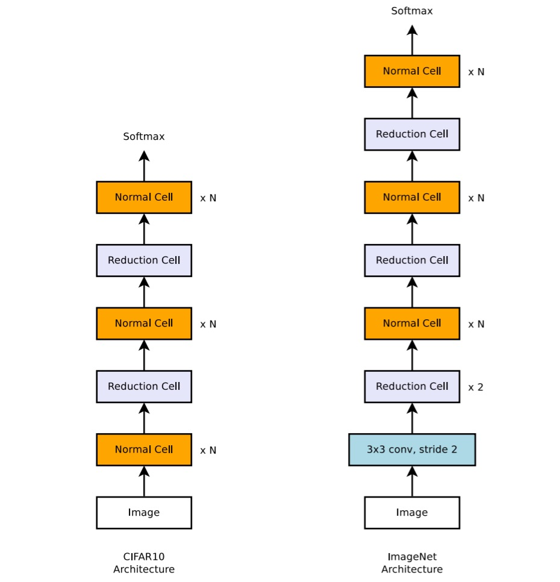
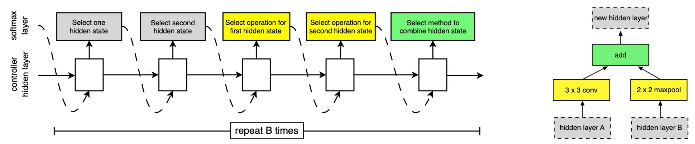
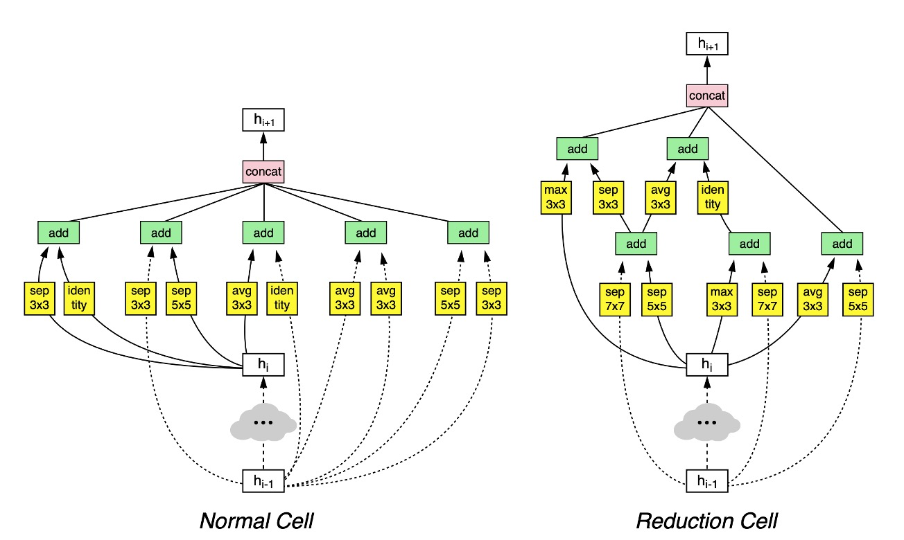
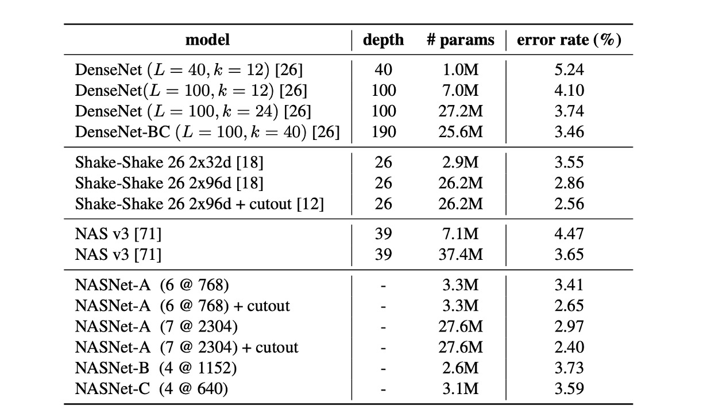
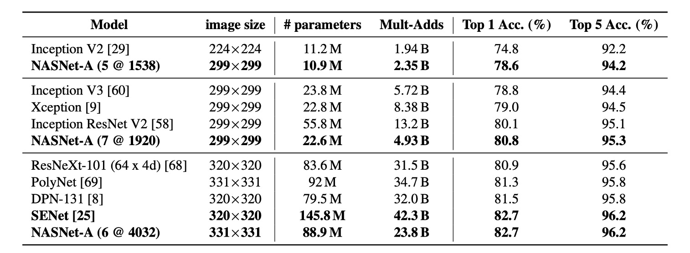
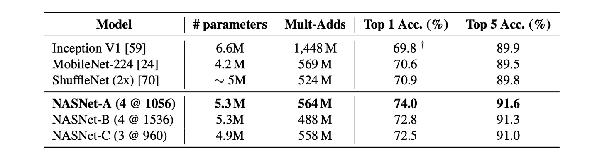

# [17.07] NASNet

## Searching for Network Architectures

[**Learning Transferable Architectures for Scalable Image Recognition**](https://arxiv.org/abs/1707.07012)

---

:::info
The following content has been compiled by ChatGPT-4 and manually proofread, edited, and supplemented.
:::

---

When you have a hammer, everything looks like a nail.

＊

Since the rise of deep learning neural networks, constructing an effective network architecture has become a significant challenge.

To tackle this, researchers have proposed various methods for automatically searching for network architectures, known as Neural Architecture Search (NAS).

Among the leaders in this field is the Google team, which you can find employing NAS techniques in various applications.

:::tip
Neural Architecture Search (NAS) is an automated technique designed to create and optimize deep learning model architectures. It aims to overcome the challenges and limitations of manually designing neural network architectures, especially when dealing with complex data or specific application scenarios. Through an automated search process, NAS identifies the most efficient network structures, enhancing model performance and reducing the time and expertise required for design.
:::

## Defining the Problem

Since the popularity of AlexNet, numerous network architectures have flourished over the past few years.

However, these architectures are often based on experience and intuition rather than rigorous theoretical foundations.

This leads to several issues, such as:

- Uncertainty about which architectures are the best.
- Designing architectures requires extensive expertise and experience.
- The design process is often time-consuming and resource-intensive.

This paper proposes a method for automatically searching for network architectures, which can help address some of these issues.

## Solving the Problem

### Transferable Architectures

Currently, the goal of all papers is consistent: achieving the best performance on the ImageNet dataset.

However, ImageNet is too large, and directly searching for suitable architectures on ImageNet would consume considerable resources.

Therefore, this paper proposes searching for suitable architectures on the CIFAR-10 dataset first and then transferring these architectures to ImageNet.

### Fundamental Structures

The authors propose two fundamental structures for constructing network architectures:

1. **Normal Cell**: This structure maintains the dimensions of the input feature map (i.e., height and width). This design ensures the integrity of spatial information during the feature extraction process, facilitating effective information transfer in deep networks.
2. **Reduction Cell**: This structure reduces the spatial dimensions of the feature map, specifically halving the height and width. This is achieved by setting the stride to 2, effectively lowering the computational load and increasing the model's abstraction ability.

Although Reduction and Normal Cells can share the same architecture, learning two separate architectures is beneficial based on experience.

Additionally, each time the spatial dimensions are reduced, the authors double the number of filters to compensate for the information loss, maintaining information density.

This design draws inspiration from Inception and ResNet structures, where the depth of layers and the number of filters are adjusted according to specific application needs.

### The Search Process

In the search space, each convolutional cell receives two initial hidden states, $h_i$ and $h_{i-1}$, derived from the outputs of the previous two lower-level cells or the input image.

The entire search process is conducted through an RNN, which predicts the structure of the convolutional cells and generates new hidden states based on the predictions.

- **The Prediction Process of the RNN**

  The RNN recursively predicts the structure of the convolutional cells following these steps:

  1. **Select Hidden State**: Choose a hidden state from $h_i$, $h_{i-1}$, or the set of hidden states generated by previous blocks.
  2. **Select Second Hidden State**: Choose a second hidden state from the same options as Step 1.
  3. **Select Operation**: Select an operation to apply to the hidden state chosen in Step 1.
  4. **Select Second Operation**: Select an operation to apply to the hidden state chosen in Step 2.
  5. **Combine Outputs**: Choose a method to combine the outputs of Steps 3 and 4 to produce a new hidden state.

- **Repeating Prediction Steps and Blocks**

  The RNN repeats the above five prediction steps B times, corresponding to B blocks in the convolutional cell.

  In experiments, choosing B=5 usually yields good results.

  Each round of prediction adds the newly created hidden state to the existing set of hidden states as potential inputs for subsequent blocks.

- **Operation Selection**

  The RNN selects operations from the following list, based on their popularity in the CNN literature:

  - Identity
  - 1x3 then 3x1 convolution
  - 1x7 then 7x1 convolution
  - 3x3 dilated convolution
  - 3x3 average pooling
  - 3x3 max pooling
  - 5x5 average pooling
  - 5x5 max pooling
  - 7x7 max pooling
  - 1x1 convolution
  - 3x3 convolution
  - 3x3 depthwise separable convolution
  - 5x5 depthwise separable convolution
  - 7x7 depthwise separable convolution

- **Combination Methods**

  In Step 5, the RNN selects a method to combine the two hidden states, either through element-wise addition or concatenation along the filter dimension.

### DropPath Module

In previous literature, DropPath technology was used to prevent overfitting and improve model generalization.

- [**Fractalnet: Ultra-deep neural networks without residuals**](https://arxiv.org/abs/1605.07648)

In this paper, the authors applied DropPath technology to the search process but found it ineffective.

They then improved DropPath technology, naming it **ScheduledDropPath**, which linearly increases the probability of dropping modules during training, resulting in good experimental outcomes!

### Search Experiment Results

Finally, the authors discovered an effective architecture on the CIFAR-10 dataset, as shown in the image above.

While the diagram may seem complex at first glance, it is quite understandable:

- The $h_{i-1}$ layer follows the dashed line, and the $h_i$ layer follows the solid line. The two are then combined to obtain $h_{i+1}$.
- If downsampling is needed, follow the `Reduction Cell` path; otherwise, follow the `Normal Cell` path.

## Discussion

### Results on CIFAR-10

As seen in the table, the large NASNet-A model with cutout data augmentation achieved a state-of-the-art error rate of 2.40% (average of five runs), slightly better than the previous best of 2.56%.

The authors noted that their best single-run error rate reached 2.19%.

### Transferring Architectures to ImageNet

Only the network structure was transferred here; the model was retrained.

The table above demonstrates that, compared to similar architectures, NASNet achieved state-of-the-art performance with fewer FLOPS and parameters.

The largest model achieved a new state-of-the-art performance on ImageNet (82.7%) based on a single non-ensemble prediction, improving approximately 1.2% over the previous best result (DPN-131).

### Evaluation on Mobile Devices

In previous research, MobileNet and ShuffleNet provided state-of-the-art results, achieving 70.6% and 70.9% accuracy, respectively, with ~550M multiply-add operations on 224x224 images.

The architecture constructed by NASNet achieved superior prediction performance under similar computational demands, reaching 74.0% accuracy.

:::tip
Simply using computational complexity to evaluate a model does not necessarily reflect its actual performance. Real-world inference tests are needed to confirm effectiveness.

Considering NASNet's extensive cross-branch addition and concatenation operations, these processes could lead to branch waits, thus reducing the model's efficiency.
:::

## Conclusion

This paper explores a method for directly learning model architectures on the datasets of interest.

By designing a search space that decouples architectural complexity from network depth, scalable convolutional cells were learned from image classification tasks.

This method enhances the adaptability of models, allowing researchers without sufficient computational resources to directly adopt the cells identified by NAS.

:::info
One curiosity remains: if sufficient resources were available to directly search for architectures on ImageNet, would better results be achieved?

Perhaps when the Google team finds the time, we will have an answer to this question.
:::
