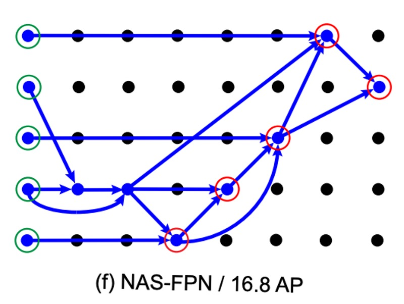
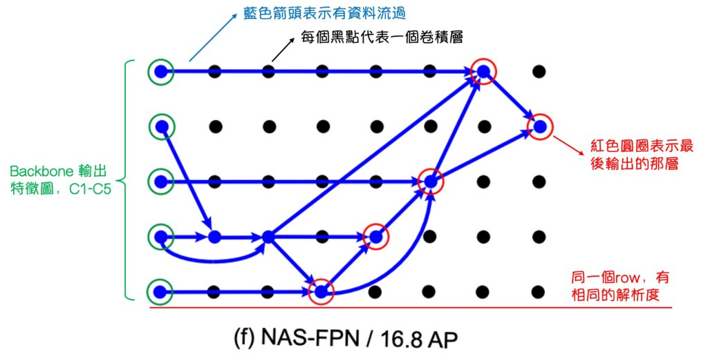

# [19.04] NAS-FPN

## Money Talks

[**NAS-FPN: Learning Scalable Feature Pyramid Architecture for Object Detection**](https://arxiv.org/abs/1904.07392)

---

:::info
The following content has been compiled by ChatGPT-4 and manually proofread, edited, and supplemented.
:::

---

After the introduction of FPN, feature fusion has been a hot topic of discussion. Here, we list some papers chronologically:

- **2017.01** -> [DSSD: Deconvolutional single shot detector](https://arxiv.org/abs/1701.06659)
- **2017.07** -> [RON: Reverse connection with objectness prior networks for object detection](https://arxiv.org/abs/1707.01691)
- **2017.07** -> [Deep layer aggregation](https://arxiv.org/abs/1707.06484)
- **2017.09** -> [StairNet: Top-down semantic aggregation for accurate one shot detection](https://arxiv.org/abs/1709.05788)
- **2017.11** -> [Single-shot refinement neural network for object detection](https://arxiv.org/abs/1711.06897)
- **2018.03** -> [Path Aggregation Network for Instance Segmentation](https://arxiv.org/abs/1803.01534) (This is PANet)
- **2018.08** -> [Scale-transferable object detection](https://ieeexplore.ieee.org/document/8578160)
- **2018.08** -> [Deep feature pyramid reconfiguration for object detection](https://arxiv.org/abs/1808.07993)
- **2018.10** -> [Parallel feature pyramid network for object detection](https://link.springer.com/chapter/10.1007/978-3-030-01228-1_15#chapter-info)

Among these, PANet is quite well-known. The other papers listed also have hundreds to thousands of citations and are worth reading if you have the time.

So, which one should we choose?

Google wanted to know this too, so they proposed NAS-FPN.

The core concept is: If we don’t know which is the best, let’s use an algorithm to brute-force search.

- **Let’s conduct a massive search!**

:::tip
Wait, isn’t this conclusion a bit off?

Actually, this is very typical of Google.

Just like the previous NASNet series, which focused on searching for network architectures, eventually leading to another paper called EfficientNet, which you might have heard of.

Beyond network architectures, chip design can also use NAS. Now, it’s just about using NAS for feature fusion, a straightforward approach.
:::

## What is NAS?

NAS stands for Neural Architecture Search, an important research direction in deep learning. Its primary goal is to automatically find the best neural network architecture to solve specific tasks. Neural network architectures typically consist of multiple layers, neurons, and connections, and the design of these architectures can significantly impact model performance.

Traditionally, neural network design is manually conducted by experts, requiring extensive experimentation and adjustment. This is a time-consuming process that demands professional knowledge. NAS aims to simplify this process through automation, allowing machines to explore and discover the best neural network architectures.

In NAS, a search space is defined, containing all possible variants of neural network architectures. Different search strategies, such as genetic algorithms, reinforcement learning, and evolutionary algorithms, are used to automatically generate, evaluate, and select these architectures to find the best-performing one for a specific task.

Generally speaking, the advantages and disadvantages of NAS are:

### Advantages

- **Automation**: NAS can automatically explore and find the best neural network architecture, reducing the workload and time required for manual adjustment and design, saving time and resources.
- **Optimization**: NAS can find the best neural network structure for specific tasks and datasets, improving model performance and potentially outperforming manually designed models in some cases.
- **Flexibility**: NAS is not limited to specific tasks or architectures and can adapt to different application scenarios, generating models that suit specific needs.
- **Innovation**: NAS helps discover new neural network structures, potentially leading to innovative model architectures and further advancement in deep learning.

### Disadvantages

- **Computational Resource Consumption**: The search process may require massive computational resources, including GPUs or TPUs, and significant time, which may limit practical application.
- **Complexity**: The size of the search space and the number of possible combinations can make the search process very complex, requiring advanced algorithms and techniques for effective searching.
- **Data Dependency**: The best architecture found may be highly dependent on the specific dataset used for the search, with no guarantee of similar performance on other datasets.
- **Randomness**: The search process may have a degree of randomness, leading to different results in different runs, challenging the stability of the outcomes.

## More Disadvantages

After looking at the pros and cons of NAS, you might be intrigued by its flexibility and innovation. However, the reality is that over 90% of practitioners or more may not have sufficient resources to build their own search systems. Typically, they can only use the results of this technology, which immediately raises another question:

- **Does my use case match the paper’s?**

This includes the distribution of the inference data, the training data’s feature distribution, and the problem-solving search space. If there is a discrepancy in any aspect, this optimized architecture might, or probably, or should...

- **Be unsuitable.**

So, why discuss this paper?

Firstly, we might be part of the 10%, and this paper shows how to design a search architecture and find the most suitable feature fusion method based on our scenarios. Secondly, this paper provides some results of automated searches, which can inspire our future designs.

## Solving the Problem

### NAS-FPN Model Design

The primary goal of this study is to find a better FPN architecture. In academic terms, the initial part of a model is called the backbone, which can be replaced with structures like ResNet, MobileNet, etc.

Next, the FPN part is usually called the neck, responsible for multi-scale feature connections, which is the focus here.

In practical work environments, engineers typically switch around these three parts, test, and extend related discussions.

In this study, the authors used a structure called "RetinaNet" as the base, with ResNet as the backbone and FPN as the neck.

:::tip
RetinaNet's main topic is Focal Loss, and the RetinaNet structure was a simple pairing product for applying Focal Loss.
:::

### Merging Cells

In NAS-FPN, based on the original FPN design, the authors introduced a new concept called "Merging Cells."

A merging cell is a small module responsible for merging two different input feature layers into a new output feature layer. The merging process involves the following steps:

1. **Select the first feature layer**: Choose one from multiple candidate feature layers (e.g., C3, C4, C5), called hi.
2. **Select the second feature layer**: Again, choose one from the multiple candidate feature layers, called hj.
3. **Determine the output feature size**: Choose a resolution size, which will be the size of the new feature layer.
4. **Select the merging operation**: Use a specific mathematical operation (such as addition or global pooling) to merge hi and hj.

In step 4, as shown below, two binary operations were designed in the search space: sum and global pooling. These operations were chosen for their simplicity and efficiency, without adding any extra trainable parameters.

If hi and hj are of different sizes, up-sampling or down-sampling is used to match their sizes before merging. The new feature layer is passed through a ReLU activation function, a 3×3 convolutional layer, and a BatchNorm layer to enhance its expressiveness. Thus, FPN can, through multiple such merging cells, continuously merge and improve feature layers, eventually generating a set of better multi-scale feature layers (P3, P4, P5, etc.).

## Discussion

Experimental data shows that with the increase in training steps, the controller can generate better sub-network architectures. This process reaches a stable state after about 8000 training steps, meaning the number of unique architectures starts to converge.

Ultimately, based on the reward optimization results, the authors selected the architecture with the highest AP for further training and evaluation.

This architecture was first sampled during the 8000 training steps and was sampled multiple times in subsequent experiments.

Then, the authors presented the FPN architecture obtained through NAS, as shown below:

This diagram looks complex, giving a feeling of being impressive but incomprehensible.

But it isn’t. Let’s annotate it:

After annotating, we can better understand the NAS-FPN results.

First, the initial (a) FPN doesn’t truly represent an FPN; it’s a “pseudo FPN” because its output feature maps and data flow order are consistent with FPN, but the original FPN doesn’t have so many convolutional layers internally.

Next, looking at the NAS-FPN experiment results from (b) to (f), as the AP score continuously improves, we can see that the search architecture eventually validates the design philosophy of PANet. That is, in (f):

- Data must be fused top-down.
- Data must be fused bottom-up.
- Though the details may differ, the essence remains.

## Conclusion

In past research, feature fusion architectures were often designed and experimented with manually, and the reliability and scalability of this approach were always questioned.

Indeed, while experimental research can provide some insights, its value is often limited by the scale and design of the experiments.

Perhaps we can accept that the theoretical foundation of certain conclusions might not be robust and accept the conclusions derived through "experimentation."

But how do these documents persuade others that the experimental scale is sufficient?

In this context, NAS-FPN, through a meticulous search architecture and unprecedented computational scale (perhaps no other company is as wealthy and willing to spend on such computations), offers a new perspective on this issue.

It not only confirms the correctness of PANet’s design philosophy but also reveals possible inefficiencies in its connection method.

The fusion methods derived through NAS not only increase the credibility of previous research but also provide new directions for future studies.
