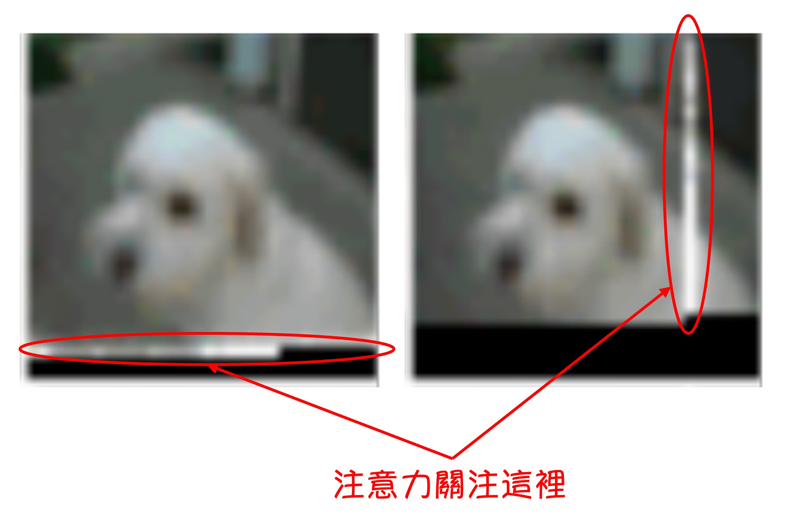
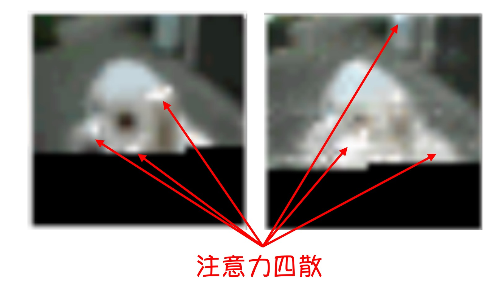
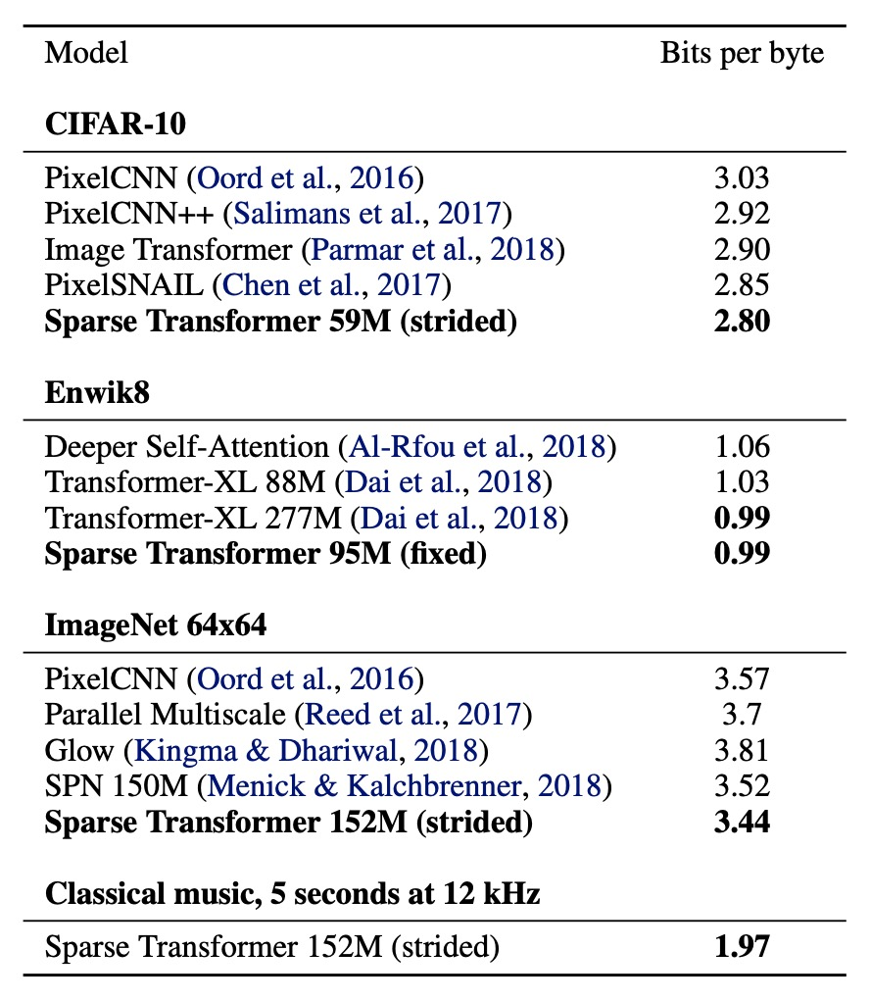

# [19.04] Sparse Transformer

## Sparse Attention Mechanism

[**Generating Long Sequences with Sparse Transformers**](https://arxiv.org/abs/1904.10509)

---

:::info
The following content has been compiled by ChatGPT-4 and manually proofread, edited, and supplemented.
:::

---

The computational complexity of the self-attention mechanism in a Transformer is $O(n^2)$.

When any algorithm exhibits such computational complexity, it indicates significant room for optimization. OpenAI has made substantial efforts in foundational research, one of which is presented in this paper: Sparse Transformer.

## Defining the Problem

To investigate how the attention mechanism in the original Transformer model operates in practical scenarios, the researchers first created an image generation model.

This model is based on a Decoder-Only Transformer architecture. It segments the image into patches, uses these patches as input sequences, and generates the image through the Transformer.

The model has 128 layers and was trained on the CIFAR-10 dataset. The experimental results are shown above. This figure is crucial in this paper as it marks the starting point of this research.

---

In the above figure, you'll notice some white spots. These are the results of visualizing the model's attention maps. The black areas indicate regions that haven't been decoded yet, so the boundary of the black region is the "currently decoding token," and the white spots represent the tokens this "currently decoding token" is focusing on.

This analysis is broken down into several parts:

### The Initial Layers

In the initial layers, the model's attention focuses around the "currently decoding token," similar to the receptive fields in convolutional neural networks.

:::tip
The low resolution is due to the CIFAR-10 images, which are only 32x32 pixels.
:::

### Layers 19-20

In layers 19 and 20, the network learns to disperse its attention along rows and columns, effectively decomposing global attention computation.

### Various Layers

In some layers, the attention span is very large, indicating these layers have a global view.

### Layers 64-128

These layers occupy half of the model's layers, located in the latter part. It can be observed that the attention in these layers is highly sparse and almost inactive.

:::info
OpenAI has provided dynamic visualizations:

- [**Sparse Transformer - OpenAI Blog**](https://openai.com/index/sparse-transformer/)
  :::

---

The insights from these experimental results are:

- **In a Transformer, not all tokens need to attend to all other tokens. Continuously stacking global attention is very wasteful.**

## Solving the Problem

The solution is to create a mechanism that allows the model to selectively attend to certain tokens rather than all tokens.

In the figure above, (a) represents the original Transformer, while (b) and (c) show the architectures of the Sparse Transformer. The small diagrams indicate the attention distribution in the figures, and the large diagram flattens these attentions into an N x N matrix.

You might notice the blank upper triangle because this is a Decoder-Only model, meaning each token only needs to attend to the tokens before it.

### Solution 1: Fixed Stride

As shown in figure (b), this architecture takes inspiration from the earlier experimental results:

- We may need to focus on the previous few tokens, i.e., the row part.
- We may need to focus on the first $a \times N$ tokens, i.e., the column part (e.g., the first 6, 18, 24,... tokens).

### Solution 2: Fixed Specific Index Tokens

As shown in figure (c), because the "fixed stride" strategy only works for data with a fixed 2D structure like images.

When dealing with text or audio data, the fixed stride strategy is less effective, so the authors proposed the "fixed specific index tokens" strategy.

This strategy aims to use specific index tokens as "anchor points," allowing the model to first aggregate information at these anchor points and then achieve a near-global attention effect through layer stacking.

### Modified Attention Mechanism

After understanding the design concepts, the mathematical formulas mentioned in the paper become very intuitive:

1. **Attention**

   - $ \text{Attend}(X, S) = a(x_i, S_i), i \in \{1, \ldots, n\} $

2. **Attention Weight Function**

   - $ a(x_i, S_i) = \text{softmax} \left( \frac{(W_q x_i) (K_S)^T}{\sqrt{d}} \right) V_S $

3. **Key and Value**

   - $ K_S = W_k x_j, j \in S_i $
   - $ V_S = W_v x_j, j \in S_i $

Where $W_q$, $W_k$, and $W_v$ represent the weight matrices for query, key, and value, respectively.

Simply put, this involves picking specific tokens from the original attention mechanism to calculate attention weights.

### Other Optimizations

Besides the attention mechanism optimizations mentioned above, the paper also discusses some other optimization methods:

1. **Checkpointing**

   The gradient checkpointing technique doesn't save all intermediate activation values during the forward pass. Instead, it only saves a part of the critical activations. During backpropagation, it recomputes the discarded intermediate activations based on the retained ones. This reduces memory usage but increases computation since some forward pass portions need to be recomputed.

   This technique comes from the paper:

   - [**Training deep nets with sublinear memory cost (2016.04)**](https://arxiv.org/abs/1604.06174)

   The goal of this technique is to reduce the memory usage of the model, allowing for the training of deeper networks.

2. **Importance of Position Embedding**

   The authors found that using position embeddings that encode data structure attention patterns is crucial for the model's performance.

   - **For image data**

     The authors used $d_{\text{data}} = 3$, corresponding to the row, column, and channel positions of each input token.

   - **For text and audio data**

     The authors used $d_{\text{attn}} = 2$, with indices corresponding to the row and column indices in the matrix.

   This embedding method ensures the model can effectively capture the spatial or structural information of different data types, thereby enhancing overall performance.

3. **Mixed Precision**

   The authors stored network weights in single precision but computed network activations and gradients in half precision. They used dynamic loss scaling during gradient computation to reduce numerical underflow and transmitted half-precision gradients when averaging across multiple GPUs. During sampling, they converted queries and keys to single precision to avoid overflow.

### Training Setup

- Use Adam optimizer.
- Perform 5000 iterations of linear warm-up.
- Use gradient clipping with a value of 1.0.
- Apply a weight decay penalty of 0.01.
- Anneal the learning rate using cosine decay (referencing Radford et al., 2018).
- Default training on 8 V100 GPUs.
- Initialize content embeddings $ W_e $ from $ \mathcal{N}(0, \sqrt{0.125/d}) $.
- Initialize position embeddings from $ \mathcal{N}(0, \sqrt{0.125 / ( d \cdot n\_{emb} ))}) $.
- Initialize all biases in attention and FFN components to 0.
- Initialize all weights from $ \mathcal{N}(0, \sqrt{0.125/d\_{\text{in}}})$.
- Initialize the output logits' weight matrix to 0.

## Discussion

### CIFAR-10

Achieved 2.80 bits per byte on the test set, surpassing the previous state-of-the-art of 2.85.

- **Model Configuration**:
  - 2 heads
  - 128 layers
  - Embedding dimension $d = 256$
  - Half-size feed-forward networks and query-key projections
- **Training Parameters**:
  - Learning rate: 0.00035
  - Dropout rate: 0.25
  - Trained for 120 epochs until validation error stopped decreasing
- **Data Split**:
  - Training set: 48,000 samples
  - Validation set: 2,000 samples

### EnWik8

Achieved 0.99 bits per byte, surpassing the similar-sized Transformer-XL's state-of-the-art of 1.03 and matching the 0.99 achieved by models trained with more than twice the parameters.

- **Model Configuration**:
  - 30 layers (Fixed)
  - 8 heads
  - Embedding dimension $d = 512$
  - Dropout rate: 0.40
- **Training Parameters**:
  - Trained for 80 epochs until validation loss stopped decreasing
  - Context length: 12,288
  - Stride: 128
- **Data Split**:
  - Training set: First 90 million tokens
  - Validation and test sets: Last 10 million tokens

### ImageNet 64x64

To test the model's ability to learn long-range dependencies and scale to large datasets, the authors trained it on a downsampled version of ImageNet and evaluated it on the validation set.

Achieved 3.44 bits per byte on the validation set, improving from the previous 3.52.

In visual evaluations, the authors observed evidence of long-term structure in most images.

- **Model Configuration**:
  - 48 layers (Strided)
  - 16 heads
  - Embedding dimension $d = 512$
  - Total parameters: 152 million
- **Training Parameters**:
  - Stride: 128
  - Dropout rate: 0.01
  - Trained for 70 epochs
  - Used 64 V100 GPUs, training took 7 days

## Conclusion

The Sparse Transformer demonstrates its effectiveness across various data types, including natural images, text, and raw audio. The results indicate that this model achieves performance equal to or better than the original Transformer while significantly reducing computational operations.

These findings have been widely referenced and developed in subsequent research projects. Understanding this paper lays a solid foundation for encountering similar concepts in future studies.
