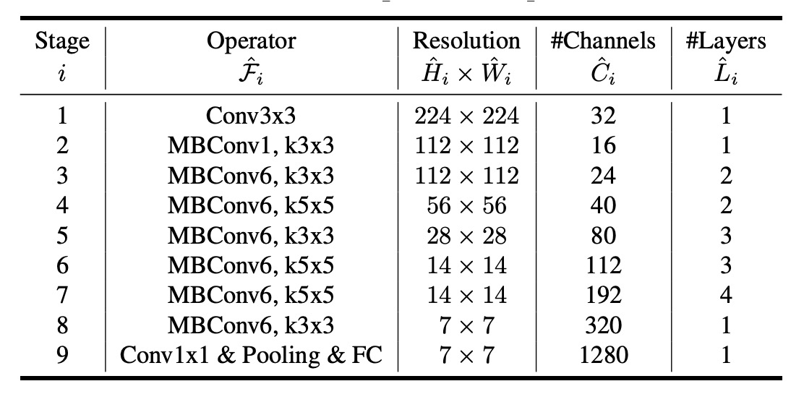
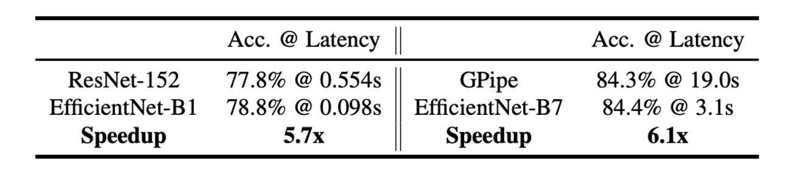

# [19.05] EfficientNet

## Compound Scaling

[**EfficientNet: Rethinking Model Scaling for Convolutional Neural Networks**](https://arxiv.org/abs/1905.11946)

---

:::info
The following content has been compiled by ChatGPT-4 and manually proofread, edited, and supplemented.
:::

---

Common methods to enhance the performance of convolutional neural networks (CNNs) include:

1. **Deeper Networks**: Increasing network depth, such as with ResNet.
2. **Wider Networks**: Increasing network width, like WideResNet.
3. **Higher Resolution**: Increasing the input image resolution.

While incremental improvements from these methods can be gratifying, the authors of this paper argue for a more holistic approach.

## Defining the Problem

The authors of this paper suggest a unified approach to scaling models and propose a method called **Compound Scaling**.

## Solving the Problem

### Two Key Observations

In this paper, the authors present two critical observations that form the foundation of their compound scaling method:

- **Observation 1: Any single dimension scaling improves accuracy, but the improvement saturates as the model size increases.**

  

  Scaling the depth, width, or resolution of a convolutional neural network (CNN) typically enhances its accuracy. However, as the network becomes extremely deep, wide, or high-resolution, the accuracy gains quickly diminish and eventually plateau. This suggests that simply increasing one dimension cannot infinitely improve model performance and will ultimately hit a bottleneck.

- **Observation 2: Balancing network width, depth, and resolution is crucial for effective model scaling.**

  

  To achieve better accuracy and efficiency within given resource constraints, it is essential to balance the network's width, depth, and resolution. While individually scaling one dimension is straightforward, its impact is limited. Instead, simultaneously scaling all dimensions in a coordinated manner can utilize resources more effectively and achieve higher accuracy.

### Compound Scaling

Here, the problem of model scaling is redefined:

Each layer of a CNN can be defined as a function $Y_i = F_i(X_i)$, where $F_i$ is the operator, $Y_i$ is the output tensor, and $X_i$ is the input tensor. The entire CNN $N$ can be represented as a combination of these layers: $N = F_k \odot ... \odot F_2 \odot F_1(X_1)$. Typically, the layers in a CNN are divided into stages, with all layers in a stage sharing the same architecture.

Therefore, a CNN can be defined as:

$$N = \odot_{i=1}^s F_i^{L_i}(X)$$

where $F_i^{L_i}$ denotes the layer $F_i$ being repeated $L_i$ times in the $i$-th stage.

The goal of model scaling is to maximize accuracy within given resource constraints. Specifically, we aim to optimize the model by adjusting its depth ($d$), width ($w$), and resolution ($r$) while keeping the basic network architecture $F_i$ unchanged.

This can be formalized as an optimization problem:

- $\max_{d,w,r} \text{Accuracy}(N(d, w, r))$

Subject to:

- $\text{Memory}(N) \leq \text{target memory}$
- $\text{FLOPs}(N) \leq \text{target flops}$

The authors propose a compound scaling method using a compound coefficient $\phi$ to uniformly scale the network's width, depth, and resolution:

- $\text{depth: } d = \alpha^\phi$
- $\text{width: } w = \beta^\phi$
- $\text{resolution: } r = \gamma^\phi$

Subject to $\alpha \cdot \beta^2 \cdot \gamma^2 \approx 2$, where $\alpha$, $\beta$, and $\gamma$ are constants determined by a small grid search, and $\phi$ is a user-specified coefficient controlling the scaling resources.

This method ensures balanced scaling across all dimensions, achieving better accuracy under given resource constraints with moderate increases in computational cost (FLOPs).

### Base Model Architecture

To develop an effective baseline network, the authors leveraged Multi-Objective Neural Architecture Search (NAS) to optimize both accuracy and FLOPs.

They used $\text{Acc}(m) \times \left(\frac{\text{FLOPs}(m)}{T}\right)^w$ as the optimization objective, where $\text{Acc}(m)$ and $\text{FLOPs}(m)$ represent the accuracy and FLOPs of model $m$, respectively. $T$ is the target FLOPs, and $w = -0.07$ is a hyperparameter controlling the balance between accuracy and FLOPs.

The search yielded EfficientNet-B0, whose architecture is similar to `MnasNet` but slightly larger, targeting 400M FLOPs.

The table below shows the architecture of EfficientNet-B0:

The primary building block of EfficientNet-B0 is the Mobile Inverted Bottleneck MBConv, optimized with squeeze-and-excitation.

### Model Scaling Architecture

Starting from the baseline EfficientNet-B0, the authors applied the compound scaling method in two steps to scale the network:

- **Step 1**: First, fix $\phi = 1$, assuming twice the resources are available, and perform a small-scale grid search based on equations 2 and 3 to determine the optimal values for $\alpha$, $\beta$, and $\gamma$. For EfficientNet-B0, the optimal values were $\alpha = 1.2$, $\beta = 1.1$, and $\gamma = 1.15$, satisfying $\alpha \cdot \beta^2 \cdot \gamma^2 \approx 2$.

- **Step 2**: Then, fix $\alpha$, $\beta$, and $\gamma$ as constants and use different $\phi$ values to scale the baseline network, resulting in EfficientNet-B1 to B7.

Notably, while it is possible to search for $\alpha$, $\beta$, and $\gamma$ directly on large models for better performance, the search cost becomes prohibitively expensive on large models. The authors' method effectively addresses this issue by performing the search once on a small baseline network (Step 1) and then scaling all other models using the same scaling coefficients (Step 2).

## Discussion

### Importance of Compound Scaling

To further understand why the compound scaling method is superior to others, the authors compared class activation maps (CAM) of representative models with different scaling methods, all scaled from the same baseline (EfficientNet-B0), showing the regions of interest while processing images:

- **Single-Dimension Scaling Models**: Lacked focus on object details and failed to capture all objects in the image.
- **Compound Scaling Models**: Tended to focus on more relevant areas with richer object details, showing a more comprehensive capture of object features.

Additionally, the authors observed the performance of several scaling methods:

1. **Single-Dimension Scaling Methods**:

   - **Depth Scaling**: Increasing the network depth, i.e., the number of layers.
   - **Width Scaling**: Increasing the network width, i.e., the number of channels per layer.
   - **Resolution Scaling**: Increasing the input image resolution.

2. **Compound Scaling Method**:
   - Combining depth, width, and resolution growth, coordinated according to the proposed $\alpha$, $\beta$, $\gamma$ parameters.

The experimental results below show that although all scaling methods improve accuracy, the compound scaling method achieves significantly higher accuracy improvements, up to 2.5%. This indicates that, with the same resource increase, the compound scaling method utilizes resources more effectively, providing substantial advantages in enhancing model performance.

### Results on ImageNet

In this paper, the authors used the following specific training configurations:

- **Optimizer**: RMSProp
- **Weight Decay**: $1 \times 10^{-5}$
- **Initial Learning Rate**: 0.256, decaying by 0.97 every 2.4 epochs
- **Activation Function**: SiLU
- **Data Augmentation**: AutoAugment, random depth

Considering larger models require more regularization, the authors linearly increased the dropout rate from 0.2 in EfficientNet-B0 to 0.5 in EfficientNet-B7.

The table shows that EfficientNet models generally use an order of magnitude fewer parameters and FLOPs compared to other CNNs with similar accuracy. Specifically, EfficientNet-B7 achieves 84.3% top-1 accuracy with 66M parameters and 37B FLOPs, more accurate than the previous best GPipe, but with 8.4 times fewer parameters.

EfficientNet models are not only smaller in size but also more computationally efficient. For instance, EfficientNet-B3 uses 18 times fewer FLOPs while achieving higher accuracy than ResNeXt101.

### Inference Speed

To validate latency, the authors also measured the inference latency of some representative CNNs on a real CPU.

The table below shows the average latency of 20 runs:

These results demonstrate that, compared to ResNet-152 and GPipe, EfficientNet not only excels in parameters and FLOPs but also achieves impressive inference speed on actual hardware.

### Parameter-Accuracy Curve

The figure above shows the parameter-accuracy and FLOPs-accuracy curves of representative CNNs, highlighting that EfficientNet models achieve higher accuracy with fewer parameters and FLOPs, underscoring their significant efficiency advantage.

## Conclusion

The depth, width, and resolution of a model are crucial factors influencing the performance of convolutional neural networks.

In this paper, the authors propose a compound scaling method that balances the scaling of depth, width, and resolution to achieve better accuracy and efficiency.

Future research can further optimize the parameter selection in compound scaling methods and explore their application in other types of neural networks, advancing the efficiency and performance of deep learning models.

:::tip
We read the abstract of this paper and directly adopted the model architecture. The results were indeed impressive.
:::
