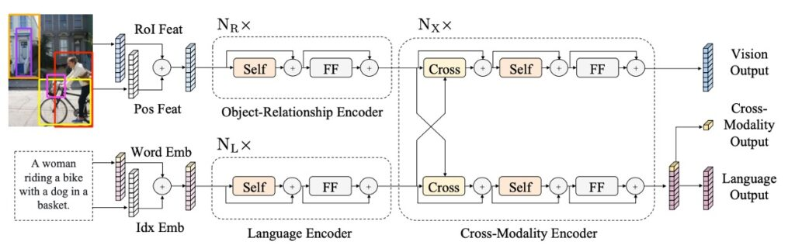
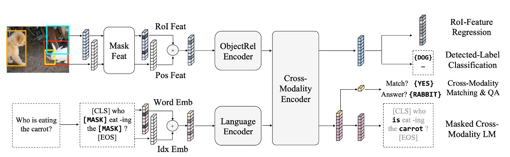
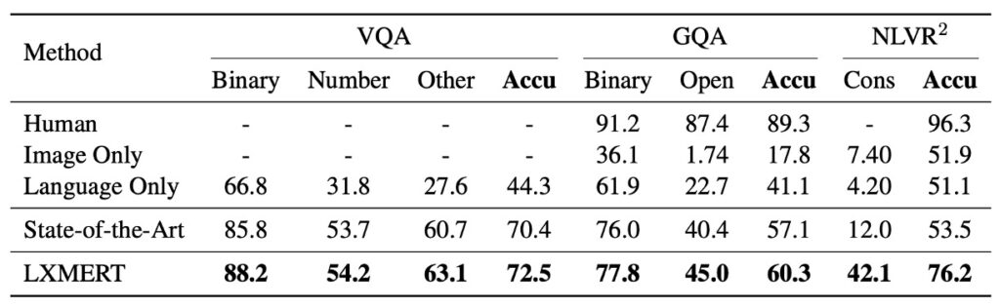

# [19.08] LXMERT

## More Pre-training

[**LXMERT: Learning Cross-Modality Encoder Representations from Transformers**](https://arxiv.org/abs/1908.07490)

---

:::info
The following content has been compiled by ChatGPT-4 and manually proofread, edited, and supplemented.
:::

---

In recent years, we have witnessed numerous efforts to merge vision and language. This field attracts relentless exploration because it involves two primary human perception modes: vision and language, which are often inseparable in daily life.

Reflecting on this journey, models like ViLBERT, VL-BERT, and VisualBERT have been milestones, each attempting to integrate these powerful information sources: images and text. However, like all pioneering research, they each had their limitations and characteristics.

LXMERT emerged during this peak of exploration, but instead of merely repeating previous achievements, it chose a different path. By adopting more attention mechanisms and more comprehensive pre-training strategies, LXMERT aimed to address some shortcomings of its predecessors, providing a relatively complete solution for vision and language at the time.

So, what exactly did LXMERT attempt at the time? How did it compare to other research, and what were its features and contributions?

Let's revisit and review the research of that period and understand how this field has gradually evolved.

## Defining the Problem

Although the authors provided an extensive review of past literature and research in their paper:

1. **Application of Transformers in Cross-Modality**

   While Transformers have succeeded in machine translation, how do they adapt to single-modality and cross-modality encoders?

2. **Object Feature Encoding**

   [**BUTD (Anderson et al., 2018)**](https://arxiv.org/abs/1707.07998) proposed using object RoI features to encode images, but how can we better combine object positions and relationships to express image semantics?

3. **Applicability of Large-Scale Pre-trained Models**

   Models like ELMo, GPT, and BERT have shown the potential of language pre-training, but how can we use these models for more challenging cross-modality tasks?

4. **Recent Developments in Cross-Modality Pre-Training**

   Recent research, such as ViLBERT and VisualBERT, attempted similar cross-modality pre-training. However, how can a model excel in various tasks, and which additional pre-training tasks can genuinely enhance model performance?

But at its core, the problem is: **How to design and train a model that effectively understands and represents visual and linguistic information, excelling in various cross-modality tasks?**

Models like ViLBERT and VisualBERT were already addressing this issue, but the authors believed they were not generalized enough.

## Solving the Problem

### LXMERT Model Design

- **Overall Architecture**

  Inspired by the Transformer structure, LXMERT integrates self-attention and cross-attention layers, allowing the model to handle both image and text inputs simultaneously. This design enables the model to encode visual and linguistic information independently while allowing these two types of information to interact and produce a cross-modality representation.

- **Input Encoding**

  For image and sentence inputs, LXMERT first converts them into corresponding encoded representations. Sentences are tokenized using WordPiece tokenizer and then encoded to obtain vector representations for each word and its position in the sentence. For images, the model uses an object-level encoding method, including object region features and spatial position information to enhance spatial awareness.

- **Encoder Design**

  LXMERT's core includes language encoders, object relationship encoders, and cross-modality encoders. Using self-attention and cross-attention techniques, the model captures information from each modality and establishes strong associations between different modalities.

- **Output Representation**

  Finally, LXMERT provides outputs at three levels: language, visual, and cross-modality. Language and visual outputs come directly from the cross-modality encoder's feature sequence. The cross-modality output uses a special [CLS] token, which combines language and visual information and can be used for various downstream tasks.

### Pre-Training Strategy

To deeply understand the connections between vision and language, LXMERT is pre-trained on a large aggregate dataset:

1. **Pre-Training Tasks**

   - **Language Tasks - Masked Cross-Modality Language Model**
     - **Description**: Helps the model understand and generate masked parts of sentences.
     - **Method**: Randomly masks 15% of words in sentences. Unlike BERT, LXMERT uses visual information to predict these masked words. For example, if "apple" is masked but the image shows an apple, LXMERT uses the image to fill in the word.
   - **Visual Tasks - Masked Object Prediction**
     - **Description**: Strengthens the model's understanding of objects in images.
     - **Method**: Randomly masks object features in images, and the model predicts the attributes or identities of these masked objects using other parts of the image or related language context.
   - **Cross-Modality Tasks**
     - **Cross-Modality Matching**
       - **Description**: Enhances the model's ability to understand the association between images and sentences.
       - **Method**: The model receives an image and a descriptive sentence and decides whether the sentence correctly describes the image, similar to BERT's "next sentence prediction" but focused on vision-language matching.
     - **Image Question Answering**
       - **Description**: Enables the model to answer questions related to image content.
       - **Method**: The model receives an image and a related question and must generate or select the correct answer, requiring good visual and language understanding and cross-modality integration.

2. **Pre-Training Data**

   - Data comes from five major vision and language datasets, sourced from MS COCO and Visual Genome.
   - The overall dataset includes 180,000 images with 9.18 million image-sentence pairs.

3. **Pre-Training Procedure**

   - Uses the WordPiece tokenizer for sentence tokenization.
   - Uses Faster R-CNN as a feature extractor with fixed parameters.
   - Model parameters are initialized from scratch, not using pre-trained BERT parameters.
   - Multiple pre-training tasks are combined into a single training process.
   - The entire pre-training runs for 10 days on 4 Titan Xp GPUs.

4. **Fine-Tuning**

   - Fine-tuning is done on specific tasks.
   - Adjusts the model as needed to fit specific tasks.
   - Uses a smaller learning rate to fine-tune the model based on pre-trained parameters.

## Discussion

### Comparison of LXMERT with Other Models

:::tip
Before starting the discussion, it's worth noting that the author only labeled the comparison target as "State-of-the-Art" (SoTA), requiring further investigation to determine what exactly is being referenced.

Alright, let's continue.
:::

According to the data in the table above, LXMERT demonstrates excellent performance across various tests.

1. **VQA (Visual Question Answering)**

   - The previous state-of-the-art result was achieved by Kim et al. in 2018 with [**BAN+Counter**](https://arxiv.org/abs/1805.07932), outperforming other recent methods such as MFH, Pythia, DFAF, and Cycle-Consistency.
   - LXMERT improved overall accuracy by 2.1%, with a 2.4% improvement in the "Binary" and "Other" question subcategories. Notably, even without a specific counting module like BAN+Counter, LXMERT achieved comparable or better results on counting-related questions (such as "Number").

2. **GQA**

   - The state-of-the-art result for GQA was based on BAN, reported by Kim et al. in 2018.
   - LXMERT improved accuracy on GQA by 3.2% compared to previous SoTA methods, surpassing the improvement on VQA. This significant improvement is attributed to GQA's reliance on visual reasoning, where LXMERT's novel encoders and cross-modality pre-training provided a 4.6% boost in open-domain questions.

3. **NLVR2**

   - NLVR2 is a challenging visual reasoning dataset, where some existing methods, such as those by Hu et al. in 2017 and Perez et al. in 2018, performed poorly. The current SoTA method was presented by Suhr et al. in 2019 with [**MaxEnt**](https://arxiv.org/abs/1811.00491).
   - The failure of many methods (including LXMERT without pre-training) indicates that without large-scale pre-training, the connection between visual and language components might not be effectively learned in complex tasks.
   - LXMERT's novel pre-training strategy significantly improved accuracy on the NLVR2 unseen test set by 22%, achieving 76.2%. Additionally, LXMERT achieved a notable improvement in the consistency evaluation metric, reaching 42.1%, a 3.5-fold increase over previous methods.

### How Does Pre-Training Affect Model Performance?

1. **Comparison of BERT and LXMERT**

   - **Visual Language Challenge**: When applying BERT to visual language tasks like NLVR2, relying solely on language pre-training is insufficient. NLVR2, combining language and visual complexity, requires the model to understand image content and match it with natural language descriptions. This explains the 22% performance drop when using only the BERT model.
   - **LXMERT's Advantage**: LXMERT offers a specialized pre-training strategy that considers both language and visual information, enabling better capture of complex associations between vision and language.

2. **Importance of Image QA Pre-Training**

   - **Pre-Training Benefits**: Through image QA pre-training, the model learns not only language structures but also how to interpret and answer questions based on images. This enhances performance on tasks like NLVR2, even when such data was not seen during pre-training.
   - **Performance Boost**: In experiments, the QA pre-training strategy improved performance on NLVR2 by 2.1%.

3. **Pre-Training vs. Data Augmentation**

   - **Common Data Augmentation Strategies**: Data augmentation is widely used to expand training data, increasing its diversity and helping models generalize to real-world scenarios.
   - **LXMERT's Unique Strategy**: Instead of merely increasing data volume, LXMERT employs a strategy of pre-training on multiple QA datasets, proving more effective than single-dataset data augmentation.

4. **Impact of Visual Pre-Training Tasks**

   - **Need for Visual Pre-Training**: Relying solely on language pre-training is inadequate for visual language tasks, necessitating specific visual pre-training tasks to capture visual information better.
   - **Performance Improvement**: Combining two visual pre-training tasks, such as RoI-feature regression and detected-label classification, further improved model performance.

### Which Model Design is Most Useful?

From LXMERT's ablation studies, the following conclusions can be drawn:

- **Importance of Pre-Training**

  Compared to BERT without LXMERT pre-training, LXMERT shows significant performance improvements in visual language tasks, highlighting the impact of pre-training strategies on model performance.

- **Cross-Modality Learning**

  Ablation studies reveal that adding more cross-modality layers can further improve performance, but gains diminish after a certain number of layers. This emphasizes the importance of cross-modality learning and its performance limits.

- **Impact of Data Strategies**

  Comparing pre-training and data augmentation strategies, LXMERT's pre-training strategy outperforms simple data augmentation in visual language tasks.

The authors did not focus much on model architecture design, indicating this was not their primary concern.

## Conclusion

This study delves deeply into the intricate interplay between vision and language. LXMERT's unique Transformer encoder and cross-modality encoders ensure that vision and language are closely integrated throughout the learning process.

This close interaction provides additional strength, especially during large-scale pre-training. By combining this pre-training strategy with various pre-training tasks, LXMERT achieves notable results across a range of visual language tasks. It sets new standards on major image QA datasets like VQA and GQA and demonstrates impressive generality on NLVR2.

LXMERT not only advances the frontier of visual language research but also lays a solid foundation for future cross-modality learning.
