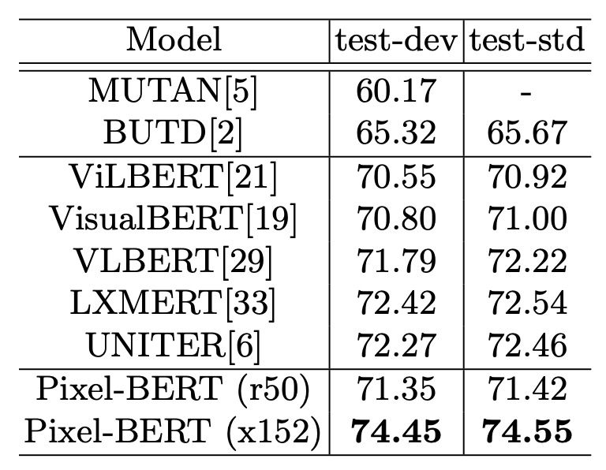
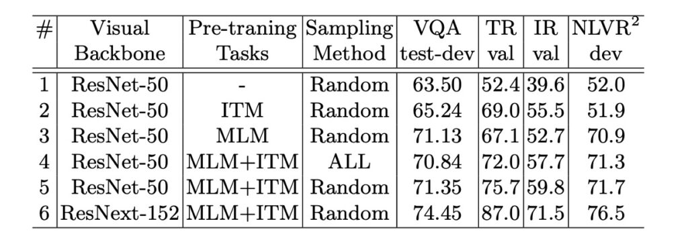

# [20.04] Pixel-BERT

## The Language of Pixels

**[Pixel-BERT: Aligning Image Pixels with Text by Deep Multi-Modal Transformers](https://arxiv.org/abs/2004.00849)**

---

:::info
The following content has been compiled by ChatGPT-4 and manually proofread, edited, and supplemented.
:::

---

In the past, when discussing the integration of vision and language models, most researchers followed a conventional standard procedure:

1. Use object detection models like Faster R-CNN to extract region features from images.
2. Combine these features with language models for cross-modal learning.
3. Explore various designs for cross-modal learning.

But who said a pre-trained object detection model must be the first step in the image encoding process?

Maybe no one explicitly stated it, but it became a common practice over time.

For researchers, it is often easier to follow previous works, make improvements, and achieve a slight performance increase of 1% to 3% to produce a commendable paper.

This trend continues until a breakthrough method is proposed or the evaluation dataset's performance saturates, leading to the next wave of changes.

Future researchers might question: Why did people back then rely so much on Transformer models?

The authors of this paper believe that the reliance on object detection models might be inherently flawed.

Object detection models are typically designed for specific visual tasks, potentially introducing biases that are not aligned with language understanding, especially when the visual representation capability of these models is limited by specific task categories.

Pixel-BERT offers a fresh perspective. It no longer relies on pre-trained object detection models but learns visual encoding directly from image pixels. This approach captures "pixel-level" visual information, including shapes, textures, and spatial relationships, which might be lost in object detection models. Combined with language encoding, this model effectively captures the subtle interactions between vision and language, learning richer and more detailed cross-modal representations.

## Problem Definition

The authors identify and define the following issues in this paper:

1. **Cross-Modal Semantic Gap**

   Current cross-modal learning (especially between vision and language) faces challenges due to the semantic gap between visual and language representations.

2. **Limitations of Visual Features**

   Previous methods tend to use region-based visual features extracted from object detection models. However, these region-based feature extractors are designed for specific visual tasks, leading to information gaps when combined with language understanding. Important visual information like object shapes, spatial relationships between overlapping objects, and object states might be lost.

3. **Constraints of Existing Visual Features**

   Region-based visual features currently used have limitations in representing broader visual semantics such as scenes and emotions, which object detection models might not capture.

## Solution

### Pixel-BERT Model Design

In early vision-language integration models, using object detection models like Faster R-CNN to extract region features from images was common practice. This means the model would search for specific objects or subjects in the image and draw bounding boxes around each object. The pixel values within these bounding boxes would be used as features for further learning.

But this method has its limitations:

- **Information Loss**: Bounding boxes might include some irrelevant background or miss parts of important objects, leading to information loss.
- **Task-Specific Constraints**: These object detection models are designed for specific visual tasks and may not be suitable for other cross-modal tasks.

### Pixel Feature Encoding

To overcome these limitations, Pixel-BERT adopts a different strategy. It no longer relies on object bounding boxes but learns visual encoding directly from the pixels.

1. **Pixel Learning**: Using CNNs like ResNet, visual features are learned directly from the entire image, considering every pixel, not just those within bounding boxes.
2. **Feature Extraction**:
   - **Image Input**: The input image first enters the model.
   - **CNN Backbone**: A pre-trained neural network is used to extract visual features from the input image.
   - **Convolution (Conv)**: Further processing of features through convolutional layers.
   - **Pooling**: This step downsamples the feature map, typically reducing its spatial dimensions.
   - **Random Sample**: Randomly selects some feature points from these features, maintaining computational efficiency and randomness.
3. **Semantic Encoding**: Each pixel feature is augmented with a semantic encoding vector (sv). This special vector differentiates visual encoding from language encoding. All pixel features share the same sv, acting as a bias term added to the CNN backbone.

### Sentence Feature Encoding

The model follows BERT’s method to encode the language information of sentences.

1. **Sentence Tokenization**

   A given sentence is tokenized into a sequence of words, a standard step in natural language processing, breaking the sentence into its constituent words.

2. **Word Tokenization**

   Using the WordPiece model, each word is tokenized. This method, commonly used in BERT, breaks a word into smaller recognizable segments or subwords, useful for handling rare or out-of-vocabulary words.

3. **Encoding Matrix Transformation**

   Each token is encoded into a vector through an encoding matrix, mapping each unique token or subword into a fixed-dimensional vector space.

4. **Positional Encoding**

   Positional information is crucial for models like Transformers. Thus, similar to BERT, Pixel-BERT adds positional encoding to capture the position of each token in the sequence.

5. **Combining Encoded Features**

   The lexical and positional encodings are combined. The paper uses LayerNorm(wi + pi + sw), where wi is lexical encoding, pi is positional encoding, and sw is the semantic encoding vector. However, in practice, the sw term is omitted.

6. **Final Language Representation**

   The combined encoded features [w^1,w^2,...,w^n] form the final language representation of the sentence, used in subsequent parts of the model.

### Cross-Modal Learning

The model uses Transformers to learn cross-modal attention, particularly the relationships between image pixels and language tokens. All encoded features are combined into a long input sequence, with special tokens like [CLS] and [SEP] to distinguish its structure. This design enables end-to-end learning, effectively bridging the gap between visual and language modalities.

### Pre-Training Methods

To learn general visual and sentence representations for vision and language-related tasks, the authors adopted a self-supervised approach for pre-training on large aggregated datasets.

- **Masked Language Model (MLM)**

  In the masked language modeling process, about 15% of the input tokens are randomly selected and masked. The mask hides the original value of the specific token, and the model's task is to recover these masked tokens' true values, relying on other non-masked language tokens and the provided visual tokens.

  Traditional BERT is unimodal, meaning it performs masked prediction only within language tokens. However, due to Pixel-BERT’s cross-modal nature, it leverages visual tokens for prediction. This capability makes Pixel-BERT more adept at handling contexts that might be ambiguous or challenging to interpret purely from language. For instance, when masked tokens in the language correlate directly with objects or scenes in the image, visual tokens provide crucial context, aiding the model in making accurate predictions.

- **Image-Text Matching (ITM)**

  Image-Text Matching (ITM) is a complex strategy designed to evaluate the model's ability to understand the deep semantic relationships between images and their corresponding text descriptions. It’s not just about finding direct matches but about recognizing nuanced connections.

  In Pixel-BERT, this task uses the [CLS] token as the representative point of the fused image and text. Through this token, the model generates a fused representation reflecting the combined meaning of the text and image. For example, when the model receives the text description "under the cherry blossoms in spring" and an image showing a park with blooming cherry blossoms, the [CLS] token generates a highly relevant fused representation. This representation is further transformed through a fully connected layer and sigmoid function, producing a score close to 1, indicating a high match between the image and text.

  However, to enhance the model's discrimination ability, "negative pairs" (where the image and text do not match) are introduced during training. For instance, pairing the text "under the cherry blossoms in spring" with an image showing a desert landscape. This design helps the model learn when the image and text are mismatched. Through this combination of positive and negative training pairs, the model can more accurately assess image-text match quality in real-world applications.

- **Pixel Random Sampling**

  Pixel Random Sampling is a unique strategy in Pixel-BERT aimed at enhancing the model's robustness and reducing overfitting risk.

  During training, after pixel features are extracted, rather than directly using all pixel features, the authors perform random sampling, selecting a portion of the pixels as model input. This means the model sees slightly different image inputs in each iteration.

  This approach has several advantages:

  - **Enhanced Robustness**: By random sampling, the model learns to extract critical visual information from partial data, maintaining good performance even if some pixels are missing or masked.
  - **Increased Efficiency**: Reducing the number of pixels input to the model decreases data processing volume, lowering computational costs and accelerating overall training.
  - **Prevent Overfitting**: Regularly changing model input prevents the model from memorizing specific input patterns, increasing its generalization ability.

  It’s important to note that this random sampling method is mainly applied during pre-training. In the fine-tuning stage, the goal is to optimize the model for specific tasks, requiring complete image data to ensure the best performance. Thus, pixel random sampling is not used during fine-tuning, ensuring consistent model input during training and testing while maximizing the use of all available pixel information.

## Discussion

### VQA Performance

- Pixel-BERT with ResNet-50 as the visual backbone achieved a score of 71.35 on the VQA test split, outperforming ViLBERT and VisualBERT using ResNet-101 or ResNeXt.

- Using ResNeXt-152 as the backbone, Pixel-BERT scored 74.45 on the test, and 74.55 on the test-standard split, surpassing other advanced methods.
- Pixel-BERT exceeded the performance of the 24-layer Transformer-based UNITER (Large) model, which scored 73.40 on the VQA test-std split.

Pixel-BERT's significant improvements demonstrate the advantages of learning visual and language attention directly at the pixel level. This approach not only enhances the visual encoder's representation but also strengthens subsequent visual and language encoding learning.

### NLVR2 Performance

In the natural language visual reasoning (NLVR2) task, the goal is to predict whether a language description corresponds to the given image pair. Pixel-BERT takes two image-language pairs as input, obtaining two encoded vectors from the [CLS] token. These vectors are concatenated and then used to train a classifier to predict "true" or "false" using cross-entropy loss.

Pixel-BERT achieved an accuracy of 76.5 on the NLVR2 development split and 77.2 on the test-P split. The results show that Pixel-BERT's method of combining two image-language pairs outperforms other models, such as LXMERT and UNITER's "Pair" settings.

Pixel-BERT's performance proves its excellence not only in the VQA task but also in tasks requiring the evaluation of the relevance between two images and a language description. These results indicate Pixel-BERT's flexibility in adapting to different input formats.

### Image-Text Retrieval

- Pixel-BERT mainly compares with Unicoder-VL and UNITER, both using 12-layer Transformers as the language module.
- In image-to-text retrieval, Pixel-BERT achieved a 0.6 improvement in recall@1 on the MS-COCO 1K test set and a 0.3 improvement on the MS-COCO 5K test set.
- In text-to-image retrieval, Pixel-BERT outperformed Unicoder-VL and UNITER, achieving at least a 1.9 improvement on the MS-COCO 1K test set and at least a 1.7 improvement on the MS-COCO 5K test set.

Pixel-BERT shows outstanding performance in image-text retrieval tasks. Its unique design strategy enables effective learning of cross-modal attention between language and image pixels, particularly excelling in text-to-image retrieval. These results demonstrate Pixel-BERT's efficiency and potential in vision-language tasks.

### Key Design Elements

The authors attribute part of Pixel-BERT's effectiveness and excellent performance to several key design elements:

1. **Choice of Pre-Training Tasks**

   The importance of MLM and ITM in pre-training is evident from ablation experiments. These tasks provide significant performance improvements for downstream tasks, with the NLVR2 task particularly relying on MLM.

2. **Combining Different Pre-Training Tasks**

   Combining MLM and ITM has a significant positive impact on the model's performance, demonstrating that using multiple pre-training tasks can further enhance downstream task performance.

3. **Random Pixel Sampling**

   This unique design aims to enhance the model's robustness and prevent overfitting. Ablation experiments show positive contributions of this strategy to VQA, retrieval tasks, and NLVR2.

4. **Choice of Visual Backbone**

   The model's performance also depends on the selected visual backbone. Using a more powerful ResNext-152 significantly improves performance, showcasing Pixel-BERT's ability to combine with strong visual backbones.

## Conclusion

Finally, the authors provide visualization results of the model. The attention maps of Pixel-BERT not only demonstrate the model's understanding but also verify its ability to accurately capture the semantic relationships between text and images. The attention mechanism visualization shows deep cross-modal learning effects, proving Pixel-BERT's performance and reliability in visual and language encoding.

In recent research developments, pre-training models in the vision and language field have achieved remarkable results. To address the limitations of region-based visual representations, the authors introduce a CNN-based visual encoder, cleverly combined with multi-modal Transformers, creating the Pixel-BERT model.

Pixel-BERT explores the connections between pixels and text in depth, demonstrating its precision and depth in visual-language encoding. Its learning strategies, such as random pixel sampling, further enhance the model's robustness. In mainstream datasets like Visual Genome and MSCOCO, this model has already shown impressive pre-training results. More excitingly, the authors plan to pre-train on more datasets and explore combining self-supervised visual content tasks to further enhance the model's performance.

:::tip
If we set aside the authors' own conclusions, I believe that replacing the "object detection model" while still matching or even surpassing the performance of state-of-the-art works like UNITER is the biggest contribution!

It means we no longer need to plug in a bulky, possibly pre-trained Faster R-CNN (or other architectures). This is definitely a notable and particularly delightful achievement for engineers!
:::
