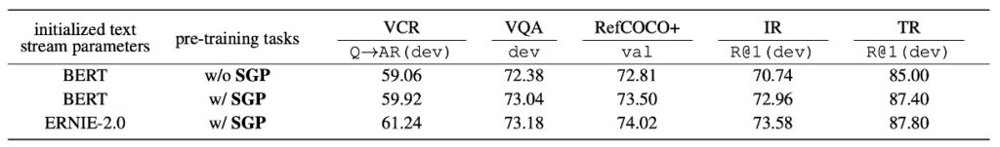

# [20.06] ERNIE-ViL

## The Double-Edged Sword of Knowledge

**[ERNIE-ViL: Knowledge Enhanced Vision-Language Representations Through Scene Graph](https://arxiv.org/abs/2006.16934)**

---

:::info
The following content has been compiled by ChatGPT-4 and manually proofread, edited, and supplemented.
:::

---

You might have heard various stories about BERT and its successors, and you could probably point out a few differences. For instance:

ERNIE models integrate rich prior knowledge, such as entity knowledge graphs, during pre-training, resulting in better semantic understanding. Additionally, ERNIE employs phrase-level masking. Besides the common Masked Language Model (MLM) task, ERNIE incorporates other pre-training tasks to enhance the model's representation capabilities.

Since ERNIE optimizes BERT, it's logical for researchers to apply this optimization approach to other domains, which is indeed what they have done.

## Problem Definition

The authors focus on the issues of vision-language pre-training models, particularly the shortcomings of current models in detailed semantic alignment.

Current models often fail to distinguish between common words and those that describe detailed semantics, such as objects, attributes, and relationships between objects. This limitation hampers these models' ability to effectively represent and capture fine-grained semantics in real-world scenes.

The key points defined and addressed by the authors are:

1. **Shortcomings of Current Vision-Language Pre-Training Models**

   Existing models often rely on random masking and subword prediction methods without effectively distinguishing between common words and those describing detailed semantics like objects, attributes, and relationships.

2. **Importance of Detailed Semantic Alignment**

   Current approaches often overlook the importance of constructing detailed semantic alignments across visual and linguistic constructs, which means models may fail to capture and represent fine semantic differences in real-world scenarios.

3. **Data Source Challenges for Vision-Language Pre-Training**

   Unlike textual pre-training models, vision-language models require high-quality, well-aligned image-text data, which are usually hard to obtain.

## Solution

### ERNIE-ViL Model Design

### Dual-Stream Cross-Modal Network

The dual-stream cross-modal Transformer structure ensures that information from both modalities can be effectively combined, providing a comprehensive, unified vision-language representation.

1. **Dual-Stream Structure**

   "Dual-stream" means there are two separate data streams or pathways. In the context of ERNIE-ViL, these two streams are text (or language) and images. Each modality has its own Transformer structure, allowing the model to focus on specific features of each modality instead of mixing them together.

2. **Processing Text and Image Data**

   Given the significant differences in the nature of visual and linguistic data (e.g., text is sequential, while images are two-dimensional), processing them separately allows the model to focus on the unique properties of each modality and use specially designed methods to parse and learn from these data.

3. **Cross-Modal Transformer Blocks**

   The purpose of these blocks is to facilitate interaction and alignment between the visual and linguistic data. Once text and images are processed by their respective Transformer structures, the cross-modal blocks work to fuse the information from both modalities using attention mechanisms and other specific strategies to find the correlations and contexts between text and images.

The main goal of the dual-stream structure is to ensure that the model understands the relationship between the text and the image. For example, if the text says "red ball," the model should be able to identify the red spherical object in the image.

### Scene Graph Prediction Tasks

A scene graph itself is not a trainable model but a data structure or representation used to describe the objects in an image, the relationships between objects, and the attributes of objects.

A scene graph is a visual representation that describes the presence of objects in an image, their relationships, and specific attributes. For instance, for an image with "a red apple on a table," the scene graph would include: the object "apple," the object "table," the attribute "red" for the apple, and the relationship "on" between the apple and the table.

Three major prediction tasks:

1. **Object Prediction**: The goal here is to predict or identify specific objects mentioned in the text. For example, in the sentence "The red apple is on the table," it should identify "apple" and "table" as the main objects.
2. **Attribute Prediction**: This focuses on the specific characteristics or descriptions of the objects. In the example above, the attribute of the object "apple" is "red." The goal is to identify and predict these attributes.
3. **Relationship Prediction**: This aims to identify the relationships between objects. In our example, the relationship between the apple and the table is "on."

By training ERNIE-ViL on these three prediction tasks, the model learns to deeply model the semantics between the visual (image) and linguistic (text description) modalities. This means the model not only identifies objects and their descriptions in the image but also understands the relationships between objects, providing richer and deeper vision-language representations.

### Semantic Alignment

A core objective of ERNIE-ViL is to ensure deep semantic alignment between the visual (image) and linguistic (text) modalities. Semantic alignment can be understood as the model's deep understanding of the relationship between objects in an image and their semantic descriptions in the text.

For example, if an image shows a cat on a car, the model should not only recognize the "cat" and "car" in the image but also understand the relationship "on" between them. Such semantic understanding ensures that the model can make the correct connections between the description and the image.

The object, attribute, and relationship prediction tasks play a crucial role in this process. These tasks require the model to not only identify objects and their attributes in the image but also understand the relationships between objects, helping to establish stronger cross-modal understanding.

### Encoding Methods

Encoding is a technique in machine learning used to transform high-dimensional input data into lower-dimensional forms, which helps the model understand and process the data better. ERNIE-ViL uses advanced encoding techniques to handle its input text and image data:

1. **Sentence Encoding**

   - The WordPiece method is used to decompose sentences. This method breaks down words into smaller units or fragments. For example, "playing" can be decomposed into "play" and "ing."
   - Each generated subword is encoded based on a combination of various information sources, including: the original word encoding (based on word semantics), segment encoding (distinguishing different sentences or paragraphs), and sequence position encoding (determining the position of the word in the sentence).

2. **Image Encoding**
   - A pre-trained object detector is used to identify major objects and features in the image. For instance, it can recognize "cat" or "car" in an image.
   - For each identified object or region, the model also encodes its positional information in the image. This helps the model understand the relative positions and relationships between objects, such as the "cat" being "on" the "car."

### Pre-Training Tasks

In deep learning, pre-training tasks are a common strategy designed to train models in advance using large amounts of unlabelled data, enabling them to generalize better on subsequent specific tasks. ERNIE-ViL proposes a series of pre-training tasks tailored for vision-language models, including object prediction, attribute prediction, relationship prediction, and masked language modeling. Below we delve into the characteristics and significance of each pre-training task:

1. **Object Prediction**

   Objects are the core elements of a visual scene, crucial for understanding the scene. Imagine a picture with just an apple and a table; if the apple is masked, the main element of the picture is hidden, making it difficult for the model to understand. In the object prediction pre-training task, some objects are masked in this way, requiring the model to predict based on other visible visual and textual information. This forces the model to learn to establish connections between images and text and improve its overall understanding of the scene.

2. **Attribute Prediction**

   Besides basic concepts, objects also have many related attributes, such as color, size, and shape. For instance, "red" in "red apple" is an attribute of the apple. The attribute prediction task requires the model to predict these attributes of masked objects, enabling it to describe and understand objects in images more precisely, rather than just basic classification.

3. **Relationship Prediction**

   Relationships between objects provide more contextual information. For example, in "the apple is on the table," "on" describes the relative position between the apple and the table. In the relationship prediction task, the model learns how to identify these relationships in the image and correctly map them to language descriptions, providing a deeper understanding of the visual scene.

4. **Masked Language Modeling (MLM)**

   MLM is a textual pre-training task. For example, in the sentence "The apple is red," the word "red" is masked, and the model is asked to fill in this missing part. ERNIE-ViL uses this strategy to learn syntactic and semantic information from text, enhancing its language processing capabilities for subsequent tasks.

5. **Masked Region Modeling and Image-Text Matching**

   These tasks focus on the image part, which we previously discussed as ITM (Image-Text Matching) and MRM (Masked Region Modeling). For example, an image may contain a "red apple" and a "wooden table." The model might mask the apple part and then try to predict the masked part based on the table and the related text description. These pre-training tasks enhance the model's understanding of single modalities and strengthen cross-modal connections, helping the model better integrate visual and linguistic information in real-world scenarios.

## Discussion

ERNIE-ViL's experimental results demonstrate its outstanding performance across various vision-language tasks, particularly when compared to other state-of-the-art cross-modal pre-training models. Here are the authors' main observations and discussions:

### Advantage of Out-of-Domain Training Data

Based on the data from Table 1, the ERNIE-ViL model shows excellent performance across multiple vision-language tasks, especially when pre-trained on large out-of-domain datasets like CC and SBU.

Here are some key highlights:

1. Compared to other methods pre-trained on the same out-of-domain datasets, ERNIE-ViL achieves the best performance across five major areas.
2. In vision reasoning, ERNIE-ViL-large shows a 6.60% improvement over VLBERT-large on the VCR task and a 1.74% improvement on the VQA task.
3. For visual grounding tasks, ERNIE-ViL-large achieves a 2.40% improvement on the RefCOCO+ testA and testB sections compared to VLBERT-large.
4. In cross-modal retrieval, ERNIE-ViLbase shows a 2.94% improvement in image retrieval and a 0.50% improvement in text retrieval tasks, surpassing Unicoder-VL-base.
5. When pre-trained on all out-of-domain and in-domain datasets, ERNIE-ViL-large still outperforms other state-of-the-art models like UNITER, OSCAR, and VILLA across multiple tasks.

### Importance of Scene Graph Prediction

The Scene Graph Prediction (SGP) task plays a crucial role in the model's performance. The experiments reveal:

1. **Introduction of Scene Graph Prediction**
   - ERNIE-ViL shows significant performance improvements after introducing the SGP task, highlighting its value during pre-training.
2. **Improvements in Specific Tasks**
   - In foundational referencing expressions, especially those requiring deep semantic alignment, SGP improves the model's accuracy on RefCOCO+ by 0.69%.
   - For image retrieval tasks, the model's R@1 on the Flickr30K dataset improves by 2.22%.
3. **Impact of ERNIE 2.0**
   - The textual initialization from ERNIE 2.0 further enhances the model's performance, particularly in visual reasoning tasks like VCR. This is likely because ERNIE 2.0 learns more commonsense knowledge during pre-training.

The inclusion of the SGP task significantly enhances ERNIE-ViL's performance, especially in tasks requiring detailed semantic alignment, such as foundational referencing expressions and cross-modal retrieval. This underscores the importance of modeling scene graphs for understanding the connections between images and text.

### Cloze Tests

The authors use cloze tests conditioned on the visual modality to evaluate the impact of the SGP task. These tests require the model to infer hidden detailed semantic tags based on visual and textual context.

1. **Dataset Construction**
   - Randomly selected 15,000 image-text pairs from the Flickr30K dataset. Selected 5,000 object, attribute, and relationship tags as hidden targets.
2. **Evaluation Metrics**
   - Used top-1 accuracy (ACC@1) and top-5 accuracy (ACC@5) as evaluation criteria.
3. **Comparison Results (from Table 3)**
   - The model pre-trained with the SGP task shows significant improvements in ACC@1 compared to the model without SGP: 1.20% improvement for objects, 3.08% for relationships, and 1.84% for attributes.
   - Both models' text parameters are initialized based on BERT.
4. **Observations**
   - In some cases, the model without the SGP task fails to make correct predictions as it lacks detailed semantic alignment and cannot distinguish between common words and detailed semantic words during pre-training. In other scenarios, the model can make predictions but with lower confidence compared to the model pre-trained with the SGP task.

The authors' cloze test results show that introducing the SGP task enables the ERNIE-ViL model to learn detailed semantic alignments across modalities more effectively.

## Conclusion

The ERNIE framework, though effectively extracting knowledge during multi-modal learning, demands significant computational and storage resources. This means it requires more computing power, which can be limiting in certain devices or scenarios. Additionally, while ERNIE leverages pre-learned knowledge, its generalization ability in rare cross-modal scenarios still needs improvement.

Extending to ERNIE-ViL, this model successfully incorporates the Scene Graph Prediction (SGP) task to optimize cross-modal detailed semantic alignment but also introduces new challenges. For example, if the relationship between objects in the scene graph, such as "tree" and "person," is mistakenly labeled as "sitting on" instead of "standing by," this misunderstanding could lead to failure in downstream tasks.

:::tip
The accuracy and completeness of the scene graph directly affect model performance!
:::

This adds uncertainty in practical applications. Moreover, consider a photo showing a blurred silhouette or overlapping objects; the model may struggle to determine whether it is a "person" or a "shadow" or another object. In such cases, the model may face difficulties interpreting complex or ambiguous scenes, limiting its applicability in scenarios requiring precise object recognition or scene interpretation.

The use of scene graphs implicitly means: "The way humans understand knowledge" is better than "The way models understand knowledge," so let the model learn how humans perceive the world.

But is this approach truly beneficial?

We encourage you to think about its advantages and disadvantages. Once you understand these, you will better grasp the opportunities and challenges presented by the "knowledge enhancement" techniques used in this paper.

Despite these challenges, ERNIE-ViL still shows impressive advantages in the realm of cross-modal pre-training. It not only optimizes detailed semantic alignment but also opens new directions, such as integrating scene graphs extracted from images and using graph neural networks (GNN) to incorporate more structured knowledge. This not only symbolizes technological progress but also provides new research directions and thinking spaces for future researchers.
