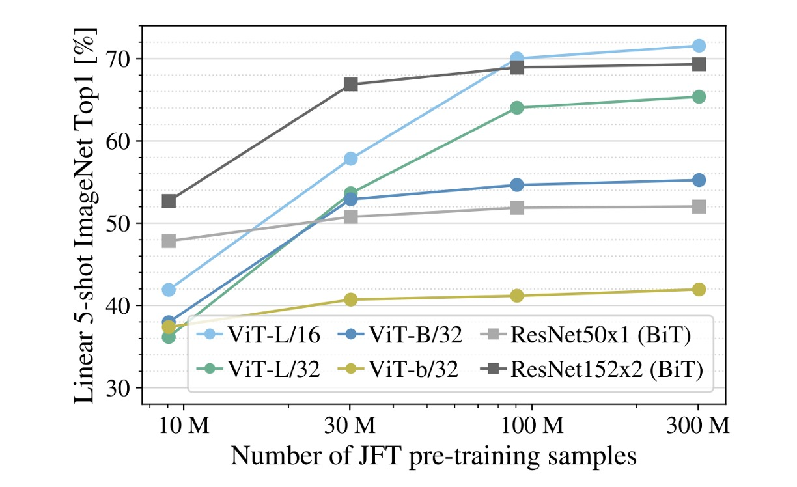
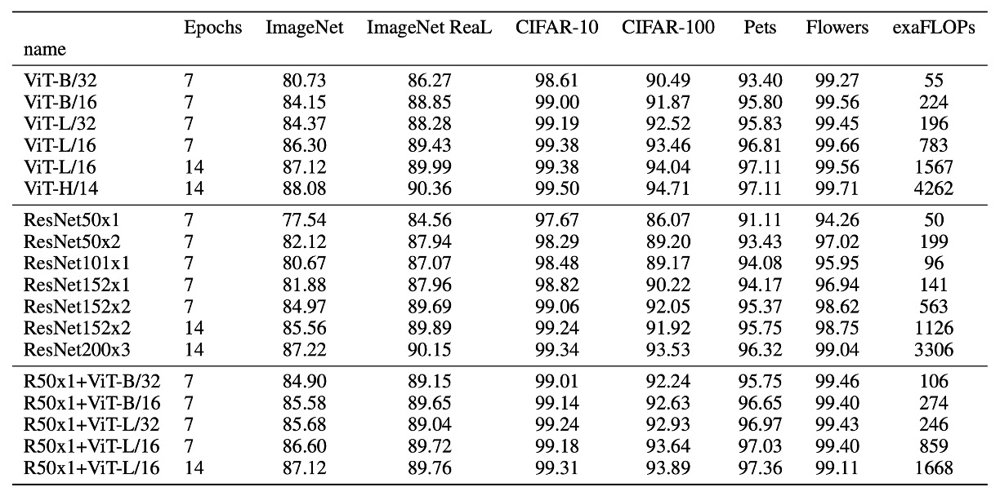

# [20.10] ViT

## Pioneering a New World

[**An Image is Worth 16x16 Words: Transformers for Image Recognition at Scale**](https://arxiv.org/abs/2010.11929)

---

:::info
The following content is compiled by ChatGPT-4 and has been manually checked, edited, and supplemented.
:::

---

In 2017, the introduction of the Transformer model caused a massive wave in the field of natural language processing (NLP), quickly becoming a dominant force.

Three years later, this wave has finally reached the realm of computer vision.

## Problem Definition

In recent years, many studies have attempted to integrate attention mechanisms with convolutional networks.

Or they have replaced certain parts while keeping the convolutional network's structure unchanged.

These studies suggest that the Transformer architecture cannot be directly applied to the image domain without modification.

However, the authors of this paper argue:

- **That's because you're doing it wrong!**

We can completely abandon convolutions and directly use Transformers to process images.

Processing images is merely a matter of handling a collection of 16 x 16 words!

## Solution

### Model Architecture


We are all familiar with the Transformer architecture.

You embed the text, arrange it into a sequence, pass it through an encoder, then through a decoder, and finally get the output.

When applying this structure to images, the first question to consider is:

- **How do you convert images into a sequence of words?**

Here, the authors propose a method: patch it up!

### Patchify

Given an image with dimensions 224 x 224, how would you divide it into smaller regions?

Manually cut it? Of course not!

The authors introduce a Conv2d operation to accomplish this task.

Let's implement it:

```python
import torch
import torch.nn as nn

# Assume image size is 224 x 224
dummy_img = torch.randn(1, 3, 224, 224)

# Patch size
patch_size = 16

# Embedding dimension
embed_dim = 768

# Patchify
emb_layer = nn.Conv2d(3, embed_dim, kernel_size=patch_size, stride=patch_size)

# After patching:
# input.shape = (1, 3, 224, 224)
# tokens.shape = (1, 768, 14, 14)
tokens = emb_layer(dummy_img)
```

Here, we set the patch size to 16 x 16 and the embedding dimension to 768.

Using the stride in the convolution, we can slide across the image in non-overlapping windows, dividing the 224 x 224 image into 14 x 14 patches.

In the original Transformer, each token in the text sequence is embedded. Here, we do the same: each image patch is embedded, meaning each 16 x 16 x 3 region is linearly transformed into a 768-dimensional vector.

Finally, we flatten these patches into a sequence:

```python
tokens = tokens.flatten(2) # (1, 768, 14, 14) -> (1, 768, 196)
tokens = tokens.permute(2, 0, 1) # (1, 768, 196) -> (196, 1, 768)
```

In the Transformer encoder, the input's first dimension is the sequence length, the second dimension is the batch size, and the third dimension is the feature encoding length.

With the above operations, we get the input sequence ready for the Transformer.

### And Then?

That's it.

From here, you can treat it like any other NLP Transformer.

Wait, not so fast!

Below is the parameter setting for ViT:


### Lack of Inductive Bias

In the Transformer architecture, there is no inductive bias for images.

In ViT, only the MLP layers are local and translation-invariant, while the self-attention mechanism is global, with very little 2D neighborhood structural information.

Therefore, the model must learn from scratch and understand: what is an image? What are the features of an image?

This is why it took so long to move from Transformers to ViT; early research failed to outperform convolutional networks and was thus abandoned.

:::tip
**What is the inductive bias of convolutional networks?**

The inductive bias of convolutional networks refers to their design preference for the translational invariance and locality of images. This preference is realized through the convolutional kernels, whose shared weights and local receptive fields enable convolutional networks to capture local features of images and perform well in tasks involving the translational invariance of images, making them easily generalizable to other image recognition tasks.
:::

### Training Data Must Be Large



Experiments show that if the training dataset is not large enough, ViT performs significantly worse than convolutional networks.

In the figure, the gray lines represent ResNet50x1 (BiT) and ResNet152x2 (BiT) results, while other colored lines represent ViT results. The horizontal axis shows the amount of training data, and when the data reaches 300M, ViT finally outperforms convolutional networks.

The authors believe:

- **For small datasets, the inductive bias of convolutional networks is crucial.**
- **For large datasets, learning relevant patterns directly from the data is sufficient!**

:::tip
Understanding ViT models:

- ViT-L/16: Large model with 16 x 16 patches
- ViT-L/32: Large model with 32 x 32 patches

The smaller the patch size, the higher the encoding resolution, resulting in better performance but higher computational cost, growing quadratically.
:::

### Can Be Even Larger


What happens if we keep training?

In this experiment, the authors used three different models:

- ViT
- ResNet
- Hybrid Model

Results show that with enough training data, ViT outperforms ResNet.

Moreover, the Hybrid Model performs slightly better than ViT with smaller models, but this difference disappears as the model size increases.

Finally, ViT shows no sign of saturation within the tested range, indicating more potential to be explored.

:::info
One might expect that convolutional local feature processing would help any size of ViT, but it doesn't.
:::



## Discussion

### What Does ViT See?


The authors extracted the first layer's projection of image patches into low-dimensional space, displaying the first 28 principal components.

- **Self-attention (left)**

  ViT, through the self-attention mechanism, can integrate global information from the image even in the lowest layer.

  Attention weights are used to calculate the average distance of integrated information in the image space, similar to the receptive field size in CNNs.

  The model shows broad attention in the lowest layer, indicating its ability to integrate global information. Other attention heads focus more locally in lower layers.

- **Position Embeddings (center)**

  Patches that are spatially close have similar embeddings, indicating that these embeddings can encode the distance relationships between patches within the image.

  The embeddings show row-column structures, sometimes revealing significant sinusoidal structures for larger grids.

- **Attention Distance (right)**

  This "attention distance" is akin to the receptive field size in CNNs.

  The average attention distance varies greatly across different heads in lower layers; some heads focus on most of the image, while others concentrate on the query position or nearby small regions.

  As depth increases, the attention distance of all heads grows. In the network's latter half, most heads have long attention distances, indicating a focus on global information in these layers.

### Predict with \[CLS\] or GAP?


In this paper, the authors used two different methods for classification tasks:

- **\[CLS\] Prediction**

  This is common in NLP, using the first token of the sequence to represent the entire sequence.

  This approach also works well in the image domain.

- **GAP Prediction**

  GAP (Global Average Pooling) is a common feature extraction method, averaging each channel of the feature map to obtain a vector.

  Initially, the authors used this method but found it performed very poorly!

  Detailed analysis revealed the issue wasn't GAP itself but the "learning rate" being too high!

After adjustments, both prediction methods achieved good results.

:::tip
In our experience, the Transformer architecture is very sensitive to learning rates, and this holds true for ViT.
:::

### Other Considerations

Besides the main content, here are some training tips and considerations:

1. Using a weight decay of 0.1 for training was found beneficial for downstream tasks.
2. The authors imitated MLM training methods but found them ineffective, requiring further research.
3. When the input image resolution changes, corresponding changes in the input sequence length (due to fixed patch size) necessitate linear interpolation of learned position encodings.
4. Adam was found to work better than SGD, likely because Adam better handles learning rate issues (AdamW is now commonly used).
5. Using 1-D learnable position encodings, 2-D learnable position encodings, or relative position encodings showed little difference, but one must be chosen; otherwise, performance significantly drops.

## Conclusion

This paper explores the application of Transformers to the image domain, proposing a novel architecture, ViT.

ViT outperforms traditional convolutional networks on large datasets and demonstrates greater potential in experiments.

The publication of this paper marks the successful application of the Transformer architecture in the image domain, opening new directions for future research.
