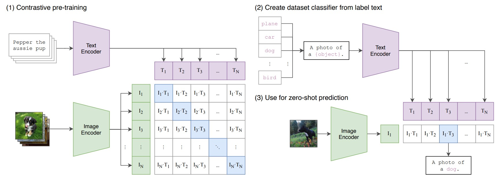
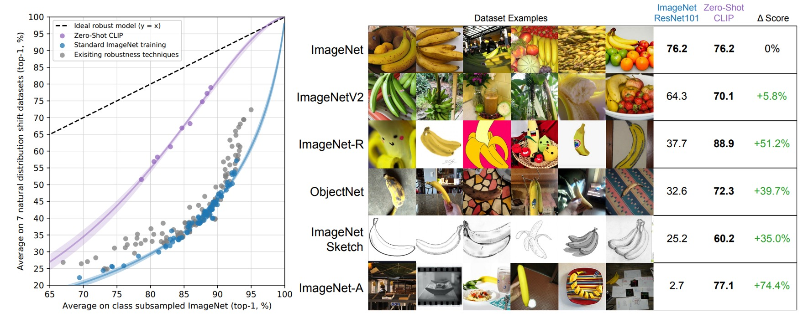

# [21.03] CLIP

## Breaking the Dimensional Barrier

[**Learning Transferable Visual Models From Natural Language Supervision**](https://arxiv.org/abs/2103.00020)

---

:::info
The following content was compiled by ChatGPT-4, edited and supplemented with manual corrections and explanations.
:::

---

In our daily lives, information is everywhere, appearing in various forms such as text, images, sound, or video. You might have described a painting with words or used pictures to make a story more vivid.

This time, we discuss Multi-Model Machine Learning (MMML).

Multi-modal learning is a machine learning method that uses multiple sources or modalities of information, such as text, images, and audio. By combining different types of information, multi-modal learning can capture richer data features to improve model accuracy and performance. This is a relatively new but rapidly developing field of research, achieving significant progress in applications like visual question answering, sentiment analysis, and automatic caption generation.

Vision-Language is a term often associated with multi-modal learning, focusing on the interaction between vision (such as images or videos) and language (such as text or speech). For example, a vision-language model can take an image and a question to generate an answer about the image or generate descriptive text from an image.

Multi-modal learning allows for describing broader concepts. Though not new, it has gained more attention recently due to the significant performance improvements brought by attention mechanisms.

Now, let's talk about CLIP, "Contrastive Language–Image Pre-training." Its core idea is simple: using large amounts of text and image data, the model learns to understand images through text or understand text through images.

This "bi-directional understanding" enhances the model's comprehension and opens new possibilities for multi-modal learning. By pretraining on vast amounts of data, CLIP learns to closely associate text with images, enabling it to generate descriptive text from an image or find matching images from a description.

Before diving into the model details, let's first look at the problems CLIP addresses and its proposed solutions.

## Defining the Problem

Try describing the following image:

- There's a cup of coffee... um, a book under the cup... they are on a table?
- Is it a corner of a coffee shop in the morning?
- Brown table and chairs, and brown coffee? (Seriously, focus!)
- ...

In fact, this image was generated using this description:

> _On a peaceful morning, sunlight gently spills through the curtains onto a minimalist wooden table. A freshly brewed cup of coffee sits on the table, its aroma mingling with the sunlight, evoking warmth and hope for the new day. The cup casts a long shadow, forming a beautiful scene with the green plants by the window. The surface of the coffee ripples slightly, seemingly narrating the morning's tranquility and life's beauty. Next to the cup, an open book lies quietly, waiting to be read. In this serene morning, coffee, sunlight, greenery, and books together create a warm and tranquil scene, telling of the simplicity and beauty of life._

If you also tried to describe this image, you might clearly feel the limitations of the ImageNet dataset used in academia and industry, despite its extensive categories and millions of images.

- There are too many ways to describe the same image.

ImageNet often provides only a hierarchical category or limited labels to describe an image's content. In contrast, human language and perception can interpret and understand an image from countless perspectives, such as color, shape, emotion, and narrative. This is the key difference between single-modal and multi-modal learning: the former usually analyzes information from a single perspective, while the latter combines different types of information for a richer and more diverse interpretation.

In single-label categories like ImageNet, much meaningful information can be overlooked, such as object interactions, contextual backgrounds, or the emotions evoked by the image. CLIP aims to break these limitations by combining information from various sources and types, such as text and images, to enrich the model's understanding and expression capabilities, making it closer to human perception and understanding.

## Solving the Problem

### CLIP Model Architecture

### Pretraining Process

Suppose we have a set of image-text pairs, such as a picture of a dog and the text "a cute puppy." In a training batch, CLIP receives multiple such pairs. The image encoder processes the image through ResNet or ViT to extract features, while the text encoder processes the text through a Transformer to extract text features.

The model then compares these features to ensure the cosine similarity between correctly paired images and texts (e.g., the dog image and "a cute puppy") is maximized, while minimizing the cosine similarity between incorrectly paired images and texts (e.g., the dog image and "an apple").

### Zero-Shot Inference

To classify fruits using CLIP without additional labeled data, we can create a set of natural language prompts, such as "A photo of an apple," "A photo of a banana," "A photo of a cherry," etc. When we have an image of a fruit to classify, we compare its features with the text features of these prompts, finding the text with the highest cosine similarity to infer the image's category.

### Natural Language Supervision

By using natural language as a supervision signal, CLIP can easily expand its training dataset. Traditional supervised learning requires extensive labeling, but by leveraging natural language, one only needs to collect a large number of image-text pairs. This method not only learns multi-modal representations but also links these representations with natural language, enabling flexible zero-shot transfer learning.

### Large-Scale Dataset: WIT

A significant part of CLIP's strong performance comes from its use of a large-scale dataset.

Initially, researchers used three datasets: MS-COCO, Visual Genome, and YFCC100M. However, they soon realized these datasets were too small for modern requirements. For example, MS-COCO and Visual Genome are high-quality datasets but only have about 100,000 training photos, which is minuscule compared to the 3.5 billion Instagram photos other computer vision systems handle. While YFCC100M has 100 million photos, many have low-quality captions and descriptions, such as autogenerated filenames or camera settings, providing little training help.

Thus, researchers created a new large-scale dataset called WIT (WebImageText), comprising 400 million image-text pairs from publicly available web resources.

:::tip
For example, finding a beautiful sunset picture online with the caption "The red sunset reflects on the tranquil lake," such image-text pairs would be collected in the WIT dataset.
:::

Researchers collected diverse image-text pairs across 500,000 different search queries, ensuring the dataset's variety.

Creating the WIT dataset aimed to address the small scale and low quality of existing datasets, allowing CLIP to learn richer and more diverse visual and language knowledge. The WIT dataset's total word count is similar to the WebText dataset used for training the GPT-2 model, highlighting its vast scale. This rich dataset enables CLIP to learn the correlations between images and text across numerous instances, achieving new heights in image and text understanding.

It must be noted that OpenAI's substantial funding enables bold research advances, creating many advanced and practical technologies and models.

Here is the dataset download link: [WIT: Wikipedia-based Image Text Dataset](https://github.com/google-research-datasets/wit#wit--wikipedia-based-image-text-dataset)

### Training Details

For model training, the authors selected a series of 5 ResNet and 3 Vision Transformer models. They trained a ResNet-50 and a ResNet-101, then scaled the ResNet-50 following the EfficientNet style to create three larger models, RN50x4, RN50x16, and RN50x64, with computation costs 4, 16, and 64 times that of ResNet-50.

For ViT models, they trained ViT-B/32, ViT-B/16, and ViT-L/14, each for 32 epochs using the Adam optimizer with decoupled weight decay regularization and cosine learning rate scheduling.

Initial hyperparameters were set through grid search, random search, and manual tuning on the baseline ResNet-50 model. Due to computational constraints, these hyperparameters were heuristically adjusted for larger models.

To ensure training stability, a learnable temperature parameter τ was initialized at 0.07, and measures were taken to prevent logits scaling above 100. Training and memory efficiency were enhanced using a large batch size of 32,768, mixed precision, gradient checkpointing, half-precision Adam statistics, and half-precision stochastic rounding text encoder weights.

Regarding hardware, training the largest ResNet model RN50x64 required 592 V100 GPUs for 18 days, while the largest Vision Transformer model needed 256 V100 GPUs for 12 days. To improve ViT-L/14 performance, they pre-trained for an additional epoch at a higher resolution of 336 pixels, labeled as ViT-L/14@336px.

The following table illustrates the configuration and requirements for training different models:

| Model Name | Base Model | Compute Scale | GPU Count     | Training Days | Special Configuration             |
| ---------- | ---------- | ------------- | ------------- | ------------- | --------------------------------- |
| ResNet-50  | ResNet-50  | 1x            | (unspecified) | (unspecified) | None                              |
| ResNet-101 | ResNet-101 | 1x            | (unspecified) | (unspecified) | None                              |
| RN50x4     | ResNet-50  | 4x            | (unspecified) | (unspecified) | None                              |
| RN50x16    | ResNet-50  | 16x           | (unspecified) | (unspecified) | None                              |
| RN50x64    | ResNet-50  | 64x           | 592           | 18            | None                              |
| ViT-B/32   | ViT-B      | (unspecified) | (unspecified) | (unspecified) | None                              |
| ViT-B/16   | ViT-B      | (unspecified) | (unspecified) | (unspecified) | None                              |
| ViT-L/14   | ViT-L      | (unspecified) | 256           | 12            | Extra pre-training 1 epoch @336px |

This table outlines the model name, base model, compute scale, GPU count, training days, and special configuration. "Unspecified" indicates the original paper did not provide specific information.

:::note
The scale of using 592 V100s is impressive and enviable.
:::

### Model Inference

In image classification, dataset labels often reflect an afterthought approach. Many standard datasets use numerical IDs for labeling, with a file mapping these IDs back to their English names. Some datasets, like Flowers102 and GTSRB, seemingly do not include such mapping in their release, severely limiting zero-shot transfer potential.

The authors note that many datasets have somewhat arbitrary class label choices, lacking the descriptive information needed for successful zero-shot transfer. For example, providing only class names to the CLIP text encoder might result in ambiguity. In some cases, the same word can have different meanings, such as "crane" referring to either a construction crane or a flying crane in ImageNet. Another example is the term "boxer" in the Oxford-IIIT Pet dataset, where it refers to a dog breed but might be interpreted as an athlete by the text encoder without context.

To address these issues, the authors experimented with prompt templates like "a photo of a 'label'" to provide textual context about the image. This method improved ImageNet accuracy by 1.3%, demonstrating its effectiveness.

Additionally, customizing prompt texts for each task significantly enhanced zero-shot performance. Examples include using "a photo of a 'label', a pet" for Oxford-IIIT Pets, specifying a type of food for Food101, or specifying an aircraft type for FGVC Aircraft.

Lastly, the authors explored boosting classification performance through ensembling multiple zero-shot classifiers. They constructed ensemble predictions in embedding space rather than probability space, using different context prompts like "a big 'label' photo" and "a small 'label' photo" to compute classifications. This ensemble prediction method improved performance, achieving an additional 3.5% accuracy gain on ImageNet, demonstrating the potential of prompt engineering and ensemble prediction methods to improve ImageNet accuracy by nearly 5%.

## Discussion

In this section, the authors raise a series of thought-provoking questions regarding the performance and effectiveness of zero-shot learning. Zero-shot learning is a method that uses existing knowledge to understand new situations through abstraction and reasoning without prior examples.

First, the authors question whether zero-shot learning truly meets expectations and accurately recognizes new classes without prior examples. They then examine the model's abstraction capability to see if it can capture and represent the core characteristics of data.

In today's data-rich environment, a model's ability to operate across different data domains is crucial. For example, can a model trained mainly on animal images effectively handle mechanical parts image recognition? They also discuss whether the model's performance matches human judgment.

The accuracy and completeness of self-constructed datasets are another focus. The authors are concerned about potential "cheating" during dataset creation, such as improper labeling or omission of certain classes.

Lastly, the potential harm hidden in data is significant. If data contains incorrect or harmful information, how does it affect the model? Does it lead the model in a wrong direction?

Through these questions, the authors aim to provide a comprehensive and in-depth discussion of zero-shot learning.

:::tip
Due to the extensive number of charts in the original paper, this article primarily focuses on conclusions, only including selected charts, with references to others as indicated in the paper.
:::

### Does Zero-Shot Meet Expectations?

CLIP meets expectations in some areas but reveals areas needing improvement:

1. Exceptional Performance on Specific Datasets:

   On specific datasets, such as those with well-defined underlying feature representations, zero-shot CLIP's performance can match or even surpass fully supervised classifiers. This highlights zero-shot learning as an efficient alternative in certain cases.

2. Performance Matching:

   Comparing CLIP to few-shot logistic regression classifiers underscores CLIP's robust performance. For instance, in an animal image classification task, zero-shot CLIP can identify unseen classes (e.g., "zebra" not present in training data) through text descriptions, while few-shot classifiers might need more training data for similar performance.

3. Zero-Shot Transfer Efficiency:

   Differences in zero-shot transfer efficiency across datasets reflect dataset complexity and diversity. For example, zero-shot transfer might need fewer examples in simpler datasets, but more in complex, varied datasets for similar performance.

4. Comparison with Fully Supervised Classifiers:

   In many cases, fully supervised classifiers outperform zero-shot CLIP, indicating supervised learning may remain a more stable choice in traditional classification tasks.

5. Predictive Trends in Performance:

   The positive correlation between fully supervised and zero-shot performance suggests potential for improving zero-shot learning. Enhancing fully supervised data quantity or learning underlying features might improve zero-shot performance.

6. Scaling Patterns:

   CLIP's logarithmic linear scaling trend in zero-shot performance may be influenced by factors like model size and training data diversity. Further analysis could identify specific factors and provide methods to improve zero-shot learning performance.

Zero-shot CLIP's performance meets expectations to some extent, particularly when compared to few-shot logistic regression, matching its performance on some datasets and achieving fully supervised levels in specific cases. However, comparisons with fully supervised classifiers and performance differences across datasets indicate significant room for improvement in CLIP's zero-shot transfer capabilities, with potential unexplored performance-impacting factors.

### Is Its Representation Capability Good?

CLIP shows strong potential in representation learning and generalization across various aspects:

1. Representation Quality Assessment:

   CLIP's ability to fit linear classifiers and perform well on multiple datasets showcases its representation learning capability. However, further exploration is needed to see if it maintains this performance on unseen datasets or extreme conditions.

2. Utility of Linear Classifiers:

   Evaluating with linear classifiers highlights the general and transferable representations learned during pretraining. This feedback reveals potential flaws, such as over-reliance on specific features, impacting adaptability to different tasks.

3. Model Scale and Performance:

   CLIP's various model scales, like ResNet-50x64 and CLIP ViT, indicate a relationship between model size, representation capability, and computational efficiency. Larger models may require more computational resources, limiting application on low-resource devices.

4. Task Diversity:

   CLIP performs well on diverse tasks like geo-localization, optical character recognition (OCR), facial emotion recognition, and action recognition. For instance, in OCR tasks, CLIP effectively recognizes text in different fonts and colors. However, specialized models might outperform CLIP in specific tasks, warranting further investigation.

5. Broad Dataset Evaluation:

   Evaluating on 27 datasets demonstrates CLIP's strong generalization and computational efficiency but may still have data bias issues, requiring further verification on diverse datasets.

6. Self-Supervised System Performance:

   Compared to self-supervised systems like SimCLRv2, CLIP shows relatively better performance. Whether self-supervised learning efficiency and effectiveness can continually improve needs time and extensive testing.

7. Comparison with Advanced Models:

   Compared to advanced models like Noisy Student EfficientNet-L2, CLIP excels on most datasets but may still have shortcomings in specific tasks or datasets.

### Can It Work Across Data Domains?

In evaluating deep learning models' performance and robustness, cross-domain ability is crucial. Ideally, a model should maintain good performance across different datasets and distributions. However, as mentioned, many ImageNet-based models significantly drop in performance when faced with new or unseen data distributions.

For example, evaluating different natural distribution shift datasets (ImageNetV2, ImageNet Sketch, Youtube-BB, etc.) reveals traditional ImageNet models (e.g., ResNet-101) perform far worse on these new datasets than on the original ImageNet validation set. This indicates significant shortcomings in these models' cross-domain performance and susceptibility to data distribution shifts.

Zero-shot CLIP models perform markedly better on these new datasets than traditional ImageNet models, effectively narrowing the gap between ImageNet accuracy and accuracy under distribution shifts. Analysis shows zero-shot classifiers significantly improve after adapting to the ImageNet distribution, with accuracy increasing by 9.2%. However, under distribution shift scenarios, accuracy shows a slight decline.

This raises an important question: How to interpret CLIP's improved accuracy on the ImageNet distribution and its unremarkable improvement under distribution shifts? Are these gains primarily due to "leveraging spurious correlations"? Moreover, is this phenomenon unique to CLIP, ImageNet datasets, and distribution shifts, or does it reflect a broader trend? Does it also apply to end-to-end fine-tuning and linear classifiers?

### Can It Compare to Humans?

To understand the differences between CLIP and human performance, researchers compared specific tasks. They selected the Oxford IIT Pets dataset, asking 5 participants to label each of the 3669 images without seeing any breed examples. In another experiment, participants were given one or two image examples of each breed for reference. This aimed to understand how humans improve their classification accuracy with given examples.

Results show that on another dataset, STL-10, humans achieved up to 94% accuracy, with some subsets reaching 97-100%, demonstrating strong human ability in these tasks. When given one example per class, human average performance improved from 54% to 76%. Additional examples did not help much overall but were beneficial for confusing images. This indicates humans excel at recognizing uncertainty and adjusting judgments based on new information.

Despite CLIP's potential in zero-shot learning and good performance in natural distribution shift tests, it still significantly lags behind humans in few-shot learning. Researchers note humans effectively use few examples to improve classification accuracy, while CLIP struggles in this area. Humans clearly outperform CLIP in leveraging prior knowledge.

### Did the Model Cheat?

During pretraining on large-scale web datasets, an unavoidable issue is unintentional overlap with downstream evaluation datasets. This overlap might lead to unusually good model performance in evaluations but does not reflect true generalization ability.

As previously discussed, some datasets, due to their uniqueness or synthetic nature, showed no overlap, such as MNIST, CLEVR, and GTSRB. However, other datasets exhibited significant overlap, especially those built from public datasets like YFCC100M. For instance, Country211 showed a 21.5% overlap rate.

Despite this, overlap had minimal impact on accuracy improvement, as in Country211, accuracy only increased by 0.2%. This might be because the training text in the overlapping items did not cover specific information relevant to downstream tasks. In some cases, like the Kinetics-700 dataset, overlapping items were actually irrelevant black transition frames, reducing accuracy in the overlapping subset by 20%.

Overlap analysis is nuanced and complex, requiring consideration of both data duplication and potential changes in underlying data distribution and other confounding factors. For instance, in the CIFAR-100 dataset, due to very low image resolution, many overlapping images were misidentified small objects like birds or planes. This might affect category distribution or overlap difficulty, impacting accuracy variation.

These observations align with previous large-scale pretraining studies, such as Mahajan et al. (2018) and Kolesnikov et al. (2019), which reported similar overlap rates and minimal overall performance changes. Importantly, these studies also compared different overlap data removal strategies and found almost no difference between the chosen methods and alternative strategies. This underscores the importance of duplication analysis in understanding and improving model generalization performance and the necessity of identifying and handling overlap before training.

The authors noted that while the detector showed near 100% accuracy on the proxy training task and achieved high precision through manual inspection and threshold adjustment, the recall rate's perfection is limited. Additionally, underlying data distribution changes between overlapping and clean subsets are potential confounders affecting analysis. For example, in Kinetics-700, many "overlapping" items were black transition frames, reducing accuracy in the overlapping part by 20%.

The authors also mentioned potential subtle distribution changes, such as in CIFAR-100, where very low image resolution caused many overlapping images to be misidentified small objects like birds or planes. Accuracy changes might result from category distribution or overlap difficulty changes, possibly obscuring overfitting effects.

### What Are the Limitations?

Despite CLIP's promising capabilities, it has several serious limitations:

1. Performance Limitations:

   On some supervised split datasets, zero-shot CLIP's performance matches linear classifiers based on ResNet-50 features. However, on most datasets, its performance is far below state-of-the-art. Even with scaling improvements, achieving top performance would require increasing CLIP's computation by about 1000 times, which is impractical with current hardware.

2. Task Learning and Transferability:

   CLIP underperforms in certain tasks, such as fine-grained classification (e.g., car models, flower species, and aircraft variants) and more abstract and systematic tasks (e.g., counting objects in images).

3. Generalization Ability:

   Although CLIP performs well on various natural image distributions, its zero-shot performance significantly drops when facing truly out-of-distribution data. For example, CLIP achieves only 88% accuracy on MNIST handwritten digit recognition, while logistic regression on raw pixels outperforms zero-shot CLIP. This highlights CLIP's inability to address the fundamental issue of deep learning models' generalization weakness. Relying solely on massive diversified datasets to effectively cover all distributions is naive, as MNIST proves this assumption easily violated.

4. Data and Computational Efficiency:

   CLIP requires vast amounts of data and computational resources, with its training process being too extensive for current hardware, taking hundreds of years to complete the full training cycle. Although existing self-supervised and self-training methods show potential for improving data efficiency, combining these methods might guide CLIP's further development.

5. Evaluation and Optimization:

   - The study's approach has several obvious limitations. Although focusing on zero-shot models, researchers repeatedly queried full validation set performance to guide CLIP development. These validation sets typically have thousands of examples, impractical for true zero-shot scenarios. Similar concerns have been raised in the semi-supervised learning field (Oliver et al., 2018).
   - Performance counterintuitively drops when transitioning from zero-shot to few-shot settings, indicating CLIP's few-shot learning optimization needs improvement.

6. Social Bias and Ethical Considerations:

   Trained on web image-text pairs, CLIP might learn societal biases due to unfiltered and unsupervised data.

Future research needs to explore combining CLIP's strong zero-shot performance with efficient few-shot learning methods to achieve more comprehensive and reliable visual and language understanding models.

### Malicious Data

- Bias:

  The article deeply explores the potential biases and malice from data, highlighting these issues' societal and individual impacts. Through analyzing data sources and potential biases, the authors call for greater awareness and understanding of data's importance and potential risks.

  Firstly, the authors point out that data collection and processing may be influenced by varying degrees of subjectivity, losing objectivity. For example, data might be skewed due to the collector's biases or important information might be overlooked due to specific processing methods.

  They provide examples of how these biases manifest in different contexts, discussing issues like racial bias, gender discrimination, and economic inequality, explaining how these issues interplay with data bias, exacerbating social problems.

  The authors remind readers that even if data is inherently innocent, improper handling might lead to severe consequences. They emphasize the need for comprehensive data governance mechanisms and data literacy among users and policymakers to understand and mitigate potential risks.

  Finally, they urge data-related individuals and institutions to responsibly handle and use data, striving to create a fair, transparent, and sustainable data ecosystem to promote social justice and progress.

- Surveillance:

  The article delves into the application and impact of widely used computer vision models in surveillance, especially focusing on performance in CCTV image classification and zero-shot celebrity identification. By analyzing the model's effectiveness and limitations, the authors aim to provide insights into these models' potential future impacts, assisting in forming norms and checks around such systems.

  The authors first tested the model's performance on low-resolution images captured by surveillance cameras (e.g., CCTV). Using the VIRAT dataset and data extracted by Varadarajan & Odobez, they tested 515 images from 12 different video sequences in coarse and fine-grained classification. Coarse classification involved identifying the main subject of an image, such as determining if the image was an empty parking lot or a school campus. Fine-grained classification required the model to choose between two options to identify smaller features like a person standing in a corner. In the coarse classification task, the model achieved a 91.8% Top-1 accuracy, but its performance dropped significantly in fine-grained detection and "stress tests," with accuracy falling to 51.1% and an error rate of 40.7% for "close" answers.

  Further, the authors explored the effectiveness of zero-shot celebrity identification. Using the CelebA dataset to test CLIP's zero-shot capability, they aimed to evaluate identity detection performance using only pre-trained public data. Results showed 59.2% Top-1 accuracy in the task of identifying 8k celebrity images "in the wild" among 100 possible classes. However, accuracy dropped to 43.3% when the number of classes increased to 1,000. While this performance does not compete with production-grade models like Google's celebrity recognition, it demonstrates the feasibility and relatively robust performance of zero-shot identification without additional task-specific datasets.

  Ultimately, the authors note that although CLIP shows significant advantages in zero-shot functionality, making it appealing for tasks with relatively few data, it has lower attractiveness for many on-demand surveillance tasks like face recognition, where large datasets and high-performance supervised models exist. Additionally, CLIP is limited in common surveillance-related tasks like object detection and semantic segmentation. However, by reducing the need for training data, CLIP unlocks certain usability aspects, allowing customized niche surveillance use cases without specialized models or datasets, lowering the skill requirements for building such applications.

## Conclusion

This study explores transferring the success of large-scale pretraining in natural language processing (NLP) to computer vision (CV), demonstrating CLIP's strong capabilities in multi-task learning and zero-shot transfer.

In conclusion, the paper's contributions and future prospects are summarized:

1. Contributions:

   - Multi-Modal Learning: CLIP's innovation lies in processing both image and text information, achieving multi-task learning and adaptation through large-scale pretraining and natural language prompts.
   - Zero-Shot Transfer Learning: CLIP demonstrates strong zero-shot transfer capability, performing well even without task-specific training data through natural language prompts.
   - Scalability: CLIP's performance can match task-specific supervised models at sufficient scale, proving its training and application scalability.

2. Future Prospects:

   - Lack of Explainability: While CLIP can merge text and image information and provide some form of explanation through natural language descriptions, it still has explainability limitations. For example, the model might offer high-level abstract explanations but lack detailed decision-making processes. Additionally, due to the complexity of the multi-layer neural network structure and potential training data biases, explanations might not always be accurate or reliable.
   - Performance Improvement Space: Despite CLIP's strong performance across tasks, there is room for improvement, especially compared to task-specific supervised models.

The authors also deeply explore potential societal impacts, thanking all project participants and software developers for their technical support. This study provides valuable insights for cross-domain technical exploration and opens new possibilities for further multi-modal learning development.
