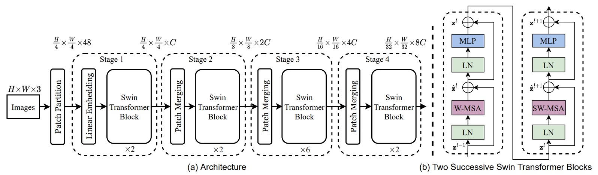
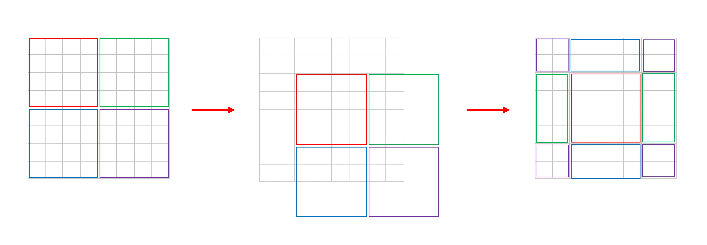
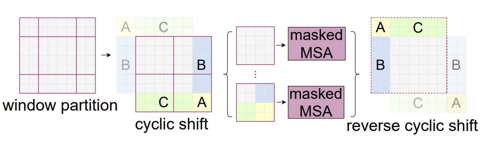

# [21.03] Swin Transformer

## The Dance Begins

[**Swin Transformer: Hierarchical Vision Transformer using Shifted Windows**](https://arxiv.org/abs/2103.14030)

---

At the same time, the PVT was proposed, which also incorporated the hierarchical structure of convolutional networks into the Transformer.

- [**[21.02] PVT: Spatial Reduction Attention Mechanism**](../2102-pvt/index.md)

PVT uses the SRA mechanism (Spatial Reduction Attention) to reduce the computational cost of the attention mechanism, but this approach doesn't truly solve the problem, as the quadratic complexity of the attention mechanism still exists.

## Problem Definition

In this paper, the authors target the original ViT architecture, identifying several key issues:

### Multi-scale Detection Capability

It's well-known that ViT struggles with detection and segmentation tasks because ViT typically breaks the input into 16x16 patches and performs self-attention operations on these patches at each layer. This process occurs at a single scale, resulting in poorer multi-scale detection capabilities compared to other architectures.

### Quadratic Complexity

For object detection, the input size isn't limited to 224 x 224 images.

Larger input images significantly increase the computational cost of the attention mechanism. For instance, a 224 x 224 image produces 14 x 14 = 196 patches; for a 1536 x 1536 image, the patch count increases to 96 x 96 = 9216. Performing self-attention on this many patches is computationally prohibitive, limiting ViT's application to large images.

## Solutions

### Model Architecture

To handle the multi-scale problem, a hierarchical architecture is adopted, as shown in the Swin-T architecture above.

An input image of H x W x 3 is split into patches of size 4 x 4, and the feature dimension is projected to C dimensions, resulting in a feature map of size H/4 x W/4 x C. The 48 in the figure represents a patch containing 4 x 4 x 3 pixels, which is then transformed to C dimensions, where C is 96.

:::tip
In practice, this step is often implemented using a convolution operation for simplicity, though the authors illustrate it in more detail here for clarity.
:::

Afterward, the feature map passes through a set of Swin-Transformer blocks. These modules consist of pairs of standard Transformer blocks followed by Swin blocks, as indicated by the number of modules being multiples of 2 in the figure.

Downsampling is achieved through patch merging, which splits each patch into 2 x 2 sub-patches. If the original size is H x W x C, after patch merging, it becomes H/2 x W/2 x 4C.

Here’s an illustrative diagram:

To control the channel count, a 1 x 1 convolution is used to reduce the number of channels from 4C to 2C.

Now that we’ve understood the basic architecture, let’s delve into the details of the Swin blocks.

### Sliding Windows

According to the paper:

- Each patch is 4 x 4 pixels, represented by the gray squares in the figure.
- Every 7 x 7 patches form a window, with M = 7 being the hyperparameter.

The model performs self-attention within each window, making each attention sequence length 49. As the image size increases, the sequence length within each window remains constant, only the number of windows increases, thus the computation scales as 49 x N. This reduces the original quadratic complexity to linear complexity.

**But this design prevents information flow between windows, hindering the full potential of the Transformer.**

To address this, the authors propose the concept of Shifted Window, where each window is shifted two patches diagonally, allowing patches to interact across windows.

:::tip
To help understand this, we created a rough explanatory diagram to show how the paper’s figure transitions from left to right:

:::

### New Challenges

This method introduces a new challenge:

The number of windows changes from $N \times N$ to $(N+1) \times (N+1)$ after shifting. Also, the window sizes become inconsistent, necessitating padding operations, potentially increasing computation again.

This is unacceptable for the authors.

To solve this, they propose a special masking method.

### Cyclic Shift

As shown in the figure, this is a new window after the shift. The authors first perform a cyclic shift on these windows and then stitch them back together, forming a new window.

:::tip
We understand the confusion here. To clarify, let’s number the nine windows A to I:

According to the paper, the shift size is 3, meaning each window shifts three patches right and down.

First, shift right by 3:

Then shift down by 3 to form new windows.

Combining these steps, we get the paper’s figure:

:::

This way, we reassemble complete N x N windows without incurring extra computational cost.

However, to prevent interactions between different small windows, the authors use a special mask.

### Special Masking

:::tip
Though this section leans more towards engineering implementation, it’s particularly brilliant!
:::

This part is complex, so we refer to the author's explanation on GitHub:

- [**Swin-Transformer/issues/38**](https://github.com/microsoft/Swin-Transformer/issues/38)

Let’s break down this mask design, as patches in each window need to be aligned for corresponding operations:

1. The first window is complete, so no attention mask is needed.
2. The second window involves areas B and H from the hand-drawn diagram.

   :::tip
   After flattening, the arrangement looks like B, B, B,..., B, H, H, ...H, resulting in a complete mask block.
   :::

3. The third window involves areas F and D.

   :::tip
   After flattening, it looks like F, F, D, D, D, F, F, D, D, D, F, ... so the attention mask has a grid-like structure.
   :::

4. The fourth window involves areas I, G, C, A.

   :::tip
   This combines previous cases, so the mask has both grid and complete blocks.
   :::

### Reverse Shift

After cyclic shift and special masking, the authors effectively enable information flow between windows while maintaining linear complexity. Finally, a reverse shift restores the original window positions, providing a complete feature map.

Without this step, the feature map would keep shifting diagonally, potentially disrupting subsequent tasks.

## Discussion

### Performance on ImageNet-1K

For image classification, the authors benchmarked the proposed Swin Transformer on ImageNet-1K.

This dataset contains 1.28 million training images and 50,000 validation images across 1,000 classes. The training setup includes:

- **Optimizer**: AdamW
- **Training Epochs**: 300
- **Learning Rate Scheduler**: Cosine decay
- **Linear Warmup**: 20 epochs
- **Batch Size**: 1024
- **Initial Learning Rate**: 0.001
- **Weight Decay**: 0.05
- **Augmentation and Regularization**: Includes most strategies except repeated augmentation and EMA, as they don't improve performance.

---

The table above compares different backbone networks, including Transformer and ConvNet-based ones trained on standard ImageNet-1K.

Compared to previous state-of-the-art Transformer architectures (e.g., DeiT), Swin Transformers show significant performance improvements.

- **Swin-T (81.3%)** outperforms **DeiT-S (79.8%)** by 1.5%.
- **Swin-B (83.3%/84.5%)** outperforms **DeiT-B (81.8%/83.1%)** by 1.5% and 1.4%, respectively.

Compared to state-of-the-art ConvNet architectures (e.g., RegNet and EfficientNet), Swin Transformer also slightly outperforms in the speed-accuracy tradeoff. Notably, while RegNet and EfficientNet were obtained through exhaustive architecture search, the proposed Swin Transformer is adapted from the standard Transformer with further improvement potential.

### Object Detection Settings

The architecture mainly aims to solve multi-scale issues, making its performance on object detection tasks more significant.

Object detection and instance segmentation experiments are conducted on the COCO 2017 dataset, which includes 118K training images, 5K validation images, and 20K test-dev images.

For ablation studies, the authors consider four typical object detection frameworks:

1. Cascade Mask R-CNN
2. ATSS
3. RepPoints v2
4. Sparse RCNN

These frameworks share the same training settings:

- **Multi-scale training**: Adjust input size so the short side is between 480 to 800 while the long side is up to 1333.
- **Optimizer**: AdamW (initial learning rate 0.0001, weight decay 0.05, batch size 16).
- **Training Epochs**: 3x schedule (36 epochs).

For system-level comparison, the authors use an improved HTC (HTC++) with:

- instaboost
- Stronger multi-scale training
- 6x schedule (72 epochs)
- soft-NMS
- Initialization with ImageNet-22K pretrained models

They compare Swin Transformer with standard ConvNets (e.g., ResNe(X)t) and previous Transformer networks (e.g., DeiT) by only changing the backbone while keeping other settings constant. Since Swin Transformer and ResNe(X)t have hierarchical feature maps suitable for these frameworks, but DeiT produces a single-resolution feature map, a deconvolution layer constructs hierarchical features for DeiT.

### Swin vs ResNe(X)t

Table (a) shows Swin-T and ResNet-50 results on four object detection frameworks.

- Swin-T provides consistent +3.4∼4.2 box AP improvements over ResNet-50.
- Model size, FLOPs, and latency are slightly larger.

Table (b) compares Swin Transformer and ResNe(X)t with Cascade Mask RCNN at different model capacities.

- Swin Transformer achieves high detection accuracy of 51.9 box AP and 45.0 mask AP, improving by +3.6 box AP and +3.3 mask AP over ResNeXt101-64x4d with similar model size, FLOPs, and latency.

Using the improved HTC framework, Swin Transformer achieves 52.3 box AP and 46.0 mask AP, improving by +4.1 box AP and +3.1 mask AP over previous ResNe(X)t (see table (c)).

In inference speed, although ResNe(X)t uses highly optimized Cudnn functions while Swin Transformer uses less optimized PyTorch functions, kernel optimization is beyond this paper's scope, so it's not discussed.

### Swin vs DeiT

Table (b) shows DeiT-S performance with Cascade Mask R-CNN.

- Swin-T outperforms DeiT-S by +2.5 box AP and +2.3 mask AP, with similar model size (86M vs. 80M) and significantly higher inference speed (15.3 FPS vs. 10.4 FPS).

DeiT's slower inference speed is mainly due to its quadratic complexity concerning input image size.

### Swin vs SoTA

Table (c) compares the best results with previous state-of-the-art models.

- Swin Transformer achieves 58.7 box AP and 51.1 mask AP on COCO test-dev, surpassing the previous best results by +2.7 box AP (no external data) and +2.6 mask AP (DetectoRS).

Through these comparisons and experimental results, the authors conclude:

- Swin Transformer significantly outperforms ResNe(X)t and DeiT in multiple object detection frameworks.
- Swin Transformer improves detection and instance segmentation accuracy while maintaining similar model size and latency.
- Despite current inference speed limitations due to less optimized PyTorch functions, Swin Transformer demonstrates strong performance potential.

### Ablation Studies

Finally, the authors detail ablation studies on Swin Transformer for image classification and object detection tasks to verify the effectiveness of key design elements.

1. **Shifted Windows**

   

   The authors first investigate the effect of shifted windows.

   Experiments show that Swin-T with shifted windows outperforms single-window partitioning methods across all tasks:

   - On ImageNet-1K, top-1 accuracy improves by 1.1%.
   - On COCO, box AP improves by 2.8, and mask AP by 2.2.
   - On ADE20K, mIoU improves by 2.8.

   These results highlight shifted windows' ability to effectively establish connections between windows in early layers. Moreover, the latency overhead from shifted windows is minimal.

2. **Relative Position Bias**

   Next, the authors compare different positional embedding methods.
   Results show that Swin-T with relative position bias significantly outperforms methods without positional encoding and absolute positional embedding:

   - On ImageNet-1K, top-1 accuracy improves by 1.2% and 0.8%.
   - On COCO, box AP improves by 1.3 and 1.5, mask AP by 1.1 and 1.3.
   - On ADE20K, mIoU improves by 2.3 and 2.9.

   This indicates that relative position bias is effective across image classification, object detection, and semantic segmentation tasks.

3. **Different Self-Attention Methods**

   

   Finally, the authors compare practical speeds of different self-attention computation methods.

   Results show that cyclic implementation is more hardware-efficient, especially for deeper stages, bringing 13%, 18%, and 18% speedups for Swin-T, Swin-S, and Swin-B, respectively. Additionally, self-attention modules based on shifted windows are several times more efficient than sliding windows.

   

   The authors also compare Swin Transformer based on shifted windows with Performer's performance, showing Swin Transformer is slightly faster and has 2.3% higher top-1 accuracy on ImageNet-1K.

## Conclusion

Swin Transformer is an innovative vision transformer that generates hierarchical feature representations with linear computational complexity concerning input image size. It demonstrates state-of-the-art performance on COCO object detection and ADE20K semantic segmentation tasks, significantly outperforming previous best methods.

Finally, the authors highlight the key role of shifted windows in Swin Transformer and anticipate its application in NLP, potentially becoming a general-purpose transformer model.

:::tip
We read this paper about five times. Since we're not smart enough, we had to read it multiple times...

This paper is very impressive, and we recommend reading the original paper thoroughly.
:::
