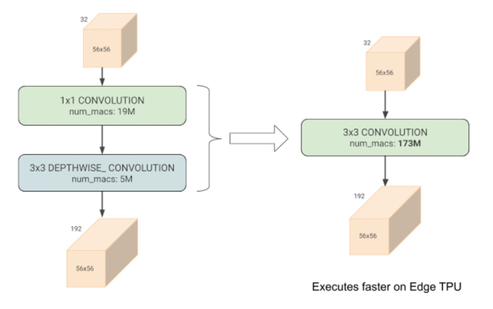
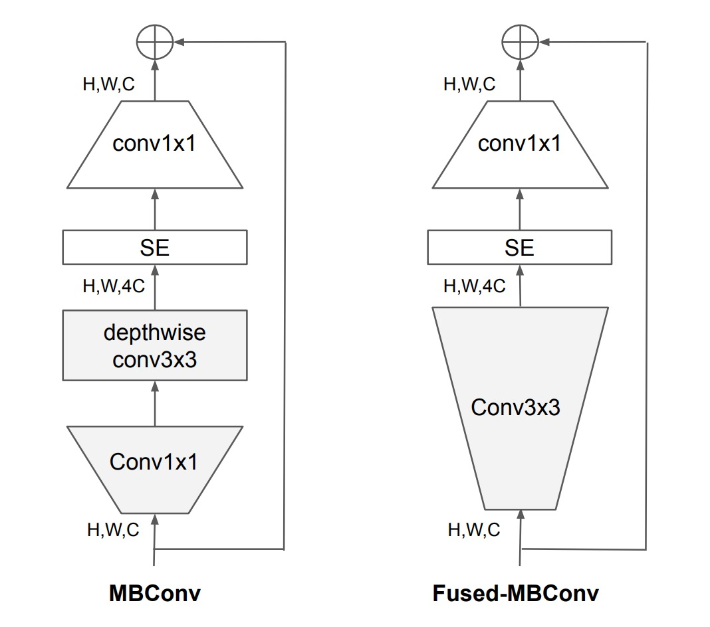
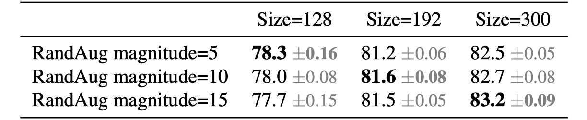
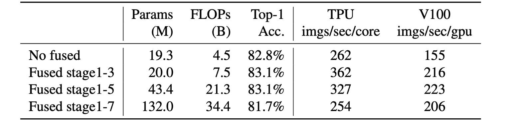
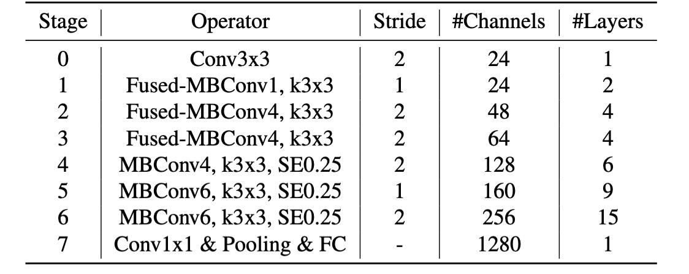
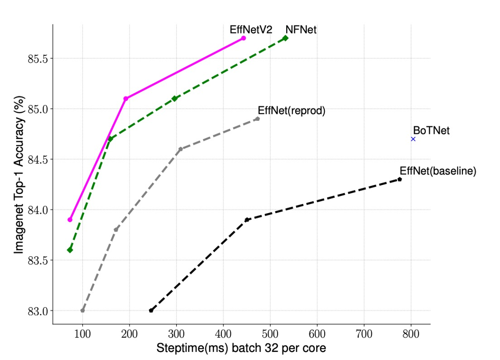

# [21.04] EfficientNet-V2

## Deep convolutional creep

[**EfficientNetV2: Smaller Models and Faster Training**](https://arxiv.org/abs/2104.00298)

---

:::info
The following content has been compiled by ChatGPT-4, and has been manually proofread, edited, and supplemented.
:::

---

After proposing the first generation of EfficientNet, the authors felt there was still room for improvement.

Thus, they introduced EfficientNetV2, a smaller and faster model while maintaining high efficiency.

## Problem Definition

During the development of the original EfficientNet, the authors discovered several issues:

1. Using very large image sizes (e.g., 800x800) resulted in very slow training speeds.
2. Placing depthwise convolutions in the early layers of the network led to slow training speeds.
3. Following the traditional ResNet approach of uniformly expanding the number of channels at each stage did not yield optimal results.

Additionally, past research at Google showed that depthwise convolutions train significantly slower than regular convolutions.

- [**[20.03] Accelerator-aware Neural Network Design using AutoML**](https://arxiv.org/abs/2003.02838)

  

  - This paper noted that depthwise convolutions, although they significantly reduce computational costs, fail to achieve hardware acceleration effectively.

Recognizing these problems, the authors sought to improve upon them.

## Solution

### Model Architecture

Depthwise convolutions have fewer parameters and FLOPs compared to regular convolutions, but they often fail to fully utilize modern accelerators.

Therefore, the authors proposed replacing the `MBConv` modules used in EfficientNet-V1 with `Fused-MBConv` modules.

Specifically, as shown in the figure, this involved removing depthwise convolutions and using standard convolutions for channel expansion instead.

### Progressive Learning

While many previous works dynamically changed image sizes during training, they often resulted in reduced accuracy.

The authors hypothesized that the accuracy drop stemmed from unbalanced regularization:

- When training with different image sizes, the regularization strength should also be adjusted accordingly, rather than using fixed regularization as in previous work.

Indeed, larger models require stronger regularization to combat overfitting. For example, EfficientNet-B7 uses more dropout and stronger data augmentation than B0.

The authors posited that even for the same network, smaller image sizes imply a smaller network capacity, necessitating weaker regularization. Conversely, larger image sizes increase computational load and network capacity, thus requiring stronger regularization to prevent overfitting.

To test this hypothesis, the authors conducted the following experiment on ImageNet:

The table shows that for an input size of 128, less regularization yields better results, whereas for an input size of 300, more regularization is better.

These results validate the authors' hypothesis, prompting them to adaptively adjust regularization and image size during training, improving upon previous progressive learning methods.

### Another Round of NAS

After modifying the basic modules, the authors conducted a new round of Neural Architecture Search (NAS).

In this phase, they discovered that in EfficientNet-V1 training, increasing the image size significantly led to high memory consumption and slow training speeds. To address this, they modified the scaling rules, capping the maximum image size at 480 pixels.

## Discussion

### Where to Place Fused-MBConv?

The placement of `Fused-MBConv` is also crucial.

The table shows that replacing all blocks with `Fused-MBConv` significantly increases parameters and FLOPs while slowing down speed.

Placing it in stages 1-3 increases FLOPs but still enhances speed and model performance.

### Network Search Results

Compared to the first generation, the second generation models differ in several ways:

1. Using `Fused-MBConv` in the early layers.
2. EfficientNet-V2 prefers a smaller expansion ratio for MBConv.
3. EfficientNet-V2 favors smaller 3x3 convolutional kernel sizes but adds more layers to compensate for the loss in the receptive field.

### Speeding Up Training

The authors compared the training speeds of EfficientNet-V2 and other models.

As shown in the table, EfficientNet-V2 trains much faster than other models.

### Results on ImageNet

EfficientNetV2 models significantly outperform previous ConvNet and Transformer models in terms of speed and accuracy.

Notably, EfficientNetV2-M achieves accuracy comparable to EfficientNet-B7 with the same computational resources and 11 times faster training speed.

EfficientNetV2 models also outperform the latest RegNet and ResNeSt models in terms of accuracy and inference speed.

While Vision Transformers perform well on ImageNet, EfficientNetV2 remains advantageous in accuracy and training efficiency with improved training methods and proper ConvNet design. Specifically, EfficientNetV2-L achieves 85.7% top-1 accuracy, surpassing the ViT-L/16 (21k) model pretrained on a larger dataset, ImageNet21k.

In terms of inference speed, EfficientNetV2 models also excel, as training speed usually correlates with inference speed.

Compared to ViT-L/16 (21k), EfficientNetV2-L (21k) improves top-1 accuracy by 1.5% (85.3% vs. 86.8%), uses 2.5 times fewer parameters, 3.6 times fewer FLOPs, and has 6-7 times faster training and inference speeds.

The authors' key observations include:

- Scaling data size is more effective than merely scaling model size for high accuracy. When top-1 accuracy exceeds 85%, further improving accuracy by scaling model size becomes challenging. However, additional pretraining on ImageNet21k can significantly enhance accuracy.
- Pretraining on ImageNet21k is highly efficient. Despite the dataset being 10 times larger, EfficientNetV2's pretraining completes in two days using 32 TPU cores, significantly faster than ViT's several weeks.

Future research suggests using the public ImageNet21k dataset for large-scale model pretraining.

## Conclusion

For engineers frequently involved in model development, this paper offers valuable insights:

- Using `Fused-MBConv` in the first three stages of convolutional network architectures can enhance model performance.
- Adapting regularization strength according to changes in image size during training can improve model accuracy.

These methods can help train models more efficiently and solve practical problems in the field.
