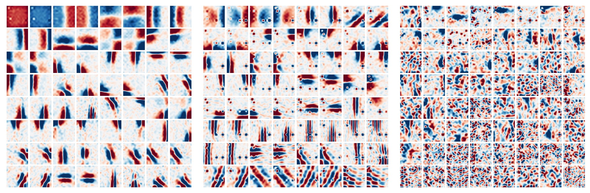

# [21.05] MLP-Mixer

## Less Loss is Gain

[**MLP-Mixer: An all-MLP Architecture for Vision**](https://arxiv.org/abs/2105.01601)

---

:::info
The following content is compiled by ChatGPT-4, and has been manually proofread, edited, and supplemented.
:::

---

After Transformers were introduced into the field of computer vision, many studies began exploring ways to make the exchange of information between patches more efficient.

Thus, a new term emerged: "Token-Mixer."

As the name implies, the purpose of a Token-Mixer is to mix information between different patches to enhance the performance of the model.

The traditional self-attention mechanism is one such implementation of a Token-Mixer.

However, due to the high computational complexity of the original attention mechanism, the academic community began searching for alternatives.

MLP-Mixer is one of these alternatives.

:::tip
Token-Mixer is a term coined in later papers and is not a proprietary term introduced in this paper.
:::

## Problem Definition

The authors believe: the complexity of self-attention is too high, so let's just get rid of it!

But what should we do after getting rid of it?

Hey! Look, there's a simple fully connected layer by the roadside! Let's use it!

~And then the paper ends here.~ (Not really!)

## Solution

### Model Architecture


In this paper, the authors propose using two stages of fully connected layers, or MLPs (Multi-Layer Perceptrons), to exchange information.

The image above might be hard to understand, but don't worry, let's break it down step by step:

1. Input an image of size 3 x 224 x 224 and divide it into 16 x 16 patches, with a dimension assumed to be 512.

   - Dimension change: [B x 3 x 224 x 224] -> [B x 512 x 14 x 14].

2. Convert it into Transformer input format.

   - Dimension change: [B x 512 x 14 x 14] -> [B x 512 x 196].

3. First stage: Exchange information between patches.

   ```python
   import torch.nn as nn

   patch_mixer = nn.Linear(196, 196)

   # Input dimension: x = [B x 512 x 196]
   x_mix_patch = patch_mixer(x)

   # skip connection
    x = x + x_mix_patch
   ```

4. Second stage: Exchange information between channels.

   ```python
   import torch.nn as nn

   channel_mixer = nn.Linear(512, 512)

   # Input dimension: x = [B x 512 x 196]
   # Reshape first -> [B x 196 x 512]
   x_mix_channel = x.permute(0, 2, 1)
   x_mix_channel = channel_mixer(x_mix_channel)

   # Reshape back
   x_mix_channel = x_mix_channel.permute(0, 2, 1)

   # skip connection
   x = x + x_mix_channel
   ```

This completes one operation of the MLP-Mixer.

You'll notice that in the above process, the second stage is similar to the original self-attention mechanism, which also involves an MLP operation.

The difference lies in the first stage, where instead of calculating the patch self-attention map, a fully connected layer is used directly.

### Discussion

### Performance on ImageNet


- The "ImNet" and "ReaL" columns represent the results on the original ImageNet validation set and the cleaned ReaL label set, respectively.
- Avg 5 indicates the average performance across five downstream tasks (ImageNet, CIFAR-10, CIFAR-100, Pets, Flowers).

---

When pre-trained on ImageNet-21k with additional regularization, MLP-Mixer achieves 84.15% top-1 accuracy on ImageNet. This is strong performance, but slightly below other models. Without regularization, Mixer tends to overfit, consistent with observations for ViT.

When training MLP-Mixer from scratch on ImageNet, Mixer-B/16 scores 76.4% at resolution 224, similar to a standard ResNet50 but lower than other state-of-the-art CNN/hybrid models like BotNet (84.7%) and NFNet (86.5%).

As the size of the upstream dataset increases, MLP-Mixer's performance improves significantly.

Mixer-H/14 achieves 87.94% top-1 accuracy on ImageNet, outperforming BiT-ResNet152x4 by 0.5%, but trailing ViT-H/14 by 0.5%. Mixer-H/14 runs 2.5 times faster than ViT-H/14 and nearly twice as fast as BiT.

In terms of precision-computation trade-offs, Mixer is competitive with more traditional neural network architectures. There is a clear correlation between total pre-training cost and downstream accuracy across architecture categories.

### Visualization Analysis



It is generally observed that the first layer of CNNs tends to learn Gabor-like detectors, which act on local regions of the image pixels.

In contrast, MLP-Mixer allows global information exchange between tokens in the MLP, raising the question:

- Does it process information in a similar way?

To answer this, the authors visualized features from different layers of MLP-Mixer, showing various levels of feature extraction.

In the image above, from left to right, are the first, second, and third layers of MLP-Mixer. We can see:

- Some learned features act on the entire image, while others act on smaller regions.
- Deeper layers seem to have less distinguishable structures.
- Similar to CNNs, there are many feature detectors with opposite phases.

## Conclusion

Less loss is gain!

Compared to the original self-attention mechanism, MLP-Mixer significantly reduces computational complexity. Even if the performance is slightly worse, it still has a strong market appeal!
