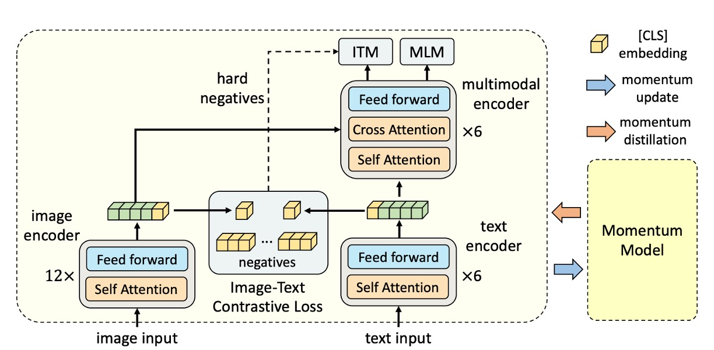
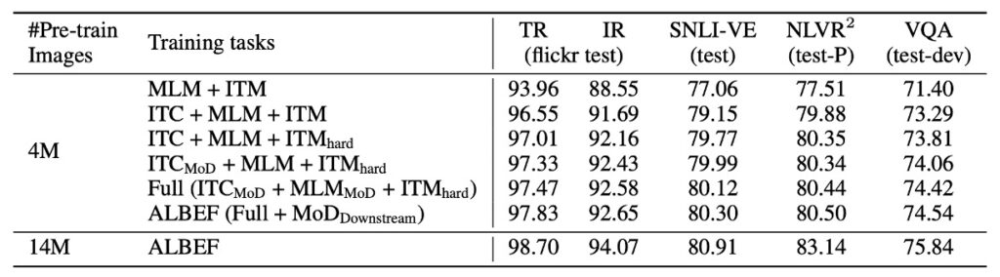
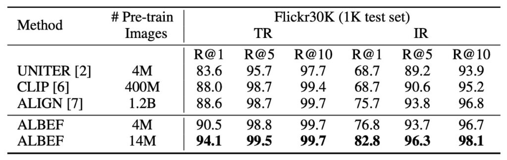
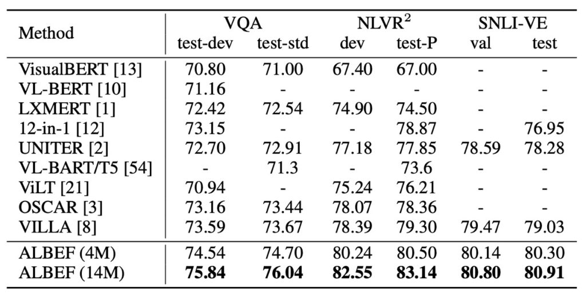
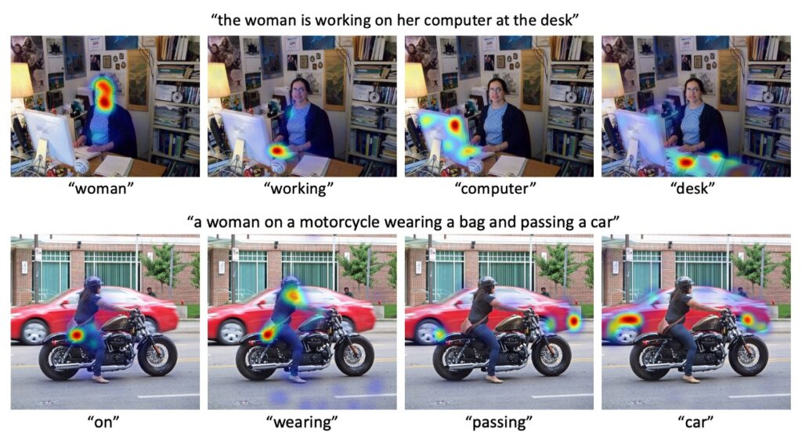

# [21.07] ALBEF

## Pursuing the Pure Path

[**Align before Fuse: Vision and Language Representation Learning with Momentum Distillation**](https://arxiv.org/abs/2107.07651)

---

:::info
The following content has been compiled by ChatGPT-4 and has been manually reviewed, edited, and supplemented.
:::

---

To excel in VQA (Visual Question Answering), using an object detector is almost inevitable.

Those pioneers who attempted to do without object detectors, like ViLT and MDETR, have already faced significant challenges.

- [**ViLT**](../2102-vilt/index.md)
- [**MDETR**](../2104-mdetr/index.md)

ViLT replaced the object detector with ViT but did not achieve remarkable results on the VQA v2 dataset. MDETR switched from Faster RCNN to DETR but didn't provide performance results on the VQA v2 dataset either.

On the other hand, the popular CLIP model:

- [**CLIP**](../2103-clip/index.md)

These methods use contrastive loss for pretraining, focusing on learning separate representations for images and text. However, such methods may lack the modeling capability for more complex V+L tasks.

So, what are the current issues with existing approaches?

## Problem Definition

The authors of ALBEF identified several key issues based on previous research:

1. **Modality Space Encoding**

   Even when image features and text encodings are converted into vector forms, they usually exist in their unique vector spaces. These spaces have distinct dimensions, ranges, and characteristics, making their interactions and relationships challenging to capture directly.

2. **Object Detector Limitations**

   Object detectors require bounding box annotations during pretraining, increasing annotation costs. They also require high-resolution images (e.g., 600×1000) during inference, adding computational cost and complexity.

3. **Data Noise Issue**

   Widely used image-text datasets often come from the internet, which inherently carries noise due to diverse sources. When pretraining models with these datasets, there's a risk that the model might overfit to specific noisy text, reducing its generalization performance in real-world applications.

Summarizing these issues, the authors proposed ALBEF, achieving state-of-the-art results in both retrieval and inference tasks without relying on object detectors by using ViT. One of the reasons for this success is the inclusion of "knowledge distillation."

## Knowledge Distillation

Before discussing how the authors solved the problems, let's briefly introduce "knowledge distillation."

With the success of deep learning models in various tasks, model size and complexity have increased. However, large models require significant computational resources, which may not be feasible for practical applications, especially on edge or mobile devices.

Knowledge distillation is a technique in deep learning aimed at transferring knowledge from a complex (and usually large) model (the "teacher model") to a simpler (and usually smaller) model (the "student model").

### Basic Principle

1. **Soft Targets**: In the distillation process, the outputs of the teacher model (typically the output of an activation function or classification probabilities) are used as soft targets to train the student model. These soft targets contain the teacher model's knowledge and provide more information than the original "hard" labels.

2. **Temperature**: A parameter called "temperature" is used to soften the probability outputs, making them smoother. Higher temperatures lead to softer probability distributions, helping the student model learn.

### Implementation Steps

1. **Training the Teacher Model**

   The teacher model is usually a large, deep learning model trained to high performance on a specific task. For example, in image classification, the teacher model could be a deep convolutional neural network like ResNet-152 or VGG-19.

   :::tip
   **Why Use Large Models?**

   Large models, due to their depth and breadth, can capture more features and patterns, achieving high accuracy on training data. But this also means they have high inference costs and require more storage.
   :::

2. **Generating Soft Targets**

   Once the teacher model is trained, it can produce soft targets, which means using the teacher model's predictions as targets instead of the original hard labels.

   :::tip
   **Difference Between Soft and Hard Targets**

   Hard labels are absolute, clear-cut classification labels (e.g., "dog" or "cat"). Soft targets provide probabilities for each possible class. For example, a soft target might tell us an image is 95% likely to be a dog, 3% a cat, and 2% other animals.
   :::

   :::tip
   **Why Use Soft Targets?**

   Soft targets provide more information and details, helping the model better understand relationships and uncertainties between classes.
   :::

3. **Training the Student Model**

   The student model, being smaller, is trained to mimic the teacher model's behavior using the soft targets generated in the previous step. This way, it learns to replicate the teacher model's decision process.

   In practice, both soft targets and original hard labels are often combined to train the student model, ensuring it not only mimics the teacher but also considers the actual data labels. The student model is typically much smaller and simpler than the teacher model, making it faster in inference and more suitable for resource-constrained environments.

4. **Extensions and Variants**

   - **Self-distillation**: The model uses its own predictions as soft targets for retraining, reinforcing its learned knowledge.

     - **Advantages**: Simple and low-cost; no need for a separate teacher model. Helps model convergence and improves accuracy.
     - **Disadvantages**: Model may overfit as it relies continuously on its predictions.

   - **Multi-teacher Distillation**: Knowledge from multiple teacher models is distilled into one student model, combining and mimicking all teacher models' behaviors.

     - **Advantages**: Richer knowledge sources; more robust and accurate student model. Reduces bias from individual models.
     - **Disadvantages**: High computational cost; increased complexity in combining and weighting outputs from different teachers.

   - **Online Distillation**: The teacher and student models are trained simultaneously. The student model learns from the teacher model in real-time as both are updated.

     - **Advantages**: Real-time updates; no need to wait for one model to finish training. Lower latency.
     - **Disadvantages**: Requires careful synchronization; increased computational demands.

## Solution

### ALBEF Model Design

Ignoring the knowledge distillation part for now, the other components should be straightforward:

1. **Image Encoder**: Uses a 12-layer Vision Transformer (ViT-B/16), initialized with ImageNet-1k pretrained weights.
2. **Text Encoder**: Uses a 6-layer Transformer Encoder, initialized with the first 6 layers of the BERTbase model.
3. **Multimodal Encoder**: Uses a 6-layer Transformer Encoder, initialized with the last 6 layers of the BERTbase model.

### Pretraining Objectives

1. **Image-Text Contrastive Learning (ITC)**

   This objective aims to learn better unimodal representations before fusion, focusing on learning a similarity function that scores image-text pairs higher.

   Two linear projections (gv and gw) map the [CLS] embeddings to normalized low-dimensional (256-d) representations. Inspired by MoCo, the authors use two queues to store recent M image-text representations from the momentum unimodal encoders. For each image and text, softmax-normalized image-to-text and text-to-image similarities are calculated. The image-text contrastive loss is defined based on the cross-entropy (H) between (p) and (y).

   :::tip
   Example:

   Suppose we are training a system to identify the corresponding description based on an image.

   - **Step 1: Transforming Embeddings**

     We have an image processed by a deep learning model, resulting in a 1000-dimensional image embedding vector labeled [CLS]. This vector is too large, so we use linear transformations (gv) and (gw) to reduce it to a 256-dimensional vector.

   - **Step 2: Storing in Queues**

     We are not only processing this image but many other images and texts. We store the most recent M image and text embeddings in a queue, similar to a recently played songs list.

     In contrastive learning, we typically need positive and negative samples to compute loss. Positive samples are similar image-text pairs, and negative samples are dissimilar pairs. Skipping this step means obtaining negative samples only from the current batch, which might be insufficient or unrepresentative, leading to poor learning.

   - **Step 3: Calculating Similarity**

     To determine the most similar text to our image, we compute the similarity between our image embedding and each text embedding in the queue, using softmax normalization to get a probability distribution for each text.

     For instance, suppose our image is of a yellow duck. The queue contains three text descriptions: "a yellow duck," "a red rose," and "a green apple." After computation, the similarities might be [0.8, 0.1, 0.1], indicating an 80% probability that the model thinks the image is described by "a yellow duck."

   - **Step 4: Calculating Loss**

     We know the true description is "a yellow duck," so the true probability distribution is [1, 0, 0]. The image-text contrastive loss is calculated based on the difference between the model's predicted distribution [0.8, 0.1, 0.1] and the true distribution [1, 0, 0], using cross-entropy (H).

   :::

2. **Masked Language Modeling (MLM)**

   MLM is a pretraining strategy designed to enhance a deep learning model's language understanding and cross-modal learning capabilities. MLM works by randomly selecting and masking certain words (typically 15%) in the input text and trying to predict the masked words using context and any related auxiliary information (e.g., images).

   This method is more than just a fill-in-the-blank game. It forces the model to understand the text's context and the visual content of the images and their relationship with the text. When the model is trained to optimize this prediction task, it simultaneously learns how to deeply and finely understand both text and images.

3. **Image-Text Matching (ITM)**

   ITM is a strategy primarily used to evaluate how well a model matches text descriptions with images. This task involves assessing the deep semantic connections between text and images.

   For this task, a special token called [CLS] is used as input, prompting the model to generate a single representation that fuses the image and text. This fused representation provides a unified view for the model to determine if the image and text match.

   To improve performance, the authors propose a strategy for sampling hard negatives for ITM tasks with zero computational overhead (as mentioned in the "Queue Storage" step). This means selecting hard negative samples (those the model is likely to get wrong) without adding extra computational cost. This approach helps the model learn more effectively from mistakes, enhancing its ability to differentiate matching and non-matching pairs.

### Momentum Distillation (MoD)

Despite the detailed pretraining strategies, there's still an unresolved issue:

- **Noise**

The pretraining image-text pairs often come from the internet, inherently noisy, and the image-text relationship is not always clear. In ITC learning, text considered a negative example (i.e., not matching the image) may still be relevant to the image. In MLM, words that describe the image well but differ from the original annotation might be incorrectly considered wrong. Existing ITC and MLM using one-hot labels penalize all predictions considered negative, regardless of their accuracy.

To address the noise in pretraining image-text pairs, the authors propose a strategy called momentum distillation. This strategy's core idea is to use an evolving "teacher model" called the momentum model to generate pseudo-targets for training the "base model."

The momentum model is not static but consists of exponential moving average (EMA) versions of the unimodal and multimodal encoders, allowing the model to adapt and reflect the latest trends in training data.

For example, suppose we have a photo of a golden beach with gentle waves lapping at the shore and a few children playing in the distance. However, the text description reads, "A golden beach with gentle waves caressing the shore, children playing joyfully, and vendors selling ice cream nearby."

In this case, traditional learning would penalize the model if the predicted description doesn't mention "ice cream," even if it accurately describes the beach, waves, and children.

This is not ideal, as "ice cream" is just a secondary element in the picture.

However, with the momentum distillation strategy, when the base model is trained, it references the momentum model (as the teacher model) to generate pseudo-targets. Suppose after several iterations, the momentum model has learned that "beach" and "waves" are the primary elements of the picture, and "ice cream" is secondary. Thus, when generating pseudo-targets, it might prioritize "beach" and "waves" over "ice cream." Consequently, when the base model learns, it won't be excessively penalized for omitting "ice cream." Instead, it will be encouraged to capture the main features of the picture, such as "beach" and "waves."

This strategy ensures the model focuses more on the main elements of the picture rather than being distracted by less relevant details.

For ITC tasks, the authors first measure image-text similarity using features produced by the momentum unimodal encoders. Based on this similarity, soft pseudo-targets are generated. The ITC MoD loss calculation considers both the traditional ITC loss and the KL divergence between the model's predictions and pseudo-targets.

For MLM, in addition to the original MLM loss, the KL divergence between the model's predicted probabilities and pseudo-targets is also considered. This strategy is extended to downstream tasks, where each task's loss is a weighted combination of the original task loss and KL divergence.

### Dataset

- **Internet Datasets**: This study used two major internet datasets, Conceptual Captions and SBU Captions.
- **In-domain Datasets**: Additionally, two in-domain datasets, COCO and Visual Genome, were used.
- In total, 4.0M unique images and 5.1M image-text pairs were collected across all datasets.
- Furthermore, to verify the method's adaptability to larger and noisier internet data, the Conceptual 12M dataset was included, increasing the total number of images to 14.1M.

### Technical Details

- **Model Architecture**: The model comprises BERTbase (with 123.7M parameters) and ViT-B/16 (with 85.8M parameters).
- **Hardware Configuration**: Training was conducted on 8 NVIDIA A100 GPUs.
- **Training Details**: A batch size of 512 was used, with a total of 30 epochs for pretraining.
- **Optimizer**: AdamW with a weight decay of 0.02 was used.
- **Learning Rate Schedule**: The learning rate was warmed up to 1e-4 over the first 1000 iterations and then decayed to 1e-5 following a cosine schedule.
- **Image Processing**: During pretraining, images were randomly cropped to 256×256 resolution and RandAugment was applied. For finetuning, the resolution was increased to 384×384.
- **Other Parameters**: The momentum parameter for updating the momentum model was set to 0.995, the queue size for image-text contrastive learning was 65,536, and the distillation weight α was linearly increased from 0 to 0.4 over the first epoch.

## Discussion

### Contribution of Knowledge Distillation

Since knowledge distillation is the main feature of this paper, let's first look at the relevant data.

From the results, the following points can be observed:

1. **Gain from Image-Text Contrastive Learning**: Adding image-text contrastive learning (ITC) significantly improved performance on various downstream tasks compared to the baseline pretraining method (MLM+ITM).
2. **Effect of Contrastive Hard Negative Mining**: This strategy further enhanced ITM performance by selecting more informative training samples.
3. **Contribution of Momentum Distillation**: Including momentum distillation improved ITC and MLM learning and boosted performance across all downstream tasks.
4. **Handling Noisy Internet Data**: The study shows that the ALBEF method effectively handles noisy internet data, enhancing the pretrained model's performance.

In summary, this study successfully improves model performance on various tasks through multiple strategies, particularly excelling in handling noisy data.

### Comparison with CLIP

In zero-shot image-text retrieval tests, ALBEF outperforms other top methods like CLIP and ALIGN, even though they were trained on larger datasets. Notably, when ALBEF's training image count increased from 4M to 14M, its performance significantly improved. This suggests that ALBEF's performance could be further enhanced if trained on larger-scale internet image-text datasets.

:::tip
The authors imply that if they used a dataset of ALIGN's scale (1.2B images), the results could be even more impressive.

I would love to try steaming with high heat to see the results, but limited training resources prevent this experiment. If there's a chance in the future, I'll update the results here.
:::

### Results on Various V+L Tasks

In other V+L understanding tasks, the table above shows ALBEF's outstanding performance. Using only 4M pretrained images, ALBEF achieves top-tier performance. With 14M pretrained images, it significantly surpasses other methods, even outperforming methods using object tags like OSCAR or adversarial data augmentation like VALLA.

- [**VILLA**](../2006-villa/index.md)
- [**Oscar**](../2004-oscar/index.md)

Specifically, compared to VILLA, ALBEF shows significant absolute improvements on several test sets, such as a 2.37% increase on VQA test-std, a 3.84% increase on NLVR2 test-P, and a 1.88% increase on SNLI-VE. Additionally, ALBEF does not require an object detector and uses lower-resolution images, making its inference speed much faster than most existing methods, such as over 10 times faster on NLVR2 compared to VILLA.

:::tip
This comparison table does not mention VinVL.

- [**VinVL**](../2101-vinvl/index.md)

VinVL's performance on VQA is 76.52 / 76.6; on NLVR2, it's 82.67 / 83.98.

In terms of scores, VinVL is still superior.

The authors did not specifically discuss this but could have at least mentioned, "We maintained comparable accuracy while improving inference speed by 10 times!" Skipping this seems like a missed opportunity.
:::

### Visualization Results

In RefCOCO+ results, ALBEF clearly outperforms other existing methods, especially with weaker text embeddings. Two ALBEF variants were used for visualization analysis:

- **ALBEF_itc**: Visualized using Grad-CAM on the self-attention map of the last layer of the image encoder, maximizing image-text similarity gradients.
- **ALBEF_itm**: Visualized using Grad-CAM on the cross-attention map of the third layer of the multimodal encoder (specifically designed for GT layers), maximizing image-text matching score gradients.

## Conclusion

One obvious limitation of "knowledge distillation" is that the "student model's" performance is constrained by the "teacher model." Since the student model can only learn what the teacher provides and may not fully absorb all information, knowledge distillation often boils down to finding a better "teacher model." Although this is a core issue, it's not the focus of this discussion.

The authors of ALBEF clearly understand knowledge distillation, stating:

- **Knowledge distillation is used to remove noise.**

The core assumption is that the model will filter out noise and only absorb correct information.

This is an ideal assumption. From the noise-removal perspective, knowledge distillation is a powerful strategy but comes with challenges such as defining noise, over-reliance on the original model, the black-box nature of the distillation process, and the potential risk of over-optimization.

ALBEF demonstrates outstanding results across various V+L tasks, offering efficient and effective inference, highlighting its immense potential in this field. This also provides new directions for future research, such as better utilizing knowledge distillation to improve model generalization and further narrowing the gap between teacher and student models.
