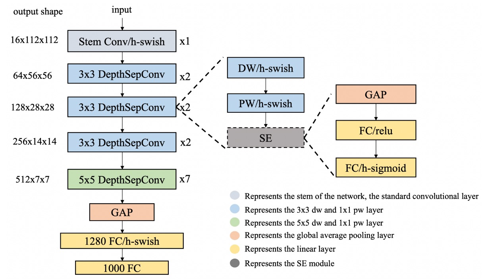
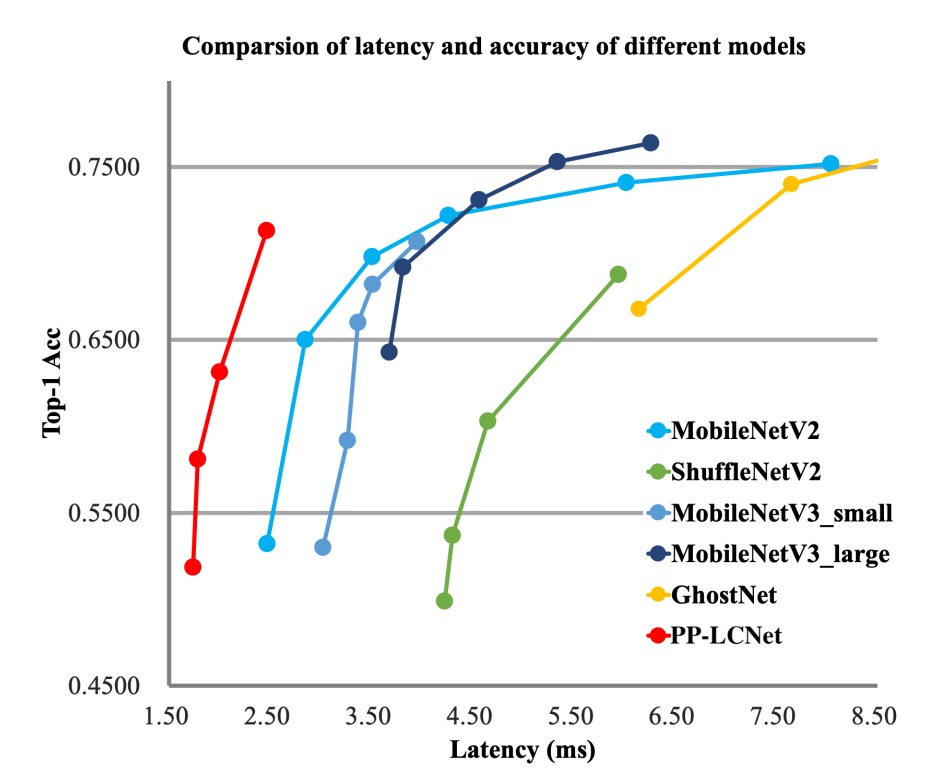

# [21.09] PP-LCNet

## Exploring the Boundaries of Speed

[**PP-LCNet: A Lightweight CPU Convolutional Neural Network**](https://arxiv.org/abs/2109.15099)

---

:::info
The following content has been compiled by ChatGPT-4 and has been manually reviewed, edited, and supplemented.
:::

---

In the race for lightweight models, several main directions have emerged:

- **Optimizing parameter count** to reduce model size.
- **Optimizing computation (FLOPs)** to lower computational requirements and improve model speed.
- **Optimizing inference time**.

Wait, what?

Isn't optimizing parameter count and computation the same as optimizing inference time?

Most people would think that reducing parameter count and computation would naturally lead to faster inference times.

- **The answer is: Not necessarily!**

---

Here's a simple example:

- Residual connections in ResNet.
- Inception modules in GoogleNet.
- Shared parameters between different modules.

These operations can increase inference time even with the same parameter count or computation due to memory read operations and inter-branch waiting times.

However, this paper doesn't delve deeply into this issue. We will explore it further when we come across other related papers.

## Problem Definition

This paper aims to address a few key issues:

1. **How to enhance feature representation without increasing latency?**
2. **What are the key factors in improving the accuracy of lightweight models on CPUs?**
3. **How to effectively combine different strategies to design lightweight models on CPUs?**

## Solution

### Model Architecture

The authors propose several strategies to address the above issues.

1. **DepthSepConv**

   The authors use DepthSepConv from [**MobileNetV1**](https://arxiv.org/abs/1704.04861) as the basic block. This approach avoids using shortcuts and concatenations, thereby improving computational efficiency.

   Previous studies have shown that using shortcuts in small models does not significantly enhance performance.

   Moreover, Intel CPUs have optimizations for Inverted Block or ShuffleNet Block, resulting in better inference performance.

2. **HSwish**

   Using the ReLU activation function is undoubtedly the fastest option!

   But it’s usually not the best.

   Many improved activation functions, such as Swish, Mish, and GELU, can enhance model performance.

   Here, the authors reference HSwish from [**MobileNetV3**](https://arxiv.org/abs/1905.02244), an activation function that maintains speed while improving model performance.

   :::tip
   The HSwish function is expressed as follows:

   $$ \text{Hswish}(x) = x \frac{\text{ReLU6}(x+3)}{6}, \text{ReLU6}(x) = \min(\max(x, 0), 6) $$

   where $\text{ReLU6}(x)$ is a variant of the ReLU function that restricts the input $x$ to the range of 0 to 6.

   The characteristics of this function include:

   - **Nonlinearity**: It provides the nonlinear processing capability necessary for deep learning models to learn complex data patterns.
   - **Boundedness and Smoothness**: With the $\text{ReLU6}$ restriction, the HSwish function is bounded in the range of $-3$ to infinity and relatively smooth.
   - **Computational Efficiency**: Its relatively simple structure makes it computationally efficient, making it particularly suitable for resource-constrained devices.
     :::

3. **SEBlock**

   This module comes from the following paper:

   - [**Squeeze-and-excitation networks**](https://arxiv.org/abs/1709.01507)

   This module also helped SENet win the 2017 ImageNet challenge.

   However, on Intel CPUs, this module increases inference time, so the authors simplified it by placing it only at the network's end.

   Experiments showed that this design improved accuracy without compromising inference speed.

4. **Large Kernel Convolutions**

   In [**MixNet**](https://arxiv.org/abs/1907.09595), the authors analyzed the impact of different kernel sizes on network performance and ultimately mixed different kernel sizes within the same network layer.

   However, this arbitrary mixing reduces model inference speed, so the authors simplified it by placing it only at the network's end.

   Replacing 3x3 convolutions with 5x5 convolutions at the network's end improved model accuracy.

5. **Additional Fully Connected Layer**

   Due to the model's small size, its information capacity is insufficient. Therefore, the authors added an extra 1280-dimensional fully connected layer at the network's end.

## Discussion

### Experimental Results

The authors conducted experiments on the ImageNet-1k dataset, which includes 1.28 million training images and 50,000 validation images across 1,000 categories.

- **Training Configuration**:

  - Used SGD (stochastic gradient descent) as the optimizer, with a momentum of 0.9 and weight decay of 3e-5 (4e-5 for larger models).
  - Batch size of 2048, with an initial learning rate of 0.8, adjusted using a cosine annealing schedule.
  - The entire training process includes 360 epochs with 5 linear warm-up epochs.
  - Image preprocessing involved random cropping to 224×224 pixels and random horizontal flipping.

- **Evaluation Phase**:

  - During evaluation, images were first resized along the short edge to 256 pixels, followed by center cropping to 224×224 pixels.

- **Accuracy Enhancement Techniques**:

  - Using the SSLD distillation method significantly improved PP-LCNet's accuracy, as shown in Table 3, comparing PP-LCNet with other state-of-the-art models.

From the above charts, it is evident that PP-LCNet offers over 1.5 times faster inference speed than other models with similar computational and parameter counts and comparable accuracy.

### Ablation Studies

1. **SE Module (Squeeze-and-Excitation)**:

   - The SE module enhances the model's attention to relationships between channels, thereby improving model accuracy.
   - Adding SE modules at the end of the network proved more effective than adding them elsewhere.

   Therefore, PP-LCNet prioritizes adding SE modules in the last two blocks to balance inference speed and accuracy.

2. **Use of Large Kernels**:

   - While large kernels (such as 5×5) can improve accuracy, they are not suitable for adding to all positions in the network.
   - Similar to the SE module, placing large kernels at the network's end proved more effective.

   Thus, specific layers use 5×5 depthwise separable convolutions, while other layers retain 3×3 kernels.

3. **Combined Effect of Different Techniques**:

   - H-Swish and large kernels can enhance performance with minimal impact on inference time.
   - Adding SE modules appropriately further enhances performance.
   - Using a larger fully connected layer after global average pooling (GAP) significantly improves accuracy.
   - Applying dropout strategies also helps improve model accuracy.

## Conclusion

In this study, the authors focused on developing methods for lightweight Intel CPU networks, aiming to improve model accuracy without increasing inference time.

Through extensive experiments and method optimization, they proposed a network architecture that performs well on various visual tasks, particularly excelling in the balance of accuracy and speed.

:::info
This model is indeed small, accurate, and has fast inference speed.

For developing mobile applications or scenarios with limited model size, this would typically be our first choice.
:::
