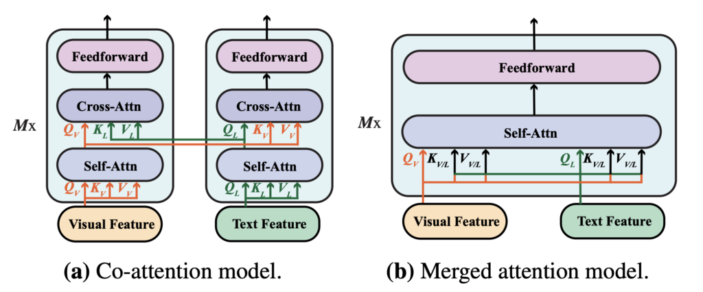
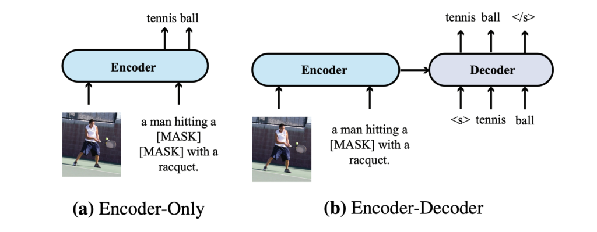
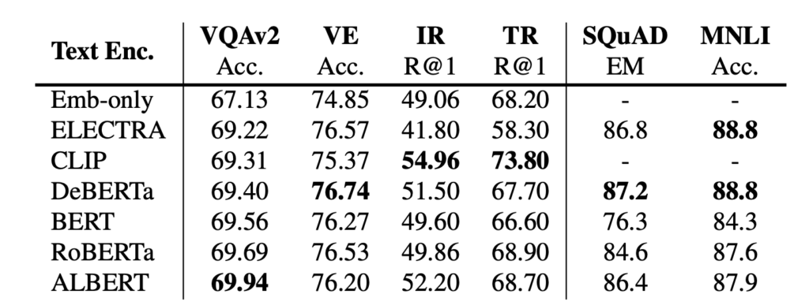

# [21.11] METER

## A Colorful Dashboard

[**An Empirical Study of Training End-to-End Vision-and-Language Transformers**](https://arxiv.org/abs/2111.02387)

---

:::info
The following content has been compiled by ChatGPT-4 and has been manually reviewed, edited, and supplemented.
:::

---

This is a comprehensive paper.

So, you can expect to see experiments and... more experiments.

Current mainstream VLP architectures mainly consist of three components:

- The vision encoder, often referred to as ViT.
- The text encoder, commonly BERT.
- Finally, the co-encoder, which integrates the visual and textual information.

The authors first compiled a summary of past research architectures, breaking down these three components and explaining each in detail.

## Defining the Problem

At its core, the issue lies with the visual component:

1. **Efficiency Issues**

   In Vision and Language Pretraining (VLP), most existing models rely on pretrained object detectors (e.g., Faster RCNN) to extract region features from images. However, these object detectors typically remain frozen during the VLP process, limiting the model's capacity. Additionally, the process of extracting region features is time-consuming, potentially affecting the model's efficiency and practicality.

2. **Limited Exploration**

   While Transformers have shown promising performance in NLP and computer vision, fully Transformer-based VLP models, especially those using Vision Transformers (ViT) as image encoders, remain underexplored. Although some ViT-based VLP models exist, their performance in downstream tasks like Visual Question Answering (VQA) lags behind state-of-the-art models.

3. **Optimizer Inconsistency**

   Some studies have attempted to directly input convolutional neural network and text grid features into Transformers but encountered optimizer inconsistencies, typically using different optimizers for CNNs and Transformers. Recent research shows that CNNs slightly underperform compared to ViT in terms of accuracy and computational cost (FLOPs).

Upon seeing the "optimizer inconsistency" mentioned, I immediately thought of SimVLM.

- **Reference: [SimVLM: Simplifying Things](../2108-simvlm/index.md)**

Given its status as a SoTA architecture, it certainly deserves respect. However, it doesn't stop researchers from scrutinizing and critiquing it, as such critique is the driving force behind progress.

## Solving the Problem

### METER Model Design

The authors systematically studied how to train high-performance vision-and-language transformers, dissecting model design across multiple dimensions: vision encoders, text encoders, multimodal fusion modules, architecture design (encoder-only vs. encoder-decoder), and pretraining objectives.

1. **Vision Encoder Selection**

   This paper explores the application of Vision Transformers (ViTs) in vision encoders, particularly in handling patch features. In the ViT mechanism, an image is first split into patches, which are then processed by the Transformer model.

   Recently, ViTs have become a popular research topic and have been applied in Vision and Language Pretraining (VLP). However, all these ViT-based models perform worse compared to state-of-the-art region feature-based models (e.g., VinVL).

   Additionally, there is a lack of systematic studies on different pretrained ViTs to determine which are best suited for VLP applications. To address this, the authors compared various ViT models, including:

   - **ViT (2020.10)**:
     - [An Image is Worth 16×16 Words: Transformers for Image Recognition at Scale](https://arxiv.org/abs/2010.11929)
   - **DeiT (2020.12)**:
     - [Training data-efficient image transformers & distillation through attention](https://arxiv.org/abs/2012.12877)
   - **CLIP-ViT (2021.02)**:
     - [Learning Transferable Visual Models From Natural Language Supervision](https://arxiv.org/abs/2103.00020)
   - **Swin Transformer (2021.03)**:
     - [Hierarchical Vision Transformer using Shifted Windows](https://arxiv.org/abs/2103.14030)
   - **CaiT (2021.03)**:
     - [Going deeper with Image Transformers](https://arxiv.org/abs/2103.17239)
   - **VOLO (2021.06)**:
     - [Vision Outlooker for Visual Recognition](https://arxiv.org/abs/2106.13112)
   - **BEiT (2021.06)**:
     - [BERT Pre-Training of Image Transformers](https://arxiv.org/abs/2106.08254v2)

2. **Text Encoder Selection**

   Following BERT and RoBERTa, VLP models first split input sentences into subword sequences. This step is part of the text processing phase before integrating text and visual information. After splitting into subwords, two special tokens are inserted at the beginning and end of the sentence to generate the input text sequence. These tokens help define the sentence boundaries.

   The authors aimed to use text encoders before sending features to the fusion module. They explored using different language models such as BERT, RoBERTa, ELECTRA, ALBERT, and DeBERTa for text encoding. Additionally, they tried a simple word embedding lookup layer initialized from BERT embeddings.

   Here are the architectures chosen by the authors:

   - **BERT (2018.10)**:
     - [Pre-training of Deep Bidirectional Transformers for Language Understanding](https://arxiv.org/abs/1810.04805)
   - **RoBERTa (2019.07)**:
     - [A Robustly Optimized BERT Pretraining Approach](https://arxiv.org/abs/1907.11692)
   - **ALBERT (2019.09)**:
     - [A Lite BERT for Self-supervised Learning of Language Representations](https://arxiv.org/abs/1909.11942)
   - **ELECTRA (2020.03)**:
     - [Pre-training Text Encoders as Discriminators Rather Than Generators](https://arxiv.org/abs/2003.10555)
   - **DeBERTa (2020.06)**:
     - [Decoding-enhanced BERT with Disentangled Attention](https://arxiv.org/abs/2006.03654)

3. **Multimodal Architecture**

   

   As end-to-end VLP models become increasingly popular, the authors reevaluated the impact of these two fusion modules in a new context, potentially to understand which fusion strategy is more effective in the new model architectures or settings.

   - **Merged Attention Module**

     In this module, text and visual features are simply concatenated and then input into a single Transformer module. This approach allows the simultaneous processing of text and visual information in the same Transformer module.

   - **Co-attention Module**

     The co-attention module independently inputs text and visual features into different Transformer modules. This module uses cross-attention techniques to achieve cross-modal interaction, enabling interaction between visual and text features.

     For region-based VLP models, these two fusion modules can achieve similar performance, suggesting that different fusion strategies may not significantly impact the results. The merged attention module is more parameter-efficient, using the same parameter set to process features from both modalities, making it more appealing in resource-limited situations.

### Encoder-Only vs. Encoder-Decoder

The authors compared two different model architectures: encoder-only and encoder-decoder, and explored their applications in Vision and Language Pretraining (VLP) models:

- **Encoder-Only Architecture**

  In this architecture, cross-modal representations (e.g., combined visual and text features) are directly input into the output layer to produce the final output. VisualBERT is an example of a VLP model adopting an encoder-only architecture.

- **Encoder-Decoder Architecture**

  Recently, some models like VL-T5 and SimVLM have advocated for the encoder-decoder architecture. In this setup, cross-modal representations are first input into a decoder before being fed into the output layer. The decoder attends to both the encoder's representations and previously generated tokens, producing outputs autoregressively.

  The authors illustrated the differences between these two architectures with an example (performing the MLM task). Specifically, for classification tasks like VQA, the encoder-decoder model inputs text into the encoder and classification tokens into the decoder, which then generates the output accordingly.

### Pretraining Strategies

The authors identified three main pretraining tasks for VLP models: Masked Language Modeling (MLM), Image-Text Matching (ITM), and Masked Image Modeling (MIM):

1. **Masked Language Modeling (MLM)**

   Initially used in pure language pretraining and later extended to VLP, the goal is to randomly mask some input tokens given an image-caption pair and train the model to reconstruct these masked tokens.

2. **Image-Text Matching (ITM)**

   The model needs to identify which images and captions match, usually framed as a binary classification problem. The model learns global cross-modal representations and uses a classifier to predict whether they match.

3. **Masked Image Modeling (MIM)**

   Inspired by MLM, this technique is used in visual pretraining models. In MIM, the model aims to reconstruct or predict masked visual features. The authors proposed improvements like Masked Patch Classification with In-batch Negatives and Masked Patch Classification with Discrete Code.

The paper did not mention the recently successful PrefixLM, likely because the authors believed PrefixLM was not mainstream at the time, and SimVLM's success was largely due to its large dataset, hence they did not discuss PrefixLM in detail.

:::tip
**Masked Image Modeling (MIM)**

Masked Image Modeling (MIM) is a technique used in visual pretraining models, inspired by Masked Language Modeling (MLM). In MIM, the model's goal is to reconstruct or predict masked visual features.

For example, models like LXMERT and UNITER train the model to regress to the original region features when some input regions are masked, typically minimizing a mean squared error loss. While MIM shows potential in some models, recent advanced models like ALBEF and VinVL do not apply MIM during VLP, suggesting doubts about MIM's true utility in VLP models.

Given these doubts, the authors proposed some improvements:

1.  **Masked Patch Classification with In-batch Negatives**

    Inspired by MLM, this method reconstructs masked image patches by having the model identify the masked patch from all possible patches in the batch, creating a temporary "vocabulary" from all patches in the current batch.

2.  **Masked Patch Classification with Discrete Code**

    Inspired by BEiT, this method involves training the model to predict the discrete codes of masked image patches. First, it uses a VQ-VAE model to convert images into a set of discrete labels, then the model's task is to predict the labels of the masked patches instead of reconstructing the patches themselves.

:::

### Datasets

The model is pretrained on four commonly used datasets: COCO, Conceptual Captions, SBU Captions, and Visual Genome, combining approximately 4M images.

### Technical Details

- Unless specified otherwise, the hidden size is set to 768, with 12 heads.
- No decoders or parameter sharing between the visual and language branches.
- The model is pretrained using only MLM and ITM unless otherwise specified.
- The model is pretrained for 100,000 steps using AdamW, with base and top layer learning rates set to 1e-5 and 5e-5, respectively.
- A warmup ratio of 10% is used, and the learning rate linearly decays to 0 after 10% of the total training steps.
- Each image is resized to 224×224 or 384×384 using center-crop, depending on the adopted vision transformer.

## Discussion

### Separate Module Evaluation

To improve efficiency, the study first compared different text and vision encoders without performing Vision and Language Pretraining (VLP), as the pretraining process is very time-consuming. Specifically:

- The model's lower layers are initialized with specific pretrained vision and text encoders, while the upper layers are randomly initialized.
- The default choice of encoders is CLIP-ViT-224/32 and RoBERTa, with N and M in ViT-N/M representing image resolution and patch size, respectively.

1. **Text Encoder Comparison**

   

   The performance difference among models with different text encoders is not significant. RoBERTa seems to achieve the best performance in this setting. Additionally, from the Emb-only results, it's clear that having a pretrained encoder is necessary; otherwise, downstream task performance drops.

2. **Vision Encoder Comparison**

   

   Both CLIP-ViT-224/16 and Swin Transformer perform well in this setting. Notably, Swin Transformer can achieve a VQA score of 72.38 on the test-dev set without any VLP, comparable to some VLP models after pretraining.

### Combined V+L Evaluation

When combined into a VLP architecture, the differences between BERT and RoBERTa seem to diminish, but having a pretrained text encoder at the bottom is still crucial (Embed-only vs. RoBERTa). For vision encoders, both CLIP-ViT-224/16 and Swin Transformer achieve decent performance. Specifically, CLIP-ViT-224/16 can reach VQA scores of 77.19/77.20 on the test-dev/test-std sets, surpassing the previous state-of-the-art region-based VinVL model.

:::tip
**A Friendly Tip from the Authors**

The authors provided an interesting technique to enhance model performance.

Using a larger learning rate for randomly initialized parameters is better than using the same learning rate for all parts of the model. Using the same learning rate for all parts of the model can degrade performance because the pretrained parameters already contain some visual and language knowledge, and overly aggressive fine-tuning can lose this valuable information.
:::

### Fusion Techniques and Decoder Contributions

The authors designed and compared merged attention and co-attention models.

Experimental results indicate that co-attention models perform better than merged attention models, suggesting the importance of maintaining separate parameter sets for the two modalities.

However, this result contrasts with previous findings from region-based VLP models. The authors believe this discrepancy may be due to:

1. Region-based VLP model results may not directly apply to ViT-based VLP models.
2. Most region-based VLP models use only pretrained vision encoders without pretrained text encoders, making symmetric architectures like co-attention less suitable in those cases.

In contrast, when comparing encoder-only and encoder-decoder architectures, the authors adopted a T5-style language modeling objective, masking 15% of input text tokens, replacing continuous text spans with sentinel tokens, and training the decoder to reconstruct the masked tokens. For image-text matching tasks, special class tokens were provided to the decoder to generate binary outputs.

Results showed that encoder-only models outperformed encoder-decoder models in both discriminative tasks, consistent with findings in the literature. However, it's worth noting that encoder-decoder architectures are more flexible and can handle tasks like image captioning, which may be challenging for encoder-only models.

:::tip
Here, we encounter a question: Why does SimVLM outperform T5? Why not adopt SimVLM's style when evaluating decoders instead of T5?

The authors did not explain, but it might be because they believe SimVLM's success is mainly due to its large-scale dataset, so they chose T5 for a more comparable reference.
:::

### Scaling Up the Dataset

The authors verified the framework's scalability by pretraining the model with more images and a larger vision backbone. The specific pretraining datasets included COCO, CC, CC12M, SBU, and VG, providing approximately 14 million images and 20 million image-caption pairs.

For the vision backbone, they used CoSwin-Huge, capable of handling large-scale visual data.
For the text backbone, they chose RoBERTa-base, ensuring effective encoding of textual information.
With the expanded setting, the model achieved state-of-the-art performance on VQAv2, surpassing SimVLM trained on 1.8 billion images, demonstrating METER's scalability and ability to achieve better results by increasing data and adjusting model structures.

## Conclusion

Certain aspects of the experimental design seem somewhat lacking and insufficiently controlled to ensure reliable results. For instance, while the authors proposed many text backbones (six) and image backbones (nine), they applied the same logic when combining these backbones into V+L models without optimizing for each architecture's unique strengths. This "one-size-fits-all" approach may not fully exploit each architecture's advantages and could obscure potential issues.

1. RoBERTa, unlike BERT, uses a new dynamic masking mechanism, yet the authors uniformly employed the MLM strategy. The vision encoder part also lacked detailed operations, simply combining effective architectures into V+L models.
2. What if the PrefixLM used in SimVLM was applied to the proposed architectures? When combining different text and image backbones, should different parameter settings and optimization techniques be used to ensure optimal performance? Additionally, the authors could have tested various multimodal fusion strategies to verify the model's generalization ability and stability.

Despite these shortcomings, I highly appreciate the study's efforts and contributions to multimodal learning. By exploring different combinations of text and image backbones, the authors provided a new perspective on understanding the possibilities and challenges of multimodal learning. Furthermore, their extensive experiments and comparisons offer valuable references and insights for future research.
