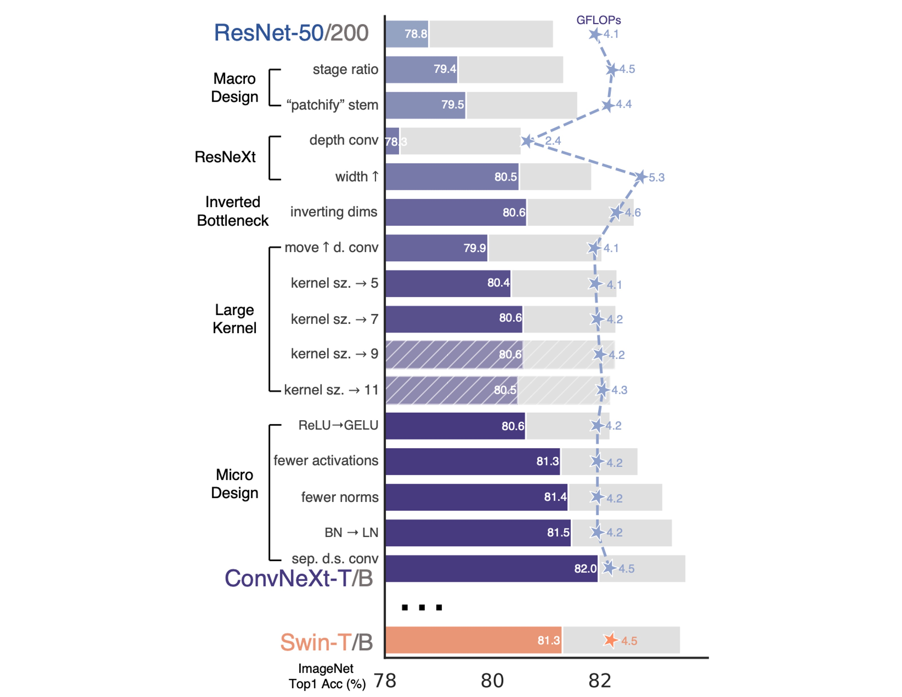
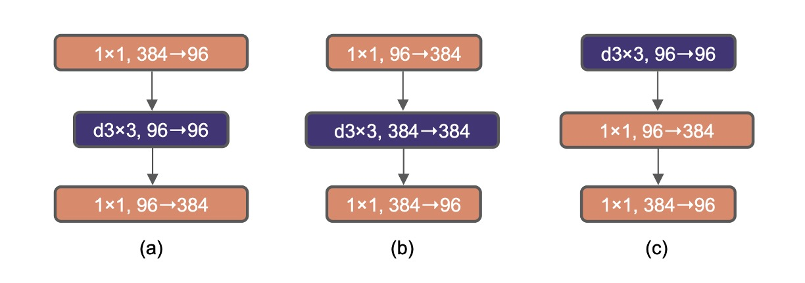
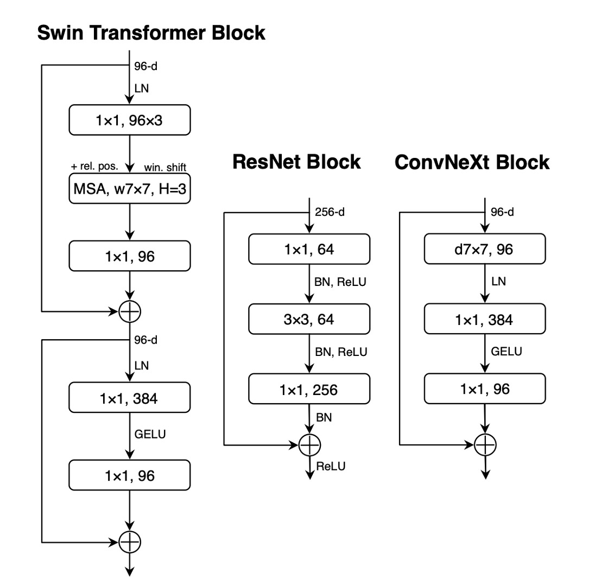
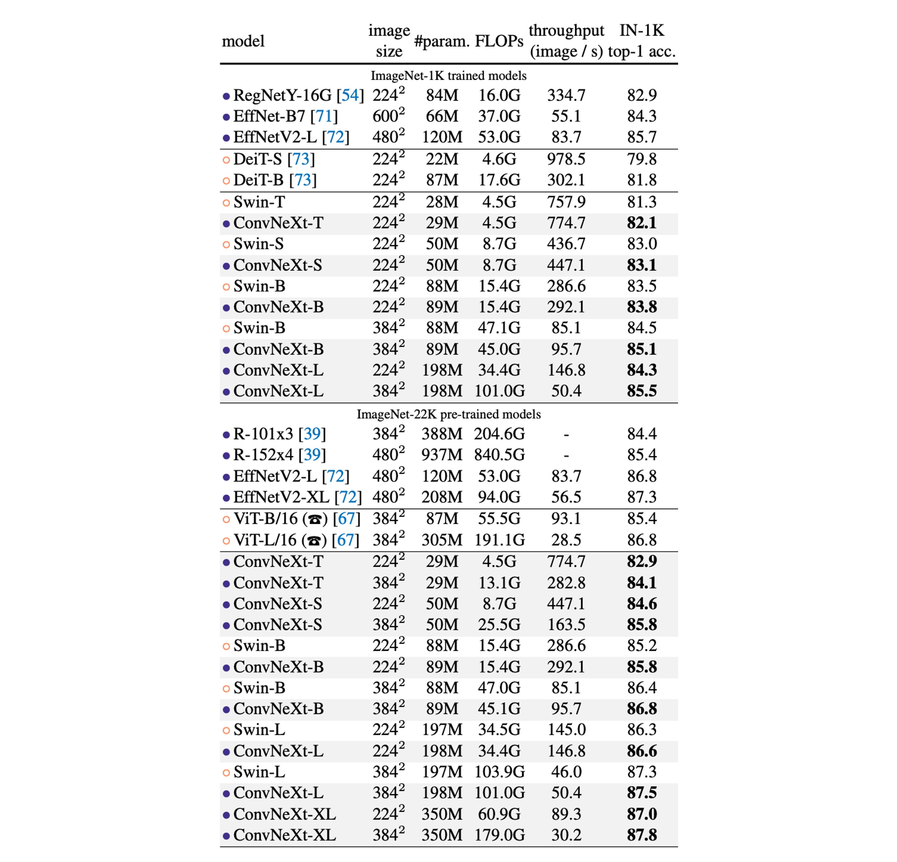

# [22.01] ConvNeXt

## Making Convolutions Great Again

[**A ConvNet for the 2020s**](https://arxiv.org/abs/2201.03545)

---

:::info
The following content has been compiled by ChatGPT-4 and has been manually reviewed, edited, and supplemented.
:::

---

Looking back at the 2010s, deep learning made significant strides, profoundly impacting multiple fields.

At the heart of this progress was the revival of neural networks, particularly Convolutional Neural Networks (ConvNet).

Over the past decade, the field of visual recognition has successfully transitioned from handcrafted features to the design of ConvNet architectures.

Although the concept of ConvNet dates back to the 1980s, it wasn't until 2012 that we truly witnessed its potential in visual feature learning, marked by the emergence of AlexNet, which heralded the "ImageNet moment" in computer vision.

Since then, the field has advanced rapidly with landmark works such as:

- [**[14.09] VGG**](https://arxiv.org/abs/1409.1556)
- [**[14.09] GoogLeNet**](https://arxiv.org/abs/1409.4842)
- [**[15.12] ResNet**](https://arxiv.org/abs/1512.03385)
- [**[16.08] DenseNet**](https://arxiv.org/abs/1608.06993)
- [**[17.04] MobileNet**](https://arxiv.org/abs/1704.04861)
- [**[19.05] EfficientNet**](https://arxiv.org/abs/1905.11946)
- [**[20.03] RegNet**](https://arxiv.org/abs/2003.13678)

These seminal works emphasized efficiency and scalability, popularizing many practical design principles.

However, everything changed with the advent of ViT.

- [**[20.10] ViT**](https://arxiv.org/abs/2010.11929)

## Defining the Problem

The introduction of Vision Transformers (ViT) fundamentally disrupted network architecture design. Besides the initial "slicing" layer that splits the image into multiple patches, ViT did not introduce any image-specific inductive bias, making minimal modifications to the original NLP Transformer.

One significant advantage of ViT is its scalability: as the model and dataset sizes grow, its performance significantly surpasses standard ResNet.

To close the performance gap, hierarchical Transformers adopted hybrid strategies. For example, the "sliding window" strategy reintroduced local attention mechanisms, making Transformers behave more like ConvNet.

Swin Transformer is a milestone in this regard, proving that Transformers can serve as a general-purpose vision backbone, achieving state-of-the-art performance across various computer vision tasks beyond image classification.

The success and rapid adoption of Swin Transformer also indicate that the essence of convolutions remains irreplaceable.

- [**[21.03] Swin Transformer**](https://arxiv.org/abs/2103.14030)

From these advancements, it becomes apparent that many of the improvements in Vision Transformers are essentially restoring the strengths of convolutions.

However, these attempts come at a cost: implementing sliding window self-attention can be expensive, and advanced methods like cyclic shifting can enhance efficiency but make system design more complex.

Ironically, ConvNet already possesses many of the required attributes, albeit in a simple, straightforward manner.

The only reason ConvNet lost momentum is that Transformers outperformed them in many vision tasks.

The authors argue: it shouldn't be this way.

## Solving the Problem

### Redesigning Network Architecture

For simplicity, the authors started with ResNet-50 and used the similarly sized Swin Transformer as a reference for comparison.

### Introducing Modern Training Techniques

ViT not only brought new network architectures but also introduced many modern training techniques. Therefore, without changing anything else, the authors first applied ViT's training techniques to ConvNet.

- Increased training time from 90 epochs to 300 epochs.
- Used the AdamW optimizer.
- Employed image augmentation techniques:

  - [**Mixup**](https://arxiv.org/abs/1710.09412)
  - [**CutMix**](https://arxiv.org/abs/1905.04899)
  - [**RandAugment**](https://arxiv.org/abs/1909.13719)
  - [**Random Erasing**](https://arxiv.org/abs/1708.04896)

- Applied regularization methods:

  - [**Stochastic Depth**](https://arxiv.org/abs/1608.06993)
  - [**Label Smoothing**](https://arxiv.org/abs/1512.00567)

:::info
With the above training techniques, the performance of ResNet-50 improved by 2.7%, from 76.1% to 78.8%.
:::

### Macro Design

This part considers two design factors:

1. **Stage Compute Ratio**

   In ResNet, the cross-stage compute distribution design is mainly empirical.

   For instance, ResNet's stage-4 is designed to be compatible with downstream tasks (like object detection) where detector heads operate on a 14×14 feature plane.

   Similarly, Swin-T follows the same principle but with a slightly different stage compute ratio of 1:1:3:1. For larger Swin Transformers, the ratio is 1:1:9:1.

   To maintain similar FLOPs to Swin-T, the authors adjusted ResNet-50's block numbers per stage from (3, 4, 6, 3) to (3, 3, 9, 3).

   :::info
   Research related to stage compute ratio:

   - [**[19.05] On network design spaces for visual recognition**](https://arxiv.org/abs/1905.13214)
   - [**[20.03] Designing network design spaces**](https://arxiv.org/abs/2003.13678)
     :::

   From this point onward, the model will use this stage compute ratio.

   :::info
   This adjustment increased the model's accuracy from 78.8% to 79.4%.
   :::

2. **Stem Structure Design**

   In ConvNet, the stem refers to the initial layer of input.

   Typically, it is used for downsampling to quickly reduce the spatial size of the input.

   In ViT, the stem is a patchify layer that splits the image into a series of patches using a large kernel convolution of 16×16.

   In Swin-T, the stem is a 4x4 large convolution with a stride of 4.

   Here, the authors adopted the same design as Swin-T and adjusted the ResNet-50's stem to a 4×4 non-overlapping convolution.

   :::info
   This design increased the model's accuracy from 79.4% to 79.5%.
   :::

### ResNeXt-ify

In this section, the authors adopted the ResNeXt design philosophy, which offers a better FLOPs/accuracy trade-off compared to a standard ResNet.

- [**Aggregated Residual Transformations for Deep Neural Networks**](https://arxiv.org/abs/1611.05431)

The core design of ResNeXt is grouped convolution, where convolutional filters are divided into different groups.

The guiding principle of ResNeXt is "use more groups, expand width," applying grouped convolution in the 3×3 convolution layer.

In this paper, the authors used depthwise convolution, a special form of grouped convolution where the number of groups equals the number of channels.

Depthwise convolution is akin to the weighted sum operation in self-attention, operating on each channel individually, mixing information only in the spatial dimension.

Using depthwise convolution effectively reduces the network's FLOPs but is expected to lower accuracy.

Following ResNeXt's strategy, the authors increased the network width to match the same channel numbers as Swin-T (from 64 to 96).

:::info
This improved the network performance to 80.5% while increasing FLOPs (5.3G).
:::

### Inverted Bottleneck

Each block in Transformers has an inverted bottleneck structure, typically with an expansion ratio of 4.

Later, MobileNetV2 also promoted this concept, with the difference being the addition of a 3x3 depthwise convolution after expansion.

In the figure above, (a) is the basic structure of ResNeXt, while (b) is the basic structure of MobileNetV2. (c) is another option, moving the 3x3 depthwise convolution to the front, preparing for the next chapter on exploring large kernel convolutions.

:::info
Using the design in (b), the model's accuracy increased to 80.6%.

In larger systems like ResNet-200 / Swin-B, more gains were achieved, increasing from 81.9% to 82.6%.
:::

### Large Kernel Convolution

One important characteristic of ViT is its non-local self-attention, granting the network global receptive fields in each layer.

This contrasts with traditional ConvNet, which uses smaller kernels (like 3×3, popularized by VGGNet).

To explore the application of large kernels, the article proposed moving the depthwise convolution layer upward, akin to placing the MHSA block before the MLP layer in Transformers.

Such structural adjustments can effectively reduce FLOPs and optimize performance.

After these adjustments, the study tested different kernel sizes (from 3×3 to 11×11):

- 3x3: 79.9%
- 7x7: 80.6%

The authors found that increasing the kernel size to 7×7 improved network performance from 79.9% to 80.6%, with FLOPs remaining unchanged.

Further increasing kernel size (beyond 7×7) showed no additional performance gains in the ResNet-200 model, indicating performance saturation at the 7×7 size.

:::info
These steps did not enhance performance, but changing from (b) to (c) mimicked the style of Transformer self-attention.
:::

### Micro Design

1. **Replacing ReLU with GELU**

   Rectified Linear Unit (ReLU) has been the preferred activation function in ConvNet due to its simplicity and computational efficiency.

   Gaussian Error Linear Unit (GELU), a smoother variant of ReLU, has gradually gained favor in state-of-the-art Transformer models, such as Google's BERT and OpenAI's GPT-2.

   The authors replaced ReLU with GELU in ConvNet, and the model's accuracy remained unchanged.

   :::info
   Although performance did not improve, the authors still preferred GELU.
   :::

2. **Reducing Activation Functions**

   

   In Transformer architectures, particularly in the MLP block, typically only one activation function is used.

   In contrast, the practice in ResNet modules is to use activation functions after each convolution layer, even after small 1×1 convolution layers.

   The authors removed all GELU activation layers in the residual network block except for one between the two 1×1 convolution layers, mimicking the Transformer block's style.

   This adjustment improved performance, increasing accuracy by 0.7%, reaching 81.3%, comparable to Swin-T's performance.

   :::info
   This design increased the model's accuracy from 80.6% to 81.3%.
   :::

3. **Reducing Normalization Layers**

   Transformers generally have fewer normalization layers, whereas in ConvNet, Batch Normalization appears after each convolution layer.

   Therefore, the authors removed two additional Batch Normalization layers, retaining them only before the 1x1 convolutions.

   :::info
   This design increased the model's accuracy from 81.3% to 81.4%.
   :::

4. **Replacing BatchNorm with LayerNorm**

   Transformers use simpler Layer Normalization, achieving good performance across different application scenarios.

   Directly replacing BN with LN in the original ResNet results in suboptimal performance.

   - [**[21.05] Rethinking "batch" in batchnorm**](https://arxiv.org/abs/2105.07576)

   With all the modifications in network architecture and training techniques, the authors revisited the impact of replacing BN with LN, finding no difficulty in training the ConvNet model using LN.

   :::info
   This design increased the model's accuracy from 81.4% to 81.5%.
   :::

5. **Downsampling Layer**

   In the ResNet architecture, spatial downsampling is performed at the beginning of each stage using 3×3 convolutions with a stride of 2 and 1×1 convolutions with a stride of 2 in the shortcut connections.

   Compared to ResNet, Swin Transformers add separate downsampling layers between stages.

   Further investigation showed that adding normalization layers where spatial resolution changes can help stabilize training.

   This includes multiple Layer Normalization (LN) layers used in Swin Transformers: one before each downsampling layer, one after the stem, and one after the final global average pooling.

   Based on these results, the authors decided to use separate downsampling layers in their final model, naming it ConvNeXt.

   :::info
   This design increased the model's accuracy from 81.5% to 82%.
   :::

## Discussion

### Summary of Model Configurations

These models represent a "modernized" upgrade to the ResNet architecture, with different variants primarily differing in the number of channels (C) and the number of blocks per stage (B).

The specific configurations for each variant are as follows:

1. **ConvNeXt-T** (Tiny):

   - Channels C = (96, 192, 384, 768)
   - Blocks per stage B = (3, 3, 9, 3)

2. **ConvNeXt-S** (Small):

   - Channels C = (96, 192, 384, 768)
   - Blocks per stage B = (3, 3, 27, 3)

3. **ConvNeXt-B** (Base):

   - Channels C = (128, 256, 512, 1024)
   - Blocks per stage B = (3, 3, 27, 3)

4. **ConvNeXt-L** (Large):

   - Channels C = (192, 384, 768, 1536)
   - Blocks per stage B = (3, 3, 27, 3)

5. **ConvNeXt-XL** (Extra Large):

   - Channels C = (256, 512, 1024, 2048)
   - Blocks per stage B = (3, 3, 27, 3)

The number of channels doubles with each new stage, following a design philosophy similar to ResNet and Swin Transformers.

This hierarchical design allows different model sizes to provide flexible and efficient performance across varying dataset sizes or complexities.

### Performance on ImageNet

1. **ImageNet-1K Performance Comparison**:

   - **ConvNeXt vs. ConvNet Benchmarks**: ConvNeXt competes with strong ConvNet benchmarks (like RegNet and EfficientNet) in terms of accuracy and inference throughput.
   - **Comparison with Swin Transformers**: ConvNeXt generally outperforms Swin Transformers under similar complexity conditions, e.g., ConvNeXt-T outperforms Swin-T by 0.8%. ConvNeXt also demonstrates higher throughput without relying on specialized modules like sliding windows or relative positional bias.
   - **Specific Model Performance**: For instance, ConvNeXt-B shows a significant advantage in FLOPs/throughput when resolution increases (from 224² to 384²) compared to Swin-B, with a 0.6% accuracy improvement (85.1% vs. 84.5%) and 12.5% higher inference throughput.

2. **ImageNet-22K Performance Comparison**:

   - **Impact of Large-Scale Pre-training**: While it's generally believed that Vision Transformers might perform better with large-scale pre-training, the results show that a well-designed ConvNet (like ConvNeXt) can match or even surpass similarly sized Swin Transformers after large-scale pre-training, with slightly higher throughput.
   - **Performance of ConvNeXt-XL**: When further scaled up to ConvNeXt-XL, accuracy reaches 87.8%, demonstrating the scalability of the ConvNeXt architecture.

3. **Advantages of the ConvNeXt Architecture**:

   - On ImageNet-1K, EfficientNetV2-L achieved the best performance under progressive training programs.
   - With ImageNet-22K pre-training, ConvNeXt can outperform EfficientNetV2, further proving the importance of large-scale training.

## Conclusion

In the 2020s, with the rise of hierarchical Vision Transformers like Swin Transformers, traditional ConvNet seemed to be viewed as less superior.

However, the ConvNeXt model presented in this paper demonstrates that maintaining structural simplicity and efficiency can still compete with state-of-the-art Vision Transformers across various computer vision benchmarks.

This battle is just beginning!
