# [22.03] RepLKNet

## Giant Convolutional Kernels

[**Scaling Up Your Kernels to 31x31: Revisiting Large Kernel Design in CNNs**](https://arxiv.org/abs/2203.06717)

---

In recent years, CNN architectures have faced challenges from ViT, causing their dominance to waver.

Some argue that ViT's strength lies in its multi-head attention mechanism, which offers greater flexibility, reduced inductive bias, and robustness to distortions.

However, another perspective attributes ViT's performance to its architecture, even when the multi-head attention is removed, resulting in similar performance.

This paper differs by focusing on a single aspect: the design of large convolutional kernels.

## Problem Definition

Large kernel models have not been popular since VGG, except for some older models like Inceptions.

VGG demonstrated that stacking small kernels can achieve the same receptive field, leading to a decline in interest in large kernel designs.

Recent studies on large kernels have not addressed a key question:

- **Why do traditional CNNs underperform compared to ViTs? Is achieving a large receptive field crucial for closing the performance gap between CNNs and ViTs?**

## A Guide to Using Large Kernels in Convolution

To answer this question, the authors systematically explored the design of large kernels in CNNs and summarized five guidelines.

### Deep Large Kernels Remain Efficient

Large kernels are often considered computationally expensive due to increased FLOPs.

However, using depthwise convolutions can significantly mitigate this issue.

On the other hand, modern GPUs and parallel computing devices have limited support for depthwise convolutions, increasing memory access costs.

Existing deep learning tools also lack adequate support for depthwise convolutions, resulting in high inference latency with PyTorch implementations, as shown below.

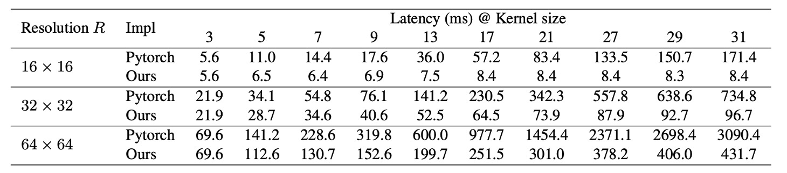

To address this, the authors released an efficient PyTorch implementation, reducing depthwise convolution latency from 49.5% to 12.3%, roughly proportional to FLOPs:

- [**RepLKNet-pytorch**](https://github.com/DingXiaoH/RepLKNet-pytorch)

### Large Kernels Heavily Rely on Residual Connections

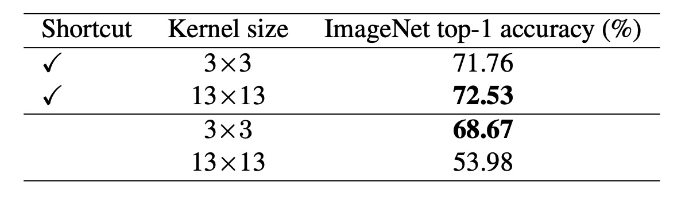

Using MobileNet-V2 for benchmarking, the authors replaced all DW 3×3 layers with 13×13 layers.

The table shows that large kernels improve the accuracy of MobileNet-V2 with shortcuts by 0.77%. Without shortcuts, large kernels reduce accuracy to only 53.98%.

:::tip
As seen in previous studies, shortcuts create implicit ensembles of models with different receptive fields, benefiting from a larger maximum receptive field without losing the ability to capture small-scale patterns.
:::

### Large Kernels Require Reparameterization

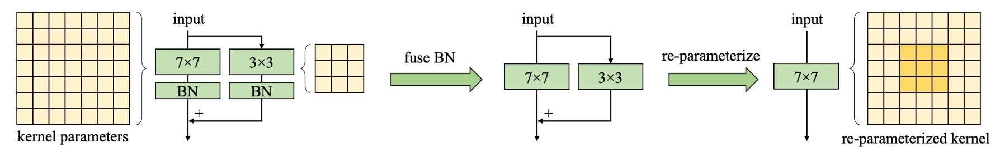

The table shows that directly increasing kernel size from 9 to 13 reduces accuracy, but reparameterization resolves this issue.

It is known that ViT faces optimization problems with small datasets. A common solution is to introduce convolutional priors, such as adding a DW 3×3 convolution to each self-attention block, similar to this study. These strategies introduce additional translation invariance and locality, making optimization easier on small datasets without losing generality.

Similarly, the authors found that reparameterization can be omitted without performance degradation when the pre-training dataset is increased to 73 million images.

### Large Kernels Significantly Enhance Downstream Task Performance

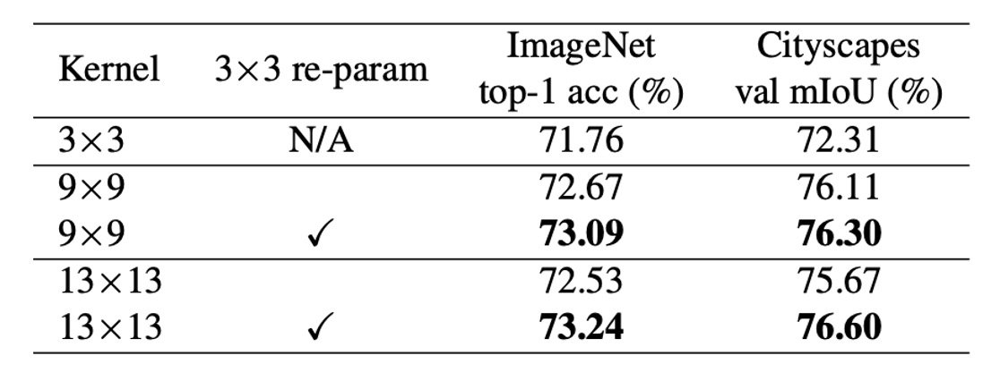

The table shows that increasing the kernel size from 3×3 to 9×9 in MobileNet V2 improves ImageNet accuracy by 1.33% and Cityscapes mIoU by 3.99%.

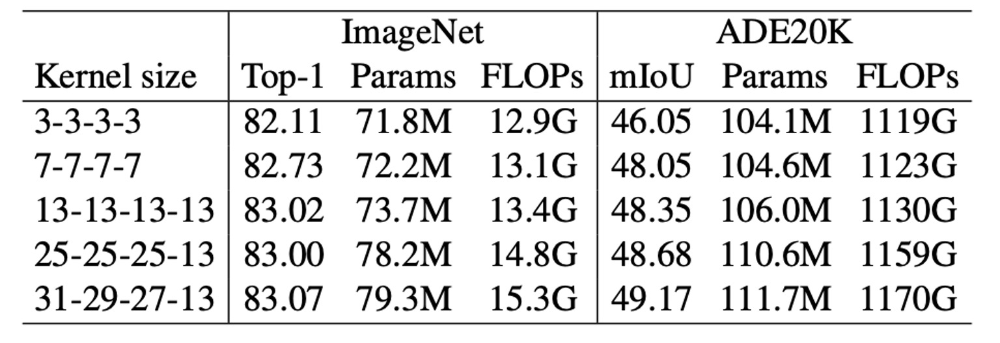

Another experiment shows a similar trend: as kernel size increases from [3, 3, 3, 3] to [31, 29, 27, 13], ImageNet accuracy improves by only 0.96%, while ADE20K mIoU increases by 3.12%. This indicates that models with similar ImageNet scores can have very different capabilities in downstream tasks.

The authors attribute this to two reasons:

1. Large kernels significantly increase the effective receptive field (ERF). Numerous studies have shown that "context" information (large ERF) is crucial for many downstream tasks, such as object detection and semantic segmentation.
2. Large kernels introduce more shape bias to the network. ImageNet images can be correctly classified based on texture or shape, but humans primarily rely on shape cues to recognize objects. Thus, models with stronger shape bias may perform better in downstream tasks.

Recent studies also indicate that ViT has a strong shape bias, partly explaining why ViT excels in transfer tasks. In contrast, traditional CNNs trained on ImageNet tend to have a texture bias.

- [**[21.05] Are convolutional neural networks or transformers more like human vision?**](https://arxiv.org/abs/2105.07197)

### Large Kernels Are Effective Even with Small Feature Maps

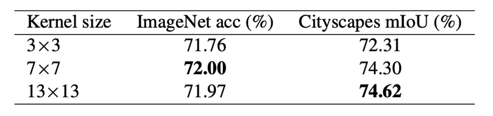

The authors enlarged the DW convolution in the final stage of MobileNet V2 to 7×7 or 13×13, making the kernel size equal to or larger than the feature map size (default 7×7). The table shows that while large kernels do not improve ImageNet performance, they significantly boost downstream tasks, increasing Cityscapes mIoU to 74.62%.

The authors believe that as kernel size increases, the translational invariance of CNNs does not strictly hold. Adjacent spatial positions' outputs share only part of the kernel weights, transforming through different mappings, as illustrated below. This mechanism might explain the effectiveness of large kernels on small feature maps.

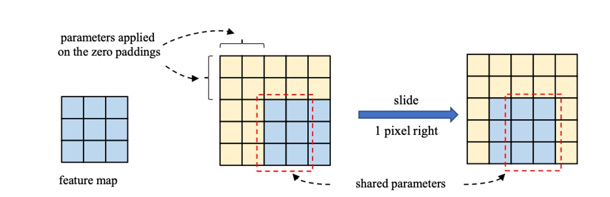

## Solving the Problem

### Network Architecture

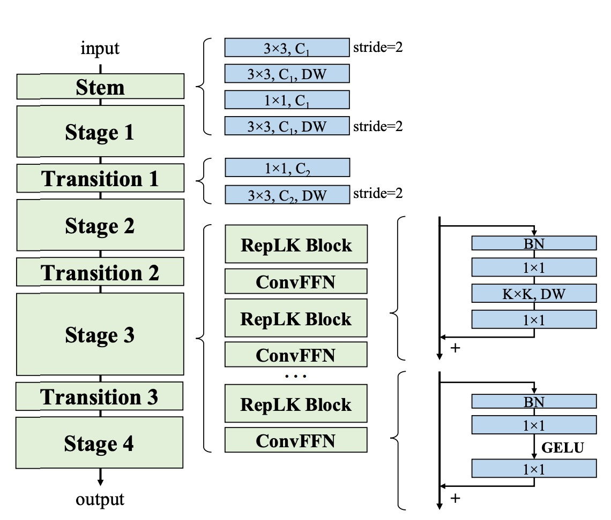

Based on the above insights, the authors proposed a new network architecture, RepLKNet.

Firstly, RepLKNet's design focuses on capturing more details in the initial stages through multiple convolution layers. After the initial 3×3 convolution and downsampling, a 3×3 depthwise separable convolution (DW) layer captures low-level patterns, followed by a 1×1 convolution layer and another DW 3×3 layer for downsampling. This ensures thorough extraction of detail information in the initial stages.

Secondly, each stage (1-4) of RepLKNet contains multiple RepLK blocks. These blocks leverage shortcuts and DW large kernels to enhance performance. Each DW convolution layer uses a 5×5 kernel for reparameterization to capture more details.

:::tip
Although not shown in the diagram above, this part is crucial for performance improvement. These blocks enable efficient feature extraction and processing at different stages.
:::

Additionally, to enhance nonlinearity and cross-channel communication, RepLKNet introduces ConvFFN blocks. These blocks consist of shortcuts, Batch Normalization (BN), two 1×1 convolution layers, and GELU activation, similar to feedforward networks (FFN) in Transformers and MLPs.

Compared to the classic FFN using Layer Normalization, BN integrates better with convolution operations, improving inference efficiency. This design is inspired by Transformers and MLP networks and has been successfully applied in CNNs.

Between different stages, RepLKNet uses Transition Blocks to adjust channel dimensions and perform downsampling. These blocks first increase channel dimensions with a 1×1 convolution, then downsample using a DW 3×3 convolution, ensuring comprehensive feature extraction and transformation. These transition blocks allow smooth transitions between stages, maintaining information consistency and integrity.

## Discussion

### Evaluation of Large Kernels

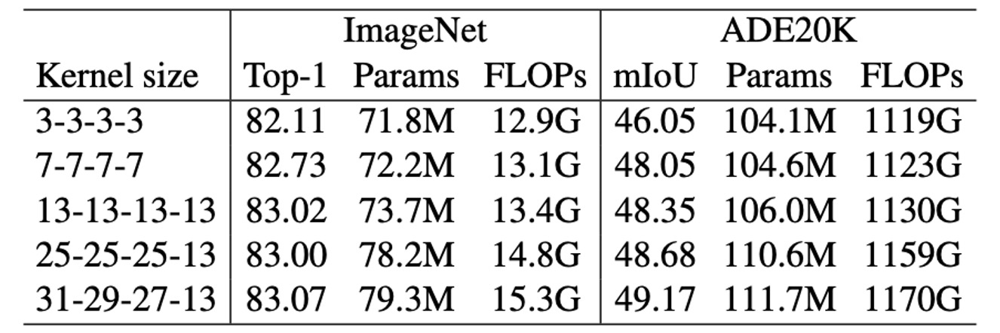

To evaluate the impact of large kernels on RepLKNet, the authors changed kernel sizes while keeping some hyperparameters fixed, observing their performance on classification and semantic segmentation tasks.

The results show that increasing kernel size from 3 to 13 improves accuracy on ImageNet, but further enlarging the kernel does not bring significant improvement. However, on ADE20K, expanding the kernel from 13 to 31 results in higher mIoU, highlighting the advantages of large kernels in downstream tasks.

This indicates that while large kernels have limited benefits for certain tasks, they are valuable in specific applications.

### Performance on ImageNet

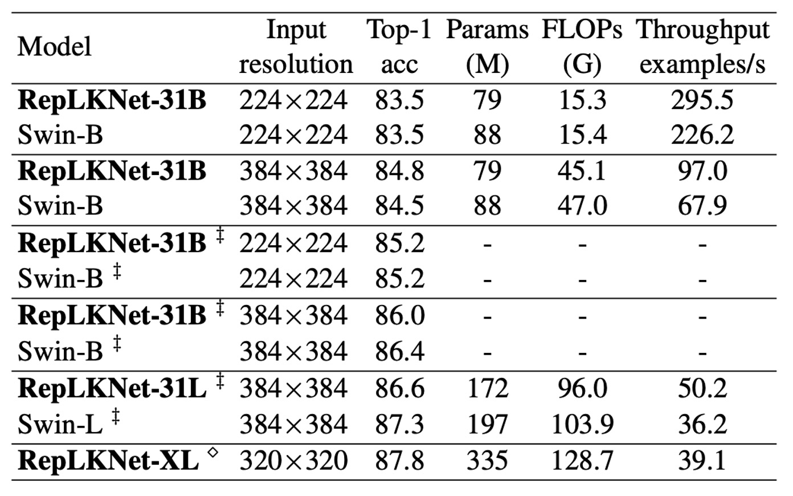

Given the similarities in architecture between RepLKNet and Swin, the authors conducted a detailed comparison.

On ImageNet-1K, the authors extended the training schedule of RepLKNet-31B to 300 epochs to ensure a fair comparison. Then, they fine-tuned for 30 epochs with 384×384 input resolution, at a training cost significantly lower than training Swin-B from scratch with 384×384 resolution.

Additionally, the authors pre-trained RepLKNet-B and RepLKNet-L on ImageNet-22K and fine-tuned them on ImageNet-1K. RepLKNet-XL was pre-trained on the authors' private semi-supervised dataset MegData73M.

The authors also tested the models' throughput on the same 2080Ti GPU with a batch size of 64.

---

The results show that although very large kernels are not suitable for ImageNet classification, RepLKNet models achieve a good balance between accuracy and efficiency. For instance, RepLKNet-31B achieved 84.8% accuracy with only ImageNet-1K training, 0.3% higher than Swin-B, and ran 43% faster. Despite RepLKNet-XL having higher FLOPs than Swin-L, it ran faster, emphasizing the efficiency of large kernel designs.

### Large Kernel CNNs Have Larger ERF Than Deep Small Kernel Models

The authors demonstrated that large kernel designs significantly improve CNN performance.

Notably, although large kernels can be represented by a series of small convolutions, such as decomposing a 7×7 convolution into three stacked 3×3 kernels, a question arises:

- **Why do traditional CNNs with numerous small convolution layers (e.g., ResNets) still underperform compared to large kernel networks?**

The authors argue that a single large kernel is more effective in achieving a large receptive field (ERF) than many small kernels. According to ERF theory, ERF is proportional to $O(K\sqrt{L})$, where K is the kernel size, and L is the depth (number of layers).

In other words, **ERF is mainly influenced by kernel size, followed by depth**.

---

Moreover, increasing depth brings optimization challenges.

Although ResNets are thought to overcome this issue, they do not entirely. Studies show that ResNets behave like ensembles of shallow networks, with ERF remaining limited despite increased depth.

To support this, the authors conducted an experiment:

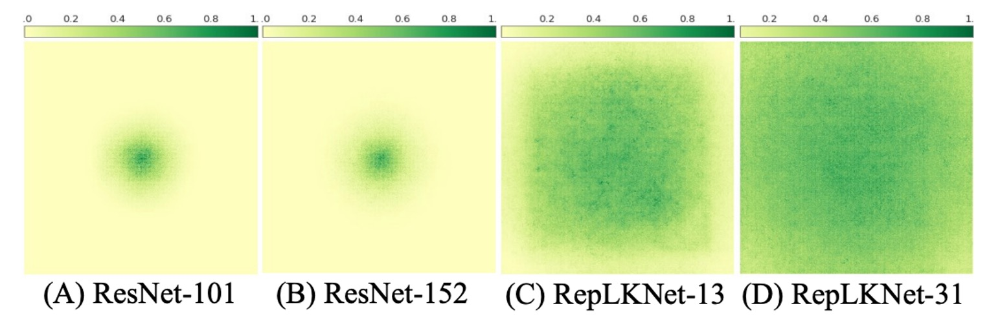

To visualize ERF, the authors used a simple yet effective method.

They generated an aggregated contribution score matrix $A (1024×1024)$, measuring the contribution of corresponding pixels in the input image to the center point of the final layer's feature map.

In simpler terms: **Which pixels in the input image contribute to the center point of the feature map?**

The results show that in ResNet, ERF is very limited, even with increased depth. In contrast, RepLKNet exhibits more uniformly distributed high-contribution pixels, resulting in a larger ERF.

### Shape Bias

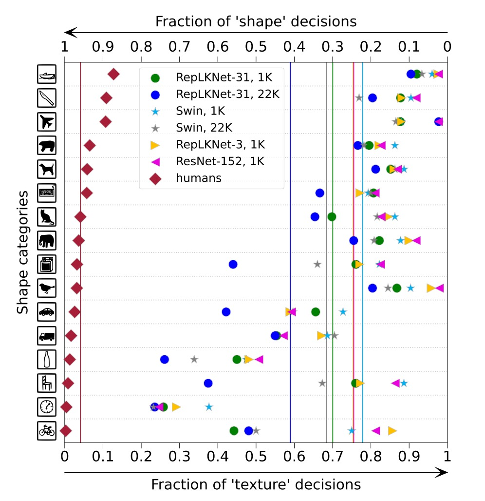

The authors note that large kernel designs introduce a stronger shape bias, crucial for downstream tasks.

They measured the shape bias of RepLKNet-31B and Swin-B, trained on ImageNet-1K or 22K, and two small kernel baselines, RepLKNet-3 and ResNet-152.

The results show that RepLKNet-31B has a significantly higher shape bias than Swin Transformer and small kernel CNNs. The authors believe that shape bias is closely related to ERF rather than self-attention, explaining:

1. ViT's high shape bias due to global attention
2. Swin Transformer's low shape bias due to local window attention

### Limitations

While large kernel designs significantly enhance CNN performance on ImageNet and downstream tasks, RepLKNet begins to lag behind Swin Transformers as the data and model scale increase.

The authors are unsure whether this gap is due to suboptimal hyperparameter tuning or fundamental flaws in CNNs with larger data and model scales.

This remains an open area for future research.

## Conclusion

In this study, the authors revisited the long-neglected design of large convolutional kernels in CNN architecture.

Through experiments, they demonstrated that using a few large kernels instead of many small ones can more effectively achieve a larger effective receptive field, significantly improving CNN performance. This finding helps narrow the performance gap between CNNs and ViTs.

For the CNN community, the results suggest that special attention should be given to ERF, which may be key to achieving high performance. For the ViT community, the study shows that large convolutional kernels can replace multi-head self-attention mechanisms with similar behavior, potentially aiding in understanding the intrinsic mechanisms of self-attention.

The authors hope this work fosters mutual understanding and progress between the two communities and inspires further research to explore and optimize deep learning model architecture design.
