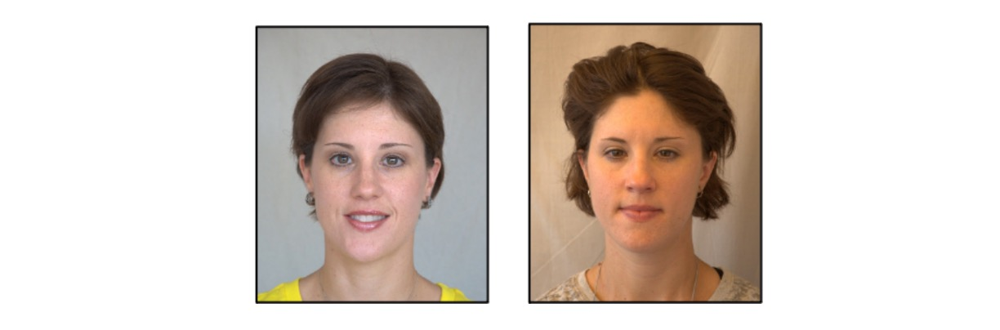
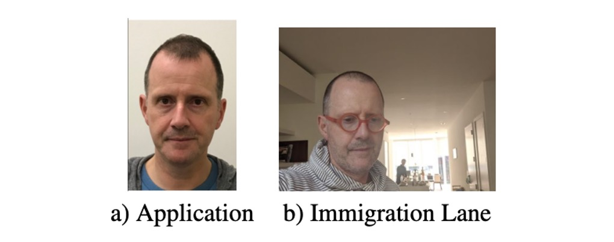

# [22.09] FRVT-Twins

## Report on Twin Identification Accuracy

[**FRVT: Face Recognition Verification Accuracy on Distinguishing Twins (NIST.IR.8439)**](https://nvlpubs.nist.gov/nistpubs/ir/2022/NIST.IR.8439.pdf)

---

:::info
The following content has been compiled by ChatGPT-4 and has been manually reviewed, edited, and supplemented.
:::

---

This is not a paper but a technical report.

The NIST conducted research on distinguishing twins within the scope of the FRVT (Face Recognition Vendor Test).

This is an intriguing issue because the high similarity between twins can pose significant challenges for facial recognition systems.

In fact, "distinguishing twins" is an exceedingly challenging task for facial recognition systems.

:::tip
For more information about NIST, you can refer to [**NIST & FRVT**](https://docsaid.org/blog/nist-and-frvt/).
:::

## Introduction

Facial recognition technology is increasingly used in both public and private sectors for identity verification, transaction authorization, and access control.

Over the past decade, accuracy in the FRVT evaluations has significantly improved, supporting these applications.

Since the COVID-19 pandemic, some algorithms have even been able to recognize individuals wearing masks.

However, despite these advancements, the identification of twins remains problematic.

This report documents the results of the latest algorithms in this regard.

## Datasets

### Twins Day Dataset 2010-2018

- [**Download**](https://biic.wvu.edu/data-sets/twins-day-dataset-2010-1015)

This dataset, from West Virginia University's Center for Identification Technology Research, includes images from Twins Days from 2010 to 2018.

These collections were conducted under IRB protocols with informed consent from each participant.

The image sizes vary by year:

- 2010: 2848x4288
- 2011: 3744x5616
- 2012 to 2018: 3300x4400 and 2400x3200.

The images are high-quality frontal portraits, meeting NIST SAP50 specifications (head and shoulder composition) and SAP51 specifications (head composition).

- **Sample Image: Different Individuals**

  

- **Sample Image: Same Individual**

  

### Immigration-related Images

This dataset includes real-time captured images, primarily from webcam images and some visa application images.

Webcam images are taken by operators under time constraints, leading to variations in roll, pitch, and yaw angles, with sometimes overexposed faces due to bright backgrounds. The average inter-pupil distance is 38 pixels, not conforming to ISO/IEC 19794-5 full-frontal image types.

Some subjects also have visa application images captured in interview environments using dedicated equipment and lighting. These images conform to ISO/IEC 19794-5 standards with a capture size of 300x300 and nearly frontal poses.

- **Example Image**

  

## Dataset Limitations

### Small Population

- The Twins Days dataset is relatively small compared to other NIST FRVT 1:1 datasets, containing over 5900 images.
- Due to inconsistent or missing metadata, many images and twins were excluded, including some incorrect matches (e.g., A and B are twins, but B and C are also recorded as twins).
- Most of the immigration-related dataset images were retained, including 152 pairs of twins and 2,478 images.

### Variations in Identification Codes

- Twins Days usually assigns the same identification code to the same participants each year, but sometimes a new code is issued.
- This results in some high-threshold non-twin comparisons that are actually correct matches being incorrectly marked as errors.

### Incorrect/Missing Metadata

- Metadata for Twins Days collections from 2011 to 2016 is partially or entirely missing.
- Incorrect metadata, such as twin type or birthdate mismatches, led to the exclusion of many images.
- The immigration-related image dataset lacks information to distinguish fraternal from identical twins.

### Imbalanced Data

- Twins Days images have an uneven distribution of twin types: 2.8% fraternal opposite-sex, 6.7% fraternal same-sex, and 90.5% identical twins.
- Age group distribution is also uneven, with most images belonging to the 20-39 age range, and very few from the 40-59 and 60+ age groups.

### Racial Imbalance

- The Twins Days dataset includes racial identity: 85% White, 10% African American, and 5% others.
- The number of racial groups is too numerous for meaningful analysis based on race.

## Algorithm Performance Report

With FRVT being open to global participation, many algorithms are involved.

This report documents the results of 478 algorithms submitted to the FRVT 1:1 test from 2019 to mid-February 2022.

### Evaluation Metrics

- **False Match Rate (FMR)**

  The False Match Rate (FMR) is the proportion of incorrect matches among all attempts, where faces of different people are wrongly recognized as the same person.

  This is a crucial performance metric in facial recognition systems, especially in high-security applications like banking or airport security.

  Setting FMR = 0.0001 means only one incorrect match in every 10,000 attempts.

- **False Non-Match Rate (FNMR)**

  The False Non-Match Rate (FNMR) is the proportion of incorrect non-matches among all attempts, where faces of the same person are wrongly recognized as different people.

  This is also an important performance metric, particularly in applications concerning user convenience and experience.

- **FNMR @ FMR = 0.0001**

  When you see "FNMR @ FMR = 0.0001," it means observing the False Non-Match Rate (FNMR) when the False Match Rate (FMR) is set to 0.0001.

  This measures how well the facial recognition system performs under extremely low false match conditions, ensuring effective recognition of the same person under stringent false match settings.

### Identical Twins

- For the Twins Days data, the FMR for identical twins usually exceeds 0.99, indicating these twins are almost always incorrectly recognized as each other by algorithms.
- FMRs below 0.99 generally result from two situations:

  - **System Errors**: Algorithms with high Failure to Enroll (FTE) rates failing to extract features from many or all images.
  - **Poor Algorithms**: Systems with high False Non-Match Rates (FNMR), producing low scores, meaning the algorithm sees everything as different people.

### Algorithms Capable of Identifying Identical Twins

Some algorithms show high accuracy in recognizing identical twins, not always mistakenly identifying identical twins as the same person.

These algorithms include:

- **Algorithms**: aigen-001, aigen-002, beyneai-000, glory-004, mobai-000, and iqface-001.
- **Performance Metrics**:
  - **FNMR (False Non-Match Rate)**: ≤ 0.02
  - **FTE (Failure to Enroll Rate)**: ≤ 0.02
  - **FMR (False Match Rate)**: ≤ 0.7

Specifically, aigen-002 is noteworthy, with an FMR of 0.475 for identical twins, meaning this algorithm correctly distinguishes twins about half the time. While this FMR is much higher than the ideal standard (FMR = 0.0001), it is significantly lower than the 0.98 and 0.99 FMRs of most other algorithms, indicating better performance in distinguishing identical twins.

## Comprehensive Analysis

### Score Distributions

The figure above shows score distributions for two accurate and representative algorithms across different photo types.

The highest scores come from "mated twins," indicating comparisons between photos of the same individual taken on the same day.

The next highest scores are from "mated mugshot," ordinary face images used as a control group.

Comparisons between identical twins (labeled "non-mated identical twins") also receive similarly high scores.

Scores for same-sex fraternal twins (labeled "non-mated fraternal same-sex twins") are also close to these high scores.

These scores are all above the threshold set in the report, designed to yield a false match rate (FMR=0.0001) for a set of unrelated face pairs.

:::tip
Although twin scores are slightly lower than same individual scores, these results are still far above the model threshold, highlighting the challenge of distinguishing twins from non-twins for algorithms.

Additionally, the report notes that simply raising the threshold to reduce false matches between twins is ineffective, as the issue lies in the fundamental design of the algorithms, not the threshold settings.
:::

### Age Effects

Analyzing different age groups of twins, both datasets show a decrease in similarity scores among unrelated twins in older age groups.

**Twins Days dataset** categorizes twins into four age groups: 0-19, 20-39, 40-59, and 60+. Analysis shows lower similarity scores in the oldest age group for both fraternal and identical same-sex twins compared to the youngest age group.

**Immigration-related dataset** includes all same-sex twins, divided into three age groups: 0-19, 20-39, and 40-59. In this dataset, similarity scores for the 0-19 age group are closer to those of related twins, while scores for the 40-59 age group are significantly lower, diverging more from related twins' scores.

Despite lower similarity scores in older age groups, these scores still exceed the algorithm thresholds, indicating algorithms still consider unrelated twins as matches. Therefore, algorithms fail to effectively distinguish between fraternal and identical twins.

:::tip
The failure to distinguish fraternal twins is particularly surprising, as fraternal twins have different genomes and should exhibit different facial features. This suggests algorithms may also struggle to accurately differentiate siblings with close birth years.
:::

### Longitudinal Effects

Despite improvements in facial recognition algorithm performance, the ability to distinguish same-sex twins has not improved. Algorithms that perform well on general face data do not show improved or decreased performance when comparing same-sex fraternal and identical twins in the Twins Days dataset.

## Conclusion

Considering NIST's Face Recognition Vendor Test (FRVT) performance and its ability to distinguish between identical and fraternal twins, current facial recognition technology faces significant challenges, particularly in distinguishing genetically similar identical twins.

Despite lower genetic similarity and potential greater facial differences among fraternal twins, algorithms still struggle to differentiate them, which could lead to catastrophic consequences in high-accuracy-required scenarios.

For future improvements, the report suggests one main point: utilizing higher resolution images to enhance facial recognition system performance.

### Using Higher Resolution Images

Higher resolution images can provide more detailed facial skin features, such as skin texture and pore patterns, which are unique to individuals and could help distinguish even genetically identical twins.

:::tip
The effectiveness of this approach has been demonstrated by a 2004 patented algorithm (US Patent: US7369685B2).

This algorithm accurately distinguished twins by analyzing skin texture visible in high-resolution images.
:::

To achieve this, future research and development should focus on improving the quality of image capture, ensuring an inter-pupil distance of at least 120 pixels, and conforming to ISO standard frontal portraits for skin texture-based analysis. Additionally, mainstream neural network models often downsample input images to improve processing speed, but this loses crucial detail information, affecting recognition accuracy (especially in highly similar cases like twins).

These are the directions for future improvements, and we hope to see better performance in recognizing twins in future FRVTs.
