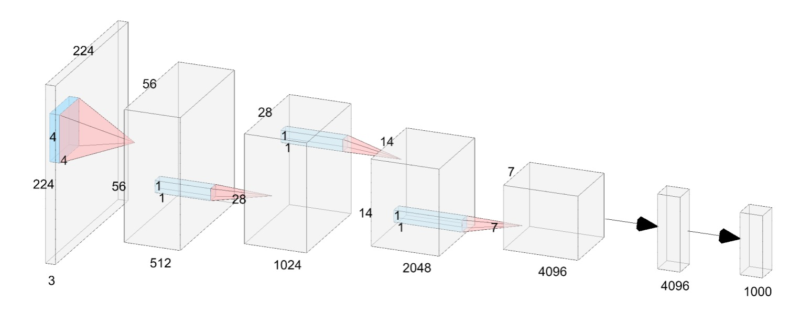
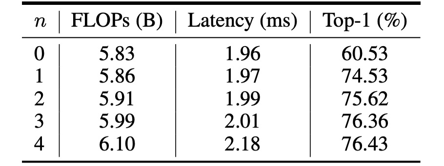

# [23.05] VanillaNet

## Vanilla Minimalism

[**VanillaNet: the Power of Minimalism in Deep Learning**](https://arxiv.org/abs/2305.12972)

---

In an era dominated by deep convolutional networks, it’s surprising to see a minimalist approach like VanillaNet emerge.

## Problem Definition

The field of computer vision has seen tremendous progress over the past few years.

From the early days of AlexNet to the latest hybrid architectures of CNNs and Transformers, the advancements have been rapid.

In the race to top the ImageNet leaderboard, researchers have continuously increased model complexity, leading to a significant rise in computational costs and resource demands.

Additionally, complex architectures pose deployment challenges. For instance, ResNet consumes a large amount of extra memory during operations, while Swin Transformers require intricate engineering implementations like re-writing CUDA code for shifted windows.

### Why Are Residual-Free Convolutional Architectures Overlooked?

Think AlexNet and VGG.

The gradient vanishing problem in deep networks was effectively addressed by ResNet’s introduction of residual connections.

On the other hand, non-residual networks inherently lagged in accuracy, an unavoidable reality.

Simple network designs seemed to hit a dead end, drawing little attention.

With the continuous development of AI chips, the inference speed bottleneck for neural networks is no longer FLOPs or parameter counts, as modern GPUs can easily handle parallel computations with immense processing power.

Ironically, the last bottleneck, unnoticed at the outset, turned out to be model complexity and depth.

## Solution

### Model Architecture



The authors of this paper propose a straightforward neural network architecture called VanillaNet, as illustrated above.

This architecture feels like a throwback to a decade ago:

- AlexNet! What are you doing here?

---

Unlike current deep networks, each down-sampling stage here consists of just a single layer.

In the Stem stage, a $4 \times 4 \times 3 \times C$ convolution layer with a stride of 4 maps the image to a $C$-dimensional feature space.

In stages 1 to 3, a MaxPool layer with a stride of 2 reduces the feature map size and doubles the channel count.

The final layer is a fully connected layer for output classification. Each convolution layer is $1 \times 1$ to minimize parameter counts. Each convolution layer is followed by an activation function, with BatchNorm applied to stabilize the training process.

There are no residual connections, attention mechanisms, or shifted windows—just basic convolutions and pooling.

### This Can’t Work, Right?

Such a simple architecture seems unlikely to perform well.

The authors point out that this design lacks a critical element: non-linearity.

It’s well-known that the power of neural networks lies in their non-linearity, key to fitting complex functions.

### Deep Training Strategy

In convolutional neural networks, the combination of convolution layers and activation functions is crucial for capturing data non-linearities.

In the initial training phase, the authors use two convolution layers with activation functions to ensure strong non-linearity, enabling better feature learning from the data. As training progresses, the non-linearity of the activation functions is gradually reduced, eventually transforming them into an identity mapping.

The change in activation function can be described by the following formula:

$$
A'(x) = (1 - \lambda)A(x) + \lambda x,
$$

where $\lambda$ is a hyperparameter varying with the number of training iterations. At the start of training, $\lambda = 0$, meaning $A'(x) = A(x)$, indicating full-strength activation. As training progresses, $\lambda$ increases until it reaches 1, turning the activation function into an identity mapping.

At the end of training, with activation functions transformed into identity mappings, the two convolution layers can be merged into one, reducing inference time and enhancing model efficiency. The merging process is akin to reparameterization:

- **BatchNorm Merging**:

  First, merge each BatchNorm layer with its preceding convolution layer.

  Let the weights and bias matrices of the convolution layer be $W \in \mathbb{R}^{C_{out} \times C_{in} \times k \times k}$ and $B \in \mathbb{R}^{C_{out}}$, and the parameters (scale, shift, mean, and variance) of the BatchNorm layer be $\gamma, \beta, \mu, \sigma \in \mathbb{R}^{C_{out}}$.

  The merged weights and bias matrices are:

  $$
  W'_i = \frac{\gamma_i}{\sigma_i} W_i, \quad B'_i = \frac{(B_i - \mu_i) \gamma_i}{\sigma_i} + \beta_i,
  $$

  where $i$ denotes the $i$-th output channel.

- **Merging Two $1 \times 1$ Convolution Layers**:

  After merging the BatchNorm layer, proceed to merge the two $1 \times 1$ convolution layers.

  Given input $x \in \mathbb{R}^{C_{in} \times H \times W}$ and output $y \in \mathbb{R}^{C_{out} \times H' \times W'}$, convolution can be expressed as:

  $$
  y = W * x = W \cdot \text{im2col}(x) = W \cdot X,
  $$

  where $*$ denotes the convolution operation, $\cdot$ denotes matrix multiplication, and $X$ is generated by the im2col operation, reshaping the input to match the shape of the convolution kernel. For $1 \times 1$ convolution, the im2col operation becomes a simple reshaping operation. Thus, the weight matrices $W_1$ and $W_2$ of the two convolution layers can be merged into one matrix:

  $$
  y = W1 * (W2 * x) = W1 \cdot W2 \cdot \text{im2col}(x) = (W1 \cdot W2) * X,
  $$

  Therefore, two $1 \times 1$ convolution layers can be merged without increasing inference time.

This deep training strategy offers several advantages:

1. **Enhanced Model Non-linearity**: Using strong non-linear activation functions at the start helps the model capture complex patterns in the data, improving performance.
2. **Gradual Transition to Simplified Model**: As training progresses, activation functions gradually turn into identity mappings, simplifying the final model structure and boosting inference speed.
3. **Convenient Layer Merging**: At the end of training, two convolution layers can be easily merged into one, reducing computational costs and improving efficiency.

:::tip
The reparameterization process is conceptually similar to RepVGG.

- [**RepVGG: Making VGG Great Again**](../2101-repvgg/index.md)
  :::

### Series-Informed Activation Functions

Existing research shows that the limited capability of simple and shallow networks primarily stems from their "insufficient non-linearity," a topic less explored compared to deep and complex networks.

In fact, there are two ways to enhance the non-linearity of neural networks:

1. **Stacking Non-linear Activation Layers**
2. **Increasing the Non-linearity of Each Activation Layer**

Current network trends favor the former, which can lead to high latency when parallel computing capacity is ample.

---

A straightforward idea to enhance activation layer non-linearity is stacking. The "serial" stacking of activation functions is the core idea of deep networks.

In contrast, the authors choose "parallel" stacking of activation functions.

Given a single activation function $A(x)$ in a neural network, which can be a common ReLU or Tanh function, the parallel stacking of activation functions can be expressed as:

$$
A_s(x) = \sum_{i=1}^{n} a_i A(x + b_i)
$$

where $n$ is the number of stacked activation functions, and $a_i$ and $b_i$ are the scaling and shifting factors for each activation function. This parallel stacking significantly enhances the non-linearity of the activation function, and the above equation can be mathematically viewed as a series, essentially a summation of multiple quantities.

---

To further enhance the series' approximation capability, the authors allow "series-based functions to learn global information by varying their input neighborhood," similar to the BNET concept.

- [**[23.01] BNET: Batch normalization with enhanced linear transformation**](https://ieeexplore.ieee.org/document/10012548)

Specifically, given the input feature $x \in \mathbb{R}^{H \times W \times C}$, where $H$, $W$, and $C$ are the height, width, and channel count, respectively, the activation function is expressed as:

$$
A_s(x_{h,w,c}) = \sum_{i,j \in \{-n, n\}} a_{i,j,c} A(x_{i+h,j+w,c} + b_c)
$$

where $h \in \{1, 2, ..., H\}$, $w \in \{1, 2, ..., W\}$, and $c \in \{1, 2, ..., C\}$.

It can be seen that when $n = 0$, the series-based activation function $A_s(x)$ degenerates into the regular activation function $A(x)$, indicating that this method can be viewed as a universal extension of existing activation functions. In the paper, the authors use ReLU as the base activation function for constructing the series due to its high inference efficiency on GPUs.

To clearly understand this concept, let’s look at the implementation that uses convolution operations to realize parallel stacking of activation functions:

```python
# Ref: VanillaNet
#     https://github.com/huawei-noah/VanillaNet/blob/main/models/vanillanet.py
import torch
import torch.nn as nn

class activation(nn.ReLU):

    def __init__(self, dim, act_num=3, deploy=False):
        super(activation, self).__init__()
        self.act_num = act_num
        self.deploy = deploy
        self.dim = dim
        self.weight = nn.Parameter(torch.randn(dim, 1, act_num*2 + 1, act_num*2 + 1))
        if deploy:
            self.bias = nn.Parameter(torch.zeros(dim))
        else:
            self.bias = None
            self.bn = nn.BatchNorm2d(dim, eps=1e-6)
        weight_init.trunc_normal_(self.weight, std=.02)

    def forward(self, x):
        if self.deploy:
            return nn.functional.conv2d(
                super(activation, self).forward(x),
                self.weight, self.bias, padding=self.act_num, groups=self.dim)
        else:
            return self.bn(nn.functional.conv2d(
                super(activation, self).forward(x),
                self.weight, padding=self.act_num, groups=self.dim))
```

## Discussion

Earlier, it was mentioned that the limited capability of shallow networks is primarily due to their "insufficient non-linearity." Now, with the addition of parallel stacked activation functions, can this design improve the model’s performance?

### Ablation Study - Activation Functions



The table above shows the performance of VanillaNet with different values of $n$.

The original network structure could only achieve 60.53% accuracy on the ImageNet dataset, which is not practical for real-world applications.

When $n = 1$, the accuracy jumps to 74.53%, marking a significant improvement. With $n = 3$, the accuracy and inference speed reach an optimal balance.

### Ablation Study - Deep Training Strategy


Given the very shallow structure of VanillaNet, the authors proposed increasing non-linearity during training to enhance its performance.

The table above analyzes the effectiveness of the proposed deep training technique, showing that the original VanillaNet achieves 75.23% top-1 accuracy, serving as a baseline. With the deep training technique, VanillaNet reaches 76.36% accuracy. These results demonstrate the usefulness of the proposed deep training technique for shallow networks.

Additionally, the authors applied deep training and series-informed activation functions to other networks to showcase the generalizability of these techniques.

The table reports results on the ImageNet dataset for two classic deep networks: AlexNet and ResNet-50. The original AlexNet achieves only 57.52% accuracy (with a 12-layer structure).

By applying the proposed deep training and series-informed activation functions, AlexNet’s performance improves significantly by about 6%, indicating the techniques’ effectiveness for shallow networks.

For the relatively complex ResNet-50, the performance improvement is minor, suggesting that deep and complex networks already have sufficient non-linearity, rendering additional techniques unnecessary.

### Ablation Study - Residual Connections


Finally, how do residual connections, popular in general network structures, perform here?

Experiments show that residual connections do not improve performance in shallow network structures and can even decrease accuracy.

A straightforward explanation is that shallow networks’ bottleneck is not identity mapping but "weak non-linearity." Thus, shortcuts do not enhance non-linearity since residual connections skip activation functions to reduce depth, leading to performance degradation.

### Performance on ImageNet


To demonstrate the effectiveness of the proposed method, the authors conducted experiments on the ImageNet dataset.

This dataset consists of 224 × 224-pixel RGB color images, with 1.28 million training images and 50,000 validation images covering 1,000 categories. They employed strong regularization, as each layer in the proposed VanillaNet has numerous parameters to capture useful information from images with limited non-linearity.

Latency tests were conducted on Nvidia A100 GPUs, and the authors proposed various VanillaNet architectures with different depths. To verify these architectures' performance, they tested with a batch size of 1, indicating that AI chips have enough computing power to handle each network.

In this setup, they found that inference speed has little to do with the number of FLOPs and parameters. For instance, while MobileNetV3-Large has very low FLOPs (0.22B), its GPU latency is 7.83ms, even higher than VanillaNet-13 with 11.9B FLOPs.

The research shows that inference speed is highly related to network complexity and depth in this setup. For example, the inference speed difference between ShuffleNetV2x1.5 and ShuffleNetV2x2 is minimal (7.23ms vs. 7.84ms), despite their significant differences in parameter count and FLOPs (0.3B vs. 0.6B) because their difference is mainly in channel count.

The study also reveals that simple architectures, including ResNet, VGGNet, and VanillaNet, achieve the highest inference speed without additional branches and complex blocks like squeeze-and-excitation blocks or dense connections.


## Conclusion

VanillaNet, with its superior efficiency and accuracy, surpasses contemporary networks, highlighting the potential of minimalistic approaches in deep learning.

This groundbreaking research paves the way for new directions in neural network design, challenging established norms of foundational models and setting new trajectories for fine and efficient model architectures.
