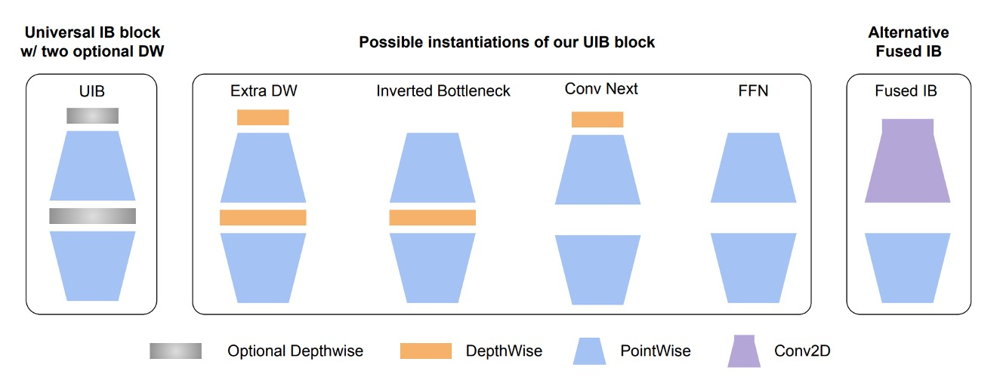
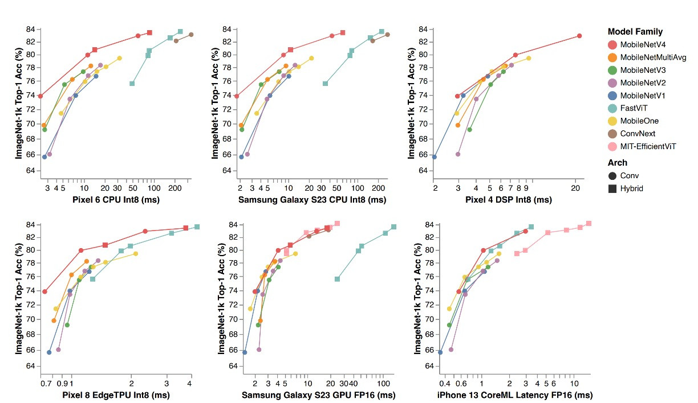
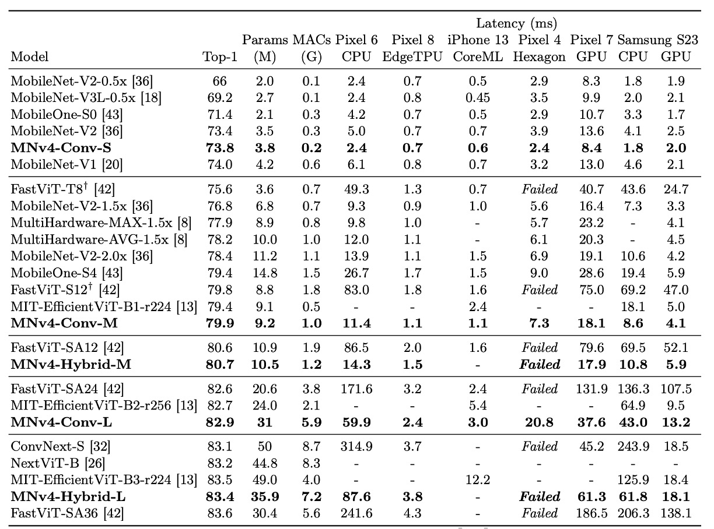
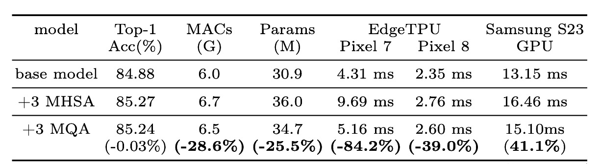
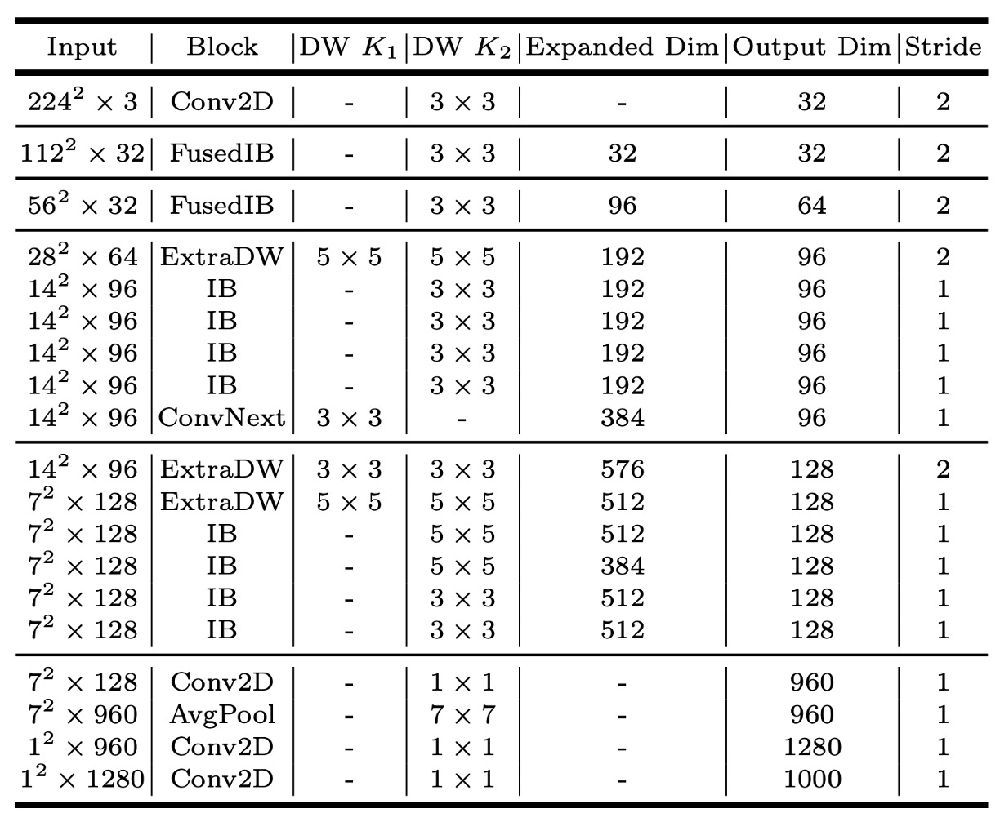

# [24.04] MobileNet-V4

## Five Years of Evolution

[**MobileNetV4 - Universal Models for the Mobile Ecosystem**](https://arxiv.org/abs/2404.10518)

---

:::info
The following content has been compiled by ChatGPT-4 and has been manually reviewed, edited, and supplemented.
:::

---

Five years have passed since the release of MobileNetV3.

During this time, the academic community has made significant progress with new network architectures and the application of multi-head attention mechanisms.

## Defining the Problem

With these new advancements, it's tempting to integrate them into MobileNet for improved performance.

Firstly, recent trends in attention mechanisms have led to two primary approaches:

### Hybrid Attention

This approach focuses on combining the strengths of CNNs and Transformers, making attention mechanisms more suitable for lightweight networks.

Notable works include:

- [**[21.08] Mobile-Former: Bridging MobileNet and Transformer**](https://arxiv.org/abs/2108.05895)
- [**[21.10] MobileViT: Light-weight, General-purpose, and Mobile-friendly Vision Transformer**](https://arxiv.org/abs/2110.02178)
- [**[23.03] FastViT: A Fast Hybrid Vision Transformer using Structural Reparameterization**](https://arxiv.org/abs/2303.14189)

### Efficient Attention

This approach aims to improve the efficiency of MHSA, reducing the complexity from $O(n^2)$ to $O(n)$.

Key papers include:

- [**[21.07] CMT: Convolutional Neural Networks Meet Vision Transformers**](https://arxiv.org/abs/2107.06263)
- [**[22.05] EfficientViT: Multi-Scale Linear Attention for High-Resolution Dense Prediction**](https://arxiv.org/abs/2205.14756)
- [**[22.06] Separable Self-attention for Mobile Vision Transformers**](https://arxiv.org/abs/2206.02680)
- [**[22.07] Next-ViT: Next Generation Vision Transformer for Efficient Deployment in Realistic Industrial Scenarios**](https://arxiv.org/abs/2207.05501)
- [**[22.12] Rethinking Vision Transformers for MobileNet Size and Speed**](https://arxiv.org/abs/2212.08059)

### Various Convolutional Network Architectures

Beyond attention mechanisms, there are other architectural overviews worth considering:

- [**[22.01] A ConvNet for the 2020s**](https://arxiv.org/abs/2201.03545)

These serve as valuable references.

## Solving the Problem

### Network Architecture

The authors first extended the inverted bottleneck (IB) from MobileNet-V2.

In the diagram, the `Inverted Bottleneck` is the basic structure of MobileNet-V2, which you are likely familiar with.

The authors added an additional `Depthwise Convolution` before this structure and allowed the front and middle parts to "combine freely."

This enables four different combinations:

1. Both selected: Extra DW
2. First DW selected: Conv Next structure
3. Middle DW selected: Original IB
4. Neither selected: Simple FFN

This flexible module is termed `UIB` (Universal Inverted Bottleneck) in the paper.

:::info
Besides `UIB`, the paper introduces another fixed component for subsequent NAS searches called `Alternative Fused IB`.

One search space rule is:

- Fixed initial layer: Start with `Conv2D` (3x3 kernel, stride=2) in the first stage, followed by `FusedIB` in the second stage to balance efficiency and accuracy.
  :::

### Mobile MQA

After designing the convolutional network architecture, the authors introduced a new attention module: Multi-Query Attention (MQA).

This structure originates from:

- [**[19.11] Fast Transformer Decoding: One Write-Head is All You Need**](https://arxiv.org/abs/1911.02150)

If you recall the basic structure of attention mechanisms, they consist of Query, Key, and Value.

In multi-head attention, each head has its own Query, Key, and Value.

The main idea here is that each head has a different Query but shares the same Key and Value.

Previous experiments have shown that this design doesn't reduce model performance, especially when the batch size is relatively small compared to the feature dimensions. This significantly reduces computation.

This is particularly relevant for mobile devices, where inference often uses a batch size of 1.

:::tip
The authors claim to be the first to apply MQA in lightweight networks.
:::

Unlike text-based attention mechanisms, this one is applied to images.

Thus, the authors also referenced another paper:

- [**[21.02] Pyramid Vision Transformer: A Versatile Backbone for Dense Prediction without Convolutions**](https://arxiv.org/abs/2102.12122)

This paper introduced the Spatial-Reduction Attention (SRA) module, which reduces the spatial dimensions of feature maps before applying attention, thus reducing computation.

Combining the two concepts, replacing SRA's attention with MQA and replacing pooling with convolution results in the Mobile MQA proposed in this paper.

:::tip
The paper lists almost ten worthwhile papers to read, which we'll compile later... so busy.
:::

### Cross-Device Optimization

The core goal of this paper is cross-device optimization.

:::tip
In previous MobileNet-V3 research, optimization was only done for the Pixel series.
:::

During the experiments, the authors gathered several key insights:

1. **Multi-path efficiency issues**:
   - Group convolutions and similar multi-path designs, despite having lower FLOPs counts, have lower efficiency due to memory access complexity.
2. **Hardware support is crucial**:
   - Advanced modules like Squeeze and Excite (SE), GELU, and LayerNorm lack good support on mobile devices.
   - LayerNorm lags behind BatchNorm.
   - SE is slow on mobile accelerators.
3. **The power of simplicity**:
   - Simple modules like ReLU, Conv2D, DW-Conv2D, and BatchNorm are well-supported on mobile devices.

Based on these insights, the NAS search system prioritizes widely supported standard modules, combining them with the aforementioned `UIB` and `MQA` modules during the search.

## Discussion

### ImageNet Experimental Results

:::info
In the table, the MobileNet series (V1, V2, V3) have been retrained with modern training schedules, resulting in higher performance than reported in the original papers.
:::

The MNv4 models excel in efficiency and demonstrate compatibility across different hardware platforms, enabling seamless deployment in the mobile ecosystem without platform-specific adjustments.

1. **Performance on CPU**: The MNv4 models are twice as fast as MobileNetV3 and significantly outperform other models with similar accuracy.
2. **Performance on EdgeTPU**: MNv4 is twice as fast as MobileNet V3.
3. **Performance on GPU and Apple ANE**: MNv4 shows excellent front-end performance on the S23 GPU and CoreML on the iPhone 13.
4. **Comparison with competing models**:
   - **FastViT**: Ranks second on the Apple Neural Engine but has over five times the latency on GPUs compared to MNv4.
   - **EfficientViT**: Performs well on GPUs but has higher latency on the Apple Neural Engine.
   - **MobileNet V3**: Performs well on CPUs but poorly on other hardware platforms.

The authors note that MNv4's success is due to the use of UIB blocks, enhanced NAS recipes, and carefully designed search spaces.

This model's universality sets a new standard for mobile models achieving optimal performance across various hardware platforms.

### Effectiveness of MQA

Experiments confirmed the advantages of MQA in hybrid models.

As shown in the table, MQA achieves over 39% acceleration on EdgeTPU and Samsung S23 GPU compared to MHSA, with negligible quality loss (-0.03%).

MQA also reduces MAC and model parameters by over 25%.

### MNv4-Conv-S

The paper proposes four models, with MNv4-Conv-S being the smallest.

For other model architectures, please refer to the paper directly.

## Conclusion

This is a universal and efficient model designed for optimal operation across the entire mobile ecosystem.

MobileNetV4, through a series of innovations and technical optimizations, achieves Pareto-optimal performance on mobile CPUs, GPUs, DSPs, and dedicated accelerators, which is rare in lightweight model research.

:::tip
Pareto Optimality is a concept from economics and engineering that describes an optimal state where no party's situation can improve without at least one party's situation worsening. This concept originates from Italian sociologist Vilfredo Pareto.
:::

＊

In past development experiences, every new lightweight model required extensive testing on various phones...

- Not to see which is best, but to see which phones have issues.

For example, the `FastViT` architecture, which gained significant attention in 2023, showed confusingly reduced performance outside of iPhones.

We appreciate Google testing this round for us, allowing us to use it directly.
