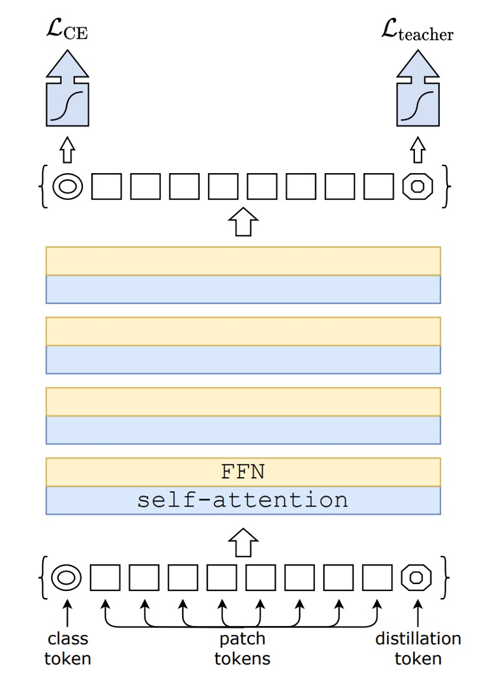
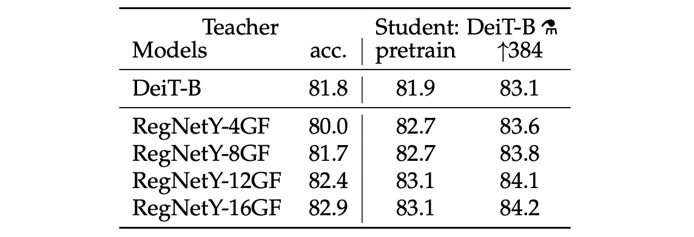
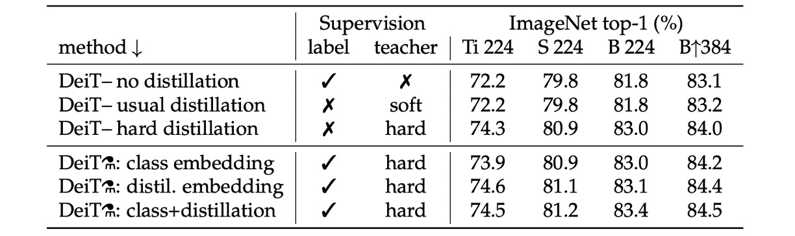
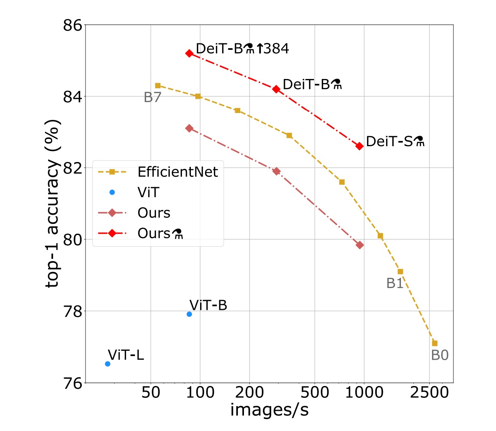
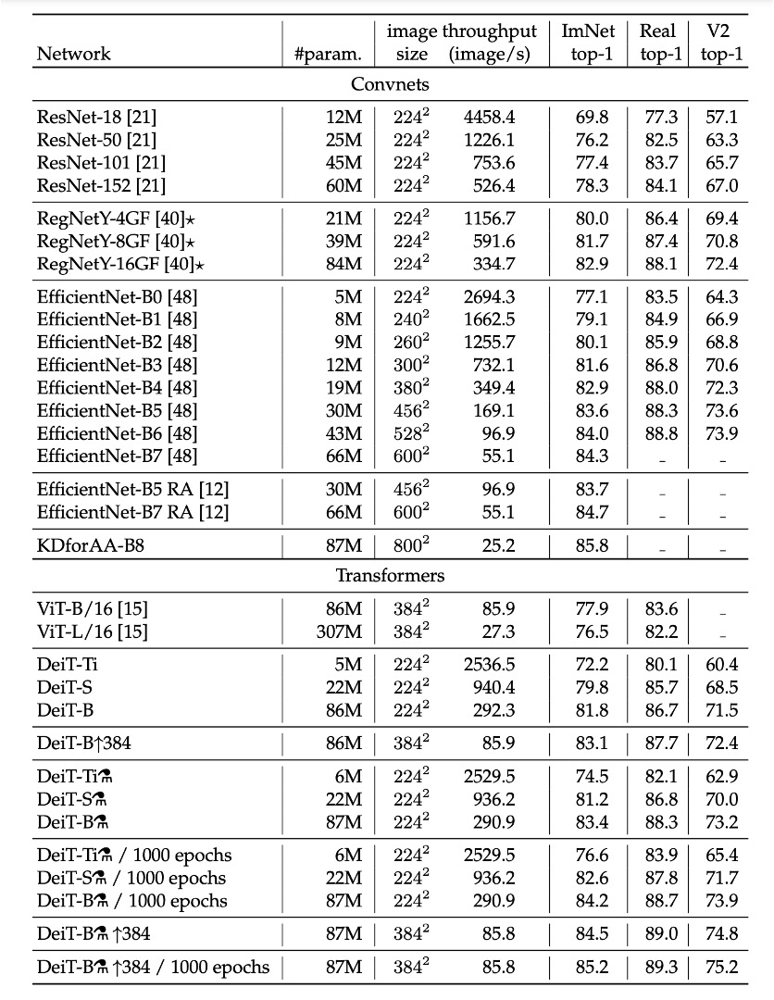

# [20.12] DeiT

## Distillation ViT

[**Training data-efficient image transformers & distillation through attention**](https://arxiv.org/abs/2012.12877)

---

:::info
The following content is compiled by ChatGPT-4 and has been manually checked, edited, and supplemented.
:::

---

Earlier, we reviewed ViT.

- [**ViT: Pioneering a New World**](../2010-vit/index.md)

This paper explored the application of Transformers in the image domain, demonstrating that on large datasets, ViT outperforms traditional convolutional networks and shows great potential.

One conclusion from that paper was:

- **ViT struggles to generalize well with insufficient data.**

## Problem Definition

The authors of this paper propose:

- **We can reduce the dependency on large datasets and improve model performance through knowledge distillation.**

## Solution

### Model Architecture

Don't be intimidated by the image.

This isn't something entirely new. If you remove the `distillation` part, you have the original ViT.

The left part of the image (CE loss) represents the standard ViT training process.

This paper's innovation starts from the `distillation` token on the right side of the image.

### Model Distillation

The authors introduced an additional token into the original ViT architecture, allowing this token to join the self-attention mechanism of the model. Ultimately, the output of this token is supervised using a Teacher-Student approach.

The Teacher is a pre-trained model, which can be a ConvNet or another architecture.

During training, the Teacher provides the output classes for the Student to learn but does not participate in gradient updates.

The Student is the model we aim to train, specifically the ViT-B/16 architecture in this paper.

There are two types of supervision:

1. **Soft Distillation**

   Soft distillation trains the model by minimizing the Kullback-Leibler divergence between the softmax outputs of the teacher and student models. Let $Z_t$ be the teacher model logits, $Z_s$ be the student model logits, $\tau$ the distillation temperature, and $\lambda$ the balance coefficient between the Kullback-Leibler divergence loss (KL) and the cross-entropy loss (LCE) based on the ground truth label $y$. The softmax function is denoted by $\psi$. The distillation objective function is defined as:

   - $$L_{global} = (1 − λ)L_{CE}(ψ(Z_s), y) + λτ^2KL(ψ(Z_s/τ), ψ(Z_t/τ))$$

   Here, $L\_{CE}$ represents the original ViT training structure's cross-entropy loss, while KL denotes the KL divergence loss for the distillation framework.

   During training, the weight of the soft distillation and cross-entropy loss is adjusted using $\lambda$.

2. **Hard-Label Distillation**

   The authors introduced a distillation variant where the teacher model's decision is treated as the ground truth label.

   Let $y_t = \arg\max_c Z_t(c)$ be the teacher model's hard decision. The objective function for hard-label distillation is:

   - $$L_{global}^{hardDistill} = \frac{1}{2} L_{CE}(ψ(Z_s), y) + \frac{1}{2} L_{CE}(ψ(Z_s), y_t)$$

   For a given image, the teacher model's hard label may vary depending on specific data augmentation methods. This choice is superior to traditional methods, requiring no parameters and being conceptually simpler: the teacher's prediction $y_t$ serves the same function as the ground truth label $y$.

   Additionally, hard labels can be converted to soft labels through label smoothing, where the ground truth label is considered with a probability of $1 - ε$, and the remaining $ε$ is distributed among the other classes. In all experiments using ground truth labels in the paper, this parameter is fixed at $ε = 0.1$.

   :::tip
   This might be hard to grasp.

   For instance, suppose you input an image with the label "dog," but the "dog" is small, and most of the image shows grass. When given to the Teacher model, the output is "grass."

   In this case:

   - **[class token]** supervises the "dog" label.
   - **[distillation token]** supervises the "grass" label.

   Finally, the two losses are combined with a weight to form the final loss function.
   :::

### Teacher Network

For the teacher network, the authors concluded through experiments that using a convolutional network as the teacher yields the best results.

They hypothesize that through distillation, ViT inherits the inductive bias of convolutional networks, enhancing its generalization ability.

## Discussion

### Which Distillation Strategy Is Best?

The table above shows the performance of different distillation strategies.

- Models with no distillation and those with only soft distillation perform similarly.
- Hard distillation alone improves performance by about 1%, indicating that hard distillation is more effective.

In the table's lower half, both label and teacher information are used during training. The comparison is between using or not using the teacher's information during inference. The results show that using both class embedding and distillation embedding during inference yields the best results.

### ImageNet Experiment Results

In the literature on image classification methods, authors typically compare accuracy trade-offs with other standards (e.g., FLOPs, number of parameters, network size).

Research finds that the performance of DeiT slightly lags behind EfficientNet, indicating that with only ImageNet training, the authors have nearly closed the gap between vision Transformers and CNNs. Compared to the previous ViT models trained only on ImageNet1k, DeiT represents a significant improvement, increasing top-1 accuracy by 6.3% in comparable settings.

Furthermore, when DeiT is distilled from a relatively weaker RegNetY to produce DeiT, its performance surpasses EfficientNet. The results show that DeiT outperforms the ViT-B model pre-trained on JFT300M at 384 resolution by 1% (top-1 accuracy 85.2% vs. 84.15%), with significantly faster training times.

The table below details additional evaluation results on ImageNet V2 and ImageNet Real, different from the ImageNet validation set, reducing overfitting on the validation set. The results indicate that in terms of the trade-off between accuracy and inference time on GPU, DeiT-B and DeiT-B ↑384 somewhat outperform the state-of-the-art techniques.

## Conclusion

The DeiT model achieves 83.1% top-1 accuracy, trained solely on ImageNet and completed in under three days on a single 8-GPU node, without using external data.

More importantly, the authors introduced a distillation strategy based on distillation tokens, enabling the student model to learn from the teacher model through the attention mechanism, showing significant advantages when compared to convolutional networks.

This paper demonstrates that high-performance ViT can be trained without requiring massive datasets and computational resources, highlighting the potential of these models to become a powerful choice for image classification methods in the future.

:::tip
This training method is cost-effective and very practical.
:::
