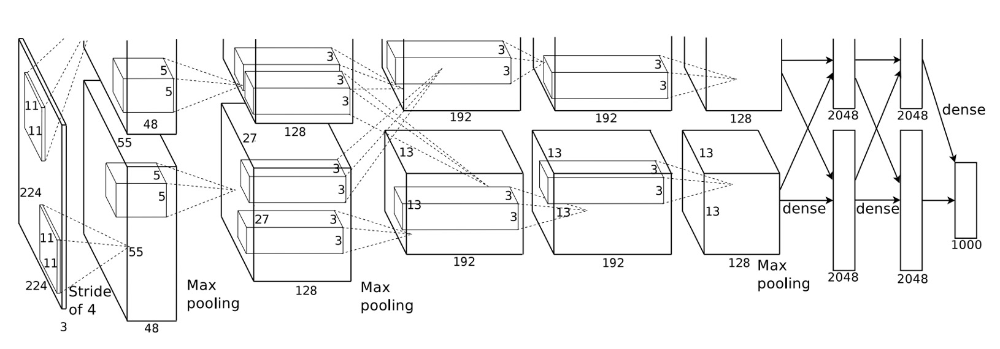

## The Rise of Convolutional Networks

[**ImageNet Classification with Deep Convolutional Neural Networks**](https://proceedings.neurips.cc/paper_files/paper/2012/file/c399862d3b9d6b76c8436e924a68c45b-Paper.pdf)

---

The study of neural networks began long before AlexNet made its mark.

AlexNet represents a significant milestone, achieving remarkable results in the 2012 ImageNet Challenge.

## Defining the Problem

By this time, the application of convolutional networks was beginning to show promise.

Before AlexNet, LeNet-5 successfully utilized Convolutional Neural Networks (CNNs) to tackle the problem of handwritten digit recognition.

- [**Gradient-Based Learning Applied to Document Recognition**](http://vision.stanford.edu/cs598_spring07/papers/Lecun98.pdf)

Additionally, this architecture had already been applied to small-scale datasets such as CIFAR-10 and MNIST.

Compared to traditional feedforward neural networks (fully connected neural networks), CNNs benefited from their inductive bias, providing powerful learning capabilities for image data. Their structure effectively captured spatial dependencies and statistical regularities in images, and required far fewer parameters, making them easier to train.

Despite the attractive features of CNNs, large-scale applications on high-resolution images were still very expensive.

Conveniently, NVIDIA was also present at that time, and the modern GPUs (back then it was the GTX580-3GB) combined with highly optimized 2D convolution implementations provided enough computational power to support the training of large CNNs.

Finally, the issue of large-scale datasets was addressed.

The large-scale image dataset ImageNet, introduced in 2009, provided enough labeled examples to effectively train these models without severe overfitting.

-

With algorithms, data, and computational power in place, the next question was: how to design a deeper and larger CNN to improve image recognition performance?

## Solving the Problem

### Model Architecture



AlexNet utilized a deep convolutional neural network with 5 convolutional layers and 3 fully connected layers.

This architecture set a precedent that persisted for many years, with subsequent CNN research evolving from this foundation.

:::tip
At this time, the paradigm for convolutional neural networks had not yet been established. Concepts such as the five-layer downsampling and Batch Normalization were not yet in use.
:::

### ReLU Activation Function

Previous research showed that using the ReLU activation function instead of Sigmoid or tanh functions resulted in faster convergence and avoided the vanishing gradient problem.

The formula is: $f(x) = max(0, x)$.

Meaning: when the input is greater than 0, the output equals the input; when the input is less than 0, the output is 0.

$$ f(x) = \begin{cases} x, & \text{if } x > 0 \\ 0, & \text{otherwise} \end{cases} $$

### Multi-GPU Training

The incomplete model architecture diagram of AlexNet is often questioned.

This is because the original paper showed the model split into two halves, each placed on a separate GPU.

### Local Response Normalization

Before Batch Normalization, models still needed normalization for effective training.

The basic idea of LRN is to normalize each neuron's activation value by considering the activations of neighboring neurons, thereby suppressing overly active neurons and promoting competition among neurons.

This mechanism, similar to lateral inhibition in biological neurons, prevents some neurons from being overly active while others remain inactive.

In AlexNet, LRN is defined as follows:

Given a neuron's activation value $a^i_{x,y}$ at position $(x, y)$, obtained by applying the $i$-th convolutional kernel and ReLU nonlinearity, the normalized activation value $b^i_{x,y}$ is calculated as:

$$b^i_{x,y} = \dfrac{a^i_{x,y}}{\left(k + \alpha \sum_{j=\max(0, i - n/2)}^{\min(N-1, i + n/2)} (a^j_{x,y})^2 \right)^\beta}$$

The parameters are:

- $a^i_{x,y}$: activation value at position $(x, y)$ after applying the $i$-th convolutional kernel and ReLU.
- $b^i_{x,y}$: normalized activation value.
- $k$, $\alpha$, $\beta$, and $n$: hyperparameters, adjusted via validation set:
  - $k = 2$
  - $\alpha = 10^{-4}$
  - $\beta = 0.75$
  - $n = 5$
- $N$: total number of convolutional kernels in that layer.
- $j$: index of neighboring convolutional kernels in the range $[\max(0, i - n/2), \min(N-1, i + n/2)]$.

### Overlapping Max Pooling

In AlexNet, the max-pooling layer has a size of 3x3 and a stride of 2.

This operation reduces the feature map size by half, lowering computation.

The authors stated that designing the max-pooling with overlapping regions helps reduce overfitting and improves the model's generalization ability.

### Dropout

During training, the authors noticed that the model tended to overfit. To address this, they introduced Dropout.

Dropout randomly drops (sets to zero) some neurons during each training iteration.

This means the network computes with a randomly selected subset of neurons during each forward pass.

Dropped neurons do not contribute to forward propagation and are not updated during backpropagation.

This prevents the network from relying on specific neurons, reducing complex co-adaptation between neurons.

:::tip
During inference, Dropout is turned off, and all neurons participate in computation.
:::

### Model Implementation

Let's take a detailed look at the network composition:

1. Input 224x224 image.
2. First convolutional layer with 11x11 kernel size, stride 4, 96 feature maps, output size 55x55.
3. Followed by max-pooling.
4. Second convolutional layer with 5x5 kernel size, 256 feature maps, output size 27x27.
5. Another max-pooling layer.
6. Third convolutional layer with 3x3 kernel size, 384 feature maps, output size 13x13.
7. Fourth convolutional layer with 3x3 kernel size, 384 feature maps, output size 13x13.
8. Fifth convolutional layer with 3x3 kernel size, 256 feature maps, output size 13x13.
9. Finally, three fully connected layers: first with 4096 neurons, second with 4096 neurons, and the last with 1000 neurons corresponding to the 1000 classes in ImageNet.

Key points from the paper:

1. Each convolutional and fully connected layer is followed by a ReLU activation function.
2. Local Response Normalization is applied after the first and second convolutional layers.
3. Max-pooling is applied after LRN and the fifth convolutional layer, with a size of 3x3 and stride of 2.
4. Dropout is used between the first two fully connected layers with a dropout rate of 0.5.

With this clear understanding, we can now write the model:

```python
import torch.nn as nn

class AlexNet(nn.Module):

    def __init__(self, num_classes=1000):
        super(AlexNet, self).__init__()

        self.stage1 = nn.Sequential(
            nn.Conv2d(3, 96, kernel_size=11, stride=4, padding=2),
            nn.ReLU(),
            nn.LocalResponseNorm(size=5, alpha=0.0001, beta=0.75, k=2),
            nn.MaxPool2d(kernel_size=3, stride=2)
        )

        self.stage2 = nn.Sequential(
            nn.Conv2d(96, 256, kernel_size=5, padding=2),
            nn.ReLU(),
            nn.LocalResponseNorm(size=5, alpha=0.0001, beta=0.75, k=2),
            nn.MaxPool2d(kernel_size=3, stride=2)
        )

        self.stage3 = nn.Sequential(
            nn.Conv2d(256, 384, kernel_size=3, padding=1),
            nn.ReLU()
        )

        self.stage4 = nn.Sequential(
            nn.Conv2d(384, 384, kernel_size=3, padding=1),
            nn.ReLU()
        )

        self.stage5 = nn.Sequential(
            nn.Conv2d(384, 256, kernel_size=3, padding=1),
            nn.ReLU(),
            nn.MaxPool2d(kernel_size=3, stride=2)
        )

        self.classifier = nn.Sequential(
            nn.Flatten(),
            nn.Dropout(0.5),
            nn.Linear(256 * 6 * 6, 4096),
            nn.ReLU(),
            nn.Dropout(0.5),
            nn.Linear(4096, 4096),
            nn.ReLU(),
            nn.Linear(4096, num_classes),
        )

    def forward(self, x):
        x = self.stage1(x)
        x = self.stage2(x)
        x = self.stage3(x)
        x = self.stage4(x)
        x = self.stage5(x)
        x = self.classifier(x)
        return x
```

## Discussion

### What Did the Convolutional Network Learn?


The authors visualized some of the first-layer convolutional kernels, showing that these filters learned features like edges, colors, and textures.

Previously, such features were manually designed and fed to machine learning algorithms using techniques like SIFT, HOG, and Sobel operators.

After AlexNet, the focus shifted from manually designing features to designing networks that could automatically learn better features.

### ILSVRC-2010 Results

| Model             | Top-1 | Top-5 |
| ----------------- | ----- | ----- |
| Sparse coding [2] | 47.1% | 28.2% |
| SIFT + FVs [24]   | 45.7% | 25.7% |
| CNN               | 37.5% | 17.0% |

In the ILSVRC-2010 competition, AlexNet achieved the following results:

- **Top-1 error rate**: 37.5%
- **Top-5 error rate**: 17.0%

Compared to the best methods at the time:

- **Sparse coding**: Top-1 error rate of 47.1%, Top-5 error rate of 28.2%.
- **SIFT + Fisher Vectors (FVs)**: Top-1 error rate of 45.7%, Top-5 error rate of 25.7%.

This shows that AlexNet significantly outperformed other methods in ILSVRC-2010.

### ILSVRC-2012 Results

| Model          | Top-1 (val) | Top-5 (val) | Top-5 (test) |
| -------------- | ----------- | ----------- | ------------ |
| SIFT + FVs [7] | —           | —           | 26.2%        |
| 1 CNN          | 40.7%       | 18.2%       | —            |
| 5 CNNs         | 38.1%       | 16.4%       | 16.4%        |
| 1 CNN\*        | 39.0%       | 16.6%       | —            |
| 7 CNNs\*       | 36.7%       | 15.4%       | 15.3%        |

- \* indicates these models were pre-trained on the full ImageNet 2011 Fall release.

In the ILSVRC-2012 competition, due to the unavailability of test set labels, the test error rates of all models could not be fully reported, but here are some key results:

- A single CNN model achieved a Top-5 error rate of 18.2% on the validation set.
- Averaging the predictions of five similar CNN models reduced the Top-5 error rate to 16.4%.
- A CNN model with a sixth convolutional layer, pre-trained on the full ImageNet 2011 Fall release (15 million images and 22,000 classes), and fine-tuned on ILSVRC-2012, achieved a Top-5 error rate of 16.6%.
- Averaging the predictions of two pre-trained CNN models with the previous five CNN models further reduced the Top-5 error rate to 15.3%.

The second-place method, which averaged the predictions of multiple classifiers computed on different types of dense sampling features, achieved a Top-5 error rate of 26.2%.

## Conclusion

AlexNet achieved remarkable results in the ILSVRC-2012 competition, marking the rise of deep learning in computer vision.

The design and training methods of this network have had a profound impact on the subsequent development of deep learning.
