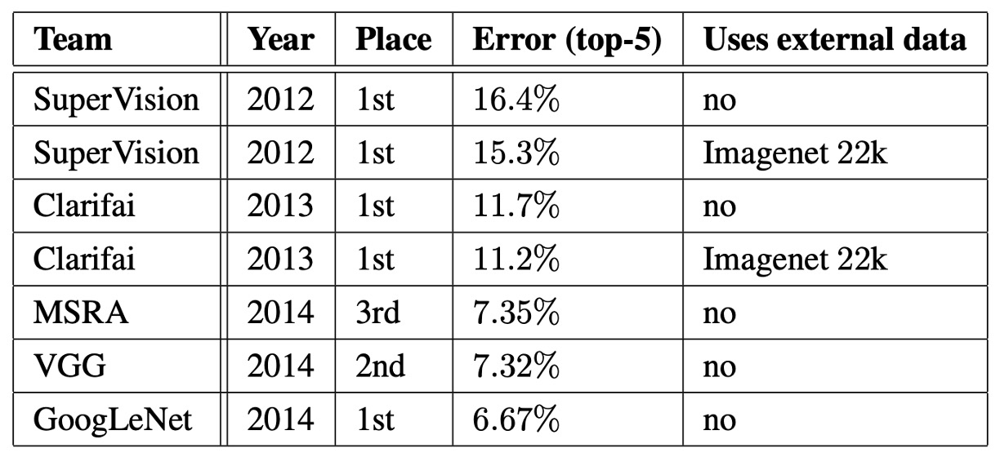

## Also Known as Inception-V1

[**Going deeper with convolutions**](https://arxiv.org/abs/1409.4842)

---

GoogLeNet employs the Inception architecture, inspired by the "Network in Network" model and a popular meme, "we need to go deeper."

- [**[13.12] Network in Network**](https://arxiv.org/abs/1312.4400)

It’s rare to see a research paper sincerely citing a meme as part of its motivation.

But since the authors boldly wrote this, we’ll share it as it is:

<figure style={{ "width": "60%"}}>

<figcaption>Source: [Know your meme: We need to go deeper](https://knowyourmeme.com/memes/we-need-to-go-deeper)</figcaption>
</figure>

The “depth” of the Inception architecture has two meanings: on one hand, it introduces a new organizational structure called the “Inception module,” and on the other hand, it achieves deeper network architectures.

The name "GoogLeNet" is a tribute to Yann LeCun's LeNet-5 network. This specific version of the Inception architecture was used in the ILSVRC14 competition.

## Problem Solved

### The Inception Module

The core idea of the Inception architecture is to approximate and cover the optimal sparse structure by using existing dense components.

In the module, 1×1, 3×3, and 5×5 convolution filters are used to process features with different spatial distributions. The outputs of all layers are concatenated into a single output vector, which serves as the input for the next stage. To avoid excessively large convolution filters, the size of these filters is constrained more for convenience than necessity.

Since pooling operations are crucial in convolutional neural networks, each Inception module includes a parallel pooling path, and the pooling layer's output is concatenated with the output from the convolutional layers, enriching the feature representation further.

To prevent computational demands from skyrocketing, Inception architecture uses 1×1 convolutions for dimensionality reduction. These convolutions serve as both a dimensionality reduction tool and a non-linear activation layer. This approach significantly reduces the computational resource requirements, especially before performing 3×3 and 5×5 convolutions, thus reducing computational complexity.

As the Inception modules are stacked, the abstraction level of features increases layer by layer, and the concentration of higher-level feature spaces gradually decreases, meaning the ratio of 3×3 and 5×5 convolutions increases as the network deepens.

### Configuration Parameters

The table above lists some important configuration parameters of GoogLeNet.

The receptive field size of the GoogLeNet network is $224 \times 224$, processing RGB images with mean subtraction. "#3×3 reduce" and "#5×5 reduce" indicate the number of 1×1 filters used before the 3×3 and 5×5 convolutions, while "pool proj" refers to the number of 1×1 filters in the projection layer following the max-pooling operation.

The depth of the GoogLeNet architecture, when only considering layers with parameters, is 22 layers, and 27 layers if pooling layers are included. The overall network contains around 100 independent building modules, with the exact number depending on the machine learning infrastructure used. An average pooling layer is used before the classifier, and in practice, an additional linear layer is added, which makes the network easier to adapt to other label sets.

Replacing the fully connected layers with average pooling improved top-1 accuracy by around 0.6%. However, despite removing the fully connected layers, using Dropout remains essential, with a dropout ratio of 70%.

### Model Architecture

Due to the depth of the network, effectively backpropagating gradients to all layers is a design concern. To address this, the authors introduced auxiliary classifiers, placed on top of the outputs of Inception modules (4a) and (4d).

:::tip
`Softmax0` and `Softmax1` in the image above are the auxiliary classifiers.
:::

The design of the auxiliary classifiers includes a 5×5 average pooling layer, a 1×1 convolution layer (with 128 filters), a fully connected layer with 1024 units, a Dropout layer with a 70% dropout rate, and a linear layer. These classifiers help reinforce the backpropagation of gradient signals during training, improving the discriminative power of lower-level features. During training, the loss from these auxiliary classifiers is weighted by 0.3 and added to the total loss, but the auxiliary networks are removed during inference.

## Discussion

### Performance at ILSVRC 2014

The task of the ILSVRC 2014 competition was to classify images into one of the 1,000 leaf node categories in the Imagenet hierarchy.

The training set contained around 1.2 million images, the validation set 50,000 images, and the test set 100,000 images. Each image was associated with a ground truth label, and the evaluation of performance was based on prediction results.

The authors did not use any external data for training during the competition, relying solely on the data provided in the training set. Additionally, several techniques were employed during testing to enhance performance:

1. Seven independent versions of the GoogLeNet model were trained, and predictions were made using an ensemble method.
2. Multiple crops of the input were used, and the predictions from all independent classifiers were averaged to produce the final result.

The final submission in the challenge achieved a top-5 error rate of 6.67% on both the validation and test sets, ranking first.

## Conclusion

The design of GoogLeNet demonstrates the importance of balancing computational resources and model performance through the innovative Inception architecture. It also shows the potential of sparse architectures, paving the way for future research in automatically designing more sparse and refined neural network structures.

The scalability of this method has made it a cornerstone in modern deep learning research, particularly in contexts that emphasize a balance between efficiency and performance. This approach offers crucial insights for future studies and applications.

This article is just the beginning of the Inception series. Later iterations, such as Inception-V2, V3, and V4, introduced various improvements and optimizations. We will explore these in due time.
