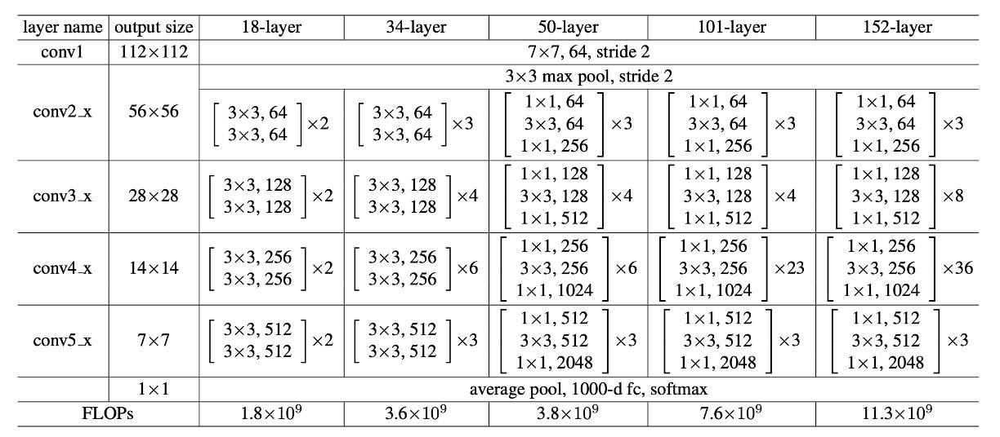

## Convolutional with 100 Layers

[**Deep Residual Learning for Image Recognition**](https://arxiv.org/abs/1512.03385)

---

After the introduction of BatchNorm, the issues of gradient vanishing and exploding seemed to have been resolved.

So why are models still difficult to train well?

## Defining the Problem

The authors conducted an experiment.

Theoretically, a deeper model should not have a higher training error than its shallower version because it can be constructed by setting the added layers to identity mappings and copying other layers from the shallower model to form a deeper model. However, as seen in the image above, with increasing network depth, both the training and testing errors rise.

Since the gradient vanishing problem has been solved, the degradation of model performance can no longer be attributed to the gradient. Additionally, this is not an overfitting problem because if it were, the training error would decrease while the testing error would increase, leading to a larger gap between them.

Hence, the authors define this issue as the model degradation problem.

## Solving the Problem

### What is Residual?

Residual typically refers to the difference between observed and reference values in mathematics and engineering.

In image processing and computer vision, the residual concept applies to local image descriptors to capture the differences between each descriptor and a predefined reference (such as a dictionary or model).

The term and the use of residuals have several reasons:

1. **Capturing Variations and Differences**: Residuals represent and encode the differences between local features and reference features, providing useful information on how local features deviate from the reference.
2. **Efficiency and Accuracy**: Focusing on residuals rather than the original descriptors can more effectively encode and process information, as residuals are usually smaller and more structured, making them easier to manage and analyze.
3. **Adaptability and Generalization**: By using residuals, models can better adapt to and recognize subtle differences between images, which is crucial for tasks such as image retrieval and classification.

### Residual Learning

Assume $H(x)$ is the target function that a deep learning model needs to learn. In a deep neural network, $H(x)$ represents the output after the input $x$ passes through a series of layers. $x$ is the original data input to these layers.

In deep learning, especially as networks become deeper, directly learning $H(x)$ can become very difficult, leading to inefficient training and poor performance (referred to by the authors as the degradation problem). The so-called residual is the difference between the model output and the original input, $H(x) - x$. This difference reflects the "extra information" the model needs to learn to transform $x$ to $H(x)$.

To simplify the optimization process, the authors introduced the residual mapping $F(x)$, defined as $F(x) := H(x) - x$. Instead of directly trying to learn the entire $H(x)$, the focus is on learning this difference, $F(x)$. Here, $F(x)$ is defined as the residual function, which is the part the model needs to learn to transform the input $x$ into the correct output $H(x)$.

When dealing with deep neural networks, if the optimal mapping is close to an identity mapping (i.e., output equals input), learning $F(x)$ approaching zero is simpler than learning the complex $H(x)$. This approach has an additional benefit: if the optimal solution is near the identity mapping, the network can easily learn a near-zero residual, thus more effectively approximating the optimal solution.

To implement this approach, the authors introduced shortcut connections in the network, which skip one or more layers and directly add the input $x$ to the output of the intermediate layers, achieving the computation of $F(x) + x$. This transformation of the optimization problem allows deep neural networks to learn and optimize more effectively, improving training results and overall performance.

### Residual Module

In the paper, the authors actually use two forms of the residual module as shown above. Both have similar parameter counts, but the one on the right features a bottleneck design. The authors later test the performance of these two forms. The number of convolutional layers per module can vary, but the authors found that using only one layer has little effect.

During the stacking process, if there is a mismatch in the number of channels, the authors use a $1 \times 1$ convolution to adjust the channels.

### Network Architecture

This might be the "longest" image we've seen in a paper...

This shows the network architecture of ResNet-34. Inspired by VGG, most of the convolutional layers here use $3 \times 3$ kernels, following two simple design rules:

1. For the same output feature map size, the stacked convolutional layers should have the same number of output channels.
2. If the feature map size is halved, the number of channels is doubled to maintain consistency in time and space.

Downsampling is achieved through convolutions with a stride of 2, and the final classification is done using a global average pooling layer followed by a fully connected layer.

Notably, in the example above, ResNet-34 has only 18% of the computation of VGG-19.

:::tip
Can't imagine how long one has to scroll if it were ResNet-152...
:::

### Parameter Configuration

The table above shows the parameter configurations for all ResNet models. As the network depth increases, the number of parameters also increases, but the computation for ResNet-152 is still much less than that of VGG.

Other training configurations are as follows:

1. **Data Augmentation**:

   - **Scale Augmentation**: The short side of an image is resized to a random size in the range [256, 480] for scale augmentation.
   - **Crop and Flip**: Randomly crop a 224×224 area from the image or its horizontal flip and subtract the mean value of each pixel.
   - **Color Augmentation**: Use standard color augmentation methods detailed in AlexNet.

2. **Normalization and Activation**:

   - Use Batch Normalization (BN) after each convolution and before activation to stabilize and accelerate training.

3. **Weight Initialization**:

   - Use Kaiming initialization to initialize weights, training all plain and residual networks from scratch.
     - [**[15.02] Delving deep into rectifiers: Surpassing human-level performance on imagenet classification**](https://arxiv.org/abs/1502.01852)

4. **Optimizer**:

   - Use mini-batch Stochastic Gradient Descent as the optimizer with a batch size of 256.
   - **Learning Rate**: Set the initial learning rate to 0.1, dividing it by 10 when the error reaches a stable level.
   - **Weight Decay**: Set to 0.0001.
   - **Momentum**: Set to 0.9.

5. **Other Configurations**:

   - **Dropout**: Do not use dropout during training.

## Discussion

### ResNet-18 vs ResNet-34

The authors first evaluated the plain networks with 18 and 34 layers.

Based on the results in the table above, the 34-layer plain network has higher validation error compared to the 18-layer plain network. To investigate the cause, the authors compared the training error and validation error during the training process, as shown in the figure below (left).

The figure reveals a degradation problem: although the solution space of the 18-layer plain network is a subset of the 34-layer network, the 34-layer plain network has higher training error throughout the training process. The authors believe this optimization difficulty is unlikely to be caused by gradient vanishing. These plain networks are trained with Batch Normalization (BN), ensuring non-zero variance in forward propagation signals. The backward propagation gradients also exhibit healthy norms with BN. Therefore, neither forward nor backward signals vanish.

In fact, the 34-layer plain network still achieves competitive accuracy, indicating that the solver works to some extent. The authors speculate that the convergence speed of the deep plain network might decrease exponentially, affecting the reduction in training error. Future research will further investigate the causes of this optimization difficulty.

Next, the authors evaluated the residual networks (ResNets) with 18 and 34 layers. The baseline architecture is the same as the above plain networks, except that shortcut connections are added to each pair of $3 \times 3$ filters. As shown in the figure above (right), residual learning reverses the situation: the 34-layer ResNet outperforms the 18-layer ResNet by 2.8%. More importantly, the 34-layer ResNet shows significantly lower training error and generalizes well to the validation data, indicating that the degradation problem is well addressed in this setting.

### Deeper Bottleneck Architectures

The authors constructed deeper networks for ImageNet.

Due to training time considerations, the authors modified the building block to a bottleneck design. For each residual function $F$, three layers are stacked instead of two, as shown above.

These three layers are $1 \times 1$, $3 \times 3$, and $1 \times 1$ convolutions. The $1 \times 1$ layers are responsible for reducing and then restoring (increasing) dimensions, with the $3 \times 3$ layer functioning as a bottleneck with smaller input/output dimensions. The two designs have similar time complexity.

- **ResNet-50**: By replacing each 2-layer block with this 3-layer bottleneck block, ResNet-50 is constructed.
- **ResNet-101 and ResNet-152**: More 3-layer blocks are used to build ResNet-101 and ResNet-152.

### Performance on ImageNet

The table above shows the performance of ResNet on ImageNet. The baseline 34-layer ResNet already achieves very competitive accuracy.

As the network depth increases, the 50/101/152-layer ResNets show significant improvements in accuracy over the 34-layer ResNet. No degradation problem is observed, and the benefits of depth are evident across all evaluation metrics.

ResNet-152 achieves a top-5 error rate of 4.49%; for the top-1 error rate, ResNet-152 reaches 19.38%, becoming the state-of-the-art model at the time.

## Conclusion

Before ResNet, training deep networks became very difficult with increasing depth, often encountering gradient vanishing or exploding problems. However, the concept of residual learning successfully overcame this bottleneck, making it possible to train ultra-deep networks. This breakthrough greatly advanced the field of deep learning, rapidly becoming a benchmark model after its introduction.

ResNet's success inspired a series of subsequent improvements and variant models, including DenseNet, ResNeXt, among others. These improved models further optimized network structures and performance, driving continuous progress and innovation in deep learning models.

Due to its exceptional performance, ResNet is widely applied in various practical scenarios, such as medical image analysis, autonomous driving, and surveillance systems. These applications demonstrate the great potential and value of ResNet in real-world applications, making it an important milestone in the development of deep learning technology.
