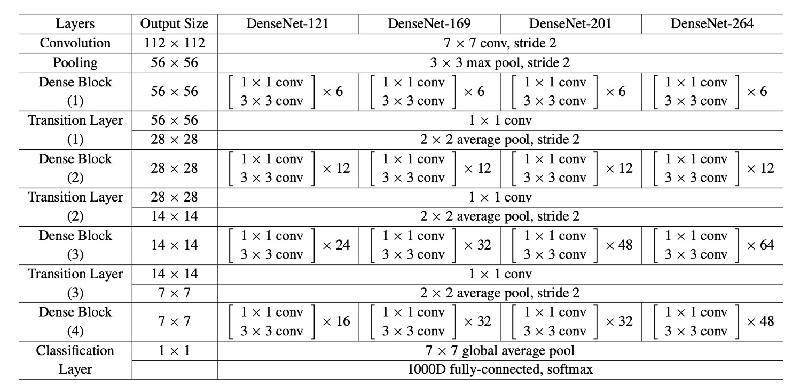

# [16.08] DenseNet

## Connecting Everything

[**Densely Connected Convolutional Networks**](https://arxiv.org/abs/1608.06993)

---

As CNNs have become deeper, gradient information from input images often vanishes, making training difficult.

Various studies began exploring how to improve the flow of information through deep networks, one of the most significant being ResNet.

- [**Deep Residual Learning for Image Recognition**](https://arxiv.org/abs/1512.03385)

## Defining the Problem

ResNet uses additive identity mappings to ensure information preservation, but many layers contribute very little:

- [**Deep networks with stochastic depth**](https://arxiv.org/abs/1603.09382)

:::tip
This issue will be revisited in MobileNetV2. We’ll discuss it in detail when we read that paper.

- [**Mobilenet-V2: Bottleneck Inside the Refinement**](../../lightweight/1801-mobilenet-v2/index.md)
  :::

Besides ResNet, another famous method is Highway Networks:

- [**Highway Networks**](https://arxiv.org/abs/1505.00387)

This paper doesn’t aim to refute the above research but proposes a new connection method to make information flow more efficiently through the network.

## Solving the Problem

### Network Architecture

This diagram is very intuitive but can be misleading:

This is not the entire network architecture; it describes the structure of a Dense Block.

In this structure, each layer’s input is the concatenation of all previous layers' outputs, and there is no downsampling.

The authors proposed this connection method to address the issue of minimal contributions from the final layers in ResNet:

- If the information can't flow to the end, let’s connect every layer together!

### Average Pooling

As shown above.

In Convolutional Neural Networks (CNNs), downsampling layers (such as pooling layers) are essential for changing the feature map size.

To effectively downsample, the authors divided the network into multiple densely connected Dense Blocks.

Between each Dense Block, there are transition layers that perform convolution and pooling operations.

The entire transition layer consists of Batch Normalization and a 1×1 convolutional layer, followed by a 2×2 average pooling layer.

### Growth Rate

An important feature of DenseNet is the growth rate.

In DenseNet, if each function $ H_l $ produces k feature maps, then the $ l $-th layer has $ k_0 + k \times (l - 1) $ input feature maps, where $ k_0 $ is the number of channels in the input layer.

A significant difference between DenseNet and other network architectures is that it can have very narrow layers, such as k = 12. This hyperparameter k is known as the network’s growth rate.

Research shows that relatively small growth rates can achieve state-of-the-art results on the tested datasets. This is because each layer can access all previous feature maps within its block, leveraging the network's "collective knowledge." The growth rate controls the amount of new information each layer contributes to the global state, which can be accessed from any position in the network without duplicating it layer by layer.

### Bottleneck Layers

Although each layer only produces k output feature maps, it typically has more inputs.

Research suggests introducing a 1×1 convolution before each 3×3 convolution as a bottleneck layer to reduce the number of input feature maps, thereby improving computational efficiency.

This design is particularly effective for DenseNet, leading the authors to refer to such a network as DenseNet-B.

The bottleneck layer structure is: BN-ReLU-Conv(1×1)-BN-ReLU-Conv(3×3). In experiments, each 1×1 convolution produces 4k feature maps.

### Compression

To further enhance model compactness, the authors designed a method to reduce the number of feature maps in the transition layers.

If a Dense Block contains m feature maps, the subsequent transition layer will produce $ bθmc $ output feature maps, where $ 0 < θ ≤ 1 $ is called the compression factor. When $ θ = 1 $, the number of feature maps in the transition layer remains unchanged.

The authors referred to DenseNets with $ θ < 1 $ as DenseNet-C and set $ θ = 0.5 $ in their experiments. When using both bottleneck layers and transition layers with $ θ < 1 $, the model is called DenseNet-BC.

### Implementation Details

For all datasets except ImageNet, the authors experimented with DenseNets having three Dense Blocks.

Each Dense Block contained the same number of layers. Before entering the first Dense Block, the input image underwent a convolution with 16 (or twice the growth rate for DenseNet-BC) output channels. For convolutions with kernel size 3×3, each side of the input was zero-padded to maintain the feature map size.

Between two consecutive Dense Blocks, the authors used a 1×1 convolution followed by a 2×2 average pooling as the transition layer. At the end of the last Dense Block, global average pooling was performed, followed by a softmax classifier. The feature map sizes in the three Dense Blocks were 32×32, 16×16, and 8×8, respectively.

The authors used the following basic DenseNet configurations in their experiments:

- L = 40, k = 12
- L = 100, k = 12
- L = 100, k = 24

For DenseNet-BC, the configurations were:

- L = 100, k = 12
- L = 250, k = 24
- L = 190, k = 40

In experiments on the ImageNet dataset, the authors used a DenseNet-BC structure with four Dense Blocks, experimenting with 224×224 input images.

The initial convolution layer had 2k convolutions of size 7×7 with a stride of 2.

The number of feature maps in all other layers also depended on the setting of k.

## Discussion

### Experimental Results

The above image plots the single-crop top-1 validation errors of DenseNets and ResNets as functions of the number of parameters and FLOPs, showing the differences in performance and computational resource usage.

In the left plot, we see the relationship between validation error and the number of parameters for DenseNet and ResNet. DenseNet-201, with around 20M parameters, has a validation error similar to ResNet-101, which has over 40M parameters. This indicates that DenseNet can achieve similar performance to ResNet with fewer parameters.

The right plot shows the relationship between validation error and the number of FLOPs. In this plot, we see that a DenseNet with the same computational load as ResNet-50 performs comparably to ResNet-101, which requires twice the computational load. This further demonstrates DenseNet’s computational efficiency, achieving high performance with relatively fewer computational resources.

### Compact Models

Any feature map learned by a DenseNet layer can be accessed by all subsequent layers, a direct result of input concatenation.

This encourages feature reuse throughout the network, leading to a more compact model.

The two charts on the left show an experiment comparing the parameter efficiency of all DenseNet variants (left) and similar ResNet architectures (right). The authors trained several small networks of different depths on C10+ and plotted their test accuracy as a function of network parameters. Results show that DenseNet-BC is the most parameter-efficient among all DenseNet variants.

Moreover, DenseNet-BC requires only about one-third the parameters of ResNet to achieve the same accuracy.

A DenseNet-BC with only 0.8M trainable parameters can achieve accuracy comparable to a 1001-layer ResNet (10.2M parameters).

### Feature Reuse

The DenseNet design allows layers to access feature maps from all preceding layers (through transition layers).

The authors conducted an experiment to investigate whether the trained network utilized this feature. They trained a DenseNet (L=40, k=12) and calculated the weights assigned by each convolutional layer within the block to other layers.

The image above shows heatmaps for all three Dense Blocks. The way to read this is: the horizontal axis represents the Target layer, the vertical axis represents the Source layer, and the color indicates the weight size, with darker colors indicating larger weights.

Several features can be observed from the image:

- All layers distribute their weights across multiple inputs within the same block, indicating that features extracted by earlier layers are directly used by deeper layers.
- Transition layers distribute their weights across all layers in the previous Dense Block, with information flowing through a few indirect paths from the first layer to the last.
- Layers within the second and third Dense Blocks consistently assign minimal weights to the outputs of transition layers (the top row of the triangle), suggesting that transition layers output many redundant features.
- The final classification layer predominantly uses the final feature map, indicating that the network generates some higher-level features in the later stages.

:::tip
After reading this, we were left puzzled:

**Why do "layers within the second and third Dense Blocks consistently assign minimal weights to the outputs of transition layers"?**

The top row of Block2 and Block3 looks entirely zero, which doesn't make sense.

Since different Dense Blocks rely on transition layers to convey information, if these weights are zero, no information would be transmitted. A closer look at the next layer after the transition layer, the second row, shows more reasonable weights, although not very large, but at least with some variance.

The second layer should just be the first layer plus a convolution, then concatenated, and shouldn't have such a stark difference (completely zero).

So, one guess is that there might be an error in the visualization code.

If you know the real reason, feel free to let us know!
:::

## Conclusion

DenseNet combines identity mappings, deep supervision, and diversified depth features, allowing feature reuse throughout the network, resulting in a more compact and accurate model. Due to its compact internal representation and reduced feature redundancy, DenseNet has shown its potential as a robust feature extractor for various computer vision tasks based on convolutional features.

Future work will explore DenseNet’s application in feature transfer, further expanding its utility in the field of computer vision.
