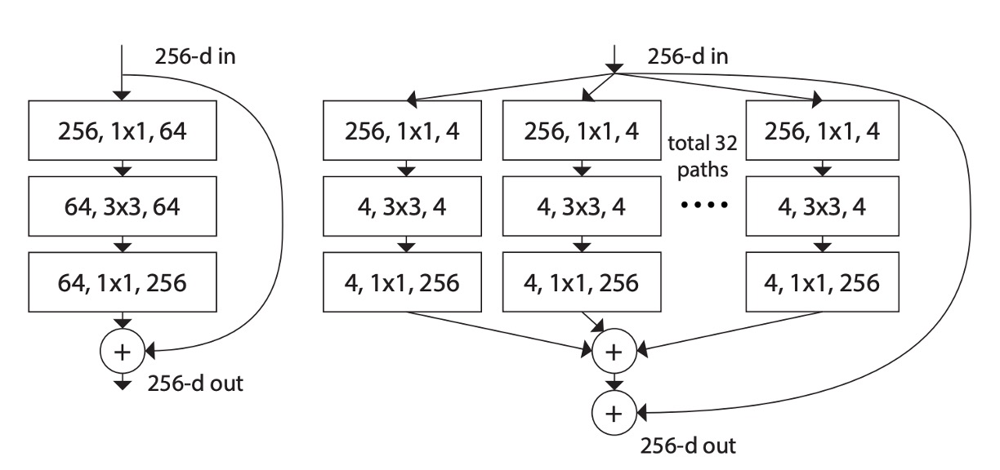

## Exploring the Next Dimension

[**Aggregated Residual Transformations for Deep Neural Networks**](https://arxiv.org/abs/1611.05431)

---

Remember the Inception model we discussed earlier?

- [**Going Deeper with Convolutions**](https://arxiv.org/abs/1409.4842)

That intricate branching structure must have left quite an impression, right?

## Problem Definition

Inception demonstrated that well-designed network architectures could achieve superior performance with lower theoretical complexity.

However, this design approach introduces several issues:

### Generalization to Downstream Tasks

In the Inception model, different sizes of convolutional kernels (e.g., 1x1, 3x3, 5x5) are used simultaneously to extract features at different scales.

We need to determine the size and number of convolutional kernels for each layer based on the characteristics of the dataset. For instance, larger convolutional kernels can capture more contextual information for image datasets, while smaller kernels can extract finer details.

Each Inception module typically includes multiple convolutional layers and pooling layers of different sizes. The internal structure of each module is designed according to the requirements, and the best combination is chosen using cross-validation.

:::tip
This isn't user-friendly!

Every time you want to use this model, you start hesitating... It's practically anti-engineer.
:::

### Not Conducive to Model Design

Current neural network research has gradually shifted from "feature engineering" to "model design engineering," i.e., how to design a good neural network.

The design of the Inception model requires a lot of human labor and time and is not easy to scale to larger models.

However, the "split-transform-merge" design philosophy is still very valuable.

## Solution

### Network Architecture

As shown in the above image, the left side is the original ResNet structure, and the right side is the ResNeXt structure proposed by the authors.

The authors borrowed design methods from VGG and ResNet, adopting a highly modular design, making the model consist of a stack of residual blocks. Then, they introduced a new dimension: cardinality, which serves as an important factor besides depth and width.

Cardinality refers to the number of groups in the ResNeXt module, i.e., dividing the input channels into several groups for convolution operations. For example, in the "total 32 paths" shown in the image, the "32" is the number of groups, with each group having four channels.

Furthermore, the authors simplified the design space through two simple rules, making the entire network design more straightforward and unified:

- Rule 1: If the same size of feature maps is produced, these blocks share the same hyperparameters (width and filter size).
- Rule 2: Each time the feature map is down-sampled by 2 times, the module's width is multiplied by 2 times.

Finally, the concept of Aggregated Transformations was introduced, extending the basic operations of neurons to more complex transformations and using bottleneck architecture and grouped convolutions to simplify implementation and improve model performance.

This architecture exists in several equivalent forms, as shown below:

- (a) in the above image is the structure proposed in this paper.
- (b) omits the branch operation of 4 1x1 256 and directly uses concat to replace it, followed by a 128 1x1 256 convolution.
- (c) directly calls the grouped convolution parameter in Conv2D, followed by a 128 1x1 256 convolution.

:::tip
Ignoring Norm, ReLU, and Pooling, the outputs of these architectures are equivalent.

We will use the third method in implementation for its speed and simplicity.
:::

### Model Configuration

Using grouped convolutions reduces computation, so to maintain the same comparison baseline, the authors doubled the intermediate channel count in the ResNeXt module compared to the original ResNet and set the number of groups to 32.

## Discussion

### Training Performance on ImageNet-1K

The above image shows the validation and training errors of different models as the number of training epochs increases.

Compared to ResNet-50, the 32×4d ResNeXt-50 achieves a validation error of 22.2%, which is 1.7% lower than ResNet-50's 23.9%.

As the cardinality $C$ increases from 1 to 32 while maintaining the same model complexity, the error rate continuously decreases. The training error of the 32×4d ResNeXt is significantly lower than that of ResNet-50, indicating that the performance improvement mainly comes from the enhanced model representation capability rather than regularization effects.

For ResNet-101, the 32×4d ResNeXt-101 outperforms ResNet-101 by 0.8%. Although the validation error improvement is smaller than that of ResNet-50, the training error improvement is still significant (ResNet-101 has 20%, while 32×4d ResNeXt-101 has 16%).

### Increasing Model Complexity

To test the impact of the number of groups on model performance, the authors conducted the following experiments:

1. **Doubling the Complexity**

   - Compared to the ResNet-101 baseline (22.0%), increasing model complexity always reduces errors.
   - But the effect is limited:
     - Increasing depth (ResNet-200, improvement of 0.3%)
     - Increasing width (wider ResNet-101, improvement of 0.7%).

2. **Increasing Cardinality is More Effective**

   Experiments show that increasing the cardinality $C$ shows better results than increasing depth or width.

   - 2×64d ResNeXt-101 reduces top-1 error to 20.7%.
     - Doubling $C$ on the 1×64d ResNet-101 baseline while maintaining width
   - 64×4d ResNeXt-101 reduces top-1 error to 20.4%.
     - Doubling $C$ on the 32×4d ResNeXt-101 while maintaining width

3. **Performance at Lower Complexity**

   32×4d ResNet-101 (21.2%) outperforms deeper ResNet-200 and wider ResNet-101, despite having only about 50% of their complexity. This indicates that cardinality $C$ is a more effective dimension than depth and width.

### ImageNet-1K Model Performance

The above table shows the single-crop test results on the ImageNet validation set.

ResNeXt's results are on par with ResNet, Inception-v3/v4, and Inception-ResNet-v2, achieving a single-crop top-5 error rate of 4.4%.

Moreover, ResNeXt's architectural design is much simpler than all Inception models, with significantly fewer manually set hyperparameters.

## Conclusion

This paper proposes a simple and highly modular network architecture, ResNeXt, built by repeatedly aggregating a set of transformations with the same topology, forming a homogeneous, multi-branch architecture with only a few hyperparameters.

The authors introduced a new dimension: cardinality, as an important factor besides depth and width.

Experimental results show that increasing cardinality significantly improves classification accuracy while maintaining model complexity.

Increasing cardinality is more effective than simply increasing model depth or width.

:::tip
This paper provides important references for the development of lightweight models such as separable convolutions and MobileNet.
:::
