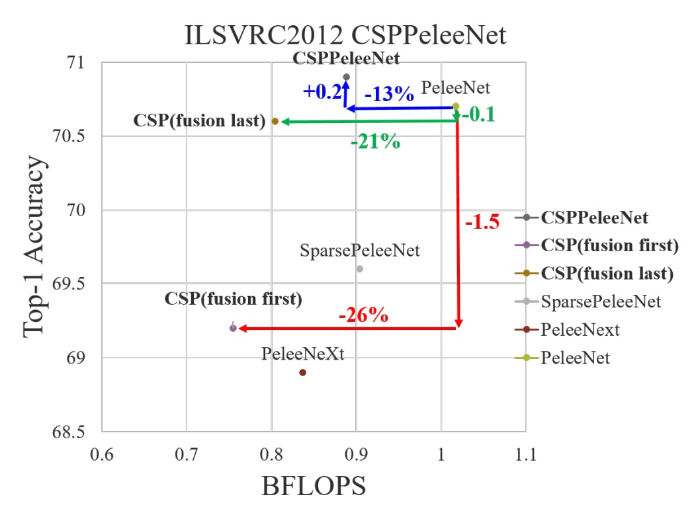

# [19.11] CSPNet

## Half-Half-Half Plugin

[**CSPNet: A New Backbone that can Enhance Learning Capability of CNN**](https://arxiv.org/abs/1911.11929)

---

CSPNet stands for "Cross Stage Partial Network."

This paper has seen widespread application in the industry, and many implementations exist in libraries such as Timm, featuring models like `cspdarknet53`, `cspresnet50`, and `cspresnext50`.

## Problem Definition

The authors analyzed existing neural network architectures, focusing on DenseNet's characteristics, which offer some advantages but also present certain issues. Below is a summary of the identified problems:

1. **Computational Bottleneck:**

   A computational bottleneck occurs when specific parts or layers of a computational process do not effectively utilize resources (like processing units, memory, data transfer), leading to limited overall performance. When bottlenecks exist, some computational resources may be idle while others are overused.

   In CNNs, different layers are responsible for different computational tasks. If one layer requires significantly more computation while others do much less, this causes some processing units to be overworked while others remain underutilized.

2. **High Memory Usage**

   Recently, DenseNet has shown promise in improving learning capabilities, but it also significantly increases memory usage. This is due to the large number of concatenation operations within the network, where each concatenation duplicates data. Even improved network architectures like PeleeNet and VoVNet share this issue.

:::tip
If you haven’t read about DenseNet, you can refer to our other paper notes:

- [**[16.08] DenseNet: Connecting Everything**](../1608-densenet/index.md)
  :::

## Solution

### Model Architecture

As shown above, the top part represents the original design of DenseNet. In simple terms, the flow works like this:

1. The input `x` passes through a convolutional layer, resulting in `y1`.
2. `y1` is concatenated with `x`, resulting in `y2`.
3. `y2` is passed through a convolutional layer, producing `y3`.
4. `y3` is concatenated with `x`, producing `y4`.
5. These steps are repeated.

In DenseNet, multiple layers share the same gradient information, which results in redundant learning and affects the overall learning efficiency.

---

To reduce memory usage, the authors modified the design by not using all the feature maps.

Key differences in the new design include:

1. **Increased Gradient Pathways**: By using a cross-stage partitioning strategy, the number of gradient pathways is doubled, reducing the number of times feature maps need to be duplicated.
2. **Balanced Computation**: To mitigate computational bottlenecks, certain dense blocks only use half of the channel count.
3. **Reduced Memory Bandwidth**: By partitioning the features, the model requires less memory bandwidth, saving about 50% of memory transfer.

Overall, the design retains DenseNet's feature reuse advantage while using gradient truncation to avoid redundant learning, improving learning efficiency.

:::tip
Although the paper frequently mentions "half," the partition ratio is actually configurable.

For simplicity, we’ll use "half" to explain the partitioning strategy in this discussion.
:::

### Transition Layer

<figure style={{ "width": "60%"}}>

</figure>

Splitting feature maps is easy, but how do you merge them back together?

To answer this, the authors proposed two fusion strategies:

1. **Fusion First**: As shown in (c) above, the two parts of the feature maps are concatenated first, followed by a transition operation. This strategy reuses a large amount of gradient information.
2. **Fusion Last**: As shown in (d) above, the transition is applied first, followed by concatenation. This strategy effectively truncates gradient flow, reducing redundant information.

The experimental results of the two strategies are as follows:

1. **Fusion First**: While computational costs decrease significantly, accuracy drops by 1.5%.
2. **Fusion Last**: Computational costs decrease dramatically, with a negligible Top-1 accuracy drop of just 0.1%.

Given these results, the authors chose the Fusion Last strategy.

### Exact Fusion Model

After discussing the construction of the CSP module, the core concept of the paper is essentially covered.

The final section focuses on optimizing the FPN structure.

---

In the image above, (c) represents the Exact Fusion Model (EFM) proposed by the authors, which looks similar to PANet. Based on PANet, the authors incorporated more global information from high-resolution feature maps.

- [**[18.03] PANet: A Shortcut**](../../feature-fusion/1803-panet/index.md)

To reduce the computational cost of concatenating feature maps, the authors used the `Maxout` operation to compress them and lower the computational burden.

:::tip
Maxout doesn't apply non-linear transformations to input data directly. Instead, it selects the maximum value from multiple linear outputs for learning.

For example, with two linear outputs, $z_1$ and $z_2$, Maxout selects the larger value as the output:

$$
\text{Maxout}(z_1, z_2) = \max(z_1, z_2)
$$

The advantage of this technique is that it avoids the "dead zone" problem of ReLU, as it always selects the most appropriate linear output instead of potentially outputting zero as ReLU might.
:::

## Discussion

### Effectiveness of the CSP Architecture

The first question to verify is whether the CSP architecture is indeed effective.

The authors took a previous backbone model, PeleeNet, and modified it to create a CSP-based version for comparison.

- [**[18.04] Pelee: A Real-Time Object Detection System on Mobile Devices**](https://arxiv.org/abs/1804.06882)

In the table above, $\gamma$ controls the partitioning ratio of the feature maps in the CSP architecture. For $\gamma = 0.5$, the feature map is split into two equal parts, and so on. For $\gamma = 0.25$, the parameter count is reduced less; for $\gamma = 0.75$, the parameter count is reduced more, but model performance drops.

Using only the CSP (Fusion First) strategy, the model outperformed SPeleeNet and PeleeNeXt. With certain transition layers reducing redundant learning, performance was exceptional. For instance, reducing computation by 21% led to only a 0.1% drop in accuracy.

At $\gamma = 0.25$, computation dropped by 11%, while accuracy increased by 0.1%, showing a good balance between computational efficiency and accuracy.

Compared to the baseline model PeleeNet, CSPPeleeNet performed the best, reducing computation by 13% and improving accuracy by 0.2%. Adjusting the partition ratio to $\gamma = 0.25$ resulted in a 3% reduction in computation and a 0.8% accuracy improvement.

### Effectiveness of the EFM Architecture

The authors performed an ablation study on the EFM using the MS COCO dataset, with results shown above.

EFM, compared to GFM, was 2 fps slower, but its AP (Average Precision) and $AP_{50}$ increased by 2.1% and 2.4%, respectively. Compared to SPP's receptive field enhancement, the SAM attention mechanism achieved better frame rates and AP, leading the authors to choose **EFM(SAM)** as the final architecture.

### Performance on ImageNet

The results show that adding CSPNet reduces computation by at least 10% across models based on ResNet, ResNeXt, and DenseNet, while maintaining or even improving accuracy.

For lightweight models, CSPNet proved particularly effective, such as:

- **CSPResNet-10** improved accuracy by 1.8% compared to ResNet-10.
- **CSPPeleeNet** and **CSPDenseNet-201-Elastic** reduced computation by 13% and 19%, respectively, while maintaining or improving accuracy.
- **CSPResNeXt-50** reduced computation by 22%, with Top-1 accuracy increasing to 77.9%.

### Performance on MS COCO

In the **30∼100 fps object detectors**, CSPResNeXt50 combined with PANet (SPP) achieved the best performance, with 38.4% AP, 60.6% $AP_{50}$, and 41.6% $AP_{75}$.

In the **100∼200 fps object detectors**, CSPPeleeNet combined with EFM (SAM) increased $AP_{50}$ by 12.1%, running at the same speed as PeleeNet while outperforming CenterNet by 4.1% at the same speed.

In **ultra-fast object detectors** (e.g., ThunderNet, YOLOv3-tiny, YOLOv3-tiny-PRN), CSPDenseNet Reference with PRN achieved the fastest speed at 400 fps, which was 133 fps faster than ThunderNet with SNet49, while $AP_{50}$ improved by 0.5%.

### Inference Speed

Finally, the authors demonstrated CSPNet's inference speed across different hardware platforms, using NVIDIA Jetson TX2 and Intel Core i9-9900K, with the OpenCV DNN module for CPU inference speed evaluation. No model compression or quantization was applied for fair comparison.

As shown, **CSPDenseNetb Ref-PRN** outperformed SNet49-ThunderNet, YOLOv3-tiny, and YOLOv3-tiny-PRN in $AP_{50}$, while being faster by 55 fps, 48 fps, and 31 fps, respectively.

**EFM** performed well on mobile GPUs, especially in reducing memory demand when generating feature pyramids, a critical advantage for memory-constrained mobile environments. **CSPPeleeNet Ref-EFM (SAM)** ran faster than YOLOv3-tiny and improved $AP_{50}$ by 11.5%, showing significant improvements.

## Conclusion

CSPNet successfully enhances computational efficiency through effective feature fusion strategies and gradient truncation techniques, especially in edge computing environments where it demonstrates remarkable performance advantages.

While the architecture complexity increases, CSPNet significantly reduces resource demand and memory bandwidth, maintaining high accuracy, making it a powerful choice for object detection and other real-time tasks.

Rather than being a backbone, CSPNet behaves more like a plugin. Next time you design a model, consider integrating the CSP structure—it might deliver some surprising benefits!
