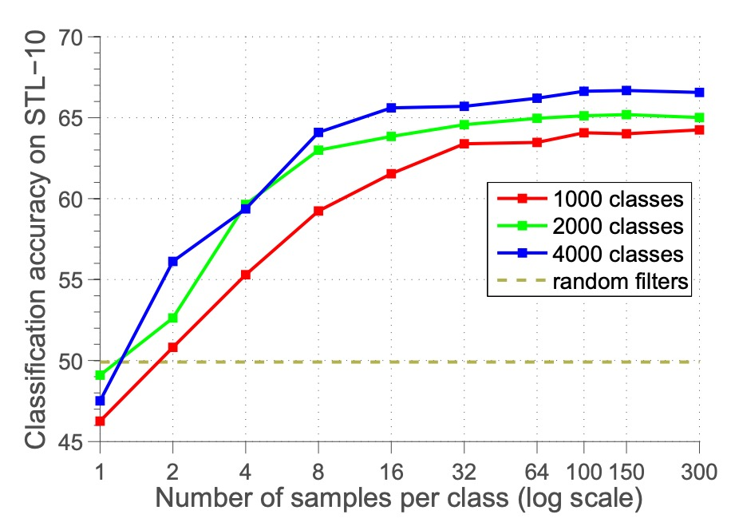
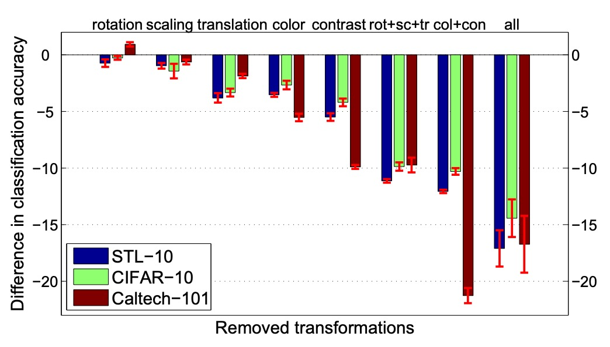

## Finding Invariant Features

[**Discriminative Unsupervised Feature Learning with Exemplar Convolutional Neural Networks**](https://arxiv.org/abs/1406.6909)

---

While reading the paper, I noticed that many studies reference the ideas from this work, so let's take some time to look at it.

The concept of the paper is simple, but many experimental results can inspire us with new ideas.

## Defining the Problem

The advantage of supervised learning is also its drawback: it requires a large amount of labeled data. In some specific application scenarios, such data might be hard to obtain or expensive.

Moreover, if we want to perform transfer learning between different tasks, such as switching from object classification to descriptor matching, the performance of supervised learning might not be ideal.

Since it’s not ideal, a simple idea arises: what if we don’t use data labels?

But if we don't use data labels, how should we train the model?

The authors suggest: we need a proxy task.

## Solving the Problem

The authors propose a training method that does not require manual annotations, called **Exemplar-CNN**.

The core concept is very simple:

1. **Randomly extract image patches**: To focus more on areas with rich object information, image patches of size $32 \times 32$ are sampled from unlabeled images, weighted by the gradient magnitude.

   :::tip
   This is not the gradient from backpropagation, but the gradient of the image. The authors believe that the gradient in the image can help us find more meaningful patches.
   :::

2. **Apply various random transformations to the image patches**: Such as translation, scaling, rotation, color adjustment, contrast adjustment, etc., to generate multiple "deformed versions." These transformations explicitly define the invariances the network should learn (e.g., rotation invariance, color invariance).
3. **Form "proxy categories" and perform discriminative learning**: Each original image patch and its deformed versions are considered as "positive samples" in the same proxy category.

The system repeats this process across many images, generating many proxy categories, and trains a CNN to distinguish "which image patches (including all deformed versions) belong to the same proxy category and which belong to other proxy categories." This way, the model learns to distinguish different image patches and also becomes invariant to "various deformations of the same image."

The list of transformations used in the paper is as follows:

- **Translation**: Translations in the vertical or horizontal direction, not exceeding 20% of the image patch size.
- **Scaling**: Rescale the image patch proportionally, with a scale factor between 0.7 and 1.4.
- **Rotation**: Rotation angle within ±20 degrees.
- **Contrast 1**: Multiply each pixel’s projection in all principal component directions by a factor between 0.5 and 2 (independent for each principal direction, the same for all pixels in the patch).
- **Contrast 2**:
  - Increase the saturation and brightness (S and V components in HSV color space) by a factor between 0.25 and 4.
  - Then multiply by a factor between 0.7 and 1.4, and add an offset between −0.1 and 0.1.
- **Color**: Apply an offset between −0.1 and 0.1 to the hue (H component in HSV color space).

:::tip
In the ablation experiments section, the authors verify the effectiveness of these transformations.
:::

The training data after cropping looks like this (using STL-10 as an example):

<figure style={{"width": "90%"}}>

</figure>

### Experimental Setup

To compare **Exemplar-CNN** with previous unsupervised feature learning methods, the authors performed a series of experiments using the following datasets: STL-10, CIFAR-10, Caltech-101, and Caltech-256.

Details about the datasets, such as the amount of data, number of categories, image sizes, are as follows:

- **Number of categories**:
  - STL-10 and CIFAR-10: 10 categories.
  - Caltech-101: 101 categories.
  - Caltech-256: 256 categories.
- **Image size processing**:
  - CIFAR-10: Adjusted from $32 \times 32$ to $64 \times 64$.
  - Caltech-101: Adjusted to $150 \times 150$.
  - Caltech-256: Adjusted to $256 \times 256$.

Next, the authors designed several network architectures as follows:

- **Small network (64c5-64c5-128f)**:
  - Two convolutional layers (64 filters each).
  - One fully connected layer (128 units).
  - Final Softmax layer.
- **Medium network (64c5-128c5-256c5-512f)**:
  - Three convolutional layers (64, 128, 256 filters).
  - One fully connected layer (512 units).
- **Large network (92c5-256c5-512c5-1024f)**:
  - Three convolutional layers (92, 256, 512 filters).
  - One fully connected layer (1024 units).
- **Convolution and pooling details**:
  - All convolution filters correspond to $5 \times 5$ regions of the input.
  - $2 \times 2$ max pooling is applied after the first two convolutional layers.
- **Other techniques**:
  - Dropout is used in the fully connected layers.
  - Based on the Caffe implementation, training details are in Appendix B.2.

The testing method applies the network to images of any size, computes feature maps, and selects the appropriate pooling method based on the dataset:

- STL-10 and CIFAR-10: Quadrant max pooling (4 values per feature map).
- Caltech-101 and Caltech-256: Three-level spatial pyramid pooling ($1+4+16=21$ values).

Finally, a one-vs-all linear SVM is used for classification.

## Discussion

### Comparison with Other Methods

<figure style={{"width": "90%"}}>

</figure>

The table above compares the performance of **Exemplar-CNN** with other unsupervised feature learning methods on different datasets.

The experimental results show that **Exemplar-CNN** achieves the best performance on all datasets, and its performance on the STL-10 dataset significantly outperforms all previously reported results, even surpassing supervised methods!

### Ablation - Number of Proxy Categories

<figure style={{"width": "70%"}}>

</figure>

The authors first tested the impact of the number of proxy categories on performance.

The experimental design adjusted the number of proxy categories $N$ from 50 to 32,000 and observed changes in classification accuracy.

As shown in the figure above, classification accuracy improves as the number of proxy categories increases, peaking around 8000 categories before stabilizing or declining. The authors believe that having too many categories causes excessive similarity between samples, making it difficult to distinguish them, which reduces classification performance.

:::tip
However, later research suggests that this issue arises because features were not normalized. If the features are normalized, classification performance improves as the number of categories increases.
:::

### Ablation - Number of Samples

<figure style={{"width": "70%"}}>

</figure>

Next, the authors explored the effect of the number of samples per proxy category $K$.

They adjusted $K$ from 1 to 300 and observed changes in classification accuracy.

The results show that accuracy increases as the number of samples per category increases, stabilizing around 100 samples. This suggests that 100 samples are sufficient to approximate the target, and further increasing the number of samples has little impact on optimization.

### Ablation - Type of Image Augmentation

<figure style={{"width": "70%"}}>

</figure>

The authors further explored the effect of different types of image augmentations on performance.

The experimental design fixed the original "seed" samples and adjusted the types of transformations applied to the proxy data, including scaling, rotation, translation, color change, contrast change, and so on.

The results show that translation, color change, and contrast change significantly affect performance, while scaling and rotation have smaller impacts.

### Ablation - Performance in Image Classification

<figure style={{"width": "90%"}}>

</figure>

The table above shows the performance of **Exemplar-CNN** across different datasets.

As the network size increases, classification accuracy generally improves, indicating that larger networks can better learn and leverage data features. The number of proxy categories used for training has a significant impact on the results, suggesting that the selection and generation of proxy data are key in unsupervised learning.

### Filter Visualization

<figure style={{"width": "70%"}}>

</figure>

The figure above shows the filters learned by the first layer of the `64c5-64c5-128f` network during training on proxy data from different datasets, arranged as follows:

- **Top**: Proxy data from the STL-10 dataset.
- **Middle**: Proxy data from the CIFAR-10 dataset.
- **Bottom**: Proxy data from the Caltech-101 dataset.

Analyzing the information presented in the figure, we can observe that the features learned by the model vary based on the dataset:

- The STL-10 dataset, with higher image resolution and diverse objects, tends to have filters that focus on learning fine-grained features (e.g., edges and textures).
- The CIFAR-10 dataset, with lower image resolution, tends to have filters that focus on coarser features, such as color blocks or simple shapes.
- The Caltech-101 dataset, with well-aligned images, leads the filters to learn local features related to specific objects.

Thus, even though the proxy data comes from different datasets, the network is still able to learn effective features for classification or matching.

## Conclusion

This paper presents an unsupervised feature learning method based on a discriminative objective that does not rely on object category labels. The authors generate proxy labels through data augmentation and define the invariances the network must learn via image transformations.

Experimental results demonstrate that **Exemplar-CNN** significantly improves feature learning for classification accuracy, and the discriminative objective offers advantages over previous unsupervised learning objectives.

:::tip
Early comparative studies in contrastive learning often cite this paper. Although there are many areas for improvement, it undoubtedly provided valuable insights for subsequent research and is worth a look.
:::
