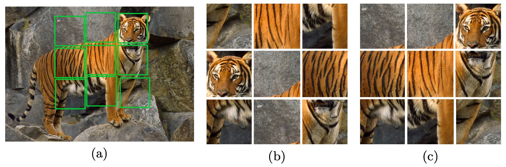
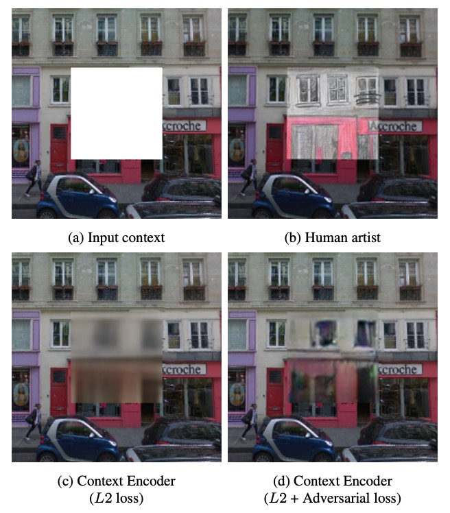
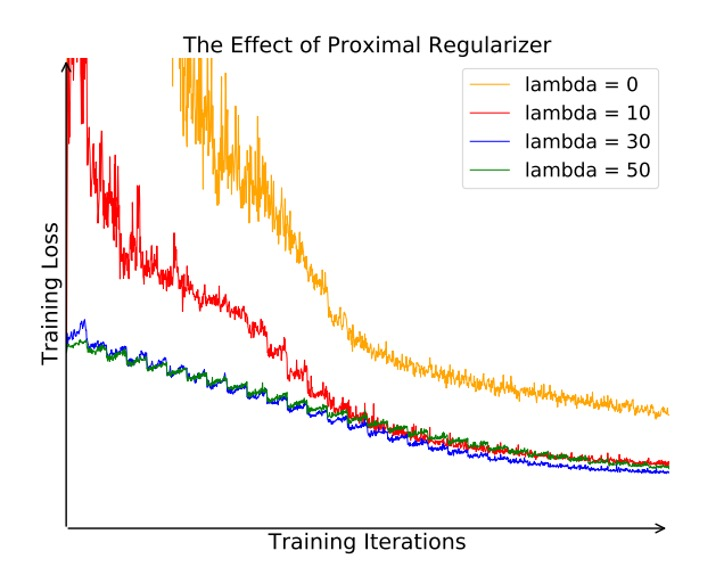

## More is better

[**Unsupervised Feature Learning via Non-Parametric Instance Discrimination**](https://arxiv.org/abs/1805.01978)

---

Seizing a break in development, I quickly dive into some papers related to contrastive learning.

Although I’ve already listened to the master class before, reading through it myself feels more solid.

:::info
Here’s a recommended master class on contrastive learning: [**Contrastive Learning Paper Overview [Paper Reading]**](https://www.youtube.com/watch?v=iIczStGLkss)

The duration is about 90 minutes, covering the basic concepts of contrastive learning, its development history, detailed readings of related papers, and analyses. After watching, you'll have improved for the next 10 years. (?)
:::

Before the concept of contrastive learning became popular, metric learning had already been widely used in the industry. The most well-known application is face recognition, with no exceptions.

The core of metric learning lies in learning feature representations $F$, which establish a measure between samples $x$ and $y$:

$$
d_F(x, y)=\|F(x)-F(y)\|
$$

Once the model is trained, it can only make inferences based on the features it has learned, without the use of a linear classifier.

:::tip
For classic papers on metric learning, refer to:

- [**[18.01] ArcFace: Additive Angular Margin Loss**](../../face-recognition/1801-arcface/index.md)
- [**[18.01] CosFace: Large Margin Cosine Loss**](../../face-recognition/1801-cosface/index.md)

During the research process, it was found that normalization—projecting feature vectors uniformly onto a hypersphere—is a key step that can improve model performance.
:::

## Defining the Problem

However, what metric learning discusses is "class-level" learning, meaning we must know which class each image belongs to in order to perform metric learning.

Metric learning is inherently supervised learning, but in real-world applications, we typically only have large amounts of "unlabeled" data, making it difficult to apply metric learning in such scenarios.

Thus, researchers have come up with various solutions:

### Generative Models

The concept of generative models is also quite appealing. By building an encoder and decoder, it transforms an image into a hidden feature representation and then reconstructs the image from that representation. Common models include Autoencoders, GANs, VAEs, etc.

The advantage is that no labels are required; as long as images are available, training can begin. However, the downside is the high computational cost. As the resolution of the reconstructed image increases, the computational load grows exponentially.

Moreover, generative models rely on the distribution of data, making them less generalizable, and in some cases, they may even experience model collapse.

### Self-Supervised Structural Learning

Self-supervised learning leverages the internal structure of the data to create a prediction task and then trains the model.

Let’s look at some interesting examples:

- **Context Prediction**

  - [**[15.05] Unsupervised Visual Representation Learning by Context Prediction**](https://arxiv.org/abs/1505.05192)

      

      <figure style={{"width": "60%"}}>
      
      </figure>
      

- **Color Restoration of Grayscale Images**

  - [**[16.03] Colorful Image Colorization**](https://arxiv.org/abs/1603.08511)

      

      <figure style={{"width": "80%"}}>
      
      </figure>
      

- **Jigsaw Puzzle Solving Task**

  - [**[16.03] Unsupervised Learning of Visual Representations by Solving Jigsaw Puzzles**](https://arxiv.org/abs/1603.09246)

      

      <figure style={{"width": "80%"}}>
      
      </figure>
      

- **Filling In Missing Parts of an Image**

  - [**[16.04] Context Encoders: Feature Learning by Inpainting**](https://arxiv.org/abs/1604.07379)

      

      <figure style={{"width": "50%"}}>
      
      </figure>
      

- **Counting Objects**

  - [**[17.08] Representation Learning by Learning to Count**](https://arxiv.org/abs/1708.06734)

      

      <figure style={{"width": "70%"}}>
      
      </figure>
      

---

After seeing so many proxy tasks, they all seem reasonable, but we cannot explain why these tasks help semantic recognition, nor can we determine the best self-supervised task.

Since there’s no consensus, let’s create one. Inspired by metric learning, the authors propose a novel feature learning training method, aiming to work without artificial labels.

## Solving the Problem

To obtain a "good" feature representation, the authors adopt an "instance-level discrimination" strategy: treating each image as an independent "class" and training a classifier to determine whether each image belongs to its own "class."

Let’s take a look at the model architecture.

### Model Architecture

As shown in the diagram above, on the left is a deep convolutional neural network labeled "**Backbone CNN**." Its function is to transform the input image $x$ (e.g., a 224$\times$224 image) into higher-level semantic features. For common CNN networks, this might involve several layers of convolution, batch normalization, pooling, and other operations. The final layer typically outputs a high-dimensional vector, which serves as the "visual feature representation."

The high-level features output from the Backbone CNN are usually still of large dimensionality (e.g., 2048 dimensions). To run efficiently with large datasets, more compressed and abstract feature descriptions are needed, so the authors add a "**Projection Head**" to project the CNN output vector into a **128-dimensional** vector space.

After projection, the 128-dimensional vector is then subjected to **L2 Normalization ($\|\mathbf{v}\|_2 = 1$)**, which means each sample is constrained to unit length. This is especially useful when computing similarity because, at this point, the dot product $\mathbf{v}_i^T \mathbf{v}_j$ represents the cosine of the angle between the two vectors on the hypersphere, with values ranging from $[-1, 1]$. This makes the calculation more intuitive and stable.

### The Problem with Traditional Classifiers

In traditional Softmax classification models, each class $j$ corresponds to a weight vector $\mathbf{w}_j$. Suppose we have $n$ images (equivalent to $n$ "classes"), with corresponding weight vectors $\mathbf{w}_1, \mathbf{w}_2, \dots, \mathbf{w}_n$. For a given image $x$, the feature vector produced by the neural network is $\mathbf{v} = f_\theta(x)$. The conditional probability of the image being classified as the $i$-th image (i.e., the $i$-th "class") can be written as:

$$
P(i \mid \mathbf{v}) \;=\; \frac{\exp(\mathbf{w}_i^T \mathbf{v})}{\sum_{j=1}^{n} \exp(\mathbf{w}_j^T \mathbf{v})}
$$

In this equation, $\mathbf{w}_i^T \mathbf{v}$ is used to measure the alignment between the feature $\mathbf{v}$ and class $i$; the denominator is the sum of the exponentiated values of all class comparisons (from 1 to $n$), ensuring that the total probability across all classes sums to 1.

In typical classification problems, the number of classes is fixed and not too large, so this parameterized Softmax is commonly used. However, here, since "each image" is treated as a new class, the number of classes can be enormous (tens of thousands, millions, or more). As a result, each class requires an independent weight vector $\mathbf{w}_j$, which not only requires significant storage space but also results in high computational costs.

Simply put, it becomes too computationally expensive.

### Non-Parametric Classifier

To address the above problem, the authors propose a "non-parametric" approach:

- **Replace the formula's $\mathbf{w}_j$ with the feature vector $\mathbf{v}_j$ stored in a memory bank.**

In other words, the "class weight" for the $j$-th image is no longer an independent $\mathbf{w}_j$, but instead, it directly uses the feature vector $\mathbf{v}_j$ of the $j$-th image itself. Additionally, the authors enforce normalization of these feature vectors to unit vectors (i.e., length 1) for ease of similarity calculation.

Thus, the Softmax formula can be rewritten as:

$$
P(i \mid \mathbf{v})
= \frac{\exp\!\bigl(\mathbf{v}_i^T \mathbf{v} / \tau\bigr)}{\sum_{j=1}^{n} \exp\!\bigl(\mathbf{v}_j^T \mathbf{v} / \tau\bigr)}
$$

Here, $\tau$ is the "temperature parameter," which can adjust the "sharpness" of the Softmax distribution; $\mathbf{v}$ is the feature vector of the current image $x$ produced by forward propagation; $\mathbf{v}_i$ is the feature vector of the $i$-th image stored in the "memory bank" (also a unit vector), and $\mathbf{v}_i^T \mathbf{v}$ is the dot product of the two unit vectors, ranging from -1 to 1, which represents their similarity.

:::tip
Originally, $\mathbf{w}_i$ is a learnable parameter, serving as the "anchor" for each class. The greater the inner product between the feature and the anchor, the higher the classification probability, making the model more likely to classify the input feature as that class.

Here, the authors forgo the $\mathbf{w}_i$ and instead directly use the "feature $\mathbf{v}_i$" of the data itself as the comparison object. This eliminates the need to learn a separate $\mathbf{w}_i$ for each possible image class, helping to reduce computational costs.

This leads to the next question: Since the classification anchors are not fixed but rather drift around as training progresses, how can the model ensure their stability?

We will discuss this shortly; let’s first continue with the rest of the architecture.
:::

### Memory Bank

The training objective for the non-parametric softmax is similar to that of typical classification problems: to maximize the probability of each training image being "correctly identified as itself," or equivalently, to minimize the negative log-likelihood over the entire training set:

$$
J(\theta)
= - \sum_{i=1}^{n} \log P\bigl(i \mid f_\theta(x_i)\bigr)
$$

Here, $f_\theta(x_i)$ is denoted as $\mathbf{f}_i$. When computing $P(i \mid \mathbf{f}_i)$, theoretically, the features of all images $\{\mathbf{v}_j\}$ are needed. However, if every backpropagation requires passing all images through the neural network, the computational cost would be very high.

Thus, in practice, the authors maintain a "Memory Bank" ($\mathbf{V} = \{\mathbf{v}_j\}$) to store the features of all images, and after each training iteration, the corresponding entry for each image in this Memory Bank is updated using the feature $\mathbf{f}_i$ from the forward pass.

Since each image has a corresponding position in memory, the previous features can be quickly retrieved to reduce computational cost when dealing with large datasets. If the total number of images $n$ is large, calculating the denominator $\sum_{j=1}^{n} \exp(\mathbf{v}_j^T \mathbf{v} / \tau)$ would be prohibitively expensive. For every image, this computation would be $O(n)$, and when $n$ reaches millions or more, it becomes almost unmanageable.

### Noise-Contrastive Estimation

The core idea of NCE is:

1. **Transform a multi-class classification problem into multiple binary classification problems.**
2. The goal of the binary classification: distinguish between "real data samples" and "noise samples."

In the multi-class scenario, each image is treated as a "class." With NCE, for a given image, we only need to distinguish "whether it is this image" versus "not this image (noise)."

The approach is to treat "other images" as noise, or sample negative examples from a noise distribution ($P_n$), and let the model learn to differentiate between positive and negative examples.

For example, to calculate the "probability that feature $\mathbf{v}$ comes from the $i$-th image," we can write:

$$
P(i \mid \mathbf{v}) = \frac{\exp(\mathbf{v}^T \mathbf{f}_i/\tau)}{Z_i}
$$

Where:

$$
Z_i = \sum_{j=1}^n \exp\bigl(\mathbf{v}_j^T \mathbf{f}_i/\tau\bigr)
$$

- $\mathbf{f}_i$ is the feature corresponding to the $i$-th image (stored in the memory bank), and $\mathbf{v}$ is the feature of some other image.
- $Z_i$ is the "normalizing constant" to ensure that the probabilities for all $i$ sum to 1.
- If $n$ is large, calculating $Z_i$ requires traversing all $j = 1, 2, \dots, n$, which is computationally expensive.

The cleverness of NCE is that, in the case of "a large number of possible classes," it does not directly compute the full denominator of the formula. Instead, it separates the "positive sample" corresponding to the "class $i$" and the "negative sample" corresponding to the "noise distribution."

:::tip
In other words: anything that is not like me is a negative sample, so just pick a small batch to compute.
:::

Let the noise distribution $P_n$ be **uniform** ($P_n(i) = \frac{1}{n}$).

The paper introduces a hyperparameter $m$, which represents that "there are $m$ times more noise samples than real samples," and then defines a "posterior probability":

$$
h(i, \mathbf{v}) := P(D=1 \mid i, \mathbf{v})= \frac{P(i \mid \mathbf{v})}{P(i \mid \mathbf{v}) + m P_n(i)}
$$

The meaning of $h(\cdot)$ is that, given feature $\mathbf{v}$ and class $i$, it is the probability that "$\mathbf{v}$ comes from the $i$-th image (real data), rather than from noise." $P(i \mid \mathbf{v})$ is the output of the above formula, and $m P_n(i)$ is the relative probability of selecting a noise sample corresponding to class $i$.

The next key point is:

1. **Take the negative log-likelihood for positive samples** (positive samples are correctly classified as positive).
2. **Take the negative log-likelihood for negative samples** (negative samples are correctly classified as negative).

:::tip
It might seem like empty talk, but many people zone out when they see "calculating negative log-likelihood." Actually, it just means: calculate the probabilities for positive and negative samples separately, then add them together.
:::

Thus, we have:

$$
J_{\text{NCE}}(\theta)
= - \mathbb{E}_{P_d}\bigl[\log h(i, \mathbf{v})\bigr]
  \;-\; m \,\mathbb{E}_{P_n}\bigl[\log \bigl(1 - h(i, \mathbf{v}')\bigr)\bigr]
$$

- Where $P_d$ represents the "real data distribution," i.e., the actual images (positive examples).
- $P_n$ represents the "noise distribution," i.e., the noise samples (negative examples).
- $\mathbf{v}$ and $\mathbf{v}'$ are feature vectors retrieved from the Memory Bank ($\mathbf{V}$); one corresponds to the "positive sample" ($x_i$), and the other is a randomly selected noise sample.

Intuitively, a larger $\log h(i, \mathbf{v})$ means the model is more confident that "$\mathbf{v}$ belongs to the $i$-th image" (good); whereas a larger $\log(1 - h(\cdot))$ means the model correctly rejects the noise.

### Approximation of $Z_i$

Although we have discussed many aspects, the biggest challenge remains unsolved.

We still need to calculate $Z_i$, which involves $\sum_{j=1}^{n} \exp(\mathbf{v}_j^T \mathbf{f}_i/\tau)$, and when $n$ is large, this is still a bottleneck.

A common approach in NCE is to treat $Z_i$ as a "constant" for estimation or approximation, and not involve it in gradient updates. In this paper, the authors refer to the following work:

- [**Learning word embeddings efficiently with noise-contrastive estimation**](https://www.cs.toronto.edu/~amnih/papers/wordreps.pdf)

They use Monte Carlo approximation to estimate:

$$
Z
\simeq Z_i
\simeq n \,\mathbb{E}_{j \in \text{subset}}
\bigl[\exp(\mathbf{v}_j^T \mathbf{f}_i / \tau)\bigr]
= \frac{n}{m} \sum_{k=1}^{m}
\exp\bigl(\mathbf{v}_{j_k}^T \mathbf{f}_i / \tau\bigr)
$$

Here, $\{j_k\}$ is a set of randomly selected indices used to approximate the average value of the entire set.

Instead of summing all $n$ terms to calculate $Z_i$, now we only sample $m$ negative examples, perform the exponential operation on them, sum them up, and then multiply by the factor $\frac{n}{m}$ to approximate the overall mean.

The paper also mentions that experimentally, a good estimate can be obtained with just a few batches early in training, and this estimate can be fixed for the remainder of the training, which works well.

### Proximal Regularization

:::info
Reference: [**Proximal Algorithms**](https://web.stanford.edu/~boyd/papers/pdf/prox_algs.pdf)
:::

:::tip
Earlier, we asked: If classification anchors are not fixed but shift during training, how can the model ensure their stability?
:::

Unlike typical classification problems, here each "class" only has "one training sample." In each training epoch, each class is only sampled once, which can lead to large oscillations in the learning process. For example, if one image happens to be overfitted or shifted by the model, a large gradient update may occur the next time it is encountered, causing significant fluctuations in the overall training objective.

To mitigate this instability caused by random sampling, the authors introduce the concept of **Proximal Regularization**. By adding a **smoothness constraint** to the loss function, they ensure that the feature vector does not differ too much from the previous iteration. This helps stabilize training and accelerate convergence.

Specifically, we assume two variables:

- **Current iteration (iteration $t$)**: For training data $x_i$, compute the feature vector $\mathbf{v}_i^{(t)} = f_\theta(x_i)$.
- **Memory Bank**: Stores the feature vector from the previous iteration (iteration $t-1$), denoted as $\mathbf{v}_i^{(t-1)}$.

In the original NCE loss, an additional term $\lambda \|\mathbf{v}_i^{(t)} - \mathbf{v}_i^{(t-1)}\|^2$ is added.

Thus, the objective function becomes:

$$
- \log h\bigl(i, \mathbf{v}_i^{(t-1)}\bigr)
\;+\; \lambda \,\bigl\|\mathbf{v}_i^{(t)} - \mathbf{v}_i^{(t-1)}\bigr\|_2^2
$$

- The first term ($- \log h(i, \mathbf{v}_i^{(t-1)})$) is the original positive example loss in NCE.
- The second term ($\lambda \|\mathbf{v}_i^{(t)} - \mathbf{v}_i^{(t-1)}\|^2$) encourages the new feature $\mathbf{v}_i^{(t)}$ not to differ too much from the previous iteration's $\mathbf{v}_i^{(t-1)}$.

Through this **proximal term**, if the feature vector changes too drastically during each update, it will be penalized. As training progresses and the model converges, the ideal scenario is $\mathbf{v}_i^{(t)} \approx \mathbf{v}_i^{(t-1)}$, and the penalty term gradually diminishes, eventually returning to the original objective function.

After incorporating this, the authors present the final objective function with **Proximal Regularization**:

$$
J_{\text{NCE}}(\theta)
$$

$$
= - \mathbb{E}_{P_d}
  \Bigl[
    \log h\bigl(i, \mathbf{v}_i^{(t-1)}\bigr)
    \;-\; \lambda \,\bigl\|\mathbf{v}_i^{(t)} - \mathbf{v}_i^{(t-1)}\bigr\|^2
  \Bigr]
  \;-\; m \,\mathbb{E}_{P_n}
  \Bigl[
    \log\bigl(1 - h\bigl(i, \mathbf{v}'^{(t-1)}\bigr)\bigr)
  \Bigr].
$$

This version retains the original NCE components for "positive example $\log h(\cdot)$" and "negative example $\log(1 - h(\cdot))$" while adding the term $- \lambda \|\mathbf{v}_i^{(t)} - \mathbf{v}_i^{(t-1)}\|^2$ to suppress drastic changes in feature vectors.

To verify the effectiveness of Proximal Regularization, the authors compare the impact of different $\lambda$ values (such as 0, 10, 30, 50) on training:

<figure style={{"width": "70%"}}>

</figure>

As shown in the figure above, when $\lambda = 0$ (i.e., no proximal term), the original objective function oscillates significantly during training and converges more slowly. With an appropriately sized $\lambda$, the objective function smooths out, converges faster, and ultimately learns better feature representations.

## Discussion

### Parametric vs Non-Parametric Softmax

<figure style={{"width": "70%"}}>

</figure>

Since the core of this paper is the "non-parametric Softmax," the authors first conducted an experiment on CIFAR-10 to compare the performance of "parametric Softmax" and "non-parametric Softmax."

Since the CIFAR-10 dataset is relatively small, the non-parametric Softmax denominator can be directly computed, allowing a direct comparison of the two approaches. The evaluation methods used were Linear SVM and k-NN classifiers, applied to "parametric" and "non-parametric" features, and their accuracy rates were compared.

The results, shown in the table above, reveal that the parametric Softmax achieved accuracy rates of 60.3% for SVM and 63.0% for k-NN, while the non-parametric Softmax achieved 75.4% and 80.8%, respectively. This demonstrates a significant improvement in performance with the non-parametric Softmax, validating the authors' approach.

Additionally, the authors explored the effects of using NCE approximation in the non-parametric setting, as shown in the table. The hyperparameter $m$ in NCE indicates how many negative samples are drawn for each positive sample:

- When $m = 1$ (only 1 negative sample), the k-NN accuracy dropped drastically to 42.5%, indicating excessive approximation (too few negative examples).
- As $m$ increases, the accuracy gradually rises. When $m = 4,096$, the results were close to the "full version" ($m = 49,999$), suggesting that with enough negative samples, NCE can closely approximate the complete non-parametric Softmax.

### Performance in Image Classification Tasks

The authors then conducted larger-scale experiments on ImageNet to compare the performance of different methods across various network architectures.

The experimental setup was as follows:

- **Dataset**: ImageNet, approximately 1.28 million images, 1,000 categories.
- **Temperature parameter $\tau$**: Set to 0.07.
- **NCE negative samples $m$**: 4,096. The authors balanced "computational cost" and "feature quality."
- **Training**:
  - Trained for 200 epochs using Momentum SGD.
  - Batch size = 256.
  - Initial learning rate of 0.03, maintained for the first 120 epochs, then decayed every 40 epochs by a factor of 0.1.

The authors listed several representative unsupervised (or self-supervised) learning methods, including:

- **Random initialization** (random initialization, as a lower bound).
- **Self-supervised**
- **Adversarial learning**
- **Exemplar CNN**
- **Split-brain autoencoder**: One of the recent self-supervised benchmark methods.

For fair comparison, the authors used multiple common architectures: AlexNet, VGG16, ResNet-18, and ResNet-50. Since network depth significantly influences results, they specifically compared the differences between "same method, different depth."

The evaluation methods were as follows:

1. **Linear SVM (conv1 ~ conv5)**: Trained a linear classifier on the intermediate features from different convolutional layers (such as conv1, conv2, conv3, ...) and tested the classification performance on the ImageNet validation set.
2. **k-NN (final 128-dimensional output)**: Directly applied nearest neighbor classification on the final 128-dimensional feature output.

The experimental results are shown in the table below:

<figure style={{"width": "70%"}}>

</figure>

The authors' method achieved a top-1 accuracy of 35.6% in conv1 ~ conv5, outperforming previous methods, including Split-brain.

Next, when attempting deeper networks such as ResNet-50, the accuracy reached 54.0%, while Exemplar CNN, even using the deeper ResNet-101, only achieved 31.5%. This demonstrates that the authors' method achieves significant improvements as the network depth increases.

The k-NN classification results were close to those of the linear classifier (conv5), indicating that the final 128-dimensional features formed a good metric space. Moreover, the deeper the layer (such as conv4, conv5), the better the results, indicating the authors' method excels in extracting high-level features.

Finally, in terms of efficiency, many methods have features with more than 10,000 dimensions at the optimal layer (such as conv3, conv4), which are not friendly for storage and computation. In contrast, the authors' method only requires 128 dimensions for the final output, making it highly compact. Storing all features for the full ImageNet dataset (1.28 million images) takes only about 600 MB, and nearest neighbor retrieval on a Titan X GPU takes less than 20 ms.

### Cross-Dataset Generalization

<figure style={{"width": "70%"}}>

</figure>

The authors then tested the features learned on ImageNet, **directly** applied to another large dataset, Places (2.45 million images, 205 categories), without fine-tuning, only feature extraction, and then trained a linear classifier or performed k-NN on Places.

The experimental results are shown in the table above. The method achieved accuracy rates of 45.5% and 41.6% on linear classification and k-NN for ResNet-50, outperforming other methods (such as Exemplar CNN, Split-brain, etc.).

These results demonstrate that the features learned on ImageNet can maintain good performance even in different domains (scene classification), showing the method's **cross-domain generalization ability**.

### Ablation Experiment - Feature Dimension

<figure style={{"width": "70%"}}>

</figure>

After confirming that the model architecture is effective, the authors conducted some ablation experiments.

The first explores the impact of feature dimension. The authors compared feature dimensions of 32, 64, 128, and 256, with results shown in the table above.

The experiments show that performance significantly improves when the dimension increases from 32 to 128. However, the improvement from 128 to 256 saturates, meaning that 128 dimensions already provide sufficient representation power. While increasing the dimension further may bring slight benefits, it is not as significant as the earlier increase.

### Ablation Experiment - Training Set Size

<figure style={{"width": "70%"}}>

</figure>

Next, the authors explored the impact of "training set size" on model performance. The experimental setup was as follows:

- **ImageNet training set**: Used 10%, 50%, and 100% of the images as the training set.
- **Validation set**: The complete ImageNet validation set was used for testing the model.

The experimental results are shown in the table above. As the training set size increases, the model performance continues to improve. This shows that the method effectively utilizes more unlabeled data to improve feature quality, and performs better with larger training sets.

:::tip
This result is very appealing because it means that as long as we keep extracting more unlabeled data, this method can continually benefit and learn stronger features.
:::

### Visualization Analysis

<figure style={{"width": "90%"}}>

</figure>

Finally, the authors presented some feature visualization results, which demonstrate the "image search by image" functionality. By comparing image features, the model finds the closest images to the "query."

The experimental results are shown in the figure above:

- **Best case (top four rows)**: The top 10 retrieved images are all from the same category as the query image (indicating that the model's metric space is extremely precise).
- **Worst case (bottom four rows)**: The top 10 images are not from the same "real class," but are visually or shape-wise very similar. For example, although they belong to different species or categories, they look similar (e.g., having the same black-and-white stripes or similar shapes and backgrounds).

The authors point out that even in "failure cases," visually similar images can still be retrieved, which proves that the "instance-level" embedding space truly captures visual features, rather than just random correspondences.

## Conclusion

The paper also includes experiments applied to "semi-supervised classification" and "object detection," but we won't go into detail here. Interested readers can refer to the original paper.

Overall, these experiments thoroughly validate the versatility and scalability of the authors' approach: it is effective not only for classification and retrieval but also demonstrates good generalization across different network architectures, data scales, and downstream tasks (semi-supervised classification, detection).

After the paper's release, the unsupervised learning framework based on NCE loss quickly achieved impressive results on large-scale datasets and demonstrated strong performance in practical applications.

There are still several classic papers to follow up on, so let’s continue reading.
