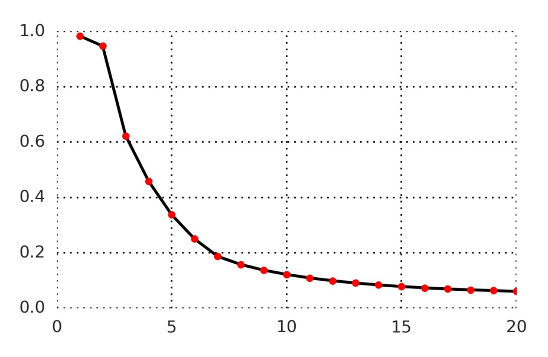
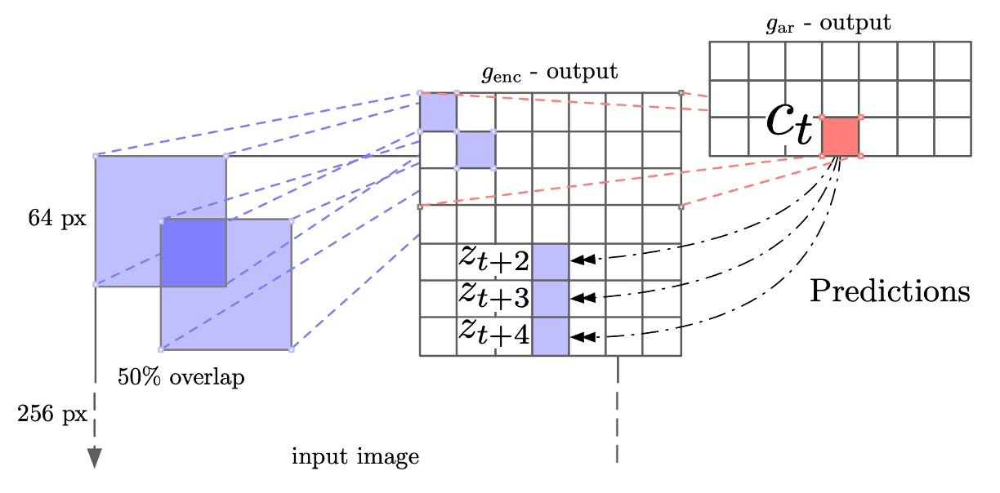

## Today shapes tomorrow

[**Representation Learning with Contrastive Predictive Coding**](https://arxiv.org/abs/1807.03748)

---

When dealing with complex, high-dimensional data, we often encounter a profound question:

> Which features are truly "important"? Which ones are "insignificant"?

In supervised tasks, in order to minimize the loss function on the training set, the model will often, without our notice, fit some irrelevant features—such as noise, camera angle biases, recording device characteristics, or the habits of the annotators.

In the short term, the model's performance on the training set improves, and it may even perform well on the test set. However, when deployed in a real environment or faced with unseen data, the model may lose the "overfitted" features it previously relied on, significantly diminishing its ability to generalize.

## Defining the Problem

At this time, generative models are a very popular unsupervised learning approach. The goal of these models is to learn the joint distribution of the data $p(x)$ and generate new samples via a generative model $p(x \mid z)$.

At first glance, this seems fine, but consider this:

When performing image classification, even if we only predict the next pixel, the entire network must capture all the information in the image, whether or not that information is truly critical—because only an identical reconstruction will avoid penalizing the model.

This is a classic case of wasting computational resources.

The so-called "higher-order abstract" information in speech data might include the speaker’s gender, pitch variation, speech rate, and style. In image data, it might be object shapes, spatial relationships, or styles.

The authors argue that we should focus on: which features should be selected to reproduce the original form at the next moment (or later moments).

- **The key lies in "prediction" not "reconstruction."**

As long as we can identify the key factors that determine future directions, we can obtain highly relevant information between the "latent representations of the past" and the "features of the future."

> Instead of realistically "reproducing" the future, it is better to "extract" the higher-order semantics shared between the present and future.

Isn't this what people have been discussing for thousands of years?

## Solving the Problem

### Model Architecture

<figure style={{"width": "90%"}}>

</figure>

To solve the problem, the authors propose the Contrastive Predictive Coding (CPC) framework.

The overall architecture is shown in the figure above. We can look at it step by step:

1. **Encoder $g_{\text{enc}}$**

   The first step is to transform the raw input sequence $\{x_t\}$ (which could be feature vectors of each position in an image or every moment of a segmented audio signal) through a "non-linear encoder" $g_{\text{enc}}$ to obtain a latent representation $\{z_t\}$:

   $$
   z_t \;=\; g_{\text{enc}}(x_t).
   $$

   The purpose of this step is to compress the high-dimensional input into a more concise or abstract representation space, often achieved through convolutional networks (for images or sounds) or other neural network architectures.

2. **Autoregressive model $g_{\text{ar}}$**

   Next, an autoregressive model $g_{\text{ar}}$ (such as GRU, LSTM, or another form of RNN) is used to read the time sequence $\{z_1, z_2, \ldots, z_t\}$ and generate a "context representation" $c_t$:

   $$
   c_t \;=\; g_{\text{ar}}(z_{\le t}) \;=\; g_{\text{ar}}(z_1, z_2, \ldots, z_t).
   $$

   $c_t$ can be seen as the hidden state "the model uses to predict the future after time $t$," containing all the information of the $z$'s up to that point.

3. **Prediction for the Future: Estimating the "Density Ratio" Rather than Direct Generation**

   As mentioned earlier, the goal of CPC is to predict future features $x_{t+k}$ given the context $c_t$.

   However, CPC does not directly model $p(x_{t+k} \mid c_t)$ (generating the entire $x$), but instead learns a density ratio:

   $$
   f_k(x_{t+k}, c_t) \;\;\propto\;\; \frac{p(x_{t+k} \mid c_t)}{p(x_{t+k})}.
   $$

   This ratio represents the likelihood of observing $x_{t+k}$ given context $c_t$, relative to the likelihood of observing $x_{t+k}$ without any context.

   The authors provide a simple implementation using a log-bilinear form:

   $$
   f_k(x_{t+k}, c_t) \;=\; \exp\bigl( z_{t+k}^\mathsf{T} \, W_k \, c_t \bigr),
   $$

   where $z_{t+k}$ is the representation of $x_{t+k}$ after passing through the encoder, and $W_k$ is a learnable linear transformation. Different $W_k$ can be used for the future $k$-th time step.

---

Here, directly generating high-dimensional data (e.g., images or speech) requires complex models; however, the goal is simply to use "information related to the context." In other words, the model doesn't need to reproduce all the background noise, only to perform contrastive recognition or differentiation of the captured abstract features.

In practice, the learned representations $z_t$ or $c_t$ from this framework can be used for downstream tasks.

If more "historical context" is needed (e.g., for speech recognition, which requires capturing longer speech segments), use $c_t$. If the task can be handled immediately (e.g., some localized recognition), $z_t$ may suffice. Pooling across the entire image or sequence can also be used to obtain an overall representation.

### InfoNCE

Next, let's look at the loss function used by the authors: **InfoNCE**.

Explaining InfoNCE directly might catch you off guard, so let’s begin with the simple cross-entropy.

In binary classification, our goal is to make the model’s probability for the positive class as close to 1 as possible, and the probability for the negative class as close to 0 as possible. This can be written as the "cross-entropy loss":

$$
\mathrm{CE} = - \Bigl[\, y \log(\hat{y}) \;+\; (1-y)\log(1-\hat{y}) \Bigr]
$$

- If $y=1$ (positive class), the loss becomes $-\log(\hat{y})$.
- If $y=0$ (negative class), the loss becomes $-\log(1-\hat{y})$.

Cross-entropy here plays the role of "forcing the model to output the correct probabilities." If we treat the "positive sample" as class 1 and the "negative sample" as class 0, we can train using cross-entropy.

For $K$ classes, each input $x$ corresponds to one of the classes $k$.

The model outputs a score $\{s_1(x), \dots, s_K(x)\}$ for each class, and we convert this into probabilities $\hat{y}_k$ using softmax:

$$
\hat{y}_k = \frac{\exp(s_k(x))}{\sum_{j=1}^K \exp(s_j(x))}.
$$

If the true label is "class $i$", the entire cross-entropy loss becomes

$$
\mathrm{CE}
\;=\;
-\, \log \Bigl(\hat{y}_i\Bigr)
\;=\;
-\, \log \biggl(
    \frac{\exp(s_i(x))}{\sum_{j=1}^K \exp(s_j(x))}
\biggr).
$$

In other words, we want to **maximize** $\exp(s_i(x))$ while **minimizing** the other $\exp(s_j(x))$ ($j \neq i$) to ensure the "correct class" has the highest probability.

In **contrastive learning**, we often encounter the situation:

> In a batch of samples, only one corresponds to your condition/context, and the others are either "mismatched" or pure "noise."

For example, out of $N$ samples, only 1 sample is positive, and the remaining $N-1$ are negative. We want to use the **same cross-entropy** to "select which one is the positive sample."

At this point, multiclass classification with $K = N$: each sample corresponds to a "class ID."

- The "positive sample" is class 1 (or a specific label),
- The remaining $N-1$ samples are assigned to classes 2, 3, ..., N.

However, in practice, we don't actually treat each negative sample as a "different class"; instead, we treat "which sample is the positive one" as a **one-vs-many** problem.

InfoNCE uses multiclass cross-entropy to perform the "positive vs. negative" contrast.

In the paper, the loss for InfoNCE is defined as follows (for a batch):

$$
L_N
=
-\, \mathbb{E}_{X} \Biggl[
    \log \frac{ f_k(x_{\text{pos}}, c) }
               { \sum_{x_j \in X} f_k(x_j, c) }
\Biggr]
$$

Where:

- $X = \{x_1, x_2, ..., x_N\}$ includes 1 **positive sample** $x_{\text{pos}}$ (which truly matches the context $c$), and $N-1$ **negative samples**.
- $f_k(x, c)$ is the scoring function, which can be thought of like the previous "$s_i(x)$ and $\exp(\cdot)$" expression.

In this multiclass classification problem, the $N$ candidate samples correspond to "N classes," with the positive sample being the "correct class" and the negative samples being the "incorrect classes."

The name InfoNCE comes from the fact that the authors further prove:

- **Minimizing** this contrastive cross-entropy ($L_N$)
- **Is equivalent to** "maximizing" the **lower bound** of the mutual information between the context $c$ and the target sample $x_{\text{pos}}$.

In other words, when we use this contrastive method to differentiate between "positive vs. negative samples," the model is forced to learn the "shared information between the context and the positive sample."

- Mathematically, it can be proven that: $I(x, c) \ge \log(N) - L_N$.
- The larger $N$ becomes, the tighter this lower bound becomes.

:::tip
**How does it differ from the original NCE?**

**NCE (Noise Contrastive Estimation)** was earlier used to estimate the "density ratio of a target distribution $p(x)$ to a noise distribution $q(x)$"; it’s commonly used in word vectors, word probability distributions, etc., aiming to reduce the difficult-to-compute normalization constant.

**InfoNCE** specifically focuses on "contrastive learning" and "maximizing mutual information." Its mathematical form still uses cross-entropy, but it emphasizes "which $x$ is the positive sample given context $c$," and can be proven to maximize the lower bound of mutual information.

Looking purely at the mathematical form, InfoNCE can also be considered a "variant of NCE," but it is applied in the context of "contrastive self-supervised learning" and "maximizing mutual information."
:::

## Discussion

The authors applied the CPC method to four different domains:

1. **Speech**
2. **Images**
3. **Natural Language**
4. **Reinforcement Learning**

The authors explored how much distinguishable information the model learned through "linear classification" or qualitative evaluations. In reinforcement learning, they incorporated the CPC auxiliary loss function into the agent model to observe improvements in convergence speed.

However, due to space constraints, we will only look at the results of CPC in the speech and image domains. For the other domains, readers are encouraged to refer to the original paper.

### Speech Recognition

In the speech domain, the authors used a 100-hour subset from the publicly available LibriSpeech dataset. Although the dataset primarily provides raw speech and transcribed text, the authors used the Kaldi toolkit and its pretrained model on LibriSpeech to generate corresponding "phoneme sequence" labels.

The authors have uploaded the aligned phone labels and their training/test split to Google Drive for easy reproduction of the experiments. The dataset contains 251 different speakers.

:::tip
Interested readers can download the data here: [**CPC Phone Labels**](https://drive.google.com/drive/folders/1BhJ2umKH3whguxMwifaKtSra0TgAbtfb)
:::

The model architecture, as described earlier, uses a 5-layer convolutional network as the encoder, with each layer's stride and filter size being $[5, 4, 2, 2, 2]$ and $[10, 8, 4, 4, 4]$, respectively. Each layer has 512 hidden units, and the ReLU activation function is used.

In the autoregressive model, the authors used a GRU with a hidden layer dimension of 256. During training, the Adam optimizer was used with a learning rate of $2 \times 10^{-4}$, and the training was conducted on 8 GPUs.

The figure below shows the prediction accuracy from 1 to 20 time steps:

<figure style={{"width": "60%"}}>

</figure>

Overall, predicting further into the future (e.g., t+20) becomes more challenging, and the model’s score for the positive sample becomes harder to maintain above all negative samples. However, this also demonstrates that the contrastive task is neither too easy (meaning the model must truly learn higher-level features) nor impossible (it can still achieve a reasonable level of distinction).

To better understand the representations learned by CPC, after training, the authors extracted the GRU outputs (i.e., $c_t$, 256 dimensions) and used this vector as a feature to perform **linear classification** for multiclass recognition across the entire dataset.

The results are shown in the table below:

<figure style={{"width": "60%"}}>

</figure>

The terms in the table represent:

- **Random initialization**: A linear classifier initialized randomly.
- **MFCC**: Traditional speech features (Mel-frequency cepstral coefficients) used to train the same linear classifier.
- **Supervised**: End-to-end training using labeled data (the same convolutional + GRU architecture), which can be seen as the "theoretical best" reference for this architecture.

The experimental results show that while CPC still lags behind fully supervised methods, it is able to extract useful phoneme distribution features using unlabeled data. When an additional hidden layer is added to the linear classifier, performance improves from 64.6% to 72.5%, approaching the fully supervised level.

### Ablation Experiments

<figure style={{"width": "60%"}}>

</figure>

To validate whether the design of CPC truly helps, the authors conducted two types of ablation experiments:

1. **Changing the prediction time steps**: The impact of predicting multiple future steps on the learned representations. The results show that "predicting multiple future steps" significantly influences feature learning, which is at the core of the CPC design.
2. **Different negative sample strategies**:
   - "Mixed speakers" vs. "Same speaker": Whether to include slices from different speakers in the negative samples.
   - Whether to exclude the current sequence itself as a source of negative samples.
   - Drawing negative samples only from the same sequence vs. from the entire batch.

These strategies all affect the difficulty of the contrastive loss, i.e., the similarity between positive and negative samples. The results show that the negative sample sampling method significantly impacts the distinguishability of the final features.

### Speaker Identification Visualization

<figure style={{"width": "80%"}}>

</figure>

The authors used t-SNE to visualize the speech features learned by CPC and projected the representations of different speakers onto a 2D plane.

From the figure, we can see that the representations of different speakers are effectively separated, demonstrating that the features learned by CPC not only contain the speech content but also include higher-level information such as the speaker's voice timbre and characteristics.

### Image Recognition

In the image domain experiments, the authors used the ILSVRC ImageNet dataset, which is a common benchmark for evaluating various unsupervised visual models.

The authors followed the approach from past literature:

- [**Multi-task self-supervised visual learning**](https://arxiv.org/abs/1708.07860)

The encoder used was ResNet v2-101, and linear classification evaluation was performed on ImageNet.

The training process involved first resizing the images to 256×256. Then, a 7×7 grid was cut from the 256×256 image, with each small block being 64×64, and there was a 32-pixel overlap between them.

<figure style={{"width": "80%"}}>

</figure>

:::tip
This process is similar to the patching process in ViT.
:::

Data augmentation was used during training, starting by randomly cropping a 256×256 image from a 300×300 image, along with horizontal flipping (50% chance) and converting to grayscale. For each 64×64 block, it was randomly cropped into 60×60 and then padded back to 64×64.

The representations extracted by ResNet v2-101 came from the third residual module, followed by spatial average pooling to obtain a 1024-dimensional vector, forming a 7×7×1024 tensor. The next step used a PixelCNN-like architecture to perform "autoregressive" predictions on the 7×7 grid: from top to bottom, each row tried to predict the features up to 5 rows ahead, with contrastive loss applied to each patch in the target row.

The experimental results are shown in the table below:

<figure style={{"width": "90%"}}>

</figure>

The metrics are the top-1 and top-5 classification accuracy on ImageNet. We can observe:

- CPC outperforms the previous best result by an absolute difference of 9% in top-1 accuracy.
- There is also an improvement of about 4% in top-5 accuracy.

This demonstrates that CPC, as a relatively "domain-agnostic" method, has made significant progress in the image domain, highlighting the effectiveness of the contrastive predictive coding in learning high-level image features.

### Visualization of Image Features

Finally, the authors demonstrated the image features learned by CPC, with each neuron (each row) representing a different image concept. These features effectively distinguish different object categories in ImageNet classification tasks.

## Conclusion

CPC offers a flexible and efficient approach in the field of unsupervised learning, combining autoregressive models with noise contrastive loss to automatically extract more abstract and generalizable representations from high-dimensional inputs.

In the past, we often had to tailor specific feature extraction methods for different data modalities or application scenarios. However, CPC shows that representation learning can be performed with a similar mechanism across tasks in speech, image, and text, and this universality opens up more possibilities for future research and applications.

:::tip
Although the concept of multimodality contrastive learning has not fully emerged here, we can already glimpse its potential.
:::
