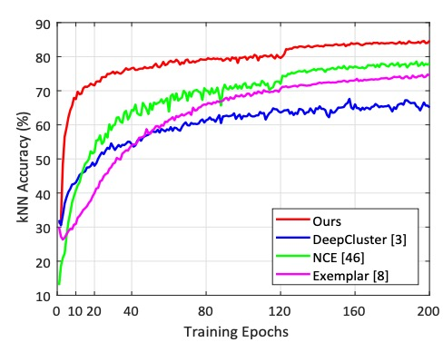
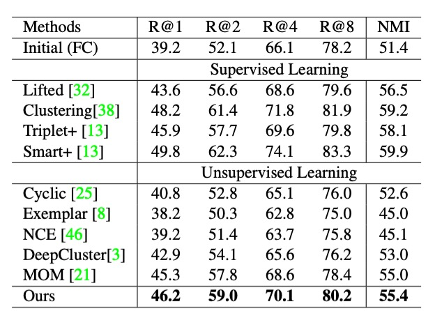

## Traces Under Difficulties

[**Unsupervised Embedding Learning via Invariant and Spreading Instance Feature**](https://arxiv.org/abs/1904.03436)

---

The main comparative targets of this paper are the Exemplar CNN and InstDisc papers.

:::tip
If you are unfamiliar with these two papers, you might want to check out our previous articles:

- [**[14.06] Exemplar CNN: Finding Invariant Features**](../1406-examplar-cnn/index.md)
- [**[18.05] InstDisc: The More the Merrier**](../1805-instdisc/index.md)

In this paper, the `InstDisc` paper is referred to as NCE, and the `Exemplar CNN` paper is referred to as Exemplar.
:::

## Defining the Problem

To find universal features, one approach is to use the classifier weight's Softmax embedding, as proposed by Exemplar CNN: **treat each image as an independent class**.

Exemplar CNN defines a matrix $W = [w_1, w_2, \dots, w_n]^T \in \mathbb{R}^{n \times d}$, where $w_j$ corresponds to the classifier weight for the $j$-th instance.

During training, based on the Softmax function, the probability of sample $x_j$ being recognized as the $i$-th instance is:

$$
P(i|x_j) = \frac{\exp(w_i^T f_j)}{\sum_{k=1}^n \exp(w_k^T f_j)}
$$

At each step, the network pulls feature $f_i$ closer to its corresponding classifier weight $w_i$, and pushes it away from other classifier weights $w_k$.

However, this method’s classifier weights restrict explicit comparisons between features, ultimately leading to poor efficiency and recognition power.

Next, InstDisc discarded the classifier weights and proposed the Memory Bank method, storing the instance features $f_i$ calculated in the previous step as $v_i$.

These stored features are then "directly" used as the classifier weights for corresponding instances, with the probability of sample $x_j$ being recognized as the $i$-th instance:

$$
P(i|x_j) = \frac{\exp(v_i^T f_j / \tau)}{\sum_{k=1}^n \exp(v_k^T f_j / \tau)}
$$

Here, $\tau$ is a temperature parameter controlling the concentration of the distribution. $v_i^T f_j$ represents the cosine similarity between feature $f_j$ and memory feature $v_i$.

The drawback is that memory features are updated less frequently, and comparisons between the real-time feature $f_i$ and outdated memory feature $v_i$ reduce training efficiency.

Since using parameterized Softmax is ineffective and the Memory Bank method is not very efficient, is there a way to directly optimize the features themselves, instead of the classifier weights or memory features?

The authors argue that we should abandon the Memory Bank and directly optimize the features themselves!

## Solving the Problem

### Model Architecture

<figure style={{"width": "90%"}}>

</figure>

The figure above shows the framework of the method proposed by the authors, which seems quite simple. First, a batch of images is input, which undergoes random data augmentation.

- **Original images:** A set of unlabeled images serves as the data source.
- **Data augmentation:** Each image undergoes random augmentation methods (such as rotation, cropping, color jittering, etc.) to generate augmented images. These augmented images retain the same semantic information as the original images.

Both the original and augmented images are input into the CNN backbone, from which corresponding feature vectors are extracted. The feature vector of the original image is denoted as $f_i$, and the feature vector of the augmented image is denoted as $\hat{f}_i$.

Finally, there is feature alignment and spreading:

- **Feature alignment for the same image (Invariance):** For the same instance (i.e., the original image and its augmented version), the embedded features $f_i$ and $\hat{f}_i$ should be consistent (features are close). This design ensures the model learns the intrinsic semantic features of the image, unaffected by the augmentation operations.
- **Feature spreading for different images (Spread-out):** The embedded features of different instances should be separated, avoiding them from becoming too close. This feature spreading helps the model distinguish between different image instances, even if they share some similarity.

### Loss Function

At the end of the methodology, let's look at the loss function designed in this paper.

First, for the positive sample classification probability, the probability of the augmented sample $\hat{x}_i$ being correctly classified as instance $i$ is:

$$
P(i|\hat{x}_i) = \frac{\exp(f_i^T \hat{f}_i / \tau)}{\sum_{k=1}^m \exp(f_k^T \hat{f}_i / \tau)}
$$

Where:

- $f_i$: The embedding feature of the original image $x_i$.
- $\hat{f}_i$: The embedding feature of the augmented image $\hat{x}_i$.
- $\tau$: The temperature parameter, which adjusts the concentration of the probability distribution.

Then, for the misclassification probability, the probability of other instances $x_j, j \neq i$ being misclassified as instance $i$ is:

$$
P(i|x_j) = \frac{\exp(f_i^T f_j / \tau)}{\sum_{k=1}^m \exp(f_k^T f_j / \tau)}
$$

The probability that $x_j$ is not misclassified as instance $i$ is:

$$
1 - P(i|x_j)
$$

Assuming the classification of different instances as instance $i$ is independent, the joint probability is:

$$
P_i = P(i|\hat{x}_i) \prod_{j \neq i} (1 - P(i|x_j))
$$

Where:

- $P(i|\hat{x}_i)$: The probability that the augmented sample $\hat{x}_i$ is correctly classified as instance $i$.
- $1 - P(i|x_j)$: The probability that other instances $x_j, j \neq i$ are not misclassified as instance $i$.

Based on maximum likelihood estimation, we can take the negative logarithm of the joint probability to obtain the loss function:

$$
J_i = -\log P(i|\hat{x}_i) - \sum_{j \neq i} \log(1 - P(i|x_j))
$$

Here, the loss function consists of two parts:

1. The loss from correctly classifying the augmented sample $\hat{x}_i$ (the first term).
2. The loss from not misclassifying other samples (the second term).

The final total loss function is defined by summing over all instances in the batch:

$$
J = -\sum_i \log P(i|\hat{x}_i) - \sum_i \sum_{j \neq i} \log(1 - P(i|x_j))
$$

This loss function design avoids the efficiency issues caused by using classifier weights or memory banks and directly optimizes the instance features, effectively improving computational efficiency and recognition ability.

## Discussion

### Comparison with Other Methods

<figure style={{"width": "50%"}}>

</figure>

The authors first follow the experimental design of InstDisc, conducting experiments on the CIFAR-10 and STL-10 datasets, using ResNet18 as the backbone network, with the output dimension of the embedding features set to 128.

The table above shows the experimental results based on the CIFAR-10 dataset, where the authors compare their method with DeepCluster, Exemplar CNN, NPSoftmax, NCE, and Triplet loss methods. The results show that the proposed method achieves the best performance on the kNN classifier (83.6%).

In different epochs, the authors plot the learning curves of other methods as shown below:

<figure style={{"width": "70%"}}>

</figure>

The results show that the proposed method reaches a kNN classification accuracy of 60% in just 2 epochs, whereas NCE requires 25 epochs and Exemplar requires 45 epochs to achieve the same accuracy.

Clearly, the learning speed of the proposed method is much faster than other competing methods. This efficiency is attributed to the direct optimization of instance features, rather than relying on classifier weights or memory banks.

:::tip
Another STL-10 dataset also achieves SOTA performance, but for brevity, it is not discussed here.
:::

### Experiments with Unknown Classes

Based on existing work in supervised deep embedding learning, the authors evaluated the following metrics on the test set:

- **Retrieval Performance (R@K):** Measures the probability of correctly matching (same class label) a given query image in the top $k$ retrieval results.
- **Clustering Performance (NMI):** Measures the clustering quality of the test set using Normalized Mutual Information (NMI).

Next, to assess the discriminative ability of the learned feature embeddings when there is no overlap in semantic classes between the training and test samples, the authors conducted experiments on the CUB200, Product, and Car196 datasets:

- **CUB200 (Bird Dataset):** The first 100 classes (5,864 images) were used for training, and the remaining 100 classes (5,924 images) were used for testing.
- **Product (Product Dataset):** The first 11,318 classes (59,551 images) were used for training, and the remaining 11,316 classes (60,502 images) were used for testing.
- **Car196 (Car Dataset):** The first 98 classes (8,054 images) were used for training, and the remaining 98 classes (8,131 images) were used for testing.

<figure style={{"width": "70%"}}>

</figure>

The results, shown in the table above, indicate that the proposed method even competes with some supervised learning methods on the CUB200 dataset, demonstrating superior unsupervised learning capabilities.

:::tip
Here, we have only shown the results for the CUB200 dataset; the results for the other two datasets can be found in the original paper.
:::

### Ablation Study

The proposed method introduces two key properties in instance feature learning: **data augmentation invariance** and **instance dispersion**.

To verify the impact of these properties on performance, the authors conducted an ablation study on the CIFAR-10 dataset.

- **Impact of Data Augmentation Invariance**

    

    <figure style={{"width": "70%"}}>
    
    </figure>
    

  The table above shows the results, where:

  - **`w/o`**: Indicates the removal of a specific augmentation operation.
  - **`R`**: Indicates random cropping (RandomResizedCrop).
  - **`G`**: Indicates random grayscale (RandomGrayscale).
  - **`C`**: Indicates color jittering (ColorJitter).
  - **`F`**: Indicates random horizontal flipping (RandomHorizontalFlip).

  From the results, it is clear that all augmentation operations contributed to the model's performance improvement, with random cropping contributing the most. The authors also conducted an experiment without any data augmentation (No DA), and the results are shown in the table below:

    

    <figure style={{"width": "70%"}}>
    
    </figure>
    

  The classification accuracy dropped sharply from 83.6% to 37.4%, which is quite astonishing!

  This shows that without data augmentation, the network fails to generate any positive concentration, leading to visually similar image features being wrongly separated. Therefore, data augmentation invariance is a key factor in learning effective embedded features.

- **Impact of Instance Dispersion**

  To study the effect of instance dispersion, the authors tested two negative sample selection strategies:

  1. **Hard Negative:** Select the top 50% most similar features to the query instance as negative samples.
  2. **Easy Negative:** Select the top 50% least similar features to the query instance as negative samples.

    

    <figure style={{"width": "70%"}}>
    
    </figure>
    

  The table again shows that when only easy negative samples are used, accuracy drops from 83.6% to 57.5%, while using only hard negative samples achieves performance nearly equivalent to the full model.

  This means that separating difficult negative samples helps improve the discriminative power of the learned embedding features. In contrast, easy negative samples provide almost no challenge to the model and do not effectively help the model learn instance dispersion.

## Conclusion

This paper emphasizes two key points: **data augmentation invariance** and **instance dispersion**.

Based on the various experiments presented by the authors, if we want to excel at unsupervised learning, we should use sufficiently diverse data augmentation operations and select hard negative samples.

These two conclusions continue to appear in subsequent research and can be regarded as important observations in the field of unsupervised learning.
