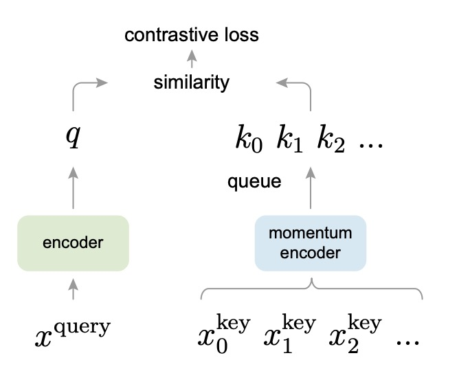

## Momentum Contrastive Learning

[**Momentum Contrast for Unsupervised Visual Representation Learning**](https://arxiv.org/abs/1911.05722)

---

Many organizations have already proposed their insights on contrastive learning, and Facebook AI Research (FAIR) certainly would not miss out.

They have joined the discussion, believing that the key to contrastive learning might lie in: momentum!

:::tip
Meta AI, currently known as such, was previously called Facebook AI Research (FAIR).
:::

## Defining the Problem

In the field of NLP, the nature of the text space is discrete, allowing words or sub-word tokens to be easily treated as a "dictionary." In contrast, the image space is continuous and high-dimensional, with no natural segmentation like words. To apply a process similar to tokenization on images, one needs to consider how to dynamically construct the "dictionary" and extract negative and positive samples from it.

We have also reviewed previous papers, which, while effective, still have a few problems:

1. **The dictionary size is often limited by batch size or GPU memory.**
2. **As the network parameters are constantly updated, the "old" feature vectors in the dictionary may be inconsistent with the "new" feature vectors.**

One approach is to use a large dictionary, like the one proposed in the paper introducing the memory bank, but because the network parameters are constantly updating, the feature vectors stored in the memory bank would not align with the new parameters, leading to inconsistency during contrastive learning.

If consistency is the issue, can we restrict the dictionary to just the current mini-batch?

That doesn’t work either.

Although this approach ensures that the features within a mini-batch remain consistent, in practice, the batch size is often limited, meaning there are very few available negative samples. Due to the lack of negative samples, the effectiveness of contrastive learning deteriorates.

The authors sought a method that could simultaneously expand the dictionary size while maintaining the consistency of the feature vectors within the dictionary. This led to the proposal of Momentum Contrast (MoCo).

In simple terms, MoCo uses a queue to store a large number of negative samples and employs a momentum update to slowly evolve the key encoder, maintaining consistency with the historical negative samples.

Is it really that simple?

Let’s delve into the details of this method.

## Solving the Problem

The core hypothesis of MoCo is that the larger the number of negative samples in the dictionary (indicating broader diversity), and the higher the consistency of encoding during training, the better the feature representations learned.

The design concept is shown in the diagram below:

<div align="center">
<figure style={{"width": "70%"}}>

</figure>
</div>

In MoCo’s design, the query and key are encoded by two separate encoders. The **query encoder** is responsible for encoding the current batch of samples, while the **key encoder** is used to encode the negative samples in the queue. To ensure that the negative representations in the dictionary stay consistent with the latest query representations, the authors propose a **slow momentum update**:

$$
\theta_k \leftarrow m \theta_k + (1 - m)\theta_q
$$

Here, $\theta_q$ and $\theta_k$ represent the parameters of the query encoder and key encoder, respectively, with $m$ being the momentum coefficient (e.g., 0.999). In this way, the parameters of the key encoder slowly and smoothly follow the latest state of the query encoder during training, preventing the feature vectors in the dictionary from losing consistency due to overly drastic encoder updates.

At the same time, the authors design a "queue" to store a large number of negative samples.

The size of this queue can be much larger than the batch size, allowing it to store more negative samples. Every time a new batch is read during training, it is encoded and enqueued at the tail of the queue, while the oldest batch of keys is dequeued. This way, a large and diverse set of negative samples is continuously preserved, and each update only requires encoding the new batch, keeping the computational cost relatively manageable.

:::tip
In this paper, the authors frequently use the terms "query" and "key."

Don’t worry, this has nothing to do with the query-key-value terminology used in self-attention. Here, "query" and "key" are just metaphors in contrastive learning to describe the relationship between "positive" and "negative" samples.

Conceptually, **“Query”** and **“Key”** do not directly replace the concepts of "positive" and "negative" samples. Instead, they are used in contrastive learning to explain the relationship between positive and negative samples using the analogy of "dictionary lookup":

1. **Query**: This vector is the object to be "classified" or "recognized," similar to the "anchor" in typical contrastive learning. In InfoNCE or other contrastive losses, the goal is to bring the query closer to its positive sample and push it farther from unrelated negative samples.
2. **Key**: Each element in the dictionary is called a Key. It can either be a **positive** (the correct key matching the query) or a **negative** (any other key that does not match the query). In other words, for a specific query, only one key is the so-called "positive sample," and all other keys are "negative samples."

To emphasize the "dictionary-query" relationship, the authors unify both positive and negative samples as Keys (positive and negative Keys), and the sample to match is called the Query.
:::

### Algorithm Design

The authors might have anticipated that readers may not have the patience to read the entire paper, so they provided the complete algorithm flow, which, once reviewed, essentially means reading the entire paper.

<div align="center">
<figure style={{"width": "70%"}}>

</figure>
</div>

Let’s break it down line by line:

---

```python
# f_q, f_k: encoder networks for query and key
# queue: dictionary as a queue of K keys (CxK)
# m: momentum
# t: temperature

f_k.params = f_q.params # initialize
```

1. This line initializes the **key encoder (f_k)** parameters to be the same as the **query encoder (f_q)** parameters.
   - Initially, both encoders are identical. During training, momentum updates will allow the key encoder to evolve slowly.

```python
for x in loader: # load a minibatch x with N samples
```

2. A **data loader (loader)** is used to read a minibatch containing **N samples**.
   - Typically, `loader` refers to a PyTorch `DataLoader`, which continuously fetches batches from the dataset.

```python
x_q = aug(x) # a randomly augmented version
x_k = aug(x) # another randomly augmented version
```

3. Perform random augmentations (e.g., cropping, flipping, color jittering) on the same batch of images `x`.
   - Although `x_q` and `x_k` come from the same original image, they are transformed into two different "views."
   - `x_q` will go into the query encoder, and `x_k` will go into the key encoder to form a "positive pair."

```python
q = f_q.forward(x_q) # queries: NxC
k = f_k.forward(x_k) # keys: NxC
```

4. Pass the augmented images through the **query encoder (f_q)** and **key encoder (f_k)** for forward propagation.
   - `q` has the shape `N x C`, representing `N` samples, each with a feature vector of dimension `C`.
   - `k` is similarly shaped `N x C`.

```python
k = k.detach() # no gradient to keys
```

5. `k.detach()` ensures that no gradients are computed for `k`.
   - Since the key encoder is not updated via backpropagation, but rather via a momentum update, this prevents the computational graph from tracking the key encoder’s parameters.

```python
# positive logits: Nx1
l_pos = bmm(q.view(N,1,C), k.view(N,C,1))
```

6. Compute the **logits for positive samples**.
   - `q.view(N,1,C)` reshapes `q` to `(N, 1, C)` and `k.view(N,C,1)` reshapes `k` to `(N, C, 1)` for batch matrix multiplication.
   - `bmm` performs the inner product for each batch, resulting in a tensor of shape `(N, 1, 1)`, which is equivalent to `(N, 1)`. This represents the similarity (dot product) for each sample's positive pair.

```python
# negative logits: NxK
l_neg = mm(q.view(N,C), queue.view(C,K))
```

7. Compute the **logits for negative samples**.
   - Here, `queue` has the shape `(C x K)`, representing `K` key vectors, each of dimension `C`.
   - The matrix multiplication of `q.view(N,C)` with `queue.view(C,K)` produces a tensor of shape `(N, K)`, representing the inner product between each query and all `K` keys in the queue.
   - These keys are considered "negative samples" because they correspond to other images or samples that do not match the query.

```python
# logits: Nx(1+K)
logits = cat([l_pos, l_neg], dim=1)
```

8. Concatenate the positive logits (`l_pos`) and negative logits (`l_neg`).
   - The result is a tensor of shape `(N, 1+K)`, where each sample has 1 positive logit (at position 0) and `K` negative logits (from position 1 to `K`).

```python
# contrastive loss, Eqn.(1)
labels = zeros(N) # positives are the 0-th
loss = CrossEntropyLoss(logits/t, labels)
```

9. Compute the **contrastive loss (InfoNCE loss)**.
   - `labels = zeros(N)` means that for `N` samples, the positive labels are all `0`, since the positive logits are in the first column (position 0).
   - `logits/t` scales the logits by a temperature parameter `t`, controlling the smoothness of the softmax.
   - `CrossEntropyLoss` applies softmax to the logits and computes the cross-entropy loss, aiming to push each sample toward the positive label (position 0).

```python
# SGD update: query network
loss.backward()
update(f_q.params)
```

10. Use **backpropagation** to update the **query encoder**'s parameters.
    - `loss.backward()` computes the gradients, and `update(f_q.params)` applies the optimizer (e.g., SGD) to update the query encoder's weights.

```python
# momentum update: key network
f_k.params = m*f_k.params + (1-m)*f_q.params
```

11. Perform the **momentum update** on the **key encoder**’s parameters:
    $$
    \theta_k \leftarrow m\,\theta_k \;+\;(1 - m)\,\theta_q
    $$
    - Here, `m` is the momentum coefficient (typically set close to 1, e.g., 0.999).
    - As a result, the key encoder’s parameters smoothly follow the query encoder’s changes, reducing the inconsistency between old key vectors and the new query vectors.

```python
# update dictionary
enqueue(queue, k) # enqueue the current minibatch
dequeue(queue) # dequeue the earliest minibatch
```

12. **Update the dictionary (queue)**:
    - `enqueue(queue, k)` adds the current batch's `k` (shape `N x C`) to the end of the queue.
    - `dequeue(queue)` removes the oldest batch of keys from the front of the queue, ensuring that the queue size remains at the predefined value `K`.
    - This keeps the queue constantly refreshed with recent keys, providing a large and diverse set of negative samples for the next training iteration.

---

After going through the code, here are the key points summarized:

1. **Dual Encoder Architecture (f_q, f_k)**: The Query encoder (f_q) handles the current batch’s positive queries, while the Key encoder (f_k) computes negative samples and does not directly receive gradients.
2. **Momentum Update**: The Key encoder’s parameters are updated slowly to track the Query encoder’s parameters, reducing inconsistency caused by rapid changes in the network.
3. **Large Dictionary (Queue) Mechanism**: Only the current batch of keys needs to be encoded, which are then enqueued, and the oldest keys are dequeued. This enables the retention of a large number of negative samples (keys), enhancing the contrastive learning effectiveness while avoiding massive memory requirements like the memory bank.
4. **Contrastive Loss**: Positive $\ell_{\text{pos}}$ and negative $\ell_{\text{neg}}$ logits are used to compute the loss, which is then implemented using softmax + cross-entropy, achieving the InfoNCE loss.

The core goal of the entire algorithm is to leverage a large and dynamically updated queue for contrastive learning while ensuring encoder consistency via momentum updates, ultimately learning better and more generalizable visual representations.

### Pretext Task

The focus of this paper is not on designing "new pretext tasks," but rather on proposing a universal mechanism, MoCo, to construct a "large and consistent" dictionary for contrastive learning.

In the experiments, the authors use **instance discrimination**, a common and simple approach, where different augmented versions of the same image are treated as positive samples, and augmented versions of other images are treated as negative samples.

It is worth mentioning that the authors encountered the issue of "BN Cheating" (Batch Normalization Cheating) during their experiments.

BN Cheating refers to a situation in contrastive learning where Batch Normalization shares statistics within the same batch, allowing the model to "peek" at information between positive and negative samples, thereby finding a "shortcut" solution that compromises the quality of the learned representations.

To avoid this, the authors introduced **Shuffling BN**, which, in multi-GPU training, disperses positive and negative samples across different GPUs and shuffles the sample order, ensuring that their statistics do not interfere with each other, thus mitigating the negative effects of BN.

:::tip
**Why doesn't the memory bank have this problem?**

In the memory bank scenario, the positive keys are actually from previous batches, so they never share the same BN statistics with the current batch. Therefore, shuffling is unnecessary. However, MoCo computes the query and key representations for the current batch in real-time, which is why this issue arises.
:::

## Discussion

Let’s take a look at some key figures to examine MoCo's effectiveness. Full experimental results can be found in the original paper.

### Feature Robustness

The authors use **linear classification** to evaluate the quality of the features learned by MoCo.

- **Self-supervised pretraining**: MoCo is trained in an unsupervised manner on ImageNet-1M (IN-1M), resulting in a feature extraction network.
- **Freeze features**: The convolutional layers of the network are frozen, and only the final fully connected layer (FC + softmax) is trained for linear classification over 100 epochs.
- **Evaluation**: Top-1 classification accuracy is measured on the ImageNet validation set (1-crop).

This procedure is a common method for "testing self-supervised feature representations" in computer vision, eliminating more complex fine-tuning factors.

The comparison targets three common contrastive loss mechanisms:

1. **End-to-end**: The query encoder and key encoder are updated via backpropagation simultaneously.
2. **Memory bank**: Feature vectors are pre-stored in a memory bank, but new and old features can easily become inconsistent due to continual updates.
3. **MoCo**: Momentum update for the key encoder + large-scale queue management for negative samples.

The experimental results are shown in the following figure:

<div align="center">
<figure style={{"width": "70%"}}>

</figure>
</div>

- All three methods see an improvement in accuracy as the dictionary size $K$ increases, demonstrating that a larger dictionary captures more sample diversity.
- The **End-to-end** method is limited by the mini-batch size (the authors used 8 Volta 32GB GPUs, supporting a batch size of about 1024). Expanding the batch size further poses difficulties with large-scale training.
- **Memory bank** can expand the dictionary but suffers from inconsistency between old and new features, leading to a 2.6% lower accuracy than MoCo.
- **MoCo** achieves the best performance with a larger dictionary, confirming its ability to balance "large dictionaries" with "consistency."

### Impact of the Momentum Coefficient

The authors further explore the effect of the momentum coefficient $m$ on MoCo.

The following table shows the impact of different $m$ values on ResNet-50 with pretraining (K = 4096):

| momentum $m$ | 0    | 0.9  | 0.99 | 0.999 | 0.9999 |
| ------------ | ---- | ---- | ---- | ----- | ------ |
| accuracy (%) | fail | 55.2 | 57.8 | 59.0  | 58.9   |

The experimental results indicate that the momentum coefficient $m$ significantly affects MoCo’s performance:

- A small $m$ (e.g., 0.9) leads to inaccurate feature learning and a large drop in accuracy.
- $m=0$ fails to converge.

In contrast, values in the **0.99~0.9999 range** produce good representations, with $m=0.999$ yielding the best performance. This demonstrates that the "slow evolution of the key encoder" helps maintain dictionary consistency and stabilize training convergence.

### Comparison with Other Methods

<div align="center">
<figure style={{"width": "85%"}}>

</figure>
</div>

For a more comprehensive comparison, the authors pretrain MoCo on ResNet-50 (R50) and its wider versions (2×, 4×) and report the relationship between model size (#params) and linear classification accuracy.

- **MoCo + R50**: Achieved **60.6%** Top-1 accuracy.
- **MoCo + R50w4×**: A larger model achieved **68.6%** accuracy.

Detailed comparison data is shown in the table below. When looking at the **standard ResNet-50** (with approximately 24M parameters), MoCo's 60.6% accuracy already "outperforms" other models in the same class:

<div align="center">
<figure style={{"width": "70%"}}>

</figure>
</div>

:::tip
The authors did not use special network structures like patchify or custom receptive fields but directly used ResNet with an additional projection layer, making the model easily transferable to various downstream visual tasks.

This indicates that the MoCo framework is highly flexible and can continue to combine with other strategies to further improve accuracy.
:::

## Conclusion

MoCo is a simple yet effective contrastive learning mechanism that, through momentum updates and queue management, achieves the goal of obtaining both a "large dictionary" and "consistency" in an unsupervised setting.

Overall, MoCo’s core mechanism shows great versatility and scalability, providing an efficient and high-performance solution for unsupervised visual representation learning.

:::tip
This framework has since been extended into many versions, and we will look at the subsequent improvements later.
:::
