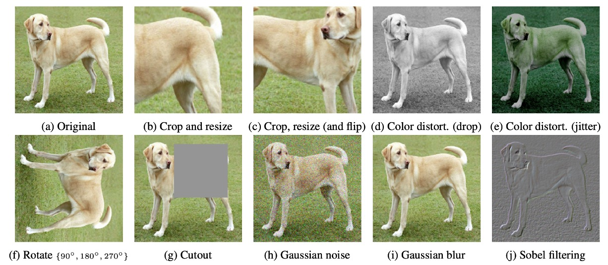
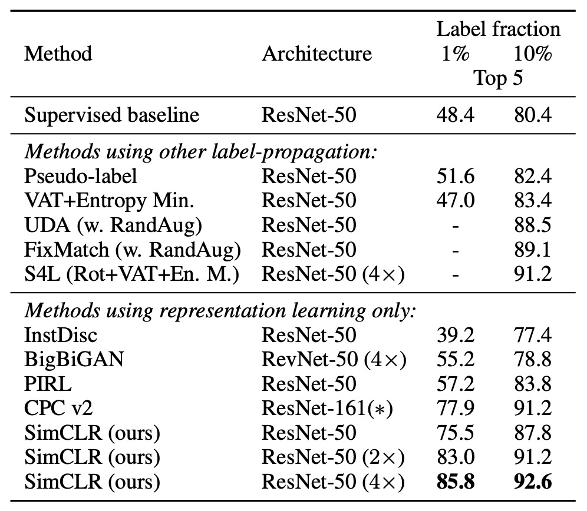

## Winning with Batch Size

[**A Simple Framework for Contrastive Learning of Visual Representations**](https://arxiv.org/abs/2002.05709)

---

Contrastive learning has been researched for about five years, and the entire field has become highly complex and chaotic. Not only are architecture designs intricate, but the specific model training methods are also varied.

The authors of this paper believe that the core of contrastive learning should be simpler.

## Defining the Problem

Recall the essential elements of contrastive learning:

- **To achieve good results, is a memory bank really necessary?**

We need a large number of negative samples to guide the model in learning better representations, and a memory bank can indeed serve this purpose. The original InstDict did this, and later MoCo followed suit.

But it's annoying! Maintaining a memory bank during training is clearly an unfriendly design.

In this paper, the author decides to directly discard the memory bank design, opting for larger batch sizes instead. As long as we provide enough negative samples, the model can learn sufficiently good representations!

:::tip
For readers who haven't read InstDict or MoCo, you can refer to our previous articles:

- [**[18.05] InstDisc: More is Better**](../1805-instdisc/index.md)
- [**[19.11] MoCo v1: Momentum Contrastive Learning**](../1911-moco-v1/index.md)
  :::

## Solving the Problem

### Model Architecture

<figure style={{"width": "70%"}}>

</figure>

This architecture is really simple: no multiple encoders, no memory bank.

The process starts by applying two random augmentations to the same image, producing two "seemingly different, but actually from the same source" images.

Then, both images are passed through "the same" encoder network to obtain two latent vectors.

Next, a small projection network maps these latent vectors to the contrastive learning space, and finally, a contrastive loss function ensures that the "same source" augmented images are close to each other in the representation space.

Huh? That's it?

Yes! That's it, and we've just finished reading a paper! (~Not really~)

### Image Augmentations

<figure style={{"width": "90%"}}>

</figure>

In SimCLR, the authors believe that augmentations are diverse and powerful, more important than supervised learning.

The augmentations used in the paper are shown in the figure above, and the key ones include:

- **Random crop**
- **Color distortion**
- **Gaussian blur**

The two augmented images are treated as a "positive pair" because they both come from the same original image.

### Detailed Design

First, for the encoder, ResNet-50 is used as the base encoder. The augmented images are input into the network to obtain a vector $h_i$. The dimensionality of this vector is typically large, such as 2048 dimensions after average pooling for ResNet-50.

Next, for the projection head, the authors found that applying the contrastive loss directly on $h_i$ is less effective than adding a small MLP first. This projection network $g(·)$ typically consists of one hidden layer, followed by ReLU, and then projecting onto a 128-dimensional vector $z_i$ used for contrastive loss calculation.

The most critical part is how to define the contrastive loss.

The core concept is: for the same pair $(i, j)$ (which come from the same original image), they should be as close as possible in the vector space, while being as far apart as possible from unrelated samples. Here, the authors refer to the NT-Xent (Normalized Temperature-scaled Cross Entropy Loss) formulation.

### NT-Xent Loss Function

Let:

- $zᵢ$ be the 128-dimensional vector obtained after passing the $i$-th augmented image through the projection head.
- $\text{sim}(u, v) = \frac{u^\top v}{\|u\|\|v\|}$ represents the cosine similarity.
- $τ$ (tau) is the temperature hyperparameter, controlling the scaling of similarity scores.

In a batch, assume there are $N$ original images, each augmented twice, resulting in $2N$ augmented images. For a positive pair $(i, j)$ (i.e., two different augmentations of the same original image), when computing the loss, the remaining $2(N - 1)$ augmented images are considered negative samples.

The NT-Xent loss function is computed as follows:

$$
ℓ_{i,j}
= - \log \left( \frac{\exp(\text{sim}(z_i, z_j)/τ)}{\sum_{k=1}^{2N} \mathbf{1}[k \neq i] \exp(\text{sim}(z_i, z_k)/τ)} \right).
$$

Where:

- The numerator $\exp(\text{sim}(z_i, z_j)/τ)$ represents the exponentiated similarity score between $z_i$ and the positive sample $z_j$.
- The denominator is the sum of the exponentiated similarity scores between $z_i$ and all other vectors in the batch (excluding itself).

The goal is to maximize the similarity between positive samples $(z_i, z_j)$ while minimizing the similarity with other negative samples, i.e., we want $\text{sim}(z_i, z_j)$ to be much larger than $\text{sim}(z_i, z_k)$ for all $k \neq i$. In this way, the model learns more discriminative representations, with similar samples clustering together and dissimilar ones being separated.

For every positive pair $(i, j)$ in the batch, the losses for both $(i, j)$ and $(j, i)$ are computed and summed for backpropagation.

:::tip
NT-Xent adapts the influence of negative samples via **cosine similarity** (with ℓ₂ normalization) and the "temperature" ($\tau$).

- **Cosine similarity**: Focuses the model on the "direction" of the vectors, rather than their "magnitude," making the relative similarity between representations more accurate.
- **Temperature parameter $\tau$**:
  Controls the scaling of the similarity, influencing the weight of negative samples in the loss:
  - **Small $\tau$** → Amplifies the similarity difference → Emphasizes "hard negatives."
  - **Large $\tau$** → Smooths the similarity difference → More even influence of negative samples.

In traditional contrastive losses, to account for the effect of "easy/hard negatives," **semi-hard negative mining** is often required. Without this filtering, most negative samples may be too easy to distinguish (high contrast), which reduces learning effectiveness.

However, NT-Xent uses **cosine similarity + temperature adjustment** to dynamically adjust the weight of negative samples based on their similarity, eliminating the need for manual negative sample selection. Experiments show that without semi-hard negative mining, other contrastive loss functions (e.g., logistic loss, margin loss) generally perform worse, and even with semi-hard negative mining, they may not outperform NT-Xent.
:::

## Discussion

### Most Useful Augmentation Combinations

<figure style={{"width": "90%"}}>

</figure>

To observe the impact of different data augmentation methods (either individually or in combination) on the quality of representations learned by the model, the authors use **linear evaluation**. In this approach, the pre-trained encoder is frozen, and a linear classifier (usually a fully connected layer) is added on top, followed by top-1 accuracy evaluation on ImageNet.

In the experiment, the model input has two "parallel augmentation pipelines." Here, the authors intentionally apply the tested augmentation to "one of the pipelines," while the other branch applies only basic random crop + resize. This allows a clearer observation of the effects of individual augmentations or combinations, without their effects being mixed.

The interpretation of the table in the image is as follows:

- **Diagonal entries**: Single transformations (e.g., Gaussian blur, color distortion), representing the application of only that augmentation to one branch.
- **Off-diagonal entries**: Combinations of two augmentations (e.g., first Gaussian blur, then color distortion).
- **Last column**: The average value of each row, which is the average performance under the augmentation combination for that row.

The experimental results show:

- **Single augmentations** (diagonal entries) are usually not enough for the model to learn strong representations. With only one variation, the model can still rely on other invariant cues to identify "positive pairs."
- **Augmentation combinations** (off-diagonal entries) tend to improve linear evaluation results.

This suggests that when two or more augmentations occur simultaneously, the contrastive learning task becomes harder, but it also enables the model to learn more general and stable features.

### Impact of Augmentation Strength

<figure style={{"width": "70%"}}>

</figure>

We can adjust the strength of augmentations, such as increasing or decreasing the variation in brightness, contrast, saturation, and hue. The authors further explore the impact of "augmentation strength" on model performance.

When training supervised classification models on ImageNet, auto-augmentation strategies like AutoAugment are commonly used. However, the authors find that AutoAugment is not necessarily better than the "simple crop + strong color distortion" approach.

The results, as shown in the table above, reveal that for **unsupervised contrastive learning**, increasing the strength of color distortion significantly improves the quality of features learned by the model. This indicates that the required augmentations for unsupervised contrastive learning differ from those in supervised learning. Many augmentations that are "very effective" in supervised learning may not similarly enhance contrastive learning.

:::tip
For different learning goals, the choice of augmentation strategy may differ. However, we often subconsciously overlook this issue because other factors might seem more important.

The author's experimental results remind us that the selection of augmentation strategies can have a significant impact on model learning effectiveness, making it worthwhile to carefully tune this aspect.
:::

### Scaling Up the Model

<figure style={{"width": "70%"}}>

</figure>

The figure above shows the performance of contrastive learning at different model scales. The authors find that as the model size increases, the performance of contrastive learning improves progressively.

This result is similar to our experience in supervised learning: increasing model capacity typically allows for richer feature representations. Additionally, as model size increases, the improvement in unsupervised contrastive learning becomes more evident, suggesting that contrastive learning is even more dependent on large models than supervised learning.

:::tip
**Why does unsupervised learning perform worse with small models compared to supervised learning, but can compete when models are large?**

In unsupervised settings, the model needs to discover the data structure on its own. If the model is too small, its representational space is highly constrained, preventing it from learning sufficiently rich features. However, once the model capacity is large enough, it can capture a variety of patterns that are observable without labels, which might be even richer than the labels used in supervised learning.
:::

### Batch Size Impact

<figure style={{"width": "70%"}}>

</figure>

The figure above shows performance at different batch sizes and training durations, with each bar representing the result from a single training experiment.

Traditionally, batch size selection mainly considers computational efficiency and gradient stability. However, in contrastive learning, batch size also plays a crucial role: **it impacts the number of available negative samples**.

- **Larger batch sizes mean more negative samples available per training step**, allowing the model to learn richer contrastive information and improve sample discrimination.
- **Faster convergence**: With fewer training epochs, larger batches allow the model to observe more negative samples in a shorter time, accelerating convergence and improving final performance.

This differs from supervised learning. In supervised learning, large batches mainly aim to "stabilize gradient estimates and improve training efficiency." But in contrastive learning, **more negative samples** are the core advantage brought by large batches.

Another interesting finding is that longer training times can partially offset the disadvantages of small batches:

- When training steps are sufficient, even small batches can accumulate enough negative sample exposure over time, narrowing the performance gap with large batches.
- However, under the same training time, larger batches typically achieve similar results faster, making them a more efficient strategy when computational resources are limited.

### Comparison with Other Methods

The authors compare the linear evaluation results of various self-supervised learning methods (i.e., freezing the backbone and adding a linear classifier on top).

The results show that even with the standard ResNet architecture (without special network designs), SimCLR achieves or exceeds the performance of previous methods that required specially designed network structures. When ResNet-50 is scaled up by 4×, its linear evaluation results can rival a supervised pre-trained ResNet-50, indicating that unsupervised contrastive learning has immense potential in large models.

If the number of ImageNet labels is reduced to 1% or 10%, and fine-tuning is done using class-balancing, as shown in the table below:

<figure style={{"width": "60%"}}>

</figure>

We can see that SimCLR still outperforms other methods, showing that contrastive learning has substantial potential in semi-supervised learning as well.

## Conclusion

In this study, the authors propose a simple yet effective contrastive learning framework and thoroughly analyze the impact of various design choices on learning outcomes.

The results show that through data augmentation strategies, nonlinear projection heads, and the NT-Xent loss function, SimCLR significantly outperforms previous techniques in self-supervised learning, semi-supervised learning, and transfer learning tasks.

:::tip
Contrastive learning, with SimCLR and MoCo as the watershed, has ended the period of chaos in this field, established a clear research direction, and provided important reference points for future research.
:::
