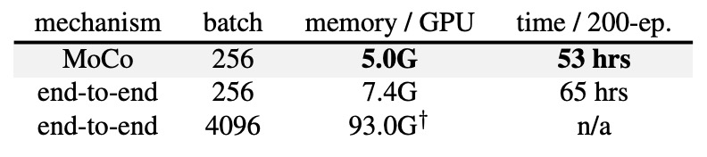

## A Comeback

[**Improved Baselines with Momentum Contrastive Learning**](https://arxiv.org/pdf/2003.04297)

---

FAIR introduced MoCo v1, but before they could even enjoy their success, Google presented SimCLR, which showed a significant performance boost!

This was a major blow to FAIR, and they couldn't just sit back and relax! So, one month after the release of SimCLR, FAIR incorporated some of its strengths and launched MoCo v2.

The message was clear: MoCo's framework is still a better choice!

:::tip
The main comparison in this paper is with SimCLR, and interested readers can refer to our previous article:

- [**[20.02] SimCLR v1: Winning with Batch Size**](../2002-simclr-v1/index.md)
  :::

## Problem Definition

SimCLR made three major improvements in its implementation:

1. **Very large batch sizes** (4k or 8k), ensuring a sufficient number of negative samples.
2. **MLP head**: The output features of the encoder are passed through a 2-layer MLP (with ReLU) before applying contrastive loss. After training, the encoder’s output (without the MLP output) is usually used for downstream tasks.
3. **Stronger data augmentation**: This includes stronger color jittering, blurring, etc.

However, despite the excellent performance, the batch size in SimCLR is really too large, and most people cannot run it.

:::tip
Google, with its ample resources, can use TPUs to handle 4k or 8k batch sizes.
:::

Thus, the authors in this paper attempt to integrate SimCLR’s two major improvements into MoCo:

1. **MLP projection head**
2. **Stronger data augmentation**

They found that these improvements are also effective within the MoCo framework and can achieve results surpassing SimCLR even in a typical 8-GPU environment (without requiring ultra-large batch sizes).

This is clearly more user-friendly for general users and makes contrastive learning research easier to reproduce.

## Solution

<figure style={{"width": "70%"}}>

</figure>

The diagram above shows the architectural differences between SimCLR and MoCo.

SimCLR is an end-to-end mechanism, requiring a batch with enough negative samples, typically requiring a batch size of 4k to 8k.

In contrast, MoCo uses a "momentum encoder" to maintain representations of negative samples. The negative sample vectors are stored in a "queue" that is shared across batches. Therefore, even with a small batch size, MoCo can use a large queue, providing plenty of negative samples.

Thus, MoCo does not need large batches to retain many negative samples, requiring less hardware resources.

### Enhanced MLP Head

<figure style={{"width": "70%"}}>

</figure>

The authors replaced the original fully connected (fc) projection head in MoCo with a 2-layer MLP (2048 units in the intermediate layer, with ReLU), testing different temperature parameters $\tau$.

The results, shown in the table, indicate that with just the fc (no MLP), the ImageNet linear classification accuracy is around 60%–61%. However, after replacing it with an MLP, the accuracy increases to about 66% (at the optimal $\tau = 0.2$), which is a significant improvement.

However, in transfer learning for object detection, the improvement from the MLP head is smaller. This raises a common question:

- **"Is a higher linear classification score always better? Does it directly correlate with actual downstream tasks?"**

Sometimes, this is not entirely true. Linear classification scores are a reference indicator, but they don’t guarantee the same level of improvement in all downstream tasks.

### Stronger Data Augmentation

<figure style={{"width": "70%"}}>

</figure>

Next, the authors added SimCLR’s "blur augmentation" and slightly stronger color distortion to MoCo’s original augmentation strategy. They found that even without the MLP head, just strengthening data augmentation increased ImageNet linear classification accuracy from 60.6% to 63.4%. The detection results also showed similar or better improvements than when using the MLP head.

Finally, when both the MLP head and strong augmentation were used, ImageNet linear classification reached 67.3%, with significant improvements in detection as well.

## Discussion

### Comparison with SimCLR

<figure style={{"width": "70%"}}>

</figure>

SimCLR used a batch size of 4k or 8k in its paper, training for 1000 epochs, achieving 69.3% linear classification accuracy on ImageNet.

The authors integrated the two improvements (MLP + augmentation) into MoCo under a more feasible hardware setup (8-GPU, batch size = 256), creating "MoCo v2."

The results show:

- With 200 epochs of pretraining, MoCo v2 achieves 67.5%, which is 5.6% higher than SimCLR’s 61.9% with the same setup, and better than the large-batch SimCLR’s 66.6%.
- If pretraining is extended to 800 epochs, MoCo v2 reaches 71.1%, surpassing SimCLR’s 69.3%.

This means MoCo, without the need for ultra-large batches, can handle a large number of negative samples via the queue mechanism and, by also applying SimCLR’s MLP head and stronger augmentation, outperforms SimCLR.

### Computational Load and Resource Consumption

<figure style={{"width": "70%"}}>

</figure>

The authors also compared the memory and time costs of the end-to-end mechanism and the MoCo mechanism on 8-GPUs.

In the end-to-end mechanism, using a batch size of 4k is almost impossible on 8-GPUs. Even with a batch size of 256, the end-to-end method requires more memory and time than MoCo, because it needs to backpropagate through both the query and key encoders.

In contrast, MoCo only updates the query encoder, making it more efficient overall.

## Conclusion

In summary, the concepts of SimCLR can be directly applied to MoCo, and due to MoCo's memory bank mechanism, training does not require massive GPU resources. It is, in any case, an economical and highly effective choice.

In this round, FAIR successfully made a comeback against Google.
