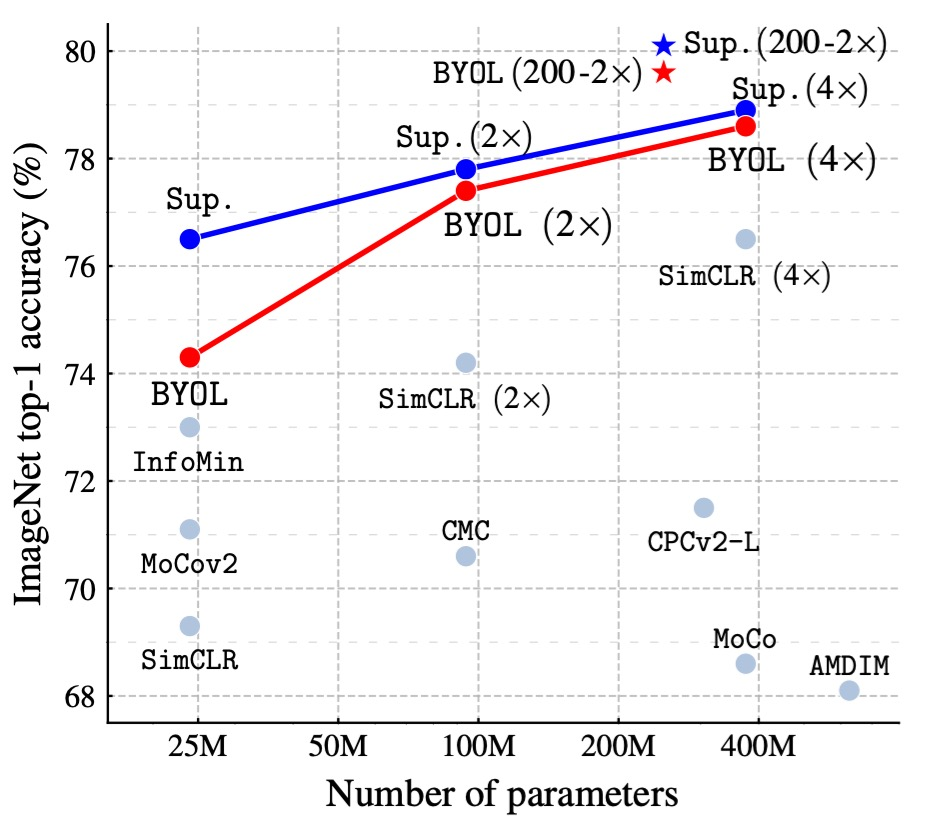
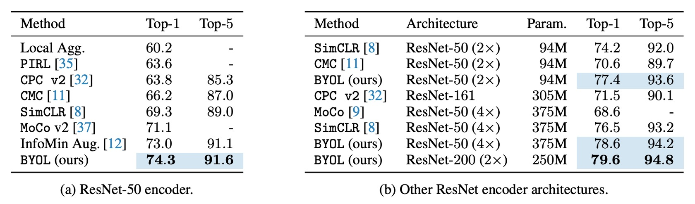

## No Need for Negative Samples

[**Bootstrap your own latent: A new approach to self-supervised Learning**](https://arxiv.org/abs/2006.07733)

---

While everyone is actively discussing how to design negative samples, the authors of this paper stand out by proposing an approach that doesn’t require negative samples.

The authors claim: as long as you learn from yourself, the model can surpass its own limits.

## Problem Definition

The core concept of contrastive learning is to pull together representations of the same image from different views (referred to as "positive sample pairs") while pushing apart representations from different images (referred to as "negative sample pairs") to learn representations.

However, these methods require carefully designed negative sample handling strategies, such as large-batch training (SimCLR) or memory banks (MoCo), to ensure effective learning.

Furthermore, these methods heavily rely on image augmentations, with techniques like random cropping proven to be very effective in experiments.

Given how troublesome the design of negative samples can be, is there a way to avoid them altogether?

:::tip
If you haven’t read SimCLR and MoCo yet, you can refer to our previous articles:

- [**[19.11] MoCo v1: Momentum Contrastive Learning**](../1911-moco-v1/index.md)
- [**[20.02] SimCLR v1: Winning with Batch Size**](../2002-simclr-v1/index.md)
  :::

## Solution

### Model Architecture

<figure style={{"width": "90%"}}>

</figure>

The authors propose the BYOL architecture, which consists of two parts: an online network and a target network:

- **Online Network**: The upper half of the figure above, consisting of three parts:

  1. **Encoder** $f_{\theta}$: Converts the input image into features.
  2. **Projector** $g_{\theta}$: Maps the features into a high-dimensional space, similar to contrastive learning methods like SimCLR.
  3. **Predictor** $q_{\theta}$: Learns a nonlinear mapping in the projected space to predict the output of the target network.

- **Target Network**:

  The structure is the same as the online network, but with different parameters $\xi$, which are an exponentially moving average (EMA) of the online network parameters $\theta$. The update rule is as follows:

  $$
  \xi \leftarrow \tau \xi + (1 - \tau) \theta
  $$

  Here, $\tau$ is the decay factor that controls the update speed of the target network.

### Training Process

The BYOL training process begins with a given image dataset $D$. A random image $x \sim D$ is selected, and two different image augmentations $T$ and $T'$ are applied to generate two different views:

$$
v = t(x), \quad v' = t'(x)
$$

Where $t \sim T$, $t' \sim T'$.

For the first augmented view $v$, the online network computes:

$$
y_{\theta} = f_{\theta}(v), \quad z_{\theta} = g_{\theta}(y_{\theta})
$$

For the second augmented view $v'$, the target network computes:

$$
y'_{\xi} = f_{\xi}(v'), \quad z'_{\xi} = g_{\xi}(y'_{\xi})
$$

At this point, we see that $z_{\theta}$ and $z'_{\xi}$ are quite similar because the model architecture is the same, and the parameters are updated using EMA. If we directly perform contrastive learning on these two outputs, the model usually collapses.

Since they are so similar, the model doesn’t need to learn and can just pull the two outputs together. To solve this problem, the authors introduce a new mechanism. The idea is to pass $z_{\theta}$ through a projection head $q_{\theta}$ to obtain a predicted output:

$$
\hat{z}_{\theta} = q_{\theta}(z_{\theta})
$$

Then, $z'_{\xi}$ and $\hat{z}_{\theta}$ are compared and pulled together, transforming the whole framework into a "prediction" problem rather than a "contrast" problem.

Finally, to ensure numerical stability, **$L_2$ normalization** is applied when comparing these vectors (making their norms equal to 1):

$$
\hat{z}_{\theta} = \frac{q_{\theta}(z_{\theta})}{\|q_{\theta}(z_{\theta})\|_2}, \quad
z'_{\xi} = \frac{z'_{\xi}}{\|z'_{\xi}\|_2}
$$

### Loss Function

Here, the authors do not use InfoNCE, but instead use Mean Squared Error (MSE) as the loss function:

$$
L_{\theta, \xi} = \|\hat{z}_{\theta} - z'_{\xi}\|_2^2
$$

Expanding the computation:

$$
L_{\theta, \xi} = 2 - 2 \cdot \langle \hat{z}_{\theta}, z'_{\xi} \rangle
$$

Where $\langle \hat{z}_{\theta}, z'_{\xi} \rangle$ is the inner product of two unit vectors, representing the cosine similarity between them.

Additionally, to symmetrize the learning, the views are swapped during training: $v'$ passes through the online network, and $v$ passes through the target network. The same loss is then computed again:

$$
L'_{\theta, \xi} = \|\hat{z}'_{\theta} - z_{\xi}\|_2^2
$$

The final total BYOL loss is:

$$
L^{BYOL}_{\theta, \xi} = L_{\theta, \xi} + L'_{\theta, \xi}
$$

### Implementation Details

BYOL adopts the same image augmentation strategy as SimCLR:

1. Random cropping and resizing to $224 \times 224$ resolution.
2. Random horizontal flipping.
3. Color jittering (randomly changing brightness, contrast, saturation, and hue).
4. Grayscale conversion (optional).
5. Gaussian blur.
6. Solarization.

---

For the network architecture, BYOL uses ResNet-50 as the base encoder $f_{\theta}$ and $f_{\xi}$, and tests deeper ResNet variants (50, 101, 152, 200 layers) and wider variants (1× to 4×) in different experiments.

The detailed network structure is as follows:

- **Output feature dimension**: 2048 (when width multiplier is 1×).
- **Projection layer (MLP)**:
  - **First layer**: Linear layer with output dimension 4096.
  - **Batch normalization**.
  - **ReLU activation**.
  - **Final linear layer**: Output dimension 256.
- **Predictor**: Same structure as the projection layer.

Unlike SimCLR, BYOL does not apply batch normalization to the output of the projection layer, as batch normalization may affect learning stability when there are no negative sample pairs.

---

Finally, BYOL uses the LARS optimizer with a cosine decay learning rate schedule:

- Train for 1000 epochs, with the first 10 epochs performing learning rate warmup.
- The base learning rate is:
  $$
  \eta = 0.2 \times \frac{\text{BatchSize}}{256}
  $$
- Weight decay: $1.5 \times 10^{-6}$.
- Exponential moving average parameter $\tau$: Starting value of 0.996, gradually increasing to 1 over training:
  $$
  \tau = 1 - (1 - \tau_{\text{base}}) \cdot \frac{\cos(\pi k/K) + 1}{2}
  $$
  Where $k$ is the current step, and $K$ is the maximum number of steps.

## Discussion

### Why Doesn’t BYOL Collapse?

:::tip
This section is arguably the most interesting part of the paper.
:::

In contrastive learning, the design of negative sample pairs ensures that the model does not collapse into a trivial constant representation.

Since BYOL does not have an explicit regularization term to avoid collapse during training, why doesn’t it collapse?

To address this, the authors provide a detailed explanation:

1. The target network parameters $\xi$ in BYOL are not updated through gradient descent. Therefore, the update direction for these parameters is not along the gradient of the loss function $L_{\theta, \xi}$:

   $$
   \xi \leftarrow \tau \xi + (1 - \tau) \theta.
   $$

   This type of update mechanism is similar to the learning dynamics in Generative Adversarial Networks (GANs), where the generator and discriminator learn through mutual competition rather than simply minimizing a joint loss function. Therefore, BYOL’s learning process is not a simple gradient descent on a loss function, and this dynamic reduces the likelihood of convergence to a trivial solution.

---

2. Further analysis assumes that **the predictor $q_{\theta}$ is optimal** (i.e., it minimizes the expected squared error):

   $$
   q^* = \arg \min_{q} \mathbb{E} \left[ \| q(z_{\theta}) - z'_{\xi} \|_2^2 \right],
   $$

   The optimal $q^*$ should satisfy:

   $$
   q^*(z_{\theta}) = \mathbb{E}[z'_{\xi} | z_{\theta}].
   $$

   Under these conditions, it is possible to derive the update direction of BYOL’s parameters. The gradient update with respect to $\theta$ is related to the conditional variance:

   $$
   \nabla_{\theta} \mathbb{E} \left[ \| q^*(z_{\theta}) - z'_{\xi} \|_2^2 \right] = \nabla_{\theta} \mathbb{E} \left[ \sum_{i} \text{Var}(z'_{\xi, i} | z_{\theta}) \right],
   $$

   where $z'_{\xi, i}$ represents the $i$-th feature component of $z'_{\xi}$.

   This indicates that BYOL is actually minimizing the conditional variance, that is, reducing the variability of the target representation $z'_{\xi}$ relative to the current representation $z_{\theta}$. Based on the fundamental properties of variance, for any random variables $X, Y, Z$, we have:

   $$
   \text{Var}(X | Y, Z) \leq \text{Var}(X | Y).
   $$

   If we let:

   - $X = z'_{\xi}$ (target projection)
   - $Y = z_{\theta}$ (current online projection)
   - $Z$ be additional variability in the training dynamics

   Then, we get:

   $$
   \text{Var}(z'_{\xi} | z_{\theta}, Z) \leq \text{Var}(z'_{\xi} | z_{\theta}).
   $$

   This shows that BYOL cannot lower the conditional variance simply by discarding information, which contradicts the collapse solution (trivial representation), because a collapse solution would be unstable in BYOL.

---

3. Finally, let’s analyze the update mechanism for the target network parameters $\xi$.

   Suppose we directly transfer the online network parameters $\theta$ to the target network:

   $$
   \xi \leftarrow \theta.
   $$

   This would indeed quickly transfer the new variability of the online network to the target network, but it could destroy the assumption of optimality for the predictor, leading to instability in training. Therefore, BYOL uses exponential moving average to update the target network:

   $$
   \xi \leftarrow \tau \xi + (1 - \tau) \theta.
   $$

   This smooth update strategy ensures that changes to the target network are gradual, allowing the predictor to stay close to optimal, which in turn stabilizes the overall learning process.

### Performance on ImageNet

<figure style={{"width": "60%"}}>

</figure>

Following the standard linear evaluation protocol, the authors train a linear classifier on the frozen representations from BYOL pretraining and measure the Top-1 and Top-5 accuracy.

On the ResNet-50 (1×) architecture, BYOL achieves a Top-1 accuracy of 74.3% (Top-5 accuracy of 91.6%), outperforming previous state-of-the-art self-supervised methods by 1.3% (Top-1) and 0.5% (Top-5).

BYOL reduces the gap to the supervised learning baseline (76.5%) but is still below the stronger supervised learning baseline (78.9%).

On deeper and wider ResNet architectures (such as ResNet-50(4×)), BYOL continues to surpass other self-supervised methods, achieving a best result of 79.6% Top-1 accuracy, which is very close to the best supervised baseline.

BYOL achieves performance comparable to, or even better than, contrastive learning methods without requiring negative samples and approaches the supervised learning benchmark. Detailed table data is shown below:

<figure style={{"width": "90%"}}>

</figure>

### Ablation Studies - Part 1

The authors performed a series of ablation studies to explore the impact of key factors in the BYOL design on the final model performance:

1. **Impact of Batch Size on Performance**:

    

    <figure style={{"width": "50%"}}>
    
    </figure>
    

   In contrastive learning methods, the batch size directly affects the number of negative samples. When the batch size is reduced, the number of negative samples decreases, leading to a worse training performance. Since BYOL does not rely on negative samples, it should theoretically be more robust.

   The authors compared the performance of BYOL and SimCLR across batch sizes ranging from 128 to 4096. The results show that BYOL performs stably within the 256-4096 range, with performance starting to degrade only when the batch size is too small. In contrast, SimCLR's performance drops sharply as the batch size decreases, which is related to the reduced number of negative samples.

---

2. **Impact of Image Augmentation**:

    

    <figure style={{"width": "50%"}}>
    
    </figure>
    

   Contrastive learning methods are highly dependent on image augmentations, especially color jittering. This is because randomly cropped views often share color information, but the color variation between views from different images is larger. Without color augmentation, contrastive learning might only learn color histogram-based distinctions, rather than deeper features.

   The authors compared the performance of BYOL and SimCLR under different image augmentation combinations. The results show that BYOL is less dependent on image augmentation. Even when color jittering is removed or only random cropping is used, BYOL still maintains a high accuracy.

---

3. **Impact of Bootstrapping**:

    

    <figure style={{"width": "70%"}}>
    
    </figure>
    

   One of the core mechanisms of BYOL is using the target network to provide learning targets, where the target network weights are the exponential moving average (EMA) of the online network weights. If the decay rate is set to 1, the target network never updates, effectively using a fixed random network. If the decay rate is set to 0, the target network updates every step along with the online network.

   The authors tested different target network update rates. The results show that:

   - If the target network updates too quickly, the learning process becomes unstable because the learning target changes too rapidly.
   - If the target network updates too slowly, learning progresses slowly, and the learned features are of poor quality.
   - Using an appropriate EMA strategy (e.g., $\tau = 0.99$) strikes the best balance between stability and learning efficiency.

### Ablation Studies - Part 2

The authors further explore the relationship between BYOL and other contrastive learning methods and analyze why BYOL outperforms SimCLR.

Starting from InfoNCE, they consider an extended InfoNCE loss function:

$$
\text{InfoNCE}_{\alpha, \beta}^{\theta} =
$$

$$
\frac{2}{B} \sum_{i=1}^{B} S_{\theta}(v_i, v'_i) - \beta \cdot \frac{2\alpha}{B} \sum_{i=1}^{B} \ln \left( \sum_{j \neq i} \exp\left(\frac{S_{\theta}(v_i, v_j)}{\alpha}\right) + \sum_{j} \exp\left(\frac{S_{\theta}(v_i, v'_j)}{\alpha}\right) \right)
$$

Where:

- **$\alpha > 0$**: Temperature hyperparameter.
- **$\beta \in [0,1]$**: Negative sample influence coefficient.
- **$B$**: Batch size.
- **$v, v'$**: Augmented views in the batch, with $v_i$ and $v'_i$ being different augmented versions of the same image.
- **$S_{\theta}(u_1, u_2)$**: Similarity function between views, defined as:

  $$
  S_{\theta}(u_1, u_2) = \frac{\langle \phi(u_1), \psi(u_2) \rangle}{\|\phi(u_1)\|_2 \cdot \|\psi(u_2)\|_2}
  $$

  Where:

  - **SimCLR**:
    - **$\phi(u) = z_{\theta}(u)$** (no predictor used).
    - **$\psi(u) = z_{\theta}(u)$** (no target network used).
    - **$\beta = 1$** (using negative samples).
  - **BYOL**:
    - **$\phi(u) = p_{\theta}(z_{\theta}(u))$** (uses predictor).
    - **$\psi(u) = z_{\xi}(u)$** (uses target network).
    - **$\beta = 0$** (does not use negative samples).

---

Based on the above setup, the experimental results are shown in the table below:

<figure style={{"width": "70%"}}>

</figure>

First, they test different values of $\beta$ to verify whether negative sample pairs are necessary:

- When **$\beta = 1$** (using negative sample pairs): The SimCLR loss function is recovered.
- When **$\beta = 0$** (no negative sample pairs): Only BYOL (with target network and predictor) is able to effectively learn.

The results show that BYOL is the only method that can maintain good performance without negative sample pairs.

Next, they add a target network to SimCLR to observe its impact on performance. The results show that adding a target network improves SimCLR's accuracy by 1.6%, highlighting the importance of the target network in contrastive learning methods.

Finally, they test adding only a predictor to SimCLR, and the performance improvement is limited compared to adding a target network. The authors believe that the combination of the predictor and target network is a key factor in avoiding the collapse solution in BYOL.

## Conclusion

The innovation of BYOL lies in completely removing the need for negative sample pairs and using the combination of a target network and a predictor to avoid the collapse solution. On ImageNet, BYOL achieves state-of-the-art self-supervised learning results and is close to the supervised learning baseline. Additionally, BYOL outperforms many existing contrastive learning methods.

:::info
There has been significant discussion about whether BYOL can truly eliminate the need for negative samples. After the paper was published, several articles explored the issue of "BN cheating" we discussed earlier, which are quite insightful. The relevant discussions are as follows:

- **Critiques from other researchers**:

  - [**Understanding self-supervised and contrastive learning with "Bootstrap Your Own Latent" (BYOL)**](https://imbue.com/research/2020-08-24-understanding-self-supervised-contrastive-learning/)

- **The authors’ responses and follow-up experiments**:

  - [**BYOL works _even_ without batch statistics**](https://arxiv.org/abs/2010.10241)

    :::

:::tip
The "BN cheating" issue was also mentioned in MoCo v1, where the authors used the "Shuffle BN" method to address this problem.

- [**[19.11] MoCo v1: Momentum Contrastive Learning**](../1911-moco-v1/index.md)
  :::
