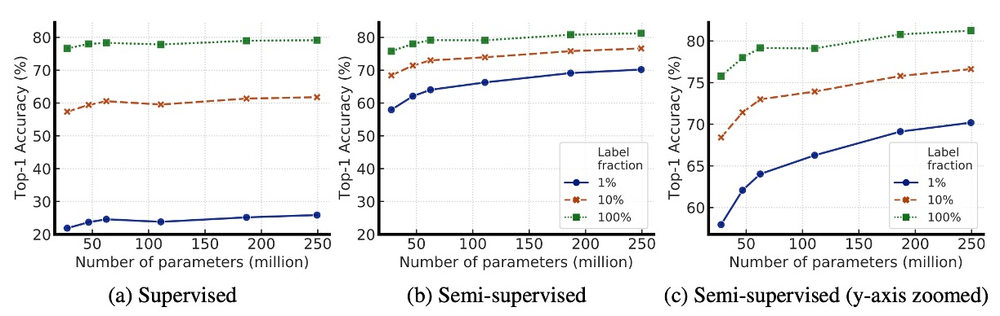
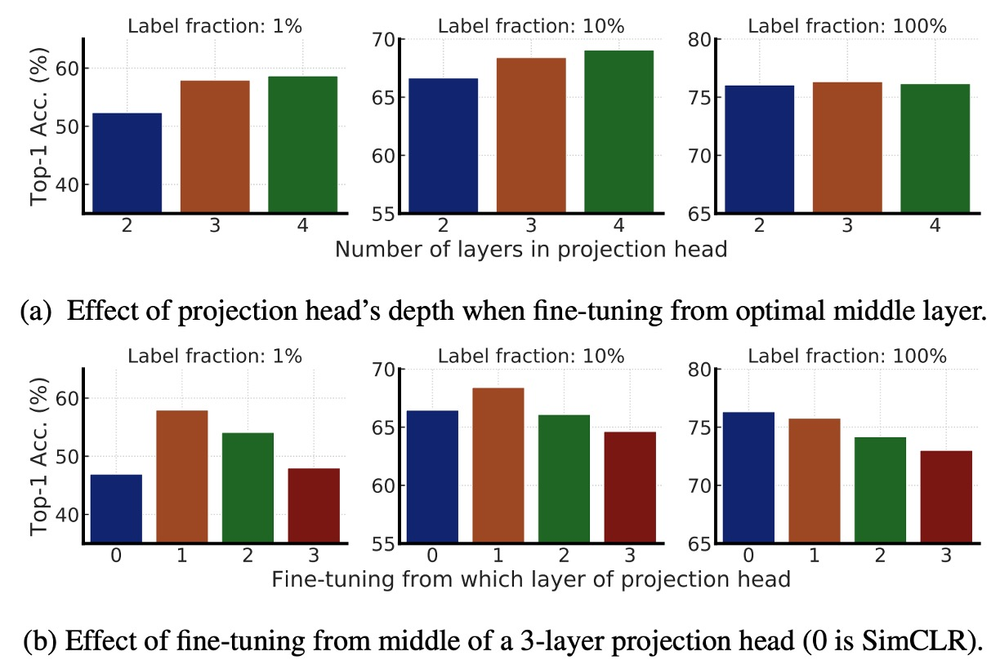

## Big Models Matter

[**Big Self-Supervised Models are Strong Semi-Supervised Learners**](https://arxiv.org/abs/2006.10029)

---

FAIR showcased some muscle with their MoCo v2 paper, claiming that if you don’t have enough computational resources, their "momentum memory" solution can yield better results.

However, the authors of SimCLR (i.e., Google Research) seemed uninterested in continuing the debate and instead shifted focus to another direction:

> **Let’s set aside the issue of computational resources and see what sparks can fly when a "self-supervised" contrastive learning framework is applied to large models.**

:::tip
Not many people can afford to set aside the issue of computational resources. Looking back now, this already signaled that the field of artificial intelligence would ultimately head toward a monopoly of computational power.
:::

:::info
If you're interested in the MoCo v2 paper, check out our previous article:

- [**[20.03] MoCo v2: A Comeback**](../2003-moco-v2/index.md)
  :::

## Defining the Problem

At this point, the well-known GPT-3 paper has already been published on arXiv.

This means that in the NLP field, unlabeled data is being increasingly used to build large language models, followed by fine-tuning with a small amount of labeled data. The "pre-training -> fine-tuning" paradigm has already been established in NLP.

But in the CV field, why doesn’t this seem to be as popular?

Thus, the authors aimed to introduce "large-scale" unlabeled data for pre-training a model based on the SimCLR contrastive learning framework, and use a "small" amount of labeled data for supervised fine-tuning.

The experimental results were impressive, so it was named SimCLR v2.

## Solving the Problem

<figure style={{"width": "90%"}}>

</figure>

This figure shows the architecture of SimCLR v2. The entire framework is divided into three main stages.

1. **Unsupervised Pretraining**:

   In this stage, the model learns general visual features through contrastive learning.

   The method is similar to the previously published SimCLR, where each image undergoes different data augmentations to produce two different views, and representations are learned using the NT-Xent loss function.

   During this stage, the downstream tasks are unknown, so no labeled data is used, making this an unsupervised method.

   :::tip
   For readers who have forgotten what NT-Xent is, here’s a quick review:

   $$
   \ell_{NT-Xent}^{i,j} = - \log \frac{\exp(\text{sim}(z_i, z_j)/\tau)}
   {\sum_{k=1}^{2N} \mathbb{1}[k \neq i] \exp(\text{sim}(z_i, z_k)/\tau)}
   $$

   Where:

   - $\text{sim}(z_i, z_j) = \frac{z_i \cdot z_j}{\|z_i\|\|z_j\|}$ is the cosine similarity.
   - $\tau$ is the temperature parameter, controlling the smoothness of the contrastive learning distribution.
     :::

2. **Supervised Fine-tuning**:

   In this stage, the authors fine-tune the model with a small amount of labeled data to adapt the model to a specific classification task.

   Unlike traditional supervised learning, SimCLR v2 does not completely discard the MLP projection head during fine-tuning. Instead, fine-tuning starts from one of the layers, improving model performance.

   :::tip
   When using a 3-layer prediction head and fine-tuning from the first layer, the accuracy increased by 14% with just 1% labeled data (compared to the 2-layer prediction head in SimCLR).

   The overall improvement is quite remarkable!
   :::

3. **Knowledge Distillation**:

   In this stage, the authors apply knowledge distillation, where the student model learns from the teacher model to improve performance and compress model size. This process minimizes the difference in outputs between the student and teacher models using a distillation loss function.

   The mathematical expression is:

   $$
   L_{\text{distill}} = - \sum_{x_i \in D} \sum_{y} P_T(y | x_i; \tau) \log P_S(y | x_i; \tau)
   $$

   Where:

   $$
   P(y | x_i) = \frac{\exp(f_{\text{task}}(x_i)[y] / \tau)}{\sum_{y'} \exp(f_{\text{task}}(x_i)[y'] / \tau)}
   $$

   - $\tau$ is the temperature parameter used to smooth the teacher model's output probability distribution, making it easier for the student model to learn.

   When some labeled data is available, a weighted combination of the cross-entropy loss from the real labels and the distillation loss can be used:

   $$
   L = -(1 - \alpha) \sum_{(x_i, y_i) \in D_L} \log P_S(y_i | x_i) - \alpha \sum_{x_i \in D} \sum_{y} P_T(y | x_i; \tau) \log P_S(y | x_i; \tau)
   $$

   Where:

   - $D_L$ is the labeled dataset.
   - $\alpha$ is the weighting factor, adjusting the ratio of real labels to distillation.

   :::tip
   **Quick review of knowledge distillation**:

   Knowledge distillation is a method for smaller student models to learn the output distribution from larger teacher models.

   - **Teacher Model**: A strong model optimized via supervised fine-tuning.
   - **Student Model**: Learns the "soft labels" from the teacher model for unlabeled data, rather than using the real labels (Ground Truth).

   The common loss function for aligning output distributions is the standard distillation loss:

   $$
   L_{\text{distill}} = - \sum_{x_i \in D} \sum_{y} P_T(y | x_i; \tau) \log P_S(y | x_i; \tau)
   $$

   The process is similar to cross-entropy loss, but the teacher model’s output probabilities serve as inputs, while the student model’s output probabilities are the targets.

   Finally, if the student model and teacher model have the "same architecture," it is called "self-distillation," which can further improve task-specific performance. If the student model is "smaller," distillation helps compress the model, making it lighter while maintaining high accuracy.
   :::

## Discussion

### Bigger Models Are More Efficient

<figure style={{"width": "90%"}}>

</figure>

The authors first explore the impact of different sizes of ResNet models (changing network depth and width) on semi-supervised learning:

- **Smallest model**: Standard ResNet-50.
- **Largest model**: ResNet-152 (3× + SK).

The experimental results, as shown in the table, indicate that for supervised learning, the accuracy difference between the smallest and largest models is only 4%. However, in the self-supervised learning portion, the accuracy difference from the linear classifier test reaches 8%, and fine-tuning with 1% labeled data increases accuracy by 17%.

Finally, when comparing ResNet-152 (3× + SK) with ResNet-152 (2× + SK), the number of model parameters nearly doubles, but the performance gain is not significant, suggesting that the benefits of increasing model width may have reached a bottleneck.

The following graph illustrates how model size and labeled data fraction affect model performance, exploring whether larger models are better at leveraging limited labeled data.

<figure style={{"width": "90%"}}>

</figure>

From the graph, it is evident that as the model size increases, the accuracy improves. This holds true in both supervised and semi-supervised learning. However, in semi-supervised learning, the performance gain for larger models is more noticeable, indicating that larger models have a greater advantage when labeled data is scarce.

Additionally, when labeled data is limited, the advantage of larger models becomes more prominent. With only 1% or 10% of labeled data available, larger ResNet variants (like ResNet-152 3×+SK) significantly outperform smaller ResNet-50 after fine-tuning.

Although larger models perform better overall, certain architectures (such as Selective Kernel, SK) can achieve similar performance with fewer parameters, suggesting that exploring better model architectures is still a valuable direction, not just blindly increasing model size.

### Deeper Projection Heads Perform Better

<figure style={{"width": "80%"}}>

</figure>

This section mainly investigates the impact of the MLP projection head in SimCLR v2 pretraining and fine-tuning.

- **Figure (a)**: Compares the impact of different projection head depths on pretraining representation learning. The results show that using a deeper projection head performs better during the pretraining phase.
- **Figure (b)**: Compares the effect of fine-tuning starting from different layers. The results show that the best fine-tuning layer is usually the first layer of the projection head, rather than the input layer, especially when labeled data is sparse.

Finally, as the ResNet network size increases, the impact of projection head depth diminishes, suggesting that for larger models, the depth of the projection head has less impact on model performance.

### Knowledge Distillation Effect

<figure style={{"width": "90%"}}>

</figure>

The above figure presents experimental results showing that knowledge distillation brings two main advantages:

1. **When the student model is smaller than the teacher model**: Knowledge distillation can effectively compress the model, allowing the smaller student model to retain the feature learning capability of the teacher model. This is particularly helpful for resource-constrained applications, such as mobile devices.
2. **When the student model has the same architecture as the teacher model (self-distillation)**: Even when the student and teacher models share the same architecture, distillation can still improve semi-supervised learning performance. This is because the distillation process helps the model filter out noise and learn more robust features.

Therefore, to obtain the best ResNet-50 model, the following strategy can be used:

- **Step 1**: First perform self-distillation on ResNet-152 to further improve its performance.
- **Step 2**: Then distill this ResNet-152 into a smaller **ResNet-50**, ensuring high accuracy even with a smaller parameter scale.

### Comparison with Other Methods

<figure style={{"width": "90%"}}>

</figure>

The experimental results in the table above show that SimCLR v2 outperforms previous semi-supervised learning methods on ImageNet, achieving significant improvements on both small models (ResNet-50) and large models (ResNet-152).

This demonstrates that combining knowledge distillation with unlabeled data is an effective semi-supervised learning strategy, not only improving model accuracy but also allowing smaller models to maintain high performance.

## Conclusion

The main research direction of SimCLR v2 is to explore "model performance with limited labeled data" and "the benefits of knowledge distillation."

Let’s summarize the semi-supervised learning framework proposed by the authors, which consists of three steps:

1. **Unsupervised Pretraining**: Learn general image features through self-supervised learning.
2. **Supervised Fine-tuning**: Adapt to a specific classification task using limited labeled data.
3. **Knowledge Distillation**: Use unlabeled data and the teacher model’s soft labels to further enhance the student model’s performance.

This approach, while already common in NLP, remains an underexplored baseline in the CV domain. The authors' experimental results show that this method significantly outperforms existing SoTA methods on ImageNet.

The power of large models in CV is becoming increasingly evident.
