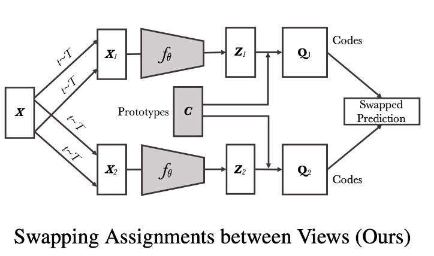
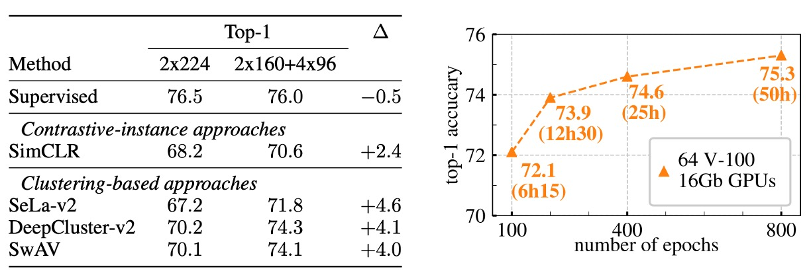

## Swapping Cluster Predictions

[**Unsupervised Learning of Visual Features by Contrasting Cluster Assignments**](https://arxiv.org/abs/2006.09882)

---

There has been some debate between the MoCo and SimCLR series for a while.

Previously, we focused on comparing positive and negative samples in pairs. This time, let's explore a different approach: how about trying clustering?

## Problem Definition

The structure of contrastive learning has largely been established, with several main ingredients:

1. **Using contrastive loss**: InfoNCE (also known as NT-Xent) is one commonly used loss function.
2. **Applying image transformations**: The features of the same image are pulled together, while features of different images are pushed apart.
3. **A large number of negative samples**: The more negative samples, the better the learning effect.

Of course, there are many variations in the details, such as using momentum encoders or memory banks.

The authors of this paper believe: "The large computational resources are still a significant issue!"

What if we change the approach and stop focusing solely on contrastive loss, instead turning it into a "prediction" problem?

We have the model "predict" the cluster assignments of another view, rather than directly comparing the features. The advantage here is that we no longer need to compute all pairwise comparisons but can achieve the same effect through cluster assignments.

:::tip
This idea of "prediction" is also reflected in another paper from the same period, BYOL, but the predicted object differs. BYOL predicts the features of another view, while SwAV predicts the cluster assignments of another view.

Interested readers can refer to our previous article: [**[20.06] BYOL: No Need for Negative Samples**](../2006-byol/index.md)
:::

## Solving the Problem

### Model Architecture

<figure style={{"width": "90%"}}>

</figure>

Looking at this diagram, you’ve essentially understood the paper.

First, the left side shows the currently widely accepted contrastive learning architecture:

In the diagram, you can see that an image $X$ undergoes various transformations (transformations $t \sim T$) to produce two augmented views (e.g., $X_1, X_2$).

These two augmented views are each passed through a convolutional network (or any feature extraction network) $f_\theta$ to output feature vectors ($Z_1, Z_2$).

In contrastive instance learning, the method "directly compares these two feature vectors", such as calculating their similarity (similar to methods like SimCLR, MoCo, etc.). The model aims to bring features from the same image closer together in feature space, while features from different images should be pushed farther apart.

---

<figure style={{"width": "85%"}}>

</figure>

The right side shows the method proposed in this paper, let’s zoom in:

In SwAV, the authors first assign each feature (e.g., $Z_1, Z_2$) to a set of trainable "prototype vectors" (hereafter referred to as prototypes), obtaining corresponding "codes" $Q_1, Q_2$.

This step is represented by "Prototypes C" and "Codes" in the diagram.

Next, the core of SwAV is the "Swapped Prediction", meaning:

1. Use the code $Q_1$ corresponding to the feature of view 1 to guide what the feature of view 2 should learn.
2. Use the code $Q_2$ corresponding to the feature of view 2 to guide what the feature of view 1 should learn.

Thus, SwAV does not directly compare $Z_1$ and $Z_2$, but compares their assignments to the "prototypes" and requires consistent assignments for different views from the same image.

Since prototypes are a set of learnable vectors, they can be seen as "cluster centers" used to map feature vectors to "codes," forming a clustering effect. During training, the model simultaneously learns these prototypes, placing them in positions in feature space that better distinguish different images.

### Online Clustering

An important feature of SwAV is "Online Clustering."

Let’s take a look at how the authors calculate the "code" for each image online and update the prototypes:

For each image $x_n$, a transformation $t$ is randomly sampled from a set of transformations $T$ (e.g., random cropping, horizontal flipping, color jittering), generating an augmented image $x_{nt}$. Then, a convolutional neural network is used to extract feature vectors, and the feature vectors are projected onto the unit sphere, obtaining $z_{nt}$, i.e., normalizing the length of the output vector to 1.

At this point, there is not much difference from previous contrastive learning papers.

Finally, $z_{nt}$ is mapped to $K$ trainable "prototypes" $\{ c_1, \dots, c_K \}$, resulting in a "code" $q_{nt}$.

:::tip
This part is enlightening! Isn't this the concept of the Codebook that we've often seen in recent years?
:::

After obtaining the cluster code for each image, the next step is to perform the swapped prediction:

Two augmented views $(t, s)$ correspond to the same image. Let $(z_t, q_t)$ represent the feature and code for view $t$, and $(z_s, q_s)$ represent the feature and code for view $s$.

- The authors want to use $z_t$ to "predict" $q_s$, and $z_s$ to "predict" $q_t$.
- This differs from directly comparing feature vectors in contrastive learning, here we are comparing "codes."

During training, the cross-entropy loss is used to calculate and the "swapped prediction" problem is performed over the entire dataset.

### Equal Allocation Constraint

To achieve online learning, we only use the features within the "current batch" to calculate the codes, rather than using the entire dataset. This way, the model can update the prototypes through continuously receiving different batches of data, allowing these prototypes to gradually adapt to the diversified feature distribution.

However, if there are no constraints on the prototypes, it's easy for all features to be mapped to the same vector, which can cause model collapse. To avoid this, the authors introduce an "equal allocation constraint," requiring that the allocation of prototypes within each batch be as uniform as possible, ensuring that each prototype receives a similar number of samples.

Suppose the current batch contains $B$ feature vectors, denoted as

$$
Z = [z_1, \dots, z_B],
$$

and $K$ prototypes are denoted as

$$
C = [c_1, \dots, c_K].
$$

We aim to optimize an allocation matrix $Q$ to achieve the best matching between features and prototypes. The objective function

$$
\mathrm{Tr}(Q^\top C^\top Z)
$$

represents the total similarity between all features and prototypes, while the entropy regularization term $\epsilon\,H(Q)$ (where $H(Q) = -\sum_{ij} Q_{ij} \log Q_{ij}$) is used to prevent overly concentrated allocations. This design encourages the model to maintain discriminative power while avoiding all features being concentrated on just a few prototypes.

In actual optimization, we restrict $Q$ to a specific set $\mathcal{Q}$, defined as:

$$
\mathcal{Q} = \Bigl\{ Q \in \mathbb{R}_{+}^{K \times B} \;\Big|\;
Q\,\mathbf{1}_{B} = \tfrac{1}{K}\,\mathbf{1}_{K}, \quad
Q^\top \mathbf{1}_{K} = \tfrac{1}{B}\,\mathbf{1}_{B} \Bigr\},
$$

where $\mathbf{1}_K$ and $\mathbf{1}_B$ represent the all-one vectors of dimensions $K$ and $B$, respectively. In operations research, such a set is known as the "transportation polytope," which requires that the sum of each row (representing each sample) and each column (representing each prototype) is a fixed constant, ensuring that each prototype is allocated approximately $\frac{B}{K}$ samples.

The smoothing parameter $\epsilon$ in the entropy regularization term plays a key role: if $\epsilon$ is too large, the allocation results will become too uniform, losing discriminative power; if $\epsilon$ is too small, the allocation may become overly concentrated, leading to model collapse. Experimental results show that using a smaller $\epsilon$ achieves a better balance.

During the solution process, we first obtain the continuous solution $Q^*$. To solve this while satisfying both the transportation polytope constraints and the exponential mapping form, the authors use the Sinkhorn-Knopp algorithm. This algorithm iteratively normalizes the rows and columns, calculating the corresponding diagonal matrices $\mathrm{Diag}(u)$ and $\mathrm{Diag}(v)$, ensuring that the resulting $Q^*$ satisfies both row and column sum conditions. The form is:

$$
Q^* = \mathrm{Diag}(u)\,\exp \Bigl(\tfrac{C^\top Z}{\epsilon}\Bigr)\,\mathrm{Diag}(v).
$$

In experiments, it was found that typically only about 3 iterations are needed to achieve the desired effect, and this computation places very little load on the GPU.

Additionally, in small batch cases, when the number of features $B$ in a batch is much smaller than the number of prototypes $K$, a single batch may not guarantee that every prototype receives enough samples. To address this, the authors keep the features from previous batches, accumulating them into a larger feature set, and then perform the allocation computation collectively. However, during backpropagation, only the samples from the current batch are updated.

For example, in practice, about $3K$ features are kept in the cache (for instance, when $K = 3000$, 9000 features are retained), which is roughly equivalent to 15 batches (assuming each batch size is 256). In contrast, some contrastive learning methods (like MoCo) often need to retain tens of thousands of features or samples, making SwAV's storage requirements more economical and efficient.

:::tip
It's like we want to throw 100 balls into 10 boxes. To avoid all the balls being thrown into the same box, we need a mechanism to ensure that each box gets an evenly distributed number of balls.

The algorithm above solves this problem, ensuring that each "prototype" vector is "as evenly as possible" allocated to feature vectors.
:::

### Multiple Crops

Previous studies mostly used random crops to capture the relationships of different parts of an image (such as scenes or objects). Through cropping different regions, the model can learn both local features and the global structure.

Theoretically, the more views we have, the more robust feature representations we can obtain. However, increasing the number of crops (or views) leads to quadratic growth in computational and memory requirements, because each additional crop requires extra computation for its features and subsequent code.

To provide more views without significantly increasing computational load, the authors propose a multi-crop strategy:

1. **Two standard resolution crops**: These two crops retain the full details of the image and are used for subsequent code calculation.
2. **Additional $V$ low-resolution crops**: These low-resolution crops only cover part of the image, but since their size is smaller, the computational cost is lower.

Using low-resolution crops significantly reduces the extra computational burden, as the computation resources required for processing low-resolution images are much less than those for high-resolution images. This means we can obtain more views from the same image without significantly impacting overall computation time and memory usage.

The original loss function was used for the swapped prediction loss between two views. Under the multiple crops strategy, the loss function is generalized as:

$$
L(z_{t_1}, z_{t_2}, \dots, z_{t_{V+2}}) = \sum_{i \in \{1,2\}} \sum_{\substack{v=1 \\ v\neq i}}^{V+2} \ell(z_{t_v}, q_{t_i})
$$

Here, $z_{t_1}$ and $z_{t_2}$ represent the features from the two standard resolution crops. The remaining $z_{t_v}$ ($v=3,\dots,V+2$) represent the features from the low-resolution crops.

The authors only use the high-resolution crops to calculate the "codes" and then use these codes to compare the features of all other crops (including the low-resolution ones).

:::tip
**Why calculate codes only for high-resolution crops?**

Calculating codes for all crops would significantly increase computational costs, and low-resolution crops only contain local information, which would reduce the quality of code assignments. In practice, it has been found that using codes from the full-resolution crops maintains better transfer learning performance.
:::

## Discussion

The authors utilize the features learned by SwAV and perform transfer learning on multiple datasets to validate the generalizability and practicality of these features. They introduce several improvements from SimCLR, including:

- **LARS (Layer-wise Adaptive Rate Scaling)**: Helps stabilize the learning rate during large-batch training.
- **Cosine Learning Rate**: Uses a cosine annealing strategy to adjust the learning rate, making the training process smoother.
- **MLP Projection Head**: Projects the features through an additional fully connected layer (MLP) to further enhance feature representation.

### Experimental Results

We focus on evaluating the unsupervised features on ImageNet.

The method involves extracting features from a ResNet-50 network (pretrained with SwAV), fixing them, and not fine-tuning. A linear classifier is then trained on these "frozen" features.

The results are shown in the table below:

<figure style={{"width": "90%"}}>

</figure>

SwAV's linear classification accuracy is 4.2% higher in Top-1 accuracy than the state-of-the-art methods at the time and only 1.2% lower than the fully supervised model. In this experiment, SwAV used large batches (4096) and trained for 800 epochs.

The right side of the figure shows the performance of ResNet-50 models with different widths on unsupervised feature learning.

The results show that as the model width increases, SwAV's performance also improves. For larger models, the gap between SwAV and the fully supervised model is only 0.6%. These results not only validate the effectiveness of SwAV but also demonstrate the potential of unsupervised learning in large-scale image classification and downstream tasks.

### Ablation Study: Multiple Crops

<figure style={{"width": "90%"}}>

</figure>

The above figure demonstrates the effect of the multi-crop strategy. The experiment was conducted on the ImageNet dataset, using ResNet-50 as the base network.

The left graph compares clustering-based methods with contrastive instance methods.

The experimental results show:

- **Without multiple crops**: SwAV and DeepCluster-v2 achieve about 2% higher Top-1 accuracy compared to SimCLR.
- **With multiple crops**: Both show a more significant improvement over SimCLR, with a 3.5% increase.

This indicates that using clustering strategies (especially the improved version) has great potential in learning visual features, and its performance is better than relying solely on instance-based contrastive methods.

From the results, SwAV and DeepCluster-v2 have very similar performances, but the key difference lies in the training modes:

- DeepCluster-v2 requires multiple passes over the entire dataset to update cluster centers and assignment results, so it is not suitable for online training. On large-scale datasets, it usually can only perform a single pass, and DeepCluster-v2 cannot function well under such conditions.
- SwAV, on the other hand, employs a direct swapping assignment strategy at the batch level, meaning it can update online and achieve ideal results even with a single pass through the data.

From another perspective, DeepCluster-v2 can be viewed as a special case of SwAV's swapping mechanism: in DeepCluster-v2, swapping happens between different training epochs, using the previous epoch's assignment results to predict the assignment for a current augmented view; whereas SwAV performs the swapping within the same batch, making it more suited for online training environments.

## Conclusion

SwAV uses a learnable cluster center, no longer directly comparing image features. Instead, it maps the features to the cluster centers they represent and then swaps information between different views.

This process acts as a kind of intermediary language, helping the model maintain consistency in unsupervised learning and capture the internal structure and relationships of images. Ultimately, this design not only allows the model to achieve performance on feature learning that is close to or even better than supervised learning, but it also showcases the potential of this approach in the field of unsupervised learning.
