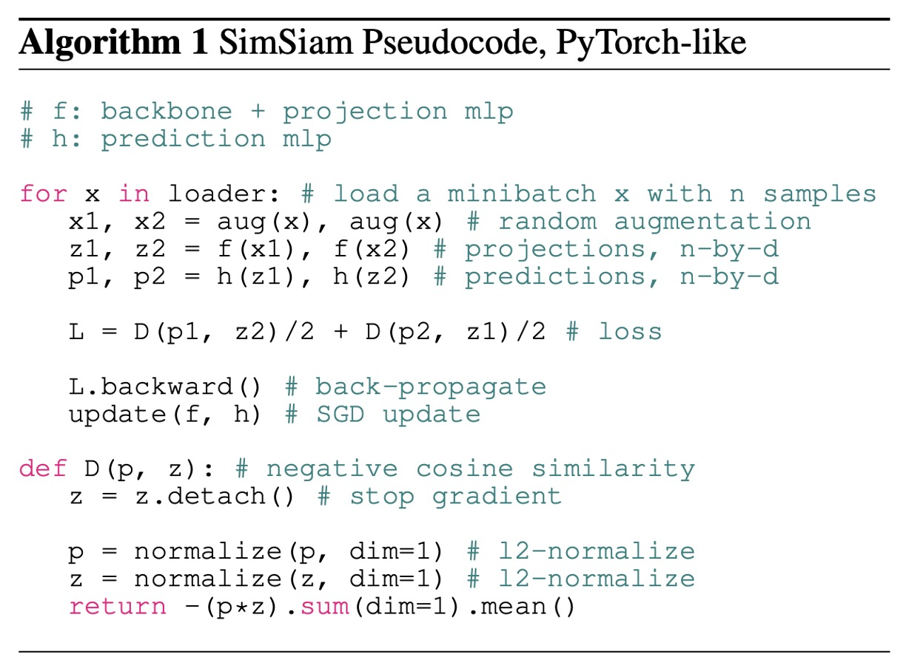

## You Can Not Pass!

[**Exploring Simple Siamese Representation Learning**](https://arxiv.org/abs/2011.10566)

---

Although we often refer to it as contrastive learning, this field should actually be called representation learning, and "contrastive" learning is simply one widely used approach.

In addition to contrastive learning, there are other learning methods, such as "self-prediction" or "cluster centers," which continue to push the performance of representation learning. However, the field still seems to lack consensus on what the key factors influencing representation learning are.

This paper is quite rich in content, so let's take a closer look.

## Defining the Problem

Some of the recent methods have adopted a Siamese network architecture to address the issue of representation learning.

However, Siamese networks are prone to collapse, where the outputs converge to a constant value.

To solve the collapse problem, past research has proposed several approaches:

- **Contrastive Learning**: Avoids collapse by using negative samples.
- **Clustering**: Introduces negative samples indirectly through clustering.
- **Momentum Encoder**: Uses momentum updates to maintain branch differences and avoid collapse.

So, is it possible to avoid collapse effectively without using any of these strategies (negative samples, clustering, momentum encoder)?

:::tip
This paper extensively compares previous related research. It is recommended that readers check out these references when they have time:

- [**[20.02] SimCLR v1: Winning with Batch Size**](../2002-simclr-v1/index.md)
- [**[20.03] MoCo v2: A Comeback**](../2003-moco-v2/index.md)
- [**[20.06] BYOL: No Need for Negative Samples**](../2006-byol/index.md)
- [**[20.06] SwAV: Swapping Cluster Predictions**](../2006-swav/index.md)
  :::

## Solving the Problem

<figure style={{"width": "90%"}}>

</figure>

The method proposed in this paper is called **SimSiam**, short for Simple Siamese Network.

Its goal is to perform unsupervised representation learning with the simplest Siamese network architecture:

First, a single input image $ x $ undergoes two random augmentations to create two different views: $ x_1, x_2 $.

These two views are fed into a shared-weight encoder $f$, which consists of two sub-networks:

1. **Backbone**: For example, ResNet-50.
2. **Projection Network (Projection MLP)**: A multilayer perceptron that maps the output of the backbone into the latent space.

Then, the output of one view is passed through a **Prediction Network (Prediction MLP)** $h$ to have the two views predict each other.

The evaluation is done using negative cosine similarity:

- Let $ p_1 = h(f(x_1)) $, the output vector after passing through the prediction network $h$.
- Let $ z_2 = f(x_2) $, the output vector of the other view after passing through the encoder $f$.

The loss function $D$ is defined as:

$$
D(p_1, z_2) = -\frac{p_1}{\|p_1\|_2} \cdot \frac{z_2}{\|z_2\|_2}
$$

- $\|\cdot\|_2$ represents the $L_2$ norm of a vector (i.e., its Euclidean length).

The greater the cosine similarity, the more similar the two vectors are, so the authors minimize the negative cosine similarity (which is equivalent to maximizing cosine similarity). This expression is equivalent to the mean squared error (MSE) between normalized vectors (differing only by a scale factor).

To allow the two views to predict each other symmetrically, the final loss function $ L $ is defined as the average of the cosine similarity in both directions:

$$
L = \frac{1}{2} D(p_1, z_2) + \frac{1}{2} D(p_2, z_1)
$$

The theoretical minimum of this loss function is -1, meaning the two vectors are perfectly aligned.

At this point, there isn't much difference from previous research, and the core concept of this paper is introduced next.

### Stop Gradient

To prevent the model from collapsing during training, the key technique proposed by the authors is:

- **Stop gradient operation!**

In practice, the equation is rewritten as:

$$
D(p_1, \text{stopgrad}(z_2))
$$

$\text{stopgrad}(z_2)$ means that in this equation, the vector $ z_2 $ is treated as a constant and does not propagate gradients back to the encoder $ f $.

The same method is applied in the other direction, and the final loss function is written as:

$$
L = \frac{1}{2} D(p_1, \text{stopgrad}(z_2)) + \frac{1}{2} D(p_2, \text{stopgrad}(z_1))
$$

In this way, each branch's encoder only receives gradients from the prediction vectors (such as $p_1$ or $p_2$), and not from its own vector, thus preventing the collapse problem.

The authors provide detailed implementation methods in the paper:

<figure style={{"width": "70%"}}>

</figure>

## Discussion

Why? Why is it that such a simple method can make the model converge?

Let's first look at the results briefly, as the authors provide extensive derivations and arguments later on.

### Comparison with Other Methods

<figure style={{"width": "90%"}}>

</figure>

The authors compare SimSiam with other mainstream unsupervised representation learning methods (SimCLR, MoCo v2, SwAV, BYOL). The comparison conditions include:

- Using the standard ResNet-50 architecture.
- Pretraining is done on ImageNet with image size $224\times224$, and each method uses two different views.
- Linear classification is used as a metric to evaluate the quality of representation learning.

The authors emphasize that, for fair comparison:

- All results are **self-reproduced** by the authors.
- SimCLR, SwAV, and MoCo v2 are slightly improved by the authors (e.g., increasing the number of layers in the projection MLP and adopting a symmetric loss function), and these improvements are marked as "+" in the results.

Experimental results show that, despite SimSiam not using negative samples or a momentum encoder, it performs very competitively overall. In particular, with shorter training times (e.g., 100 epochs), **SimSiam outperforms all other methods** (with an accuracy of 67.7%), surpassing SimCLR, MoCo v2, SwAV, and other methods. When the training epochs increase (e.g., 200 or 400 epochs), SimSiam’s performance improvement is smaller, but it still maintains a highly competitive level.

Although SimSiam is extremely simple, it excels in training efficiency in the medium-to-short term.

### Exploration of Basic Architecture Design

<figure style={{"width": "70%"}}>

</figure>

To compare various architectures in more detail, the authors provide model architecture diagrams for different setups:

- **Comparison with SimCLR**

  SimSiam outperforms SimCLR significantly in all experimental settings.

  In this paper, **SimSiam can be seen as "SimCLR without negative samples"**, and this result validates the effectiveness of SimSiam, showing that even without contrastive learning (negative samples), the model can avoid collapse and achieve better performance.

  Therefore, negative samples are not a necessary design for good performance in representation learning.

- **Comparison with BYOL**

  BYOL uses a momentum encoder (inherited from the MoCo series), whereas SimSiam does not.

  In the experiments, BYOL performs slightly better than SimSiam in long-term training (e.g., over 200 epochs), but SimSiam shows that without a momentum encoder, it can still achieve similar performance, especially in shorter epochs.

  In this paper, **SimSiam can be seen as "BYOL without a momentum encoder"**, which suggests that a momentum encoder is not necessary for preventing model collapse.

  Therefore, while momentum encoders can improve performance, they are not a necessary design for preventing model collapse.

- **Comparison with SwAV**

  SwAV essentially uses online clustering and Sinkhorn-Knopp (SK) transformations.

  In this paper, **SimSiam can be viewed as "SwAV without online clustering"**, and while SwAV includes these additional components, it performs better in longer-term training (200 epochs), but does not show a significant advantage over SimSiam in shorter-term training (100 epochs).

  Therefore, while online clustering in SwAV is effective, it is not a necessary factor for short-term collapse prevention.

### Ablation Studies

- **Necessity of Stop-Gradient**

  

  In the same model architecture and hyperparameter settings, one group uses stop-gradient, while the other completely removes it.

  The experimental results show that without stop-gradient, the model quickly collapses, and the training loss reaches the theoretical minimum of -1, with the standard deviation of the output vector approaching zero, indicating that the model has collapsed into a constant vector.

  After adding stop-gradient, the feature distribution becomes normal, and the standard deviation approaches $\sqrt{\frac{1}{d}}$, indicating that the vectors are evenly distributed on the unit hypersphere, effectively preventing collapse.

  Therefore, the network architecture design alone (predictor, BN, $L_2$ normalization) is insufficient to prevent collapse, while stop-gradient is a crucial design.

- **Analysis of the Role of the Predictor ($h$)**

   

   <figure style={{"width": "70%"}}>
   
   </figure>
   

  The authors further analyze the role of the predictor network $h$ in the model.

  The experiment shows that when the predictor $h$ is removed (i.e., set $h$ as an identity map), the model immediately collapses, because the symmetric loss function combined with the identity map causes stop-gradient to lose its effect.

  If the predictor $h$ is initialized randomly but fixed and not updated, the model does not collapse but fails to converge, resulting in high loss. This indicates that the predictor $h$ must be updated in accordance with the model's feature learning.

  Therefore, the predictor network $h$ is an essential component of SimSiam, and must be trained along with the encoder.

- **Analysis of Batch Size Impact**

  

  The authors investigate the model's performance across different batch sizes, ranging from 64 to 4096, with linear learning rate adjustments. All experiments use SGD (not using the LARS optimizer).

  The experimental results show that SimSiam is not sensitive to batch size, unlike SimCLR or SwAV, which require large batch sizes.

- **Analysis of Batch Normalization (BN) Impact**

    

   <figure style={{"width": "80%"}}>
   
   </figure>
   

  The authors test the impact of BN on the model.

  The experimental results are as follows:

  - (a) Completely removing BN from the MLP: no collapse, but poor performance (34.6%) and difficult optimization.
  - (b) Adding BN to the hidden layers: significant improvement to 67.4%.
  - (c) Adding BN to the projection MLP output layer: further improvement to 68.1% (best setting).
  - (d) Adding BN to the prediction MLP output layer: training instability and oscillation.

  Therefore, BN helps stabilize and accelerate model convergence but does not directly relate to preventing collapse.

- **Analysis of Replacing Similarity Functions**

  The authors replace cosine similarity with cross-entropy similarity to examine the model's stability.

  Experimental results:

  - Cosine similarity: 68.1%
  - Cross-entropy similarity: 63.2%
  - Both methods prevent collapse, but cosine similarity performs better.

  The conclusion is that the specific similarity function does not have a direct relationship with model collapse; the model design itself is more important.

- **Symmetry of Loss Function (Symmetrization) Analysis**

  The authors investigate whether the loss function needs to be symmetric.

  Experimental results:

  - Symmetric version (sym): 68.1%
  - Asymmetric version (asym): 64.8%
  - Asymmetric version with doubled sampling (asym 2×): 67.3%

  The conclusion is that symmetric loss functions positively impact model performance but are not a necessary condition to prevent model collapse.

## Expectation-Maximization Hypothesis

:::tip
Mathematical Warning! The following content involves optimization and mathematical derivation.
:::

Through experiments, the authors found that the core design of SimSiam, the "stop-gradient," effectively prevents model collapse and leads to excellent representation learning results. But why is this simple operation so effective? What underlying principle is hidden behind it?

To explain the mechanism, the authors propose a key hypothesis:

> **SimSiam implicitly solves an optimization problem similar to "Expectation-Maximization (EM)."**

### Mathematical Representation

The authors suggest that SimSiam is mathematically equivalent to solving the following optimization problem, where the loss function is defined as:

$$
L(\theta, \eta) = \mathbb{E}_{x, T}\left[\|F_{\theta}(T(x)) - \eta_x\|^2_2\right]
$$

Where:

- $F_{\theta}$: is the encoder network determined by parameters $\theta$.
- $T(x)$: represents the image $x$ after random data augmentation.
- $\eta$: is a set of additional optimization variables, where each image $x$ has a corresponding representation vector $\eta_x$.
- $\eta_x$: can intuitively be understood as the "feature representation" of image $x$, but it is not directly output by the neural network; it is instead a variable optimized through the process.

Thus, SimSiam implicitly solves the following optimization problem:

$$
\min_{\theta,\eta} L(\theta,\eta)
$$

This optimization problem is similar to the classic "K-means clustering" problem:

- $\theta$: corresponds to the cluster centers, learned from the shared features of images.
- $\eta_x$: corresponds to the assignment of each sample in the cluster (cluster assignment).

This problem can be solved using "alternating optimization":

1. **Fix $\eta$, optimize $\theta$**:

$$
\theta^t \leftarrow \arg\min_{\theta}L(\theta,\eta^{t-1})
$$

In this step, since $\eta^{t-1}$ is fixed as a constant, gradients will not propagate back to $\eta^{t-1}$, which naturally leads to the stop-gradient operation.

---

2. **Fix $\theta$, optimize $\eta$**:

$$
\eta^t \leftarrow \arg\min_{\eta}L(\theta^t,\eta)
$$

This step is independent for each image $x$, and the optimal solution is to set the representation $\eta_x$ for each image equal to the average feature of the image after all augmentations:

$$
\eta_x^t \leftarrow \mathbb{E}_T\left[F_{\theta^t}(T(x))\right]
$$

### SimSiam's EM Approximation

SimSiam actually approximately executes the alternating optimization of the above EM algorithm, but with a simple yet important approximation:

- The expectation, which should be averaged, is approximated by using only a single image augmentation $T'$, i.e.:

$$
\eta_x^t \leftarrow F_{\theta^t}(T'(x))
$$

- This approximated representation $\eta_x^t$ is then fed back into the original $\theta$ optimization problem, yielding the actual loss function used in SimSiam:

$$
\theta^{t+1}\leftarrow\arg\min_{\theta}\mathbb{E}_{x,T}\left[\|F_\theta(T(x))-F_{\theta^t}(T'(x))\|^2_2\right]
$$

This form directly reflects the Siamese network architecture and naturally introduces the stop-gradient operation.

### The True Role of the Predictor

The aforementioned EM hypothesis does not explain the necessity of the predictor $h$, so the authors further hypothesize:

- The function of the predictor network $h$ is actually to approximate the expectation of another image augmentation:

$$
h(z_1) \approx \mathbb{E}_T[F_\theta(T(x))]
$$

Since it is not feasible to directly compute the expectation over all image augmentations, the predictor network $h$ is trained to learn and approximate this expectation. Therefore, the predictor essentially serves as an approximation tool to make up for the lack of expectation computation.

### The Effect of Symmetric Loss Function

The authors also note that the above EM hypothesis does not require the use of a symmetric loss function (symmetrized loss). The effect of symmetrization is essentially like taking an additional pair of image augmentations $(T_1, T_2)$ at each optimization step, which helps more accurately approximate the expectation and can improve model accuracy. However, it is not a necessary condition to prevent collapse.

### Experimental Validation of the Hypothesis

The authors conducted two concept verification experiments to support the above EM hypothesis:

1.  **Multi-step Alternating Updates**

        The experiment found that increasing the number of alternating optimization steps (e.g., 10 steps, 100 steps) still yields good results, even better than the original SimSiam:

        - 1-step (SimSiam): 68.1%
        - 10-step: 68.7%
        - 100-step: 68.9%
        - 1-epoch: 67.0%

        This supports the effectiveness of EM alternating optimization.

2.  **Verification of Image Augmentation Expectation Approximation**

        By using a moving average to approximate the expectation, even without the predictor network $h$, reasonable performance (55.0%) can still be achieved. If the moving average is not used and the predictor is removed, the model collapses completely (0.1%).

        This confirms that the presence of the predictor indeed serves to compensate for the lack of expectation computation.

---

While the authors have proposed a reasonable EM hypothesis, they have not fully explained why the model collapse can be prevented. They speculate that it may be related to the initialization and path of the alternating optimization, but this remains an intuitive level of explanation and requires further theoretical exploration in the future.

## Conclusion

In this paper, the authors explored the "extremely simple design of Siamese networks," and despite the simplicity of the SimSiam architecture (no negative samples, no clustering, no momentum encoder), it still performs very competitively across various experiments.

This suggests that the success of recent mainstream self-supervised methods (such as SimCLR, MoCo, SwAV, BYOL) may not stem from the various additional complex designs but fundamentally from their "shared Siamese network architecture itself"!

The minimalist Siamese network architecture might be the real core reason behind the success of recent representation learning, warranting further exploration and research.
