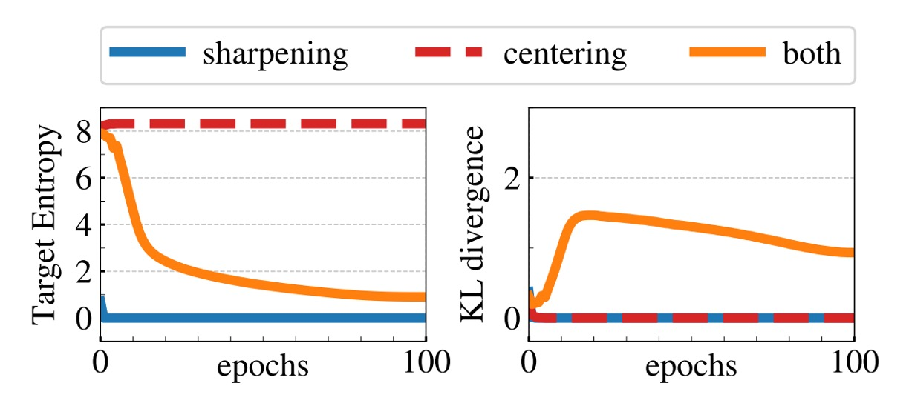
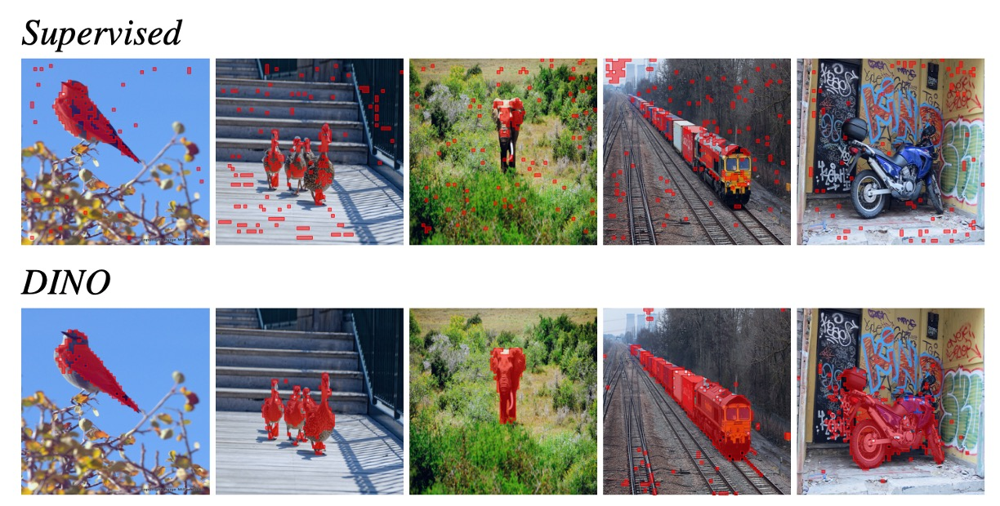

## Self-Distillation With No Labels

[**Emerging Properties in Self-Supervised Vision Transformers**](https://arxiv.org/abs/2104.14294)

---

This paper was published around the same time as MoCo v3, but it performs significantly better.

Although the acronym of the paper's title comes from self-**di**stillation with **no** labels, abbreviated as DINO, it should be pronounced like "dinosaur" in English, as DI-NO, not Dee-No.

:::tip
This judgment is based on the presence of various little dinosaurs on their Github...

- [**https://github.com/facebookresearch/dino**](https://github.com/facebookresearch/dino)
  :::

## Defining the Problem

Do you remember BYOL?

If not, no worries, here’s a brief introduction. The BYOL architecture looks like this:

<figure style={{"width": "80%"}}>

</figure>

BYOL first introduced the classic concept that negative samples are "unnecessary" in the process of representation learning.

The core components of BYOL are three:

1. **Siamese networks**: An online network and a target network, where the target network updates its parameters through exponential moving average (EMA).
2. **Stop gradient**: The target network does not propagate gradients during training.
3. **Additional MLP layer**: The only difference between the online and target networks is that the online network has an additional MLP for prediction.

:::tip
If you are interested in the details of BYOL, you can refer to the paper we previously read:

- [**[20.06] BYOL: No Need for Negative Samples**](../2006-byol/index.md)
  :::

In this paper, the authors were inspired by BYOL and decided to make slight modifications to this structure.

The changes are minimal, just two:

1. **Change the loss function**: BYOL uses MSE, while here it is changed to similarity matching loss.
2. **Remove the additional MLP layer**: This means the siamese network architecture here is exactly the same for both networks.

It may seem like not much, but this form is not without reasoning. The authors based it on this paper:

- [**[17.03] Mean Teachers Are Better Role Models**](https://arxiv.org/abs/1703.01780)

This paper proved that in a Teacher-Student network, using a moving average for the teacher network is more effective than using fixed network parameters.

:::info
Knowledge distillation is a training method in which we aim to have the student network mimic the output of the teacher network.
:::

## Solving the Problem

<figure style={{"width": "50%"}}>

</figure>

After modifying the BYOL architecture, it looks like the figure above.

Given an input image $x$, the two networks each output a $K$-dimensional feature vector, which is converted to a probability distribution via the softmax function. For the student network (left side of the image), the probability for the $i$-th dimension, $P_s(x)(i)$, is defined as:

$$
P_s(x)^{(i)} = \frac{\exp\left(\frac{g_{\theta_s}(x)^{(i)}}{\tau_s}\right)}{\sum_{k=1}^{K} \exp\left(\frac{g_{\theta_s}(x)^{(k)}}{\tau_s}\right)}
$$

Where $\tau_s > 0$ is the temperature parameter used to control the sharpness of the output distribution. Similarly, for the teacher network (right side of the image), the probability distribution $P_t$ is defined using a temperature $\tau_t$.

Assuming the teacher network $g_{\theta_t}$ is fixed, we aim to make the output distribution of the student network, $P_s(x)$, as similar as possible to the output distribution of the teacher network, $P_t(x)$. This is achieved by minimizing the cross-entropy loss between them:

$$
\min_{\theta_s} H(P_t(x), P_s(x))
$$

Where the cross-entropy $H(a, b) = -\sum a \log b$ measures the difference between two distributions.

Since self-supervised learning does not use labels, the authors employ a common technique in contrastive learning, where different augmentations of the same image are used to generate different "views."

In this architecture, **all views are input to the student network, and only global views are input to the teacher network**. This design encourages the "local-to-global" correspondence.

For each global view $x \in \{x^g_1, x^g_2\}$ and other views processed by the student network $x'$ (where $x' \neq x$), the cross-entropy loss is calculated, and the total loss is minimized:

$$
\min_{\theta_s} \sum_{x \in \{x^g_1, x^g_2\}} \sum_{\substack{x' \in V \\ x' \neq x}} H(P_t(x), P_s(x'))
$$

This loss function is general for the number of views, and can be used even with just two views; the standard setting in this paper uses two global views and multiple local views as basic parameters.

The student network's parameters $\theta_s$ are optimized by minimizing the above loss function using stochastic gradient descent (SGD).

The teacher network's parameters $\theta_t$ are updated using EMA from the student network's parameters $\theta_s$, with the update rule as follows:

$$
\theta_t \leftarrow \lambda \theta_t + (1 - \lambda) \theta_s
$$

This update method is similar to the momentum encoder, where the coefficient $\lambda$ follows a cosine schedule from 0.996 to 1 during training.

### Preventing Model Collapse

The issue with this type of siamese network self-supervised method is that the model often collapses unexpectedly. Previous studies have mostly used contrastive loss, clustering, and other methods to prevent the model from collapsing into a trivial solution. However, the authors here adopted centering and sharpening strategies.

- **Centering:**

  The centering operation adds a bias term $c$ to the output of the teacher network, defined as:

  $$
  g_t(x) \leftarrow g_t(x) + c
  $$

  This prevents any particular dimension from overly dominating the output, while simultaneously encouraging a more uniform distribution. Additionally, to ensure that the centering operation works stably under different batch sizes, the center $c$ is updated using exponential moving average:

  $$
  c \leftarrow m c + (1 - m) \frac{1}{B} \sum_{i=1}^{B} g_{\theta_t}(x_i)
  $$

  where $m > 0$ is the rate parameter and $B$ is the batch size. This update ensures that the center $c$ only depends on the first-order statistics of the batch.

- **Sharpening:**

  The sharpening operation is achieved by using a lower temperature $\tau_t$ in the teacher's softmax normalization, which makes the teacher’s output probability distribution sharper. This balances the uniform tendency caused by centering, helping to prevent model collapse.

## Discussion

### Comparison with Other Methods

<figure style={{"width": "60%"}}>

</figure>

Based on experimental results, the authors categorized the comparisons into "same architecture" and "cross-architecture" comparisons:

1. **Comparison within the Same Architecture:**

   - **ResNet-50 Architecture:**
     DINO achieves results on ResNet-50 that are comparable to the best existing self-supervised methods, verifying that DINO can perform on par with other methods under standard settings.
   - **ViT-S Architecture:**
     When using ViT-S (designed based on DeiT-S), DINO’s performance significantly surpasses BYOL, MoCov2, and SwAV.
     - It improved by 3.5% in linear classification tasks.
     - It improved by 7.9% in k-NN evaluation.
       Additionally, the performance obtained using a simple k-NN classifier (74.5%) is very close to the linear classifier (77.0%). This phenomenon is unique to the ViT architecture and is not seen in other self-supervised methods or ResNet-50.

2. **Cross-Architecture Comparison:**

   This section primarily explores the extreme performance of DINO-trained ViT models across different scale architectures, rather than directly comparing various methods.

   From the experimental results, it appears that scaling up the ViT model indeed improves performance, but the impact of reducing the patch size (i.e., the “/8” variant) is more significant. Reducing the patch size doesn’t increase the number of parameters, but it greatly reduces the running time (by 1.4 times) and significantly improves performance, although it does increase memory usage.

   A basic ViT model using an 8×8 patch and trained with DINO achieves a top-1 accuracy of 80.1% in linear classification and 77.4% in k-NN classification, with only one-tenth of the parameters of previous best methods.

In summary, DINO not only performs excellently on the standard ResNet-50 architecture but also shows significant performance improvements in the ViT architecture, especially by reducing the patch size. This results in a substantial improvement in performance and a significant increase in operational efficiency.

:::tip
When we first read this part of the paper, we were quite confused.

From the table, the higher the value of im/s, the faster the model's inference speed. For example, the standard ViT-S model (with a larger patch size) has 1007 im/s, while ViT-S/8 (with a patch size of 8×8) drops to 180 im/s. This suggests that, for the same architecture, reducing the patch size increases computational load and slows down inference speed.

The paper states:

> "While reducing the patch size do not add parameters, it still leads to a significant reduction of running time, and larger memory usage."

This could easily be misunderstood as "reducing the patch size significantly accelerates inference." In reality, reducing the patch size, while not increasing the number of parameters, increases the input sequence length, which slows down im/s (inference speed) and increases memory usage.

What the authors likely intended to convey is that reducing the patch size significantly improves performance (e.g., top-1 accuracy), and compared to some large models, it still maintains superior overall operational efficiency (when compared to previous SOTA methods).

At least, that's how we interpreted it. If we misunderstood, we welcome corrections from readers.
:::

### Importance of Different Components

<figure style={{"width": "60%"}}>

</figure>

The authors conducted a series of experiments to assess the importance of various components:

- **No Momentum (Row 2 in the table):**
  Without the momentum encoder, the entire framework fails to converge, meaning the model cannot learn useful representations.
- **Operations to Prevent Collapse (e.g., SK):**
  To prevent collapse, certain advanced operations like SK are necessary. However, experiments show that once momentum is added, the effect of additional SK becomes less significant (contrast rows 3 and 9 in the table), highlighting the critical role of the momentum encoder in preventing collapse and improving performance.
- **Multi-View (multi-crop) and Cross-Entropy Loss:**
  Experiments (rows 4 and 5) show that multi-view training and the cross-entropy loss used by DINO are crucial for obtaining good features.
- **Effect of the Predictor:**
  Adding a predictor to the student network has limited impact on performance, while in BYOL, the predictor is a critical component for preventing collapse.

### Model Collapse Testing

<figure style={{"width": "80%"}}>

</figure>

Generally, the two most common types of collapse are:

- The model outputs the same result for different inputs, collapsing into a uniform distribution.
- One dimension overly dominates, leading to an imbalanced output.

The centering operation, which adds a bias $c$ to the teacher’s output ($g_t(x) \leftarrow g_t(x) + c$), prevents any one dimension from dominating too much, but it might cause the output to become more uniform. In this case, the sharpening operation, which uses a lower temperature $\tau_t$ in the teacher's softmax normalization, sharpens the output distribution, counteracting the uniform tendency caused by centering.

Mathematically, the cross-entropy $H(P_t, P_s)$ can be decomposed into the teacher’s output entropy $h(P_t)$ and the KL divergence $D_{KL}(P_t \| P_s)$:

$$
H(P_t, P_s) = h(P_t) + D_{KL}(P_t \| P_s)
$$

When $D_{KL}$ converges to 0, it means the teacher’s output does not change with input (i.e., collapse).

The experiment shown in the figure indicates that if only one of the operations is used, the KL divergence converges to 0, while the entropy $h(P_t)$ tends to different limits (towards 0 without centering, or $-\log(1/K)$ without sharpening), which highlights the complementary nature of the two operations in preventing different forms of collapse. Using both operations simultaneously achieves a balanced effect, preventing model collapse.

## Conclusion

<figure style={{"width": "80%"}}>

</figure>

Through extensive experimental analysis, the authors found that training ViT using self-supervised learning not only demonstrates exceptional performance in downstream tasks but can even rival convolutional neural networks (CNNs) specifically designed for vision tasks.

This result suggests that self-supervised learning can effectively enhance the generalization ability of ViT, enabling it to perform stably across different scenarios. In contrast, ViT models trained with traditional supervised learning generally perform poorly on downstream tasks, often failing to match the level of CNNs.

The image above shows the visual results of ViT applied to an image segmentation task, with red dots indicating the areas the model's multi-head attention is focusing on. It’s clear that the self-supervised ViT exhibits more reasonable attention distribution and stronger semantic alignment ability, enabling it to focus more accurately on key regions in the image, thereby improving performance in downstream tasks.

This finding strongly suggests that self-supervised learning may be the optimal solution for the ViT architecture. It can fully exploit the potential of Transformers, eliminate the dependence on large amounts of labeled data, and open up new possibilities in the vision domain.
