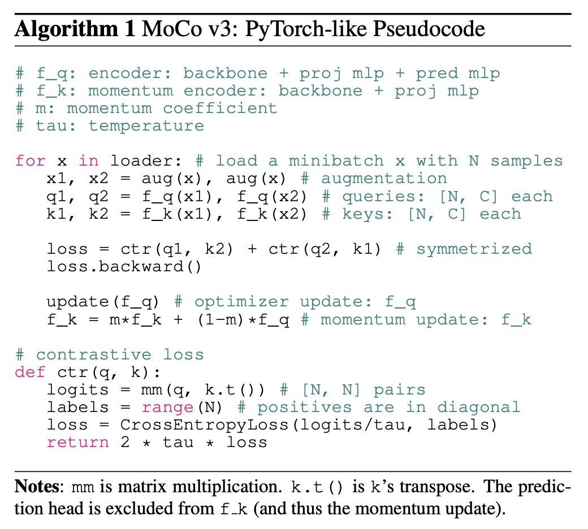
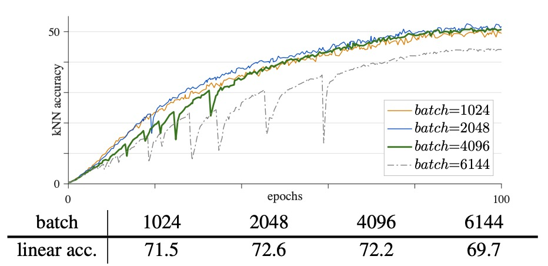
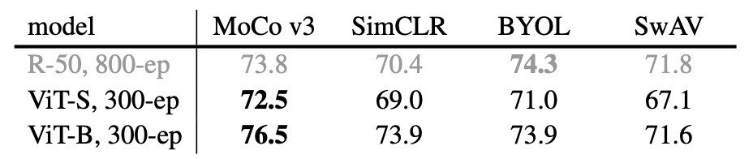
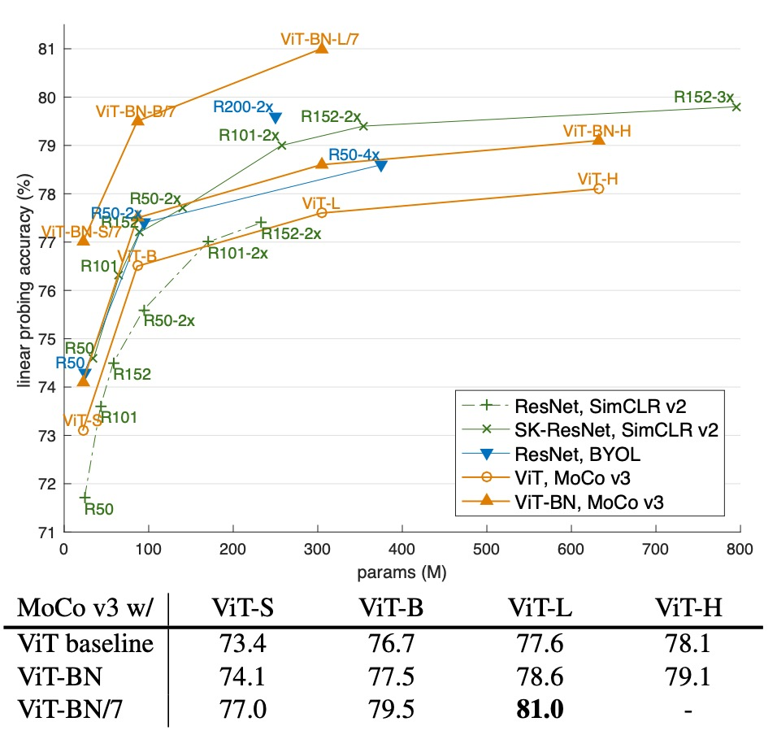

## ViT Expedition Team

[**An Empirical Study of Training Self-Supervised Vision Transformers**](https://arxiv.org/abs/2104.02057)

---

The trend of representation learning has continued for five years, and it seems to have settled down.

At this time, however, a major update emerged in the computer vision field: ViT was released (October 2020).

The MoCo research team couldn’t contain their excitement and eagerly began exploring this brand-new architecture.

## Defining the Problem

After the ViT architecture was released, the authors of the original paper indicated that when using a BERT-like MASK mechanism for pre-training on this architecture, the results were somewhat disappointing.

Due to the looser nature of image features, simply introducing MASK to have the model perform reconstruction didn’t yield the expected results. Instead, using a supervised learning approach with a massive dataset for pre-training allowed the model to surpass other CNN architectures and achieve state-of-the-art (SoTA) performance.

This conclusion in the ViT paper indeed sparked a lot of researchers to try their hand at it:

> **Does unsupervised learning really not work? Or was it just your approach that was wrong?**

Thus, the authors of the MoCo paper also decided to join in on the exploration of the ViT architecture to see if introducing a twin network structure for representation learning could yield good results in pre-training the model.

## Solving the Problem

This paper does not introduce new methods or architectures.

It simply applies the MoCo architecture to ViT for a round of experimentation.

The specific process can be directly seen in the algorithmic structure description provided in the paper. In fact, once this section is understood, the paper is essentially covered:

<figure style={{"width": "70%"}}>

</figure>

Let's go through the diagram:

1. Prepare two encoders:

   - The first encoder’s architecture is: backbone + proj mlp + pred mlp
   - The second encoder’s architecture is: backbone + proj mlp (momentum update)

2. Extract a batch $x$ (containing $N$ images) from the data, and apply data augmentation to generate $x_1, x_2$ for each image.
3. Use $f_q$ to get query vectors $q_1, q_2$ for $x_1, x_2$ respectively; use $f_k$ to obtain key vectors $k_1, k_2$.
4. Call the function $ctr(q, k)$ to compute the contrastive loss:
   - The indices for the positive sample pair are on the diagonal (using `labels = range(N)`).
   - After dividing logits by $\tau$, use the cross-entropy loss function to compute the loss.
   - Finally, the loss is multiplied by $2\tau$ as the output.
   - The final total loss is $ctr(q_1, k_2) + ctr(q_2, k_1)$.

The loss function here is the InfoNCE loss, which was previously mentioned, and its formula is:

$$
L_q = -\log \frac{\exp\left(\frac{q\cdot k^+}{\tau}\right)}{\exp\left(\frac{q\cdot k^+}{\tau}\right)+\sum_{k^-}\exp\left(\frac{q\cdot k^-}{\tau}\right)}.
$$

Where:

- $q$ is the query vector;
- $k^+$ is the positive sample vector, obtained from the same image as $q$ but using another encoder $f_k$;
- $\{k^-\}$ is the negative sample set, consisting of key vectors from other images in the same batch;
- $\tau$ is the temperature hyperparameter, which controls the smoothness of the distribution.

The objective of this loss is to bring $q$ and $k^+$ closer while pushing $q$ away from all $k^-$.

After backpropagation, the optimizer updates $f_q$, and then $f_k$ is updated using momentum to ensure the key encoder remains stable.

---

At this point, there’s nothing new.

Thus, the focus of this paper is on the experimentation, which we will look at carefully.

## Discussion

In this paper, the authors monitor the kNN curve to observe the changes during training.

The kNN curve is a tool used to monitor the quality of the feature representations learned by the model in real-time. The process works as follows:

1. **Feature extraction:**
   During training, the model extracts features from the input images. These features directly reflect the current representational capacity of the model without any additional adjustment.

2. **kNN classification:**
   For each sample to be evaluated, k-nearest neighbors (kNN) classification is used. That is, based on some distance metric (such as Euclidean distance or cosine similarity), the k closest neighbors to the sample are found from the pre-stored feature set, and the predicted label is obtained by majority voting from these neighbors.

3. **Curve generation:**
   The accuracy obtained from kNN classification on the validation set is recorded at each step. As training progresses, these accuracies form a curve. This curve reflects the quality of the feature representations at different stages of training.

4. **Revealing training stability:**
   By observing the kNN curve, researchers can discover that even when the loss function seems to decrease and the final accuracy appears reasonable, the quality of the model’s feature representation (such as kNN classification accuracy) may still experience "plummeting" or fluctuations. These fluctuations suggest instability during training, which might not cause divergence but could result in hidden degradation of final performance.

In summary, the kNN curve is an evaluation method based on k-nearest neighbor classification, used to track the stability and quality of the feature representations learned by the model during training, thus revealing potential instability issues.

### ViT Instability

In theory, replacing ResNet with ViT as the backbone in a twin network self-supervised framework isn't difficult; however, in practice, training ViT faces significant instability issues. This instability is not immediately apparent from the final accuracy, as even when the training results seem "normal" on the surface, the process may hide local failures or "partial successes."

- **Impact of Batch Size**

    

    <figure style={{"width": "70%"}}>
    
    </figure>
    

  ViT models are computationally heavy, and large batch training provides more negative samples, which aids contrastive learning. However, when the batch size is too large (e.g., 4k or 6k), significant "fluctuations" or "drops" appear in the training curve.

  As shown in the figure above:

  - Batch size 1k: Linear probing accuracy is about 71.5%, with a smooth curve.
  - Batch size 2k: Accuracy rises to about 72.6%, maintaining smoothness.
  - Batch size 4k: The curve shows noticeable "dips," with accuracy slightly dropping to 72.2%.
  - Batch size 6k: More evident fluctuations, with a large drop, and accuracy decreases to 69.7%.

  Although larger batch sizes theoretically offer more negative samples and help learning, excessively large batches may cause the model to exhibit "partial restarts" during training, where it jumps out of the current local optimum to find a new solution. This can lead to hidden performance degradation. This degradation may not manifest as extreme divergence, but rather as subtle (1–3%) drops in accuracy, affecting the reproducibility and comparative analysis of experiments.

- **Impact of Learning Rate**

    

    <figure style={{"width": "70%"}}>
    
    </figure>
    

  To handle large batch training, a linear learning rate adjustment rule is often used, which is given by the formula:

      $$
      \text{Effective LR} = \text{base lr} \times \frac{\text{BatchSize}}{256}.
      $$

  Experimental results show:

  - When using a smaller learning rate (e.g., lr = 0.5e-4), training is more stable but may suffer from underfitting, leading to lower accuracy (70.4%).
  - A moderate learning rate (e.g., lr = 1.0e-4) achieves better fitting, with accuracy reaching 72.2%.
  - When the learning rate is increased further (e.g., lr = 1.5e-4), training becomes unstable, and more "dips" appear in the curve, ultimately reducing model performance.

  The authors suggest that the learning rate needs to balance stability and sufficient fitting. Too low a learning rate can result in underfitting, while too high a learning rate exacerbates instability, causing drastic gradient changes that lead to performance fluctuations.

- **Impact of Optimizer**

    

    <figure style={{"width": "70%"}}>
    
    </figure>
    

  Some recent self-supervised methods have adopted the LARS optimizer, which is designed for large batch training, while LAMB can be viewed as the LARS version of AdamW.

  The authors tested using the LAMB optimizer to see the results:

  - Under appropriate learning rates (e.g., lr = 5e-4), LAMB outperforms AdamW, with a final accuracy of 72.5%.
  - When the learning rate exceeds the optimal value (e.g., lr = 6e-4 or 8e-4), LAMB’s performance quickly drops, reducing by 1.6% and 6.0%, respectively.

  The authors point out that although LAMB's gradient changes are smoother, this smoothness might cause unstable gradient issues to accumulate gradually, ultimately affecting model performance. LAMB is highly sensitive to learning rate, and its effect varies under different settings, making it difficult to compare different architecture designs without conducting additional learning rate searches.

  For this reason, the authors chose to use the more stable AdamW optimizer in other experiments.

### Solving ViT Instability Issues

:::tip
This could probably be another paper by itself, but the authors generously provide everything in one.
:::

During training, the authors observed that sudden changes in gradients caused noticeable "dips" in the training curve, as shown in the figure below:

By comparing gradients at each layer, they found that these gradient spikes first appear in the first layer (patch projection layer), and only appear in subsequent layers after several iterations.

This phenomenon suggests that instability originates in the shallow layers first, potentially affecting the performance of deeper layers. Based on this observation, the authors hypothesize that instability primarily starts in the first layer.

To prevent the gradient fluctuations caused by this layer, the authors propose freezing the patch projection layer during training. The practical implementation of this technique is to use the stop-gradient operation, which fixes the weights of this layer and instead uses a fixed random projection to embed the image patches.

The experimental results are shown below:

<figure style={{"width": "70%"}}>

</figure>

Compared to a learnable patch projection, using a random (frozen) patch projection results in smoother training curves and improved stability.

With a learning rate of lr = 1.5e-4, the improved stability increases the final linear probing accuracy by 1.7%, reaching 73.4%. As the learning rate increases, this stability improvement becomes more evident (increases by 0.4%, 0.6%, and 1.7%).

In addition to fixing the random weights, the authors also tried using BatchNorm or WeightNorm on the patch projection layer but found no improvement in stability, with results similar to the original configuration. When gradient clipping is applied to this layer with a sufficiently small threshold, it can have a similar effect to freezing the weights.

From an architectural perspective, the output dimension of the patch projection layer in standard ViT is usually complete or over-complete, meaning that random projection is sufficient to preserve the original information, and there’s no need to learn the weights of this layer. Fixing the first layer essentially narrows down the solution space, suggesting that the problem mainly lies in the optimization process.

While this technique alleviates instability, when the learning rate is too high, the entire model can still become unstable. Therefore, this is only a partial solution and does not fundamentally eliminate the problem.

### Comparison of Self-Supervised Learning Frameworks

<figure style={{"width": "70%"}}>

</figure>

The authors tested on four frameworks: MoCo v3, SimCLR, BYOL, and SwAV, ensuring fairness by using the same random projection technique in all experiments, and performing a parameter search for learning rate (lr) and weight decay (wd).

The table shows the performance of ViT-S/16 and ViT-B/16, where MoCo v3 achieves the best accuracy on ViT. Additionally, unlike the case with ResNet-50 (R50), MoCo v3 and SimCLR benefit more from ViT-B, indicating that there is a difference in performance between ViT and convolutional networks under the same self-supervised framework.

### Ablation Study

:::tip
The data from this section's tables are scattered within the text, so we will directly present the numbers.
For those who wish to view the original tables, please refer to the paper.
:::

- **Position Embedding:**

  Three options were compared here: sin-cos (default), learnable, and no position embedding.

  The results show that: sin-cos achieved a linear probing accuracy of 76.5%; learnable embeddings were slightly lower at 76.1%; and completely omitting position embedding dropped the accuracy to 74.9%. This suggests that the model can still learn strong representations even without explicit position information (otherwise, the model would likely fail).

- **The Role of Class Token:**

  The ablation study compared using `[CLS]` versus not using `[CLS]`.

  When `[CLS]` was removed but the final LayerNorm (LN) was retained for pooling, performance significantly dropped to 69.7%. However, directly removing LN and using global average pooling yielded a result close to the original (76.3%).

  The results show that `[CLS]` is not absolutely necessary, but the use of LN has a significant impact on the final performance.

- **BatchNorm (BN) in the MLP Head:**

  The ViT model itself does not contain BN, using it only in the MLP head.

  The ablation results indicate that using BN achieved 76.5%, while removing BN required a larger batch size (2048) for convergence, and accuracy dropped to 74.4%, a decrease of approximately 2.1%.

- **Prediction Head:**

  MoCo v3 by default includes a prediction MLP head. In the ablation experiment, when the prediction head was removed, the accuracy dropped from 76.5% to 75.5%, indicating that the prediction head can further improve performance, but is not essential.

- **Momentum Encoder:**

  Different momentum coefficients $m$ were compared (0, 0.9, 0.99, 0.999).

  When $m = 0.99$ (the default), the best performance was achieved (76.5%), while $m = 0$ (similar to SimCLR) only achieved 74.3%, showing that using a momentum encoder can improve accuracy by about 2.2%.

- **Impact of Training Length:**

  The results of training for 300 epochs versus 600 epochs were compared.

  The smaller ViT-S/16 model improved from 72.5% at 300 epochs to 73.4% at 600 epochs; however, the ViT-B/16 model only improved from 76.5% to 76.7%. This shows that smaller models benefit more from extended training, while larger models’ gains tend to saturate.

### Comparison with Other Methods

<figure style={{"width": "70%"}}>

</figure>

The table above shows a comparison of MoCo v3 with iGPT and masked patch prediction methods.

MoCo v3 achieved higher accuracy with a smaller model under the same linear probing protocol and training data. For ViT-L, self-supervised pre-training (77.6%) even outperformed supervised pre-training (76.53%).

The following chart shows a trade-off comparison between parameter count and linear probing accuracy to compare large-scale ResNet models with self-supervised ViT models:

<figure style={{"width": "70%"}}>

</figure>

The horizontal axis typically represents the model’s parameter count (i.e., model size), while the vertical axis represents the linear probing accuracy. This display helps to visualize how model performance changes as the model size (parameter count) increases. It provides an intuitive understanding of the balance between resource consumption (parameter count) and final performance (accuracy) and the effectiveness of self-supervised learning methods across different model sizes.

From the graph, we can see that self-supervised ViT models achieve comparable or even better performance than large ResNet models within certain parameter ranges, highlighting the potential of ViT architectures in self-supervised learning. Additionally, the performance differences across methods (such as SimCLR v2, BYOL) at the same parameter scale reflect the impact of each architecture and training method on performance improvement.

## Conclusion

Alright, so after going through the whole paper, even though no new methods were introduced, why is this paper titled "MoCo v3"?

The result is quite clear—because even with the same familiar formula, applying it to ViT reveals completely different advantages! In contrast to other competitive methods (SimCLR, BYOL, SwAV), when the model architecture switches from CNN to ViT, the overall performance either doesn’t improve or even declines.

Doesn’t this just prove once again that the MoCo architecture is the best?

Let’s bump up its version number—it's not unreasonable!
