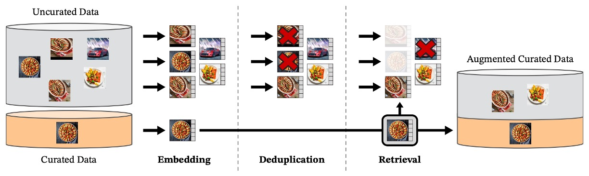
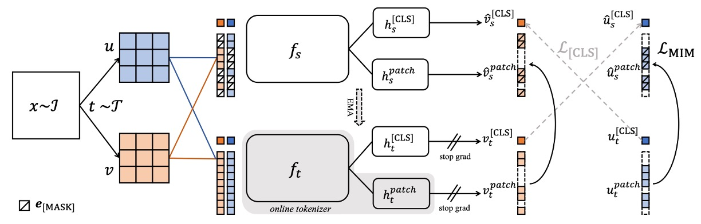
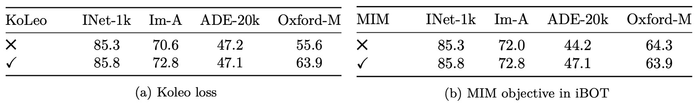
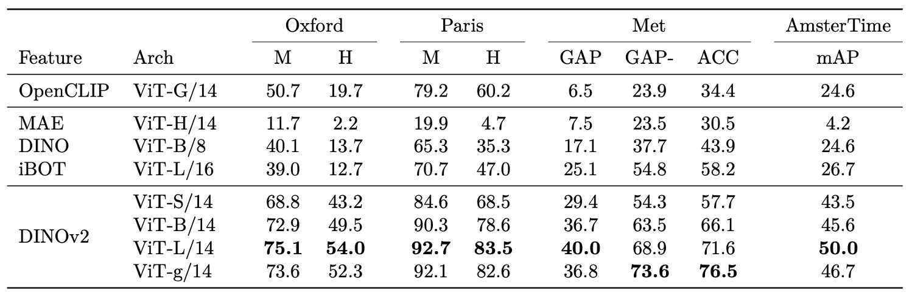

## Universal Feature Forging Method

[**DINOv2: Learning Robust Visual Features without Supervision**](https://arxiv.org/pdf/2304.07193)

---

We have already reviewed the first generation of DINO.

After two years, let’s see what improvements Meta AI Research has made on this architecture.

:::tip
This paper is nearly 20 pages long—perfect for passing the time.
:::

## Problem Definition

In recent years, the mainstream development trend of visual models has become polarized:

On one hand, methods like CLIP and ALIGN learn through image-text alignment, using language as a semantic supervisory axis, successfully training foundational models with semantic understanding capabilities. These methods show strong performance in classification, retrieval, and multimodal tasks.

On the other hand, another route chooses not to rely on language, even rejecting any external annotation. This is a purer self-supervised perspective, letting images “speak for themselves,” enabling models to learn recognition, memory, abstraction, and generalization silently.

This route attempts to answer a more fundamental question:

> **In a world without language, can images still understand themselves?**

This is the core pursuit of Self-Supervised Learning (SSL) techniques.

These methods can be roughly divided into two categories:

1. **Intra-image pretext tasks**, such as predicting masked patches, reconstructing original images, color restoration, or patch order prediction. These are similar in form to “fill-in-the-blank” tasks in language models, with typical examples including MAE and BEiT.

2. **Discriminative self-supervision**, emphasizing distinctive training across different images, such as contrastive learning, instance classification, or clustering. Representative methods include SimCLR, MoCo, BYOL, and DINO.

These methods have been validated on standard datasets like ImageNet-1k to learn frozen features with generalization ability, even comparable to supervised training. However, when scaling up model size, extending training time, or using uncurated datasets, these methods often face challenges such as performance collapse, unstable training, and feature degradation.

Perhaps the quality and diversity of data are even more critical factors?

Although self-supervised learning does not rely on manual annotation, it depends more heavily on the breadth and structural balance of the input data itself. When datasets suffer from topic shifts, long-tail imbalance, or excessive repetition, models tend to learn partial and hard-to-transfer representations.

Despite accumulating many impressive academic and industrial results, there remain several key unresolved issues for pushing these methods toward stable and usable visual foundational models:

- **Can existing self-supervised techniques maintain sufficient stability and scalability when scaled up?**
- **Can truly language- and annotation-free learning still produce universal features suitable for direct downstream applications?**
- **How can we effectively and automatically perform data filtering and distribution balancing when facing massive, uncurated image collections?**

These questions remain open.

DINOv2 starts from the first generation’s foundation, further adjusting data strategies, enhancing architectural stability, and reconsidering systematic design for self-supervised learning. If the data is better and the architecture more stable, perhaps we can go further—enabling language-free models to become the universal basis for modern visual systems.

## Data Collection

To enable the model to learn solid, generalizable visual features, data quality is the first priority.

When the goal is “fully self-supervised without annotation,” the responsibility of data selection no longer lies on labels but on **the diversity and representativeness of the images themselves**.

The data processing pipeline planned by the authors can be roughly divided into three steps, as illustrated below:

<figure style={{"width": "90%"}}>

</figure>

### 1. Preparing the Data Pool

The chosen target dataset LVD-142M consists of two parts:

- **Curated portion**: based on ImageNet-1k/22k, Google Landmarks, and multiple fine-grained datasets, serving as sources of “representative samples”;
- **Uncurated portion**: raw images collected from public web crawler databases, filtered for safety (removing illegal URLs, NSFW content, blurred faces, etc.), totaling 1.2 billion images.

These uncurated images are unlabeled, undocumented, and unfiltered, representing the most “wild web” data state.

:::info
The paper uses the term “curated” extensively, so a brief reminder for readers:

- **Curated data**: data that has been manually selected, cleaned, and organized into high-quality datasets;
- **Uncurated data**: data crawled from the web or other sources without filtering or cleaning.
  :::

### 2. Removing Duplicates

To avoid bias caused by duplicate training data, the authors introduced a specialized copy detection process to remove highly similar images, not only within the uncurated set but also excluding samples similar to test sets to prevent data leakage.

The implementation details of this step come from the algorithm by Pizzi et al. (2022), ensuring a diverse and clean dataset.

:::tip
Reference: Pizzi et al. [**[22.02] A self-supervised descriptor for image copy detection**](https://arxiv.org/abs/2202.10261)
:::

### 3. Self-Supervised Retrieval

Here lies the truly ingenious design.

The authors first use a ViT-H/16 model previously self-supervised trained on ImageNet-22k to compute embedding representations for all images. Using cosine similarity as the distance metric, they retrieve uncurated images that “look like curated data.”

This retrieval is neither manual annotation nor keyword filtering but purely based on visual similarity of image features.

Next, the uncurated images are clustered by K-means. Depending on the scenario (large or small query datasets), for each base image, the top N nearest neighbors (N=4) or M images from the corresponding cluster are selected.

This choice balances data overlap and retrieval diversity.

### Engineering Scale and Efficiency

Such large-scale data processing and retrieval require powerful computational resources.

The entire pipeline is built on the FAISS framework, using GPU-accelerated inverted indexing and quantization coding, distributed across 20 computing nodes each equipped with 8 V100 GPUs. It took less than two days to complete the cleaning and organization of 142 million high-quality training images.

Overall, DINOv2’s data preparation cleverly combines “existing high-quality datasets” with “visually semantically similar web images,” using self-supervision to automatically select training samples, laying a foundation for subsequent model learning.

## Solution

The training strategy adopted by DINOv2 belongs to **Discriminative Self-Supervised Learning**. Overall, it can be seen as a hybrid design combining DINO and iBOT with SwAV’s centering mechanism, augmented by regularization terms and a high-resolution training strategy.

:::tip
Wait—this sudden flood of terms might catch readers off guard.

For those unfamiliar with the above terms, you can refer to the following papers:

- [**[20.06] SwAV: Swapping Cluster Predictions**](../2006-swav/index.md)
- [**[21.04] DINO: Self-Distillation With No Labels**](../2104-dino/index.md)
- [**[21.11] iBOT: Image BERT Pre-Training with Online Tokenizer**](https://arxiv.org/abs/2111.07832)
  :::

### Image-Level Feature Alignment

<figure style={{"width": "50%"}}>

</figure>

This part is based on the core idea of the DINO method, as illustrated above.

Using the DINO loss function, the goal is to ensure that the semantic representations of images under different views (augmentations), processed by the student and teacher networks respectively, remain consistent.

The specific procedure is as follows:

- Take two different crops (called views) from the same image and input them separately into the **student and teacher** models;

- Both models are Vision Transformers, and their class tokens are taken as the overall semantic vector representing the image;

- The class tokens are then passed through separate MLP heads to produce vectors called “prototype scores,” which are each normalized by a softmax:

  $$
  \mathbf{p}_s = \mathrm{softmax}(h_s(z_s)), \quad \mathbf{p}_t = \mathrm{softmax}(h_t(z_t))
  $$

- To avoid overly sharp predictions from the teacher, the teacher’s softmax outputs are further smoothed by a process called **centering**, commonly implemented via moving average or the Sinkhorn-Knopp algorithm;

- The final loss is the cross-entropy between the two distributions:

  $$
  \mathcal{L}_{\text{DINO}} = - \sum_{k} p_t^{(k)} \log p_s^{(k)}
  $$

Here, the student is the training target, while the teacher is an exponential moving average (EMA) of the student weights and does not participate in backpropagation.

### Patch-Level Prediction Task

<figure style={{"width": "90%"}}>

</figure>

To encourage the model to learn fine details and local semantics, the authors incorporate iBOT’s “pixel-level prediction task,” structured as follows:

- Randomly mask certain patches in the student input, forming masked tokens;
- These patches remain fully visible in the teacher input;
- For each masked patch, the student’s predicted distribution $\mathbf{p}_{s}^{(i)}$ and the teacher’s target distribution $\mathbf{p}_{t}^{(i)}$ are computed, both followed by softmax and centering:

  $$
  \mathcal{L}_{\text{iBOT}} = - \sum_{i \in \mathcal{M}} \sum_{k} p_t^{(i, k)} \log p_s^{(i, k)}
  $$

where $\mathcal{M}$ is the index set of all masked patches. This task provides finer spatial-level supervision, aiding downstream pixel-level tasks such as segmentation.

### Head Design

Both DINOv2 and iBOT require additional MLP projection heads to map transformer outputs into logits.

Although the original iBOT paper reports better results sharing the heads, DINOv2’s large-scale experiments found **using two separate heads performs better**, thus the two are fully decoupled.

### Sinkhorn-Knopp Centering

To stabilize the teacher’s predicted distributions, DINOv2 adopts the **Sinkhorn-Knopp normalization (SK)** from SwAV to balance batch distributions.

This method iteratively normalizes rows and columns, approximating a doubly stochastic matrix. In practice, three iterations suffice.

Using SK reduces the risk of model collapse by preventing the output from concentrating on a single prototype.

### KoLeo Regularization

DINOv2 introduces a rarely seen regularizer in this domain: **KoLeo Regularizer (Kozachenko-Leonenko Regularizer)**, which encourages feature embeddings to be evenly and widely distributed in embedding space.

This term originates from differential entropy estimation and is formulated as:

$$
\mathcal{L}_{\text{KoLeo}} = -\frac{1}{n} \sum_{i=1}^{n} \log d_{n,i}
$$

where:

- $d_{n,i} = \min_{j \ne i} | \mathbf{x}_i - \mathbf{x}_j |$ is the nearest neighbor distance for the $i$-th vector;
- All vectors $\mathbf{x}_i$ are $\ell_2$ normalized beforehand.

This regularization prevents features from over-concentrating during training, promoting coverage and diversity in feature representation.

### High-Resolution Training Phase

Although high-resolution images are critical for tasks like segmentation and detection, directly using high resolution during pretraining is computationally expensive. Therefore, the authors adopt a compromise: **briefly switch to 518×518 high-resolution images in the later pretraining phase** to enhance detail signals.

This approach is similar to the resolution ramp-up in methods like UniViT and FlexiViT, and experiments show it effectively improves pixel-level performance with minimal extra training time.

Overall, DINOv2’s training objective integrates semantic consistency, patch prediction, distribution balancing, and spatial regularization, achieving a stable balance between efficiency and generalization.

## Engineering Implementation

The authors dedicate a chapter to introducing how to accelerate the training pipeline and reduce memory usage. Compared to iBOT, with the same hardware, DINOv2 achieves roughly 2× speedup and only 1/3 memory usage.

### FlashAttention

Self-attention layers are the biggest computational bottleneck in ViT architectures.

The team developed an optimized FlashAttention implementation that outperforms the original in both memory and speed, and supports more hardware platforms and architectural variants.

They found that aligning embedding dimensions with GPU-friendly sizes (e.g., 64 per head, total embedding multiple of 256) further improves efficiency.

Therefore, ViT-g uses 1536 dimensions and 24 heads (64 dims per head), replacing the commonly used 1408 dims / 16 heads design.

Experiments show comparable accuracy with better efficiency.

### Sequence Packing

ViT inputs are patch tokens, and DINO-style methods process two crops simultaneously:

- Large crops (resolution 224) produce long sequences;
- Small crops (resolution 98) produce short sequences.

Previous approaches forwarded these separately, causing batch size inconsistency and wasted computation.

DINOv2 introduces a technique from NLP: **Sequence Packing**.

Multiple token sequences of varying lengths are concatenated into one long sequence, and a block-diagonal attention mask prevents cross-attention between different sequences. This yields the same effect as separate forwards but significantly improves computational efficiency.

This design relies on low-level support and is implemented on top of the `xFormers` library.

### Stochastic Depth

Stochastic Depth randomly drops residual blocks during training as a form of regularization.

Traditionally, the output is zeroed out after computation; DINOv2 instead skips computation for dropped blocks entirely, saving proportional memory and compute.

This requires a special kernel that randomly permutes samples in the batch dimension and only computes the first $(1-d) \cdot B$ samples per layer. With the paper’s drop rate $d=40\%$, about 40% computation is saved per layer, greatly reducing overhead.

### Distributed Training

Training billion-scale models (e.g., ViT-g with \~1.1B parameters) is bottlenecked by memory.

DINOv2 employs **Fully-Sharded Data Parallel (FSDP)** to shard model replicas across GPUs, including:

- Student network,
- Teacher network,
- Optimizer first- and second-moment parameters (AdamW).

Together, these float32 parameters occupy \~16 GB memory. FSDP shards these tensors across GPUs, freeing single-card limits and enabling larger models.

Additionally, model weights and gradients are communicated in float16 (except MLP heads) to reduce GPU communication overhead by at least 50% compared to float32 all-reduce in DDP.

Empirically, PyTorch FSDP + mixed precision significantly outperforms DDP + autocast.

### Model Distillation

After training large models like ViT-g, DINOv2 does not directly train smaller models like ViT-B or ViT-L from scratch. Instead, knowledge distillation is used to let smaller models mimic the large one’s outputs.

The training strategy reuses the teacher-student framework with these modifications:

- The pretrained ViT-g is frozen as teacher;
- Masking and stochastic depth are disabled to simplify training;
- The iBOT loss is applied to two global crops;
- The student’s EMA is kept as the final model output.

This design is similar to Duval et al.’s method but without changing the loss function structure, reusing the original pipeline for simplicity and practicality.

Experiments show that even ViT-L distilled this way outperforms training from scratch significantly.

## Ablation Experiments

To verify the effectiveness of each component design, the authors conducted several experiments covering training strategies, data sources, model sizes, loss components, and resolutions.

### Model Training Process

<figure style={{"width": "70%"}}>

</figure>

Using iBOT as the baseline, the authors sequentially added various DINOv2 techniques (such as dual heads, Sinkhorn centering, KoLeo regularization, etc.) and observed performance on ImageNet-1k (including k-NN and linear probe evaluations).

Results show that **most technical components individually improve at least one evaluation metric**. In some cases (e.g., LayerScale and Stochastic Depth), linear probing performance decreases but training stability improves significantly, which is a more important practical indicator.

### Pretraining Data

<figure style={{"width": "90%"}}>

</figure>

To test the impact of data quality on features, the authors compared three datasets:

- LVD-142M (curated set selected via visual retrieval)
- ImageNet-22k (traditional large-scale labeled dataset)
- Uncurated-142M (random samples from the same source web data)

All trained with ViT-g/14 under identical conditions.

Experiments show as above:

- **Curated data significantly outperforms uncurated**, even at equal quantities;
- LVD-142M surpasses ImageNet-22k on most benchmarks (except ImageNet-1k);
- On domains without data filtering reference (e.g., INaturalist, Places205), LVD-142M also demonstrates better transferability.

This confirms that “data curation” remains a crucial design factor in self-supervised learning.

### Importance of Loss Components

Next, the authors evaluated the actual contribution of each loss term via ablation on:

- **KoLeo Regularization**

  On the Oxford-M image retrieval task, **enabling KoLeo brings about 8% accuracy improvement**; meanwhile, it causes no significant side effects on ImageNet classification or ADE segmentation.

  This shows the regularizer successfully encourages feature dispersion, especially benefiting retrieval tasks requiring detailed feature discrimination.

- **iBOT-style Masked Image Modeling**

  Removing this loss causes about **3% accuracy drop on ADE-20k segmentation**. This highlights the critical role of patch-level supervision in pixel-level tasks.

### Knowledge Distillation Effect

<figure style={{"width": "90%"}}>

</figure>

To reduce training costs of smaller models, DINOv2 uses ViT-g as a frozen teacher to distill ViT-L/14 and compares it against training from scratch.

Results show **distilled ViT-L outperforms the from-scratch model across 12 benchmarks**, simplifying training for smaller models and proving DINOv2’s framework has strong “teach big to small” transfer capability.

### High-Resolution Training

<figure style={{"width": "90%"}}>

</figure>

Finally, the authors tested whether high-resolution training from scratch is necessary:

- Compared fixed resolutions of 224, 416, and a setting that switches to 416 resolution only during the final 10k iterations;
- Evaluation metrics included ImageNet classification and ADE segmentation;
- **Training entirely at 416 resolution achieves best results but incurs triple the computational cost of 224**; switching to high resolution only at the last 10k iterations yields nearly the same performance but with only a small additional computation overhead.

Therefore, DINOv2 adopts the latter as a compromise, retaining the benefits of higher resolution without the cost of prolonged high-res training.

## Discussion

### ImageNet Classification

<figure style={{"width": "90%"}}>

</figure>

In the ImageNet-1k linear classification task, DINOv2 demonstrates extremely strong feature representation capability.

Even with only a frozen backbone paired with a simple linear classifier, its accuracy surpasses all existing self-supervised methods and, for the first time under the same evaluation setup, matches or even surpasses several weakly supervised models, leading in some architectural conditions.

Moreover, without relying on large-scale language-text alignment or extra supervision, the learned features still show excellent linear separability and robust category generalization. Its performance in k-NN evaluation is equally stable, indicating good discriminability and neighborhood consistency.

Examining results across different model architectures and resolutions reveals that DINOv2 maintains considerable scalability while keeping training resolution fixed. It shows stable performance across mainstream architectures, from medium-sized ViTs to larger G-scale models.

Overall, the experiments clearly indicate that DINOv2 has pushed past previous self-supervised performance boundaries toward the practical threshold of weakly supervised feature learning. This makes frozen features more useful and flexible in real tasks and proves the method’s sufficient transfer potential without fine-tuning.

### Video Classification

<figure style={{"width": "90%"}}>

</figure>

In broader downstream image and video classification tasks, DINOv2’s learned representations show strong cross-modal and cross-domain generalization potential. Whether on natural fine-grained datasets (e.g., iNaturalist series), scene recognition (Places205), or varied classification benchmarks from SimCLR, DINOv2 delivers very competitive performance.

DINOv2 significantly outperforms weakly supervised methods in natural category recognition, demonstrating robust discrimination of fine-grained visual variations. Even in specific domains like indoor scenes (Places205), where language-aligned models slightly outperform, its overall performance remains highly usable without text supervision.

Extending to video classification, despite no video data seen during pretraining, DINOv2’s frozen features provide meaningful foundations for action recognition. On datasets demanding strong temporal information, it even surpasses similarly frozen CLIP-like models, showing spatial features retain rich semantics after temporal integration.

<figure style={{"width": "90%"}}>

</figure>

Finally, across 12 image classification tasks including objects, scenes, and materials, DINOv2 maintains a clear advantage over self-supervised models and competes closely with weakly supervised methods on most datasets. It only shows slight disadvantage on text-prior-biased datasets (e.g., SUN). Especially in fine-grained vehicle and airplane classification tasks, DINOv2 performs exceptionally well, reflecting that its learned features have internalized many key discriminative cues without language guidance.

### Instance Recognition

<figure style={{"width": "90%"}}>

</figure>

In instance-level recognition tasks, DINOv2 also exhibits strong discriminative ability.

Using non-parametric retrieval ranking by cosine similarity between query and database images, the comparison includes both self- and weakly supervised models.

Results show that across domains such as landmark recognition (Oxford, Paris), artwork retrieval (Met), and historical street view matching (AmsterTime), DINOv2 significantly outperforms existing baselines. Its average precision improvements are particularly notable in challenging settings, indicating exceptional sensitivity to subtle differences and fine details.

Notably, DINOv2’s features excel not only at category-level classification but also at instance-level recognition, demonstrating consistent and effective representation across task granularities.

### Semantic Segmentation

<figure style={{"width": "70%"}}>

</figure>

In dense-level tasks such as semantic segmentation and monocular depth estimation, DINOv2 shows strong patch-level representation ability, enabling practical frozen feature predictions.

For semantic segmentation, even with a simple linear predictor and low-resolution upsampling, DINOv2 achieves stable performance across multiple datasets. Enhanced by simple multi-layer feature concatenation and multi-scale inference (+ms setting), its results approach fully fine-tuned MAE models and rival current state-of-the-art methods on specific datasets—despite using a much simpler prediction architecture.

Moreover, integrating the frozen backbone into state-of-the-art segmentation pipelines (ViT-Adapter + Mask2Former) without end-to-end training still achieves comparable accuracy, demonstrating the backbone’s high transferability and reusability.

### Qualitative Results

Beyond quantitative evaluation, the authors performed qualitative analyses verifying DINOv2 features’ semantic sensitivity, structural consistency, and cross-domain transferability.

First, visual comparisons of depth estimation:

<figure style={{"width": "90%"}}>

</figure>

Semantic segmentation and depth estimation visuals show that even using only a frozen backbone with a linear predictor, DINOv2 produces semantically clear, boundary-coherent segmentation maps far superior to OpenCLIP under the same setup.

Depth predictions also follow a similar trend: DINOv2 outputs smoother, spatially consistent depth maps with better shape restoration, especially accurately recognizing fine objects indoors (e.g., chairs).

Next, evaluation on out-of-domain images tests generalization to unseen data:

<figure style={{"width": "90%"}}>

</figure>

Generalization experiments on anomalous data show that even for unseen modalities (animals, paintings), DINOv2’s features enable segmentation and depth modules to produce reasonable predictions. This indicates the learned visual representations do not overfit to a single domain, possessing genuine transfer potential.

Finally, analysis of feature space structure is presented:

<figure style={{"width": "90%"}}>

</figure>

PCA projections reveal that patch-level features naturally separate foreground and background, and even under unsupervised conditions capture internal semantic regions (e.g., structural zones, part continuity).

Components belonging to the same semantic class across different images (e.g., animal heads, wings) exhibit strong alignment, suggesting the model has learned a spatially consistent visual decomposition internally.

## Conclusion

From an engineering practitioner’s perspective, DINOv2’s greatest value lies in delivering “high-quality, versatile visual features that can be directly applied to multiple tasks without fine-tuning.”

This means we can solve problems originally requiring fine-tuning or extra supervision using fewer resources and simpler downstream modules. Whether classification, segmentation, depth estimation, or instance retrieval, DINOv2 provides immediately deployable frozen features, paired with minimal linear heads—significantly reducing deployment and maintenance complexity.

Furthermore, DINOv2 shows robustness in cross-domain performance and detailed structural recognition, making it an excellent backbone choice for tasks with scarce data, large variability, yet demanding precise semantic discrimination.

More importantly, it is not a black box.

Through PCA and patch matching analyses, we can concretely understand the semantic structures and object part segmentation encoded in the features, greatly aiding interpretability and debugging.

If you plan to work on medical imaging, satellite imagery, retail product recognition, or even autonomous vehicle perception modules, DINOv2 is a versatile foundational model worthy of consideration.
