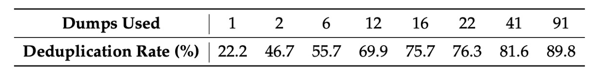
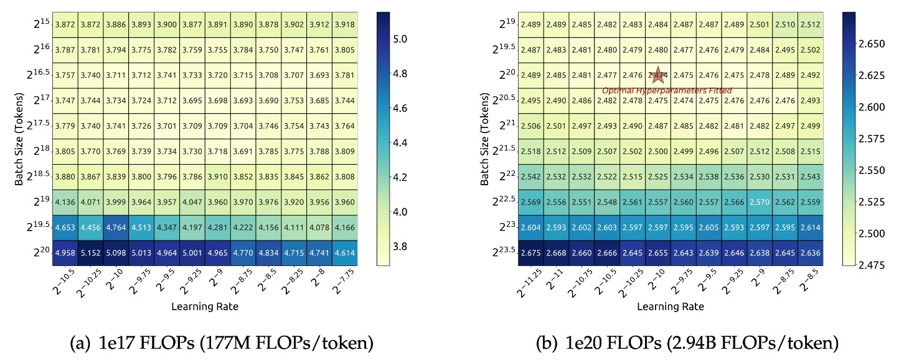
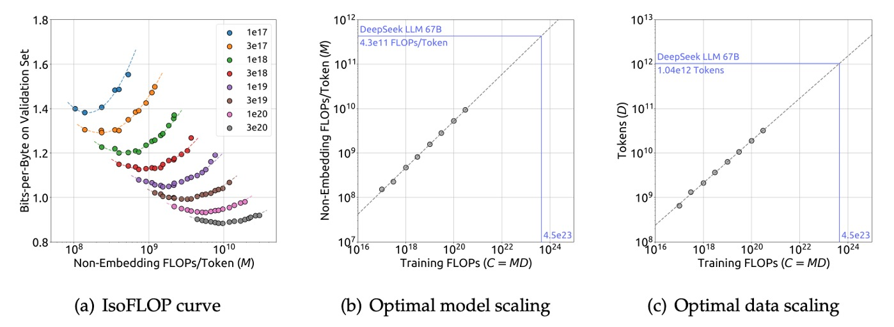
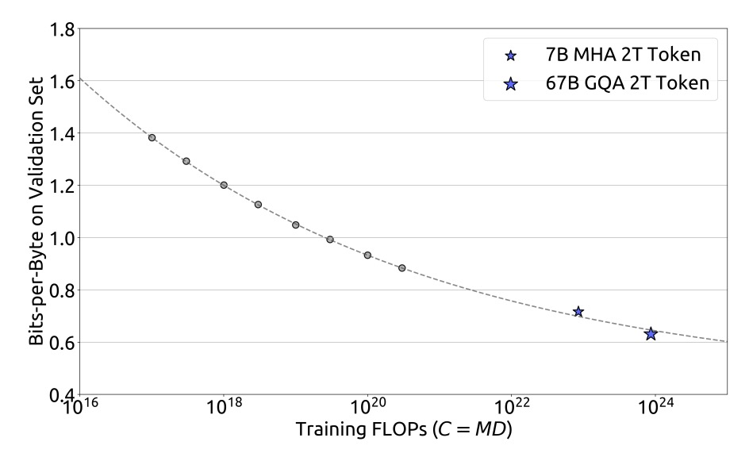

## New Scaling Laws

[**DeepSeek LLM: Scaling Open-Source Language Models with Longtermism**](https://arxiv.org/abs/2401.02954)

---

Recently, DeepSeek has been in the spotlight, generating a lot of buzz, with even OpenAI stepping in to comment.

Given the immense impact they’ve made, let’s take some time to review their recent publications.

This paper is 48 pages long, filled with extensive experimental data and technical details, so we’ll focus on the key points.

## Defining the Problem

The performance gap between open-source and closed-source models has long been a popular topic. Previous research has shown that open-source models generally perform significantly worse than closed-source models on most benchmarks, primarily due to the scale and resource limitations of open-source models.

To bridge this gap, the research team proposed the DeepSeek LLM series, a set of open-source language models ranging in size from 7B to 67B. To train these models, the research team challenged the existing Scaling Laws, arguing that past research findings may not be entirely accurate. Therefore, they introduced their own Scaling Law, which became the core of the paper, exploring the relationship between model size, data scale, and computational budget.

We will focus on the discussion of the Scaling Law and briefly introduce the design and experimental results of DeepSeek LLM.

## Solving the Problem

### Data Processing Strategy

The research team adopted a three-phase strategy: "Deduplication → Filtering → Remixing."

- **Deduplication**:

    

    <figure style={{"width": "80%"}}>
    
    </figure>
    

    The entire Common Crawl corpus was used for deduplication. As seen in the table above, deduplication across multiple dumps is more thorough than when applied to a single dump, providing the model with more unique learning samples.

- **Filtering**: A rigorous document quality evaluation standard was designed, combining linguistic and semantic analysis to ensure data quality from both local and global perspectives.
- **Remixing**: To address the issue of uneven data distribution, the team specifically enhanced data from underrepresented domains, ensuring that the dataset was more balanced and inclusive of diverse information.

In terms of Tokenizer design, the research team employed Byte-level Byte-Pair Encoding (BBPE), using pre-tokenization to avoid mixing different character categories (such as newlines, punctuation, and CJK symbols). Additionally, they split numbers into individual digits. The vocabulary was initially set to 100,000, with 15 special tokens and extra space up to 102,400, balancing computational efficiency in model training with future scalability needs.

### Model Architecture Design

The model largely follows the LLaMA architecture, using a Pre-Norm structure with RMSNorm and SwiGLU as the activation function for the Feedforward Neural Network (FFN). Rotary Embedding is employed for position encoding to enhance sequence processing capability.

To reduce inference costs, the 67B model uses Grouped-Query Attention (GQA) to replace traditional Multi-Head Attention.

The smaller (7B) and larger (67B) models have 30 and 95 layers, respectively. This adjustment not only maintains consistency with the parameters of other open-source models but also facilitates pipeline segmentation, optimizing training and inference workflows. Unlike traditional methods that increase the FFN width, the research team chose to extend the 67B model’s parameters by increasing network depth, which helps improve overall model performance.

:::tip
Here are a few key terms, for which you may need to read other papers:

1. Rotary Embedding: Rotational position encoding, which can be referenced from our previous article
    - [**[21.04] RoFormer: Rotary Position Embedding**](../../transformers/2104-roformer/index.md)
2. Grouped-Query Attention: Grouped multi-head attention, refer to the GQA paper
    - [**[23.05] GQA: Training Generalized Multi-Query Transformer Models from Multi-Head Checkpoints**](https://arxiv.org/abs/2305.13245)

We’ll add corresponding notes once we’ve reviewed these papers.
:::

### Parameter Configuration

The model initialization standard deviation was set to 0.006, and the AdamW optimizer was used:

- $\beta_1=0.9$
- $\beta_2=0.95$
- weight_decay=0.1

The learning rate scheduler employed a multi-step configuration, reaching its peak after 2000 warmup steps, then gradually decaying to 31.6% and 10% of the maximum value at 80% and 90% of the training tokens, respectively. This strategy allows for adjusting training scales under a fixed model size while reusing the previous stage’s training results, which is convenient for continued training. Overall, experiments show that, while the loss curves differ, the final performance is consistent with the cosine scheduler.

Gradient clipping was set to 1.0 to prevent gradient explosion and stabilize training.

Training was conducted using the HAI-LLM framework, which integrates data, tensors, sequences, and pipeline parallelism technologies, similar to Megatron’s design, effectively sharing the computational load of large-scale models.

Additionally, flash attention technology was introduced to improve hardware utilization, and ZeRO-1 technology was used to partition the optimizer state, further reducing memory consumption. Some layers (such as LayerNorm, GEMM, and Adam updates) were fused to accelerate training; mixed precision (bf16 training, fp32 gradient accumulation) and in-place cross-entropy computation were used to optimize memory usage.

Model weights and optimizer states are automatically saved every 5 minutes, ensuring that at most 5 minutes of training is lost in case of hardware or network failures. Training can also be resumed from different 3D parallel configurations to adapt to dynamic changes in computational resources.

For evaluation, the vLLM was used for generative tasks, while non-generative tasks were processed using continuous batch handling to minimize manual adjustments of batch size and token padding.

## Scaling Laws

:::tip
For readers who haven’t seen the two well-known Scaling Laws papers, you can first check out our previous notes:

- [**[20.01] Scaling Laws: Scaling Laws for Neural Language Models**](../../transformers/2001-scaling_laws/index.md)
- [**[22.03] Chinchilla: Chinchilla's Gaze**](../../transformers/2203-chinchilla/index.md)
:::

### Hyperparameter Configuration

<figure style={{"width": "90%"}}>

</figure>

The research team first performed a grid search for a specific model scale (177M FLOPs/token) under a computational budget of $C = 1\mathrm{e}17$, exploring different combinations of batch size $B$ and learning rate $\eta$.

Based on the experimental results shown in the figure above, the research team observed that within a wide range of $B$ and $\eta$, the model's generalization error remained stable. This suggests that within this larger parameter space, an "approximately optimal" set of hyperparameters could be found.

To further explore a larger computational budget range (from $1\mathrm{e}17$ to $2\mathrm{e}19$), the research team adopted a multi-step learning rate scheduler. This scheduler allows for the reuse of previously trained results after the first stage of training, enabling efficient training of multiple hyperparameter configurations. Since there is redundancy in the parameter space, the team defined that the hyperparameters are considered "approximately optimal" when the model's generalization error exceeds the minimum by no more than 0.25%.

Through extensive experiments and data fitting, the results showed:
  - **Optimal Batch Size $B_{opt}$:** Increases gradually with the computational budget $C$. This aligns with intuition, as more computational resources allow for larger batches.
  - **Optimal Learning Rate $\eta_{opt}$:** Decreases as $C$ increases. In other words, as the model size grows and the computational budget increases, a lower learning rate is needed to maintain stability.

Finally, the research team presented the following two formulas to describe this relationship:

$$
\eta_{opt} = 0.3118 \cdot C^{-0.1250}
$$

$$
B_{opt} = 0.2920 \cdot C^{0.3271}
$$

These formulas quantify the power-law relationships between optimal learning rate and optimal batch size with respect to the computational budget $C$.

To validate the effectiveness of these formulas, the research team conducted a validation experiment with a larger computational budget of $C = 1\mathrm{e}20$, using a model scale of 2.94B FLOPs/token. The experimental results, shown in the figure (right), confirmed that the fitted hyperparameters were located at the center of the optimal parameter space, further validating the accuracy of the formulas.

### Optimal Model and Data Scaling Estimates

After fitting the approximate optimal hyperparameter formulas, the research team began investigating how to optimally allocate model size and data scale:

> **That is, determining the best model size and data size to minimize error, given a specific computational budget $C$.**

The core goal was to identify two power-law relationships, where the optimal model size $N_{opt}$ is related to the computational budget as:

$$
N_{opt} \propto C^{a}
$$

And the optimal data size $D_{opt}$ (measured in the number of tokens in the data) follows:

$$
D_{opt} \propto C^{b}
$$

Here, $a$ and $b$ are the scaling exponents for the model and data, respectively.

Early works often used the number of model parameters to represent model size, and the relationship between computational budget and model/data size was approximately:

$$
C = 6N \cdot D
$$

Model size could be approximated by $6N_1$ or $6N_2$. However, these representations failed to fully account for the computational burden of attention operations, leading to errors of up to 50% in different model scales, especially for smaller models. These errors can significantly impact the statistical fitting of subsequent Scaling curves.

To overcome this issue, the research team introduced a new model size representation $M$, which includes the computational cost of attention operations but excludes vocabulary calculations. The formula is:

$$
M = 72\, n_{layer}\, d_{model}^2 + 12\, n_{layer}\, d_{model}\, l_{seq}
$$

Where:

  - $n_{layer}$: Number of layers
  - $d_{model}$: Model width
  - $l_{seq}$: Sequence length

Using $M$, the computational budget can be simplified as:

$$
C = M \cdot D
$$

This makes it easier to estimate the optimal allocation of model and data across different configurations.

After introducing $M$, the research team clarified their objective:

> **Given $C = M \cdot D$, find the optimal model size $M_{opt}$ and optimal data size $D_{opt}$ such that the model's generalization error $L(N, D)$ is minimized.**

This can be expressed as:

$$
M_{opt}(C),\, D_{opt}(C) = \arg\min_{M,D \, \text{s.t.} \, C = M \cdot D} L(N,D)
$$

To reduce experimental costs and fitting complexity, the research team used the **IsoFLOP profile** method introduced in Chinchilla:

- Select 8 different computational budgets, ranging from $1\mathrm{e}17$ to $3\mathrm{e}20$.
- For each budget, design about 10 different model and data size configurations.
- For each configuration, hyperparameters are determined by the previously established formulas and generalization errors are calculated on an independent validation set (with 100M tokens).

Using this data, the research team plotted the IsoFLOP curve and the model/data scaling curves:

They finally obtained the optimal model and data scaling formulas:

$$
M_{opt} = M_{base} \cdot C^{a}
$$

- Where $M_{base} = 0.1715,\; a = 0.5243$.

$$
D_{opt} = D_{base} \cdot C^{b}
$$

- Where $D_{base} = 5.8316,\; b = 0.4757$.

Based on these fitting results, the research team successfully predicted the generalization errors for the DeepSeek LLM 7B and 67B models, as shown below:

<figure style={{"width": "90%"}}>

</figure>

Experimental results show that small-scale experiments can accurately predict model performance under 1000 times the computational budget, providing strong support for large-scale model training.

### Impact of Data Quality

The research team selected three datasets for comparative analysis:

- **Early Data:** Early internal data.
- **Current Data:** Current internal data.
- **OpenWebText2:** The dataset used in previous scaling laws research.

Through comparisons, the evaluation showed that the quality of the current internal data is better than the early data, while OpenWebText2, due to its smaller size, can undergo more meticulous processing, and its data quality even surpasses that of the current internal data.

Using the Scaling Laws formulas from the previous section, the research team calculated the Scaling indices for different datasets, as shown in the table below:

<figure style={{"width": "80%"}}>

</figure>

Specifically, OpenAI (using OpenWebText2) had coefficients of $a=0.73$ and $b=0.27$; Chinchilla (MassiveText) had coefficients of $a=0.49$ and $b=0.51$; and for their own data, the early internal data had coefficients of $a=0.450$ and $b=0.476$, while the data processed with OpenWebText2 had coefficients of $a=0.578$ and $b=0.422$.

From these results, it can be seen that as data quality improves, the model expansion index $a$ gradually increases, while the data expansion index $b$ decreases accordingly. This shows that "**with the same computational budget, higher-quality data requires allocating more resources to model expansion rather than merely increasing the amount of data**." This also explains why earlier studies showed significant differences in the optimal model and data allocation strategies across different datasets.

:::tip
Intuitively, one might think that high-quality data, due to its clear logic and minimal noise, could allow smaller models to perform well. In other words, higher-quality data could "save" model capacity.

However, the research team points out: not so!

**Because high-quality data reduces prediction difficulty, it means that the signals in the data are stronger and more stable. This allows the model to use additional capacity to capture more nuanced patterns, further improving performance**.

In other words, when data quality is higher, the model is no longer limited by "noise" and can fully leverage its scaling effects, resulting in greater improvements as model parameters increase.
:::

## Model Alignment

The main goal of the model alignment (Alignment) process is to ensure that when the model generates responses, it provides useful information while avoiding harmful content.

Regarding the data, the research team collected approximately 1.5 million Chinese and English instruction data points, covering a wide range of topics. Of these, 1.2 million are considered helpful data, distributed as follows: general language tasks make up 31.2%, math problems 46.6%, and programming exercises 22.2%; an additional 300,000 data points focus on safety issues, covering various sensitive topics.

The alignment process is divided into two stages:
- The first stage is supervised fine-tuning (Supervised Fine-Tuning, SFT).
- The second stage uses direct preference optimization (Direct Preference Optimization, DPO).

In the supervised fine-tuning stage, different training epochs were used for different model sizes because larger models are more prone to overfitting. The experiment used benchmarks like GSM8K and HumanEval, finding that the performance of the 7B model continued to improve, while the 67B model reached its performance ceiling more quickly.

In the second stage, DPO was employed to further enhance the model's alignment. DPO has proven to be a simple and effective method, with its core being the adjustment of the model’s response generation direction using preference data.

In this stage, the research team constructed preference data for helpfulness and harmlessness. Specifically, they first collected multilingual prompts covering creative writing, Q&A, instruction following, and other areas, then used the DeepSeek Chat model to generate candidate responses, which were used to construct helpful preference data. Harmfulness preference data was constructed using a similar process.

## Discussion

The experiment results of DeepSeek LLM are abundant. We’ll focus on the model's generative abilities in open-domain and open-ended tasks, as these are closer to real-world usage, allowing us to assess the model’s performance in multi-turn dialogues, cross-lingual tasks, and other unstructured applications.

For other aspects, interested readers can refer to the original paper.

### Chinese Open-Ended Evaluation

<figure style={{"width": "90%"}}>

</figure>

The research team tested the model’s open-ended generative abilities on Chinese and English tasks.

For the Chinese evaluation, they used the AlignBench test set, which covers 8 major categories and 36 subcategories, with a total of 683 questions. Each question provided not only a prompt but also a professional reference answer and a scoring template, using GPT-4 for response quality assessment to ensure the objectivity and professionalism of the evaluation.

During the evaluation process, the research team used the official AlignBench GitHub repository to implement the model evaluation and strictly adjusted the generation temperature parameters according to the original settings. Specifically, for tasks such as role-playing, writing skills, and open-ended questions, the generation temperature was set to 0.7; for other tasks, it was set to 0.1 to ensure the generated results were sufficiently diverse yet stable.

From the AlignBench leaderboard, it can be seen that the DeepSeek 67B Chat model outperformed ChatGPT and other benchmark models in several Chinese tasks, second only to two versions of GPT-4, demonstrating its excellent performance in handling open-ended Chinese questions. Furthermore, after DPO (direct preference optimization) training, the model showed significant improvements in almost all evaluation metrics, proving the positive effect of DPO in improving model alignment.

In Chinese language tasks, its basic Chinese proficiency even surpassed the latest version of GPT-4; in more complex Chinese logical reasoning and mathematical problem-solving tasks, the model's performance clearly led other large Chinese language models.

### English Open-Ended Evaluation

<figure style={{"width": "90%"}}>

</figure>

In the English open-ended evaluation, the research team used the MT-Bench benchmark, which includes 8 different categories of multi-turn dialogue questions designed to test the model’s generative abilities in continuous conversations. This benchmark comprehensively assesses the model's performance in various open-ended scenarios, especially examining whether the model can maintain consistency and coherence in multi-turn interactions.

The experimental results showed that the DeepSeek LLM 67B Chat model outperformed several other open-source models, such as LLaMA-2-Chat 70B, Xwin 70b v0.1, and TÜLU 2+DPO 70B, with a score of 8.35, comparable to GPT-3.5-turbo. This indicates that in multi-turn English dialogue generation, DeepSeek LLM's performance has reached the level of mainstream commercial models.

Moreover, after further applying DPO training, the average score of DeepSeek LLM 67B Chat improved to 8.76, just behind GPT-4. This suggests that DPO not only further adjusts the model’s generation preferences but also effectively enhances its performance in open-ended multi-turn dialogues.

### Other Interesting Findings

After completing the full evaluation process, the research team made several interesting discoveries:

- **(1) Model Safety Evaluation:**

  

  <figure style={{"width": "60%"}}>
  
  </figure>
  

  The research team first used the "Do-Not-Answer Score" to evaluate how well the model can correctly refuse to answer sensitive or inappropriate questions. A higher score indicates better safety performance.

  From the data, DeepSeek-67B-Chat performed exceptionally well in safety and is considered one of the safer models.

- **(2) Staged Fine-Tuning Strategy:**

  During the fine-tuning process, the research team discovered that for smaller models (such as 7B), extended fine-tuning on mathematical and programming data can enhance their expertise, but it may harm dialogue performance, causing repetitive responses.

  To address this, they proposed a staged fine-tuning strategy: the first stage uses all available data for fine-tuning, while the second stage focuses on fine-tuning dialogue data. Experimental results showed that this staged fine-tuning effectively balanced the needs of specialized tasks and smooth dialogues.

- **(3) Impact of Multiple-Choice Question Data:**

  During the alignment phase, the research team attempted to add 20 million Chinese multiple-choice question data to improve the model’s performance on multiple-choice tasks.

  After adding the multiple-choice data, the model's scores on benchmarks like MMLU, C-Eval, and CMMLU significantly improved. However, this improvement did not extend to generative evaluations like TriviaQA and Chinese question answering. In other words, although multiple-choice data could enhance the model's problem-solving ability, it did not make the model appear "smarter" in real-world dialogue generation.

  Therefore, to avoid the model overfitting to the multiple-choice question format and diminishing its overall intelligence performance, they ultimately decided not to include multiple-choice data in both the pre-training and fine-tuning stages.

- **(4) Instruction Data in Pre-Training Stage:**

  Additionally, the research team experimented by adding 5 million multiple-choice instruction data points in the later stages of pre-training (the last 10%) to observe the impact on the base model's performance.

  The results showed that this did indeed improve the model’s performance on benchmark tasks, but the final effect was nearly identical to adding the same data during the supervised fine-tuning stage.

  Thus, if the instruction data is large enough, including it in pre-training is feasible. However, since the research team preferred to exclude multiple-choice data and non-multiple-choice data was relatively limited, they ultimately decided not to include instruction data in the pre-training stage.

- **(5) Impact of System Prompts:**

  System prompts are used to guide the model in generating helpful, polite, and positive responses.

  The research team used system prompts similar to those in LLaMA-2, such as clearly telling the model, “You are DeepSeek Chat, a helpful, respectful, and honest AI assistant,” and explaining the knowledge cutoff date, etc.

  Interestingly, they found that for the 7B model, adding a system prompt slightly decreased the evaluation score (from 7.15 to 7.11), whereas for the 67B model, the system prompt significantly improved performance (from 8.35 to 8.58). This could be because larger models are better able to understand and follow the intent conveyed by the system prompt, while smaller models may be negatively impacted by inconsistencies between training and testing.

## Conclusion

DeepSeek LLM is a large-scale language model trained from the ground up, built on a corpus of 2 trillion tokens in both Chinese and English. The paper not only records the choice of hyperparameters and Scaling Laws calibration during the model training process but also compares various fine-tuning strategies in depth and proposes a methodology that balances training efficiency and resource allocation.

This release is not just about the model itself but also marks an important milestone as DeepSeek-AI officially enters the open-source LLM space.

Currently, the DeepSeek series has released several core papers. We will take the time to read the subsequent research papers and continue to explore its full technical layout and evolution trajectory.
