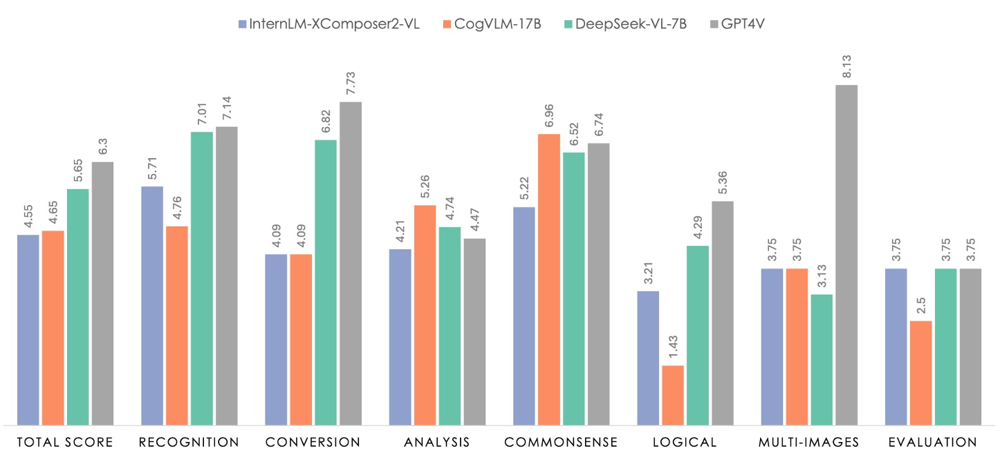
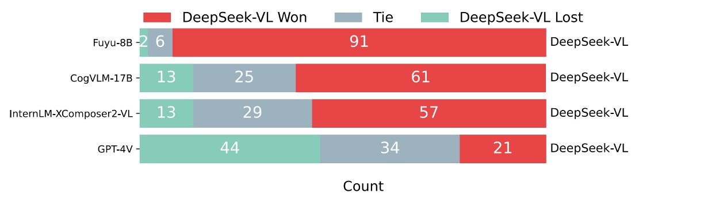

## Multimodal Training Recipe

[**DeepSeek-VL: Towards Real-World Vision-Language Understanding**](https://arxiv.org/abs/2403.05525)

---

This paper discusses multimodal research.

Two months after the release of DeepSeek LLM, the DeepSeek team published their research results in the multimodal domain.

## Problem Definition

Existing multimodal models often use low-resolution inputs (e.g., 336×336 or 448×448), which leads to poor performance in complex scenarios such as OCR tasks or tiny object recognition. Moreover, there is still a significant performance gap between open-source and closed-source models.

What hasn't been done well in the past serves as the best motivation for the future.

The authors briefly illustrate the typical application of multimodal models using the example of image question answering.

<figure style={{"width": "90%"}}>

</figure>

## Solution

In this paper, the authors break down the training problems of multimodal models into three dimensions.

### Training Data

The study divides the dataset into two main categories:

- **Pre-training Data**: Primarily used to improve the model's cross-modal basic understanding ability. The data is sourced from various origins and types, and is used for pre-warming and joint pre-training during the early stages of training.
- **Supervised Fine-tuning Data**: Smaller in scale, mainly used to teach the model to perform specific downstream tasks, and is applied in the later stages of supervised fine-tuning.

First, the **pre-training data** consists of the following:

<figure style={{"width": "70%"}}>

</figure>

- **Interleaved Image-Text Data**: Open datasets like MMC4, Wiki, Wikihow, and Epub textbooks are used to enable the model to learn multimodal input within context.
- **Image Captioning Data**: Sourced from high-quality datasets such as Capsfusion, TaiSu, and Detailed Caption, enhancing the model's ability to semantically describe image content.
- **Table and Chart Data**: Includes sources such as Chart2text, Geo170K, Unichart, Ureader, M-paper, ScienceQA, ScreenQA, SciGraphQA-295K, Paper2figure100k, Widget Captioning, Screen2words, and Refexp, enabling the model to understand typical table and chart images.
- **Web Code Data**: Using UI Inverse Rendering techniques (referencing HuggingFaceM4 and MATCHA methods), about 1.46 million Jupyter notebooks are processed, with 1.1 million representative instances selected after filtering (each example contains at least 5 lines of code), resulting in approximately 2 million pairs of images and code.
- **Document OCR Data**: To address OCR at the document level, two main sources are integrated:
  1. **arXiv Articles**: Source code and PDFs are extracted from 1.4 million arXiv papers, and converted into image-text pairs using the Nougat tool.
  2. **E-books and Educational Materials**: 860,000 English and 180,000 Chinese e-books are processed, along with millions of primary and secondary school test papers, converted into paired formats using HTML rendering tools.
- **Scene Text OCR Data**: Enhances the model's ability to recognize text integrated into images in complex environments.
- **Pure Text Corpus**: Maintains the model's expertise in language tasks, using the same corpus as DeepSeek-LLM.

---

Next, the **supervised fine-tuning data** focuses on the model's performance on specific tasks, sourced from multimodal and language data:

<figure style={{"width": "70%"}}>

</figure>

- **Publicly Available GPT-4V Datasets**: Includes ShareGPT4V, LAION-GPTV, LVIS-Instruct4V, textOCR-GPT4V, LLaVA1.6-GPT4V, and IconQA.
- **Some Table and Chart Data**: Sourced from pre-training datasets like Ureader, ScreenQA, Geo170K, and ScienceQA.
- **UI Code Data**: From Screen-to-code tasks, helping the model reconstruct code from graphical interfaces or visual charts.
- **Internal High-Quality Multimodal SFT Data**: Some data presented in Chinese, meticulously designed based on real-world application scenarios, covering categories such as cognition, transformation, analysis, reasoning, evaluation, and safety. This classification is used to select representative prompts for each test image and to create a balanced evaluation dataset.
- **Pure Text SFT Data**: Consistent with the text data used in DeepSeek-LLM, serving as part of the joint vision and language SFT data.

### Model Architecture

<figure style={{"width": "50%"}}>

</figure>

:::tip
Ignore the ice and fire in the image for now, as this will be discussed in the next section.
:::

The entire model architecture is relatively simple, consisting of three modules:

1. **Hybrid Vision Encoder**

    As shown in the image, the main components are:

    - **SigLIP-L Vision Encoder:** Accepts low-resolution input (384×384) and focuses on extracting high-level semantic information.
    - **SAM-B Vision Encoder:** A vision-specific self-supervised encoder based on ViTDet, capable of accepting high-resolution input (1024×1024), excelling at capturing low-level detail information.

    This design is chosen because image details and semantic information need to be extracted at different resolutions.

    The connection process of the two models is as follows:

    - The high-resolution image, after being encoded by SAM-B, produces a feature map of size `64×64×256`.
    - This feature map is first interpolated by the VL Adaptor to `96×96×256`, followed by two convolution layers with stride 2, resulting in a feature map of size `24×24×1024`, reshaped to `576×1024`.
    - This is concatenated with the `576×1024` feature map output from SigLIP-L, ultimately forming 576 visual tokens, each with a dimension of 2048.
    - After GeLU activation, it passes through an embedding layer to connect with the language model.

    ---

    :::tip
    All information in the image is condensed into these 576 tokens.

    Half of these tokens represent high-level semantic information, while the other half captures low-level details.
    :::

2. **Vision-Language Adaptor**

    This section uses a two-layer hybrid MLP. Initially, separate single-layer MLPs handle high-resolution and low-resolution features, and then the two are concatenated along the dimension and passed through another MLP to transform them into the input space of the language model.

    :::info
    A side note: This section reveals the technical line chosen by the paper.

    To bridge vision and language, there are several common techniques, which we have seen in previous papers:

    1. **Contrastive Learning Methods**: For example, CLIP, ALIGN, etc., these architectures typically map vision and language features to the same space and train the model using contrastive learning.

        - [**[21.03] CLIP: Breaking the Dimensional Barrier**](../../multimodality/2103-clip/index.md)

        ---

    2. **Fusion Methods**: For example, Flamingo, BLIP, etc., these architectures introduce cross-modal attention to fuse features.

        - [**[22.01] BLIP: Synthetic Text Technology**](../../multimodality/2201-blip/index.md)
        - [**[22.04] Flamingo: Richly Illustrated**](../../multimodality/2204-flamingo/index.md)

        ---

    3. **Adapter-based Methods**: This is the approach used by this paper, DeepSeek-VL. In this architecture, a converter is inserted between vision and language features to bridge the two. Specifically, it "translates" vision features into language features and then proceeds with further training in the language model way.

        ---
    4. **Masked Methods**: For example, BEiT-3, which uses masking tasks for self-supervised learning, learning joint representations of images and text by predicting the masked parts.

        - [**[22.08] BEiT-3: Great Minds Think Alike**](../../multimodality/2208-beit-v3/index.md)
    :::

3. **Language Model**

    This part refers to the previously seen DeepSeek LLM, designed based on the LLaMA architecture, using Pre-Norm structure and RMSNorm.

    In the Feed-Forward Network (FFN) section, the activation function uses SwiGLU, and the language model employs Rotary Embedding as positional encoding, with the same tokenizer as DeepSeek-LLM.

    The model is divided into DeepSeek-VL-1B (pre-trained on approximately 500 billion text tokens) and DeepSeek-VL-7B (pre-trained on about 2 trillion tokens).

### Training Process

<figure style={{"width": "90%"}}>

</figure>

The overall training process is divided into three stages, as shown in the image above:

1. **Stage 1: Training the Vision-Language Adaptor**

    In order to establish the correspondence between vision and language features in the embedding space, and to enable the LLM to understand the entities presented in the image, the first stage only trains the adaptor parameters while freezing the vision encoder and language model.

    The data used includes 1.25 million image-text captions from ShareGPT4V and 2.5 million Document OCR rendered pairs.

    Experiments show that simply increasing the data scale does not provide significant benefits and may even lead to performance degradation, so the LLM will be unfrozen in the next stage.

2. **Stage 2: Joint Vision-Language Pretraining**

    In the second stage, part of the DeepSeek LLM is unfrozen and added to the training.

    The challenge here is how to train on multimodal data without affecting the language model's performance. According to experimental results, directly training on multimodal data improves multimodal performance but severely degrades the language model's linguistic performance.

    Ultimately, the authors choose a training ratio of about 7:3 for language and multimodal data. Additionally, to address the training instability due to the limited capacity of the 1.3B model and lack of SFT data, they adopt the Multi-choice PPL method: inputting the question along with all answers, calculating the perplexity for each option, and selecting the option with the lowest perplexity as the final answer. A small amount of SFT data is also introduced during pretraining to improve the model's instruction-following ability.

3. **Stage 3: Supervised Fine-tuning**

    The final stage involves unfreezing all the model parameters and performing supervised fine-tuning.

    In this step, the authors make instruction adjustments to the pretrained model to further enhance the model's dialogue and interaction capabilities, ultimately resulting in the DeepSeek-VL-Chat model.

    During training, a mix of multimodal data and pure text dialogue data is used to ensure the model demonstrates comprehensive performance in various dialogue scenarios.

### Discussion

The paper includes several charts and tables, but here we will focus on the results from the Human Evaluation. If you're interested in other sections, feel free to refer to the original paper.

<figure style={{"width": "90%"}}>

</figure>

In the chart above, the green section represents the performance of DeepSeek-VL-7B, while the gray section represents GPT-4V.

The evaluation dataset consists of 100 questions, which are divided into seven categories. These categories align with the classification system used for the internal supervised fine-tuning (SFT) data, ensuring that the tasks being tested are representative and cover the majority of multimodal model applications.

To ensure the dataset is comprehensive and representative, the research team collected similar image materials from free-licensed image communities and photographs taken by researchers themselves. They then designed appropriate prompts based on the task categories and requirements described in existing reports. This data collection and prompt design process ensured that the human evaluation dataset accurately reflects real-world multimodal application scenarios.

In the evaluation, DeepSeek-VL-7B was compared with InternLM-XComposer2-VL, CogVLM, and GPT-4V. The results show that GPT-4V excels in most dimensions, while all open-source models still lag behind GPT-4V in logical reasoning, highlighting the need for scaling LLMs.

DeepSeek-VL-7B achieves near GPT-4V performance overall, especially excelling in tasks such as "Recognition," "Transformation," and "Common Sense Reasoning."

Additionally, the authors conducted an extra comparative evaluation, using GPT-4V as an evaluator to compare the answer quality between DeepSeek-VL and other models.

The procedure involved showing GPT-4V the question and answers from two models for 99 manually evaluated test samples, and GPT-4V would determine which answer was better or if both were equal.

The results are shown in the figure below:

<figure style={{"width": "90%"}}>

</figure>

In most cases, GPT-4V tends to rate DeepSeek-VL's answers higher.

DeepSeek-VL was considered superior in over 60% of cases compared to other open-source multimodal models (e.g., Fuyu-8B, CogVLM-17B, and InternLM-XComposer2-VL). Compared to other proprietary models, DeepSeek-VL also demonstrated excellent performance, matching GPT-4V.

### Ablation Study

1. **Module Capacity and Data Scale**

    

    <figure style={{"width": "90%"}}>
    
    </figure>
    

    During the first training phase (the projector warmup stage), the authors expanded the training dataset and then performed supervised fine-tuning to test whether this would improve the performance of the projector.

    As shown in the table above, increasing the training data did not improve performance in stage 1. This suggests that the projector's capacity has inherent limitations, unable to capture the vast amount of knowledge needed for multimodal tasks, and simply increasing the dataset size will not overcome this bottleneck.

2. **The Importance of Stage-wise Training**

    

    <figure style={{"width": "90%"}}>
    
    </figure>
    

    The authors compared the impact of different stage combinations on the final model performance, as shown in the table above:

    - Combination of "Stage 1 + Stage 2 + Stage 3"
    - Combination of "Stage 1 + Stage 3"
    - Combination of "Stage 2 + Stage 3"

    The combination of all three stages (Stage 1, Stage 2, and Stage 3) significantly outperformed the combination of Stage 1 and Stage 3, demonstrating the importance of multimodal pretraining (Stage 2).

    Furthermore, even when using only Stage 2 and Stage 3, the performance was slightly lower than the full-stage combination, indicating that the Vision-Language Adaptor warm-up stage (Stage 1) also contributes positively to the final results.

---

In addition, the authors discuss the importance of modality grouping and pre-warming strategies. Using a modality-based grouping training strategy effectively addresses the efficiency bottleneck caused by different processing speeds across modalities in mixed batches. Also, starting from pure language data and gradually incorporating multimodal data (modality pre-warming) helps prevent a sharp decline in language capabilities early on, both of which have significant practical value.

The comparison tables in this section are quite detailed, so they are not fully listed here. Interested readers can refer to the original paper.

## Conclusion

In this paper, the authors propose a training recipe for multimodal models, and let's review the key points:

1. **Use two vision encoders responsible for extracting information at different resolutions.**
2. **Use Adapter-based methods to transform visual features into language features.**
3. **Use a three-stage "pretraining - fine-tuning" strategy to ensure the model's performance on multimodal tasks.**

As mentioned earlier, there are many pretraining methods. Another technique that can save computational resources is MoE (Mixture of Experts). The authors also mention plans to scale DeepSeek-VL to a larger scale and introduce MoE techniques to further improve the model's efficiency and performance.

Let’s stay tuned for what’s next!