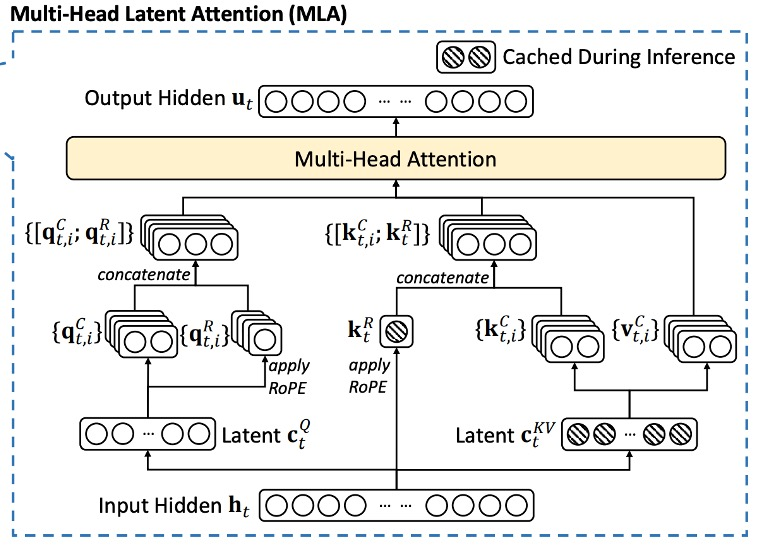
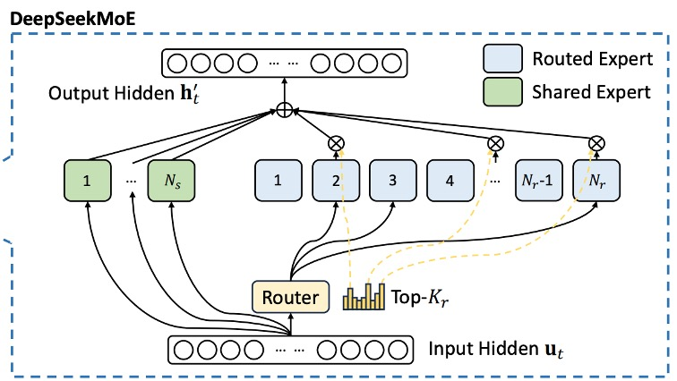
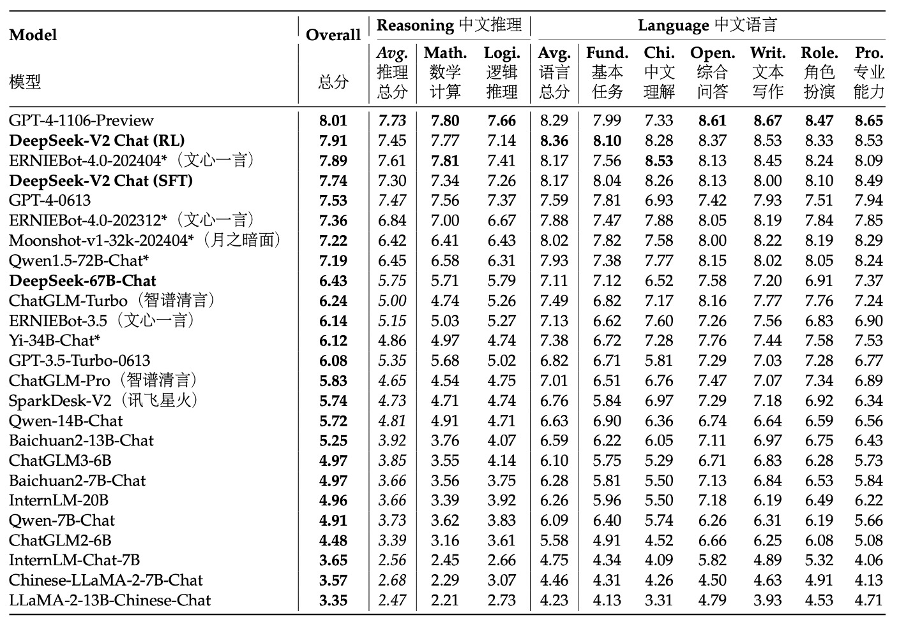

## Cost-Effective Optimization

[**DeepSeek-V2: A Strong, Economical, and Efficient Mixture-of-Experts Language Model**](https://arxiv.org/abs/2405.04434)

---

The previous paper was discussing testing the effects of MoE, and not even three months later, here comes another paper.

This paper has 52 pages, with a large amount of experimental data and technical details. As usual, we'll focus on the key points.

:::warning
Mathematics warning: The main focus of this paper is on optimizing the model modules, which involves a significant amount of mathematics. Please read carefully.
:::

## Defining the Problem

In recent years, with the rapid development of large language models, the increase in the number of parameters has indeed brought about significant improvements in model performance, even showcasing some "emergent capabilities," giving us hope of moving towards general artificial intelligence.

However, this improvement often comes with a huge consumption of computational resources, which not only makes training extremely expensive but also results in efficiency loss during inference due to computational and memory bottlenecks. This, in turn, affects the widespread adoption and deployment of these models in real-world applications.

Therefore, the DeepSeek research team focused on the computational bottleneck and efficiency issues and proposed the DeepSeek-V2 model, aiming to improve computational efficiency and reduce training and inference costs while maintaining strong performance.

## Solving the Problem

DeepSeek-V2 still adopts the standard Transformer structure, where each Transformer block contains an attention module and a feed-forward network (FFN).
- **Attention Module**: The research team proposed MLA, which uses low-rank key-value joint compression to address the KV cache bottleneck faced by traditional MHA during generation.
- **Feed-Forward Network**: The DeepSeekMoE architecture is used, which is a high-performance Mixture-of-Experts model that allows training powerful models within limited costs.

Other details (such as Layer Normalization and activation functions) follow the setup of DeepSeek 67B. The overall architecture is shown in the figure below:

<figure style={{"width": "90%"}}>

</figure>

### Multi-head Latent Attention

<figure style={{"width": "80%"}}>

</figure>

In the standard multi-head attention mechanism (MHA), assume:
- $d$: embedding dimension
- $n_h$: number of attention heads
- $d_h$: dimension of each head
- $h_t \in \mathbb{R}^{d}$: input representation of the $t$-th token

Using three projection matrices $W_Q$, $W_K$, and $W_V$, each of size $\mathbb{R}^{d_h n_h \times d}$, the query (q), key (k), and value (v) are computed:

$$
\begin{aligned}
q_t &= W_Q h_t\\[1mm]
k_t &= W_K h_t\\[1mm]
v_t &= W_V h_t
\end{aligned}
$$

These vectors are then split into $n_h$ heads as follows:
$$
[q_{t,1};\, q_{t,2};\, \dots; \, q_{t,n_h}] = q_t
$$
$$
[k_{t,1};\, k_{t,2};\, \dots; \, k_{t,n_h}] = k_t
$$
$$
[v_{t,1};\, v_{t,2};\, \dots; \, v_{t,n_h}] = v_t
$$

Each head then performs the attention calculation:

$$
o_{t,i} = \sum_{j=1}^{t} \text{Softmax}_j\!\left(\frac{q_{t,i}^\top k_{j,i}}{\sqrt{d_h}}\right) v_{j,i}
$$

Finally, the outputs of the heads are combined through an output projection matrix $W_O \in \mathbb{R}^{d \times d_h n_h}$:

$$
u_t = W_O [o_{t,1};\, o_{t,2};\, \dots; \, o_{t,n_h}]
$$

Up to this point, this is the standard MHA computation process.

However, the problem lies in the fact that during inference, to speed up computation, all the keys and values need to be cached. This results in each token having to store $2 n_h d_h$ elements, and when the sequence length is large, the memory cost grows quadratically, becoming a significant bottleneck.

Thus, the core of MLA is to reduce the KV cache using "low-rank compression."

The specific steps are as follows:

1. **Key-Value Compression**: For each token, we first compute its compressed latent representation:

   $$
   c_{KV,t} = W_{DKV} h_t
   $$

   where $c_{KV,t} \in \mathbb{R}^{d_c}$, $d_c \ll d_h n_h$, and $W_{DKV} \in \mathbb{R}^{d_c \times d}$ is the down-projection matrix.

2. **Up-Projection to Recover Keys and Values**: The keys and values are recovered from the compressed representation:

   $$
   k_C,t = W_{UK} c_{KV,t}
   $$

   $$
   v_C,t = W_{UV} c_{KV,t}
   $$

   where $W_{UK}$ and $W_{UV}$ are the up-projection matrices for the key and value, respectively, with dimensions $\mathbb{R}^{d_h n_h \times d_c}$.

During inference, only $c_{KV,t}$ needs to be cached, meaning each token only stores $d_c$ elements, significantly reducing memory costs.

Additionally, because $W_{UK}$ can be absorbed into $W_Q$, and $W_{UV}$ can be absorbed into $W_O$, there is no need for explicit key and value computation during the actual attention calculation.

Finally, to reduce activation memory during training, the research team also applied a similar low-rank compression to the query vectors:

$$
c_{Q,t} = W_{DQ} h_t
$$

$$
q_C,t = W_{UQ} c_{Q,t}
$$

where $c_{Q,t} \in \mathbb{R}^{d'_c}$ is the compressed representation of the query, and $d'_c \ll d_h n_h$.

### Decoupling Rotary Position Embedding

Rotary Position Embedding (RoPE) is a method for incorporating position information in Transformer models, but it is sensitive to both keys and queries. In the case of low-rank compression, if RoPE is directly applied to the compressed key $k_C,t$, it will couple the up-projection matrix $W_{UK}$ with the positional information, thus breaking the earlier absorption optimization and forcing the need to recompute the keys for previous tokens during inference.

:::tip
Wait, this section might seem confusing?

No worries, let’s simplify it: Imagine compressing ten people’s names into one single name.

Suppose you originally have ten names, like “Xiaoming, Ahua, Xiaomei, Aqiang…” Each name has its own position. To save space, you decide to merge these ten names into a comprehensive name, such as “MinghuaMeiqiang…” This method saves storage space and is easier to manage.

However, if you then add the position information of each original name to this merged name (for example, marking the original order in front of the merged name), this new combined name becomes tightly bound with the position information.

The result is: whenever you want to add a new name or query the order of previous names, you must first break apart the merged name and recompute the correct order for each person. This undermines the convenience brought by the initial compression and increases the burden for further processing.

In a Transformer model, RoPE is used to add position information to keys and queries, but if you apply RoPE directly to the already compressed (low-rank compressed) key, it’s like adding position information to that merged name. This couples the up-projection matrix (which corresponds to our subsequent processing tool) with the positional information, forcing the need to recompute the keys for the prefix tokens during inference. This not only reduces efficiency but also undermines the benefits of the compression.
:::

The research team proposed a decoupled RoPE strategy. Specifically, they added extra multi-head queries $q_{R,t,i} \in \mathbb{R}^{d^R_h}$ and shared keys $k_{R,t} \in \mathbb{R}^{d^R_h}$ to carry the positional information of RoPE.

Then, they computed the following:

$$
[q_{R,t,1};\, q_{R,t,2};\, \dots; \, q_{R,t,n_h}] = q_{R,t} = \text{RoPE}(W_{QR} c_{Q,t})
$$

$$
k_{R,t} = \text{RoPE}(W_{KR} h_t)
$$

Where $W_{QR} \in \mathbb{R}^{d^R_h n_h \times d'_c}$ and $W_{KR} \in \mathbb{R}^{d^R_h \times d}$ are the matrices used to generate decoupled queries and keys.

Finally, the compressed part and the decoupled part are concatenated:

$$
q_{t,i} = [q_{C,t,i};\, q_{R,t,i}]
$$

$$
k_{t,i} = [k_{C,t,i};\, k_{R,t}]
$$

And the attention calculation is performed:

$$
o_{t,i} = \sum_{j=1}^{t} \text{Softmax}_j\!\left(\frac{q_{t,i}^\top k_{j,i}}{\sqrt{d_h + d^R_h}}\right) v_{C,j,i}
$$

Finally, the outputs of the heads are combined using $W_O$:

$$
u_t = W_O [o_{t,1};\, o_{t,2};\, \dots; \, o_{t,n_h}]
$$

This design decouples RoPE’s positional information from the low-rank compression, thereby retaining the advantages of position encoding without affecting the absorption matrix optimizations, ensuring that no keys need to be recomputed for prefix tokens during inference.

### DeepSeekMoE

<figure style={{"width": "80%"}}>

</figure>

Unlike traditional MoE models, DeepSeekMoE performs a more detailed segmentation of the experts: splitting the FFN module into two parts:

- **Shared Experts**: A fixed number of experts that each token will use.
- **Routed Experts**: Experts that are dynamically selected to participate in the computation.

For the $t$-th token, its FFN input is $u_t$, and the final FFN output $h'_t$ is defined as:

$$
h'_t = u_t + \sum_{i=1}^{N_s} \text{FFN}^{(s)}_i(u_t) + \sum_{i=1}^{N_r} g_{i,t} \,\text{FFN}^{(r)}_i(u_t)
$$

Where:
- $N_s$ is the number of shared experts,
- $N_r$ is the number of routed experts,
- $\text{FFN}^{(s)}_i(\cdot)$ and $\text{FFN}^{(r)}_i(\cdot)$ represent the feed-forward operations of the $i$-th shared expert and routed expert, respectively.

The selection of routed experts depends on a gating mechanism, defined as follows:

$$
g_{i,t} =
\begin{cases}
s_{i,t}, & \text{if } s_{i,t} \in \text{Topk}(\{ s_{j,t} \mid 1 \le j \le N_r\}, K_r),\\[1mm]
0, & \text{otherwise},
\end{cases}
$$

Where $K_r$ is the number of active routed experts, and $s_{i,t}$ is the affinity score between the token and the $i$-th routed expert, computed as:

$$
s_{i,t} = \text{Softmax}_i\bigl(u_t^\top e_i\bigr)
$$

Here, $e_i$ represents the "centroid" of the $i$-th routed expert, which is used to represent the feature center of that expert.

In MoE models, when experts are distributed across multiple devices, the routing decision for each token may involve cross-device communication. If a large number of experts are activated, this will incur additional communication costs. To control this, DeepSeekMoE uses a **device-limited routing** mechanism:

1. For each token, select $M$ devices with the highest affinity scores across all devices.
2. Then, perform Top-K expert selection only within these $M$ devices.

Experimental observations show that when $M \ge 3$, this limitation significantly reduces cross-device communication while maintaining performance close to the unrestricted Top-K selection.

The core of this strategy is to balance routing quality with communication costs between devices, achieving high computational efficiency in large-scale distributed environments.

:::tip
If you’re not familiar with Mixture-of-Experts (MoE), you can refer to our previous notes:

- [**[21.01] Switch Transformer: Let the Experts Speak**](../../transformers/2101-switch-transformer/index.md)
:::

### Auxiliary Balance Loss

Since MoE models often experience situations where some experts are overactivated (or even completely unused), this can lead to "routing collapse" and reduce computational efficiency. To address this, DeepSeekMoE has designed three auxiliary losses to promote load balancing:

1. **Expert-Level Balance Loss**

    $$
    L_{ExpBal} = \alpha_1 \sum_{i=1}^{N_r} f_i\, P_i
    $$

    Where:

    $$
    f_i = \frac{1}{K_r\,T} \sum_{t=1}^{T} 1(\text{Token } t \text{ selects Expert } i)
    $$

    $$
    P_i = \frac{1}{T} \sum_{t=1}^{T} s_{i,t}
    $$

    - $T$ is the total number of tokens in the sequence,
    - $1(\cdot)$ is an indicator function,
    - $\alpha_1$ is a hyperparameter used to adjust the loss weight.

    This loss aims to balance the activation frequency and average affinity score of each routed expert.

---

2. **Device-Level Balance Loss**

    The routed experts are grouped into $D$ groups (each group $E_i$ placed on the same device). The loss is defined as:

    $$
    L_{DevBal} = \alpha_2 \sum_{i=1}^{D} f'_i\, P'_i
    $$

    Where:

    $$
    f'_i = \frac{1}{|E_i|} \sum_{j \in E_i} f_j
    $$

    $$
    P'_i = \sum_{j \in E_i} P_j
    $$

    - $\alpha_2$ is the device-level balance hyperparameter.

    This helps ensure the computation load is balanced between devices, preventing any one device from becoming overloaded and causing bottlenecks.

---

3. **Communication Balance Loss**

    Even with device-limited routing, if some devices receive significantly more tokens than others, this can affect communication efficiency. Therefore, the following loss is introduced:

    $$
    L_{CommBal} = \alpha_3 \sum_{i=1}^{D} f''_i\, P''_i
    $$

    Where:

    $$
    f''_i = \frac{D}{M\,T} \sum_{t=1}^{T} 1(\text{Token } t \text{ is sent to device } i)
    $$

    $$
    P''_i = \sum_{j \in E_i} P_j
    $$

    - $\alpha_3$ is the communication balance hyperparameter.

    This design encourages each device to maintain a similar level of communication, improving computational coordination efficiency across devices.

---

Finally, in addition to balance losses, the research team introduced a **device-level token dropping strategy** to further mitigate the computational waste caused by load imbalances. The method is as follows:

1. Calculate the average computation budget for each device so that the capacity factor for each device is set to 1.0.
2. Drop the tokens with the lowest affinity scores on each device until the computation budget is reached.
3. Ensure that about 10% of the training tokens are never dropped.

This allows for flexible decisions on whether to drop tokens during inference based on efficiency requirements, while ensuring consistency between training and inference.

### Training Strategy

The paper maintains the same data processing pipeline as DeepSeek 67B, but with the following enhancements:

- **Expanded Data Volume**: The cleaning process was optimized to recover a large amount of previously deleted data.
- **Improved Data Quality**: More high-quality data was added, especially Chinese data (Chinese tokens are about 12% more than English tokens). Additionally, quality-based filtering algorithms were improved to remove a large amount of useless information while retaining valuable content.
- **Filtered Controversial Content**: This strategy aims to reduce biases from specific regional cultures.

The tokenizer uses the same Byte-level Byte-Pair Encoding (BBPE) algorithm as DeepSeek 67B, with a vocabulary size set to 100K, resulting in a total pre-training corpus of 8.1T tokens.

Model hyperparameters are as follows:

- Number of Transformer layers: 60 layers
- Hidden layer dimension: 5120
- Standard deviation of randomly initialized parameters: 0.006
- **MLA-related:**
    - Number of attention heads $n_h$: 128
    - Dimension of each head $d_h$: 128
    - KV compression dimension $d_c$: 512
    - Query compression dimension $d'_c$: 1536
    - Decoupled query and key head dimension $d^R_h$: 64

MoE layer configuration is as follows: except for the first layer, all other FFN layers are replaced with MoE layers.

- Each MoE layer contains 2 shared experts and 160 routed experts
- The hidden dimension of each expert is 1536
- Each token activates 6 routed experts
- To address the impact of low-rank compression and fine-grained expert segmentation on layer output size, additional RMS Norm layers and scaling factors were introduced to ensure training stability.

Finally, DeepSeek-V2 has a total of 236B parameters, but only 21B parameters are activated per token.

Training hyperparameters are as follows:

- Optimizer: AdamW, hyperparameters $\beta_1=0.9$, $\beta_2=0.95$, weight decay = 0.1
- Learning rate scheduling: Linear warmup for the first 2000 steps, then scaled by 0.316 at approximately 60% and 90% of the token count, with a maximum learning rate of 2.4×10⁻⁴
- Gradient clipping set to 1.0
- Batch size uses a progressive adjustment strategy, from 2304 to 9216, then remains at 9216
- Maximum sequence length set to 4K, trained on 8.1T tokens
- Other parallelization setups:
    - Pipeline parallelism is used to deploy different layers across different devices
    - Routed experts are evenly distributed across 8 devices ($D=8$)
    - Device-limited routing is set to send each token to a maximum of 3 devices ($M=3$)
    - Hyperparameters for the auxiliary balance losses are set to $\alpha_1=0.003$, $\alpha_2=0.05$, $\alpha_3=0.02$
    - Token-dropping strategy used during training for acceleration, but tokens are not dropped during evaluation

---

After the preliminary pre-training, the research team used the YaRN method to expand the model's default context window from 4K to 128K.

Particular attention was given to expanding the decoupled shared key $k^R_t$ responsible for carrying RoPE, with parameters set as: scale $s=40$, $\alpha=1$, $\beta=32$, and a target maximum context length of 160K.

To accommodate the unique attention mechanism, the length scaling factor was adjusted, making the formula for $\sqrt{t}$ as follows:

$$
\sqrt{t} = 0.0707 \ln s + 1
$$

This aims to minimize perplexity.

During the long-context expansion phase, an additional 1000 steps were trained, with a sequence length of 32K and a batch size of 576 sequences. Although only a 32K sequence length was used during training, the model showed robust performance during evaluation at the 128K context length. Based on the "Needle In A Haystack" (NIAH) test, the model performed well across various context lengths.

## Model Alignment

To improve the alignment of the model with human preferences and further enhance the accuracy and satisfaction of responses, the authors performed reinforcement learning adjustments. The Group Relative Policy Optimization (GRPO) algorithm was used, which is particularly advantageous as it saves training costs by eliminating the need for a critic model of the same scale as the policy model. Instead, group scores are used to estimate the baseline.

The reinforcement learning training strategy is divided into two stages:

- **Stage 1: Reasoning Alignment**

    In this stage, the authors trained a dedicated reward model $R_{\text{Mreasoning}}$ for reasoning tasks, such as programming and mathematics:

    $$
    r_i = R_{\text{Mreasoning}}(o_i)
    $$

    This helps the model continuously improve its problem-solving abilities for such tasks.

- **Stage 2: Human Preference Alignment**

    In this stage, a multi-reward framework is used, with rewards obtained from three aspects:
    - A helpful reward model $R_{\text{Mhelpful}}$
    - A safety reward model $R_{\text{Msafety}}$
    - A rule-based reward model $R_{\text{Mrule}}$

    Ultimately, for a given response $o_i$, the reward value is calculated as:

    $$
    r_i = c_1 \cdot R_{\text{Mhelpful}}(o_i) + c_2 \cdot R_{\text{Msafety}}(o_i) + c_3 \cdot R_{\text{Mrule}}(o_i)
    $$

    Where $c_1, c_2, c_3$ are the respective coefficients. This multi-reward design helps the model consider multiple quality metrics when generating responses.

To obtain reliable reward signals, the research team collected large amounts of preference data:
- Preference data for programming tasks were based on compiler feedback,
- Preference data for mathematics tasks were based on real labels.

The reward model was initialized using DeepSeek-V2 Chat (SFT) results and trained with point-to-point or pairwise loss.

## Discussion

Due to space limitations, let's look at the results from AlignBench. If you are interested in other experimental results, you can refer to the original paper.

<figure style={{"width": "90%"}}>

</figure>

The table ranks the models based on their overall performance scores on AlignBench, with higher-scoring models ranked higher. This reflects their overall capabilities in tasks such as Chinese conversation generation or comprehension. The scores were evaluated by GPT-4‑0613, meaning this powerful model was used as the standard to assess the quality and context relevance of the generated results.

The experimental results show that, in Chinese generation tasks, DeepSeek-V2 Chat (RL) has a slight advantage over (SFT) and has significantly surpassed all other open-source Chinese models, especially in Chinese reasoning and linguistic abilities, outperforming the second-place model, Qwen1.5 72B Chat.

In terms of Chinese comprehension ability, DeepSeek-V2 Chat (RL) even outperforms GPT‑4‑Turbo‑1106‑Preview. However, in reasoning tasks, DeepSeek-V2 Chat (RL) still lags behind some giant models, such as Erniebot‑4.0 and GPT‑4.

These evaluation results demonstrate the advantages of the DeepSeek-V2 Chat model under different fine-tuning strategies: with RL fine-tuning, it not only achieves a significant advantage in English conversation generation but also performs at a very high level in Chinese comprehension, although there is still room for improvement in certain reasoning tasks. This shows that the model is highly competitive in generating high-quality, instructional dialogue, while also indicating areas for future improvement.

## Conclusion

<figure style={{"width": "90%"}}>

</figure>

DeepSeek-V2 is a large language model based on the MoE architecture, supporting up to 128K context length.

The model leverages two innovative techniques:

  - **Multi-head Latent Attention**: By using low-rank key-value joint compression, it greatly reduces the need for KV cache during inference, thus improving inference efficiency.
  - **DeepSeekMoE**: Through fine-grained expert segmentation and shared expert designs, it achieves the goal of training powerful models at lower costs.

Compared to the previous version, DeepSeek LLM 67B, DeepSeek-V2 offers:
  - A **42.5% reduction** in training costs;
  - A **93.3% reduction** in KV cache usage;
  - A **5.76x improvement** in generation throughput.

Despite having a total of 236B parameters, each token only activates 21B parameters, which strikes a good balance between economy and performance, making it one of the most powerful open-source MoE models currently available.