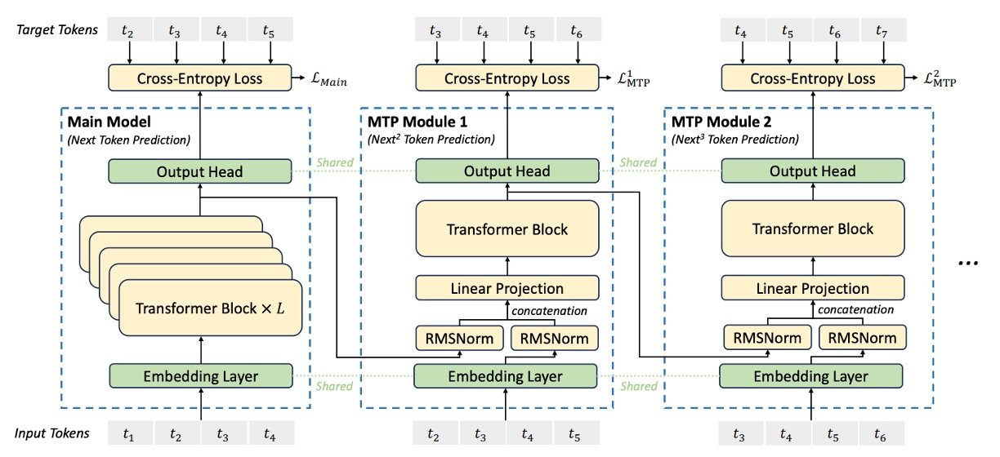
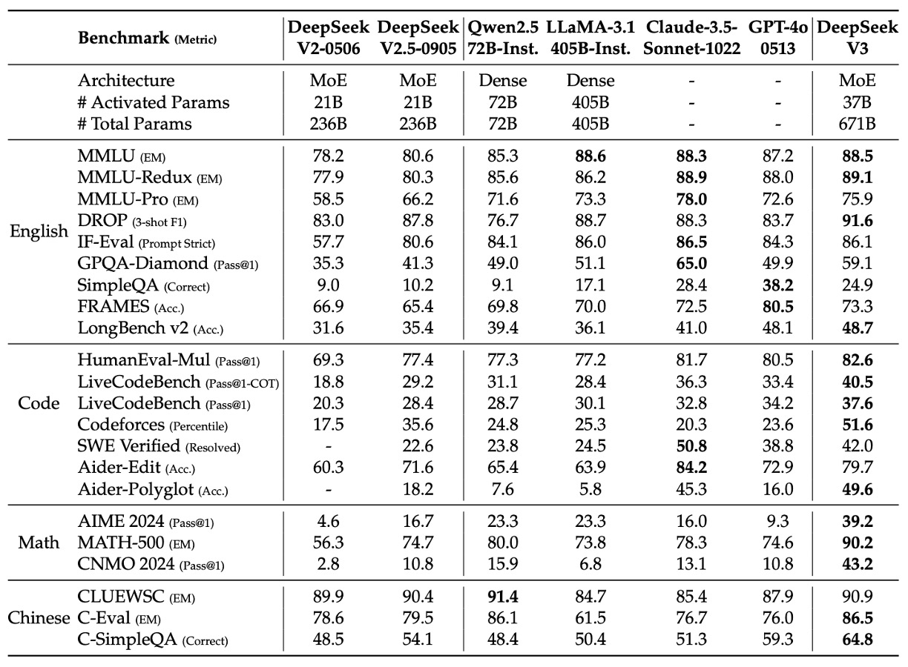
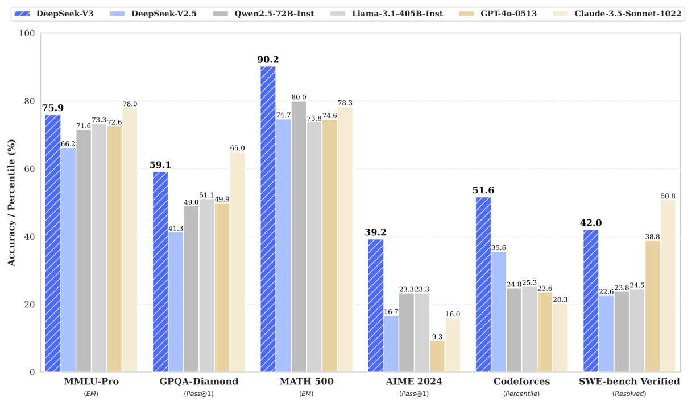

## The Expert’s Far-Sighted View

[**DeepSeek-V3 Technical Report**](https://arxiv.org/abs/2412.19437)

---

In the blink of an eye, we’ve reached the third generation.

Let’s quickly recall what the research team has done in previous iterations.

## Defining the Problem

The first generation, DeepSeek LLM, followed the LLaMA architecture and proposed its own Scaling Law, fitting the optimal formula after several rounds of testing.

The second generation, DeepSeek-V2, built on the previous work, introducing the DeepSeekMoE architecture and the Multi-Head Latent Attention (MLA) mechanism, yielding impressive results.

Now, of course, the goal is to continue the success of past efforts.

In the third-generation architecture, the research team scaled up the model size by about double, aiming to create an even larger model.

However, merely increasing the scale wouldn’t make for an interesting paper, so more had to be done.

Therefore, in this paper, the research team proposed several new improvements:

1. Adjusting the auxiliary loss function strategy to make the expert system more stable.
2. Providing more prediction targets to compress the information density of each token.
3. Introducing FP8 mixed precision for training and implementing more efficient parallelization algorithms.

We won’t repeat the similar parts from before, so let’s now dive into the specific details of the improvements presented in this paper.

:::tip
For readers interested in the technical details of previous generations of the model, you can refer to our previous notes:

- [**[24.01] DeepSeek LLM: New Scaling Laws**](../2401-deepseek-llm/index.md)
- [**[24.05] DeepSeek-V2: Cost-Effective Optimization**](../2405-deepseek-v2/index.md)
  :::

## Solving the Problem

The overall architecture of DeepSeek-V3 is still based on the Transformer, but it has been optimized for training cost and inference efficiency, primarily reflected in the MLA and DeepSeekMoE modules.

1. **Multi-Head Latent Attention (MLA)**: Reduces memory consumption of the key-value (KV) cache through low-rank compression.
2. **DeepSeekMoE with Auxiliary-Loss-Free Strategy**: Utilizes a fine-grained expert branch structure and a dynamic adjustment mechanism to maintain load balancing across experts without introducing additional auxiliary losses.

While MLA improves inference efficiency, DeepSeekMoE reduces training costs.

These two parts were already seen in DeepSeek-V2, so we’ll skip further details.

---

Let’s now take a look at the auxiliary-loss-free strategy.

You may recall that in DeepSeek-V2, the author dedicated a large portion of the paper to explaining the "auxiliary loss strategy" because traditional MoE models often rely on auxiliary losses to prevent routing collapse. However, excessive auxiliary loss can degrade model performance, and fine-tuning it relies heavily on experience.

Half a year later, in this paper, the research team tells us, "We’ve decided to ditch that approach!"

### Auxiliary-Loss-Free Strategy

The original term is Auxiliary-Loss-Free Load Balancing.

The approach of the auxiliary-loss-free strategy is to add a bias term $b_i$ to each expert and add it to the corresponding affinity score, which is used to determine the Top-$K_r$ routing:

$$
g'_{i,t} =
\begin{cases}
s_{i,t}, & s_{i,t} + b_i \in \text{Topk}(\{ s_{j,t} + b_j \,|\, 1 \le j \le N_r \}, K_r), \\
0, & \text{otherwise}.
\end{cases}
$$

It’s important to note that this bias term is used solely for routing decisions, while the original $s_{i,t}$ is still used for calculating the gate value.

At the end of each training step, based on the load of each expert: if an expert is overloaded, its $b_i$ is decreased by $\gamma$; if underloaded, it’s increased by $\gamma$ (where $\gamma$ is the hyperparameter controlling the bias update rate).

This way, load balancing is maintained without introducing additional auxiliary losses, thereby preventing large auxiliary losses from negatively affecting model performance.

To avoid extreme imbalance within a single sequence, the research team also introduced a sequence-level auxiliary loss:

$$
L_{Bal} = \alpha \sum_{i=1}^{N_r} f_i P_i
$$

Where:

$$
f_i = \frac{1}{K_r T} \sum_{t=1}^{T} 1\{ s_{i,t} \in \text{Topk}(\{ s_{j,t} \,|\, 1 \le j \le N_r \}, K_r) \}
$$

$$
s'_{i,t} = \frac{s_{i,t}}{\sum_{j=1}^{N_r} s_{j,t}}
$$

$$
P_i = \frac{1}{T} \sum_{t=1}^{T} s'_{i,t}
$$

- $T$ is the number of tokens in the sequence,
- $1(\cdot)$ is the indicator function,
- $\alpha$ is a very small hyperparameter.
  This loss is used to further encourage the expert routing distribution within each sequence to remain balanced.

To reduce cross-node communication costs, the system limits each token to be routed to at most $M$ nodes (determined by the highest $K_r^M$ affinity score on each node).

Finally, because the load balancing strategy is effective, DeepSeek-V3 does not discard any tokens during training or inference.

:::tip
**Traditional method**: Encourages balanced activation frequency and affinity scores among experts through expert-level, device-level, and communication balancing losses, but these losses require additional hyperparameter tuning.

**This paper’s method**: Dynamically updates the bias term $b_i$ at the end of each training step based on the load of each expert: if an expert is overloaded, $b_i$ is reduced; if underloaded, $b_i$ is increased. This adjustment automatically leads to more balanced routing without needing to "penalize" imbalance through additional losses.
:::

### Multi-Token Prediction

<div align="center">
<figure style={{"width": "90%"}}>

</figure>
</div>

DeepSeek-V3 introduces a new training objective that allows the model to predict multiple future tokens at each position in sequence.

This strategy has two main advantages:

- **Denser training signals:** Each position generates multiple prediction targets simultaneously, improving data utilization efficiency.
- **Advanced planning representation:** The model can predict and adjust its internal representations layer by layer, making future token generation more forward-looking and accurate.

Unlike previous methods in the literature that use parallel independent output heads, MTP employs a serialized prediction approach, ensuring that a complete causal chain is maintained at each prediction depth.

The entire MTP objective consists of $D$ sequential modules, each used to predict one additional token, and they share embedding layers and output heads with the main model. Each MTP module contains the following components:

- **Shared Embedding Layer Emb(·):**
  Shared with the main model, used to obtain token embeddings.

- **Shared Output Head OutHead(·):**
  Maps the output of the Transformer module to logits, which are then converted into prediction probabilities via Softmax.

- **Transformer Block $TRM_k(\cdot)$:**
  Further processes the information at the $k$-th prediction depth.

- **Projection Matrix $M_k \in \mathbb{R}^{d \times 2d}$:**
  Used to linearly combine the previous layer’s representation with the future token embedding, mapping it back to a $d$-dimensional space.

For the $i$-th input token $t_i$, at the $k$-th prediction depth, we first take the representation $h^{(k-1)}_i \in \mathbb{R}^d$ from the previous layer (when $k=1$, $h^{(0)}_i$ is the output of the main model) and the embedding $Emb(t_{i+k}) \in \mathbb{R}^d$ of token $t_{i+k}$; then, we concatenate these two vectors after applying RMSNorm normalization to both, and perform a linear transformation using the projection matrix $M_k$:

$$
h'^{(k)}_i = M_k\,[\text{RMSNorm}(h^{(k-1)}_i);\, \text{RMSNorm}(Emb(t_{i+k}))]
$$

This step combines information from the previous layer’s representation and the future token, providing richer input features for the $k$-th layer prediction.

The concatenated representation $h'^{(k)}_i$ is then input into the dedicated Transformer block $TRM_k(\cdot)$ to generate the updated representation:

$$
h^{(k)}_{1:T-k} = TRM_k(h'^{(k)}_{1:T-k})
$$

Here $T$ is the input sequence length. As each prediction depth increases, the processing range shrinks by $k$ tokens, ensuring that each prediction has a corresponding ground truth token for training.

Using the shared output head, the Transformer block output is mapped to the prediction distribution, generating the prediction for the $i+k+1$-th token:

$$
P^{(k)}_{i+k+1} = \text{OutHead}(h^{(k)}_i)
$$

Here $P^{(k)}_{i+k+1} \in \mathbb{R}^{V}$ is the predicted probability distribution (where $V$ is the vocabulary size), which is mapped to logits and then passed through Softmax to obtain the probabilities.

To guide the multi-level predictions, each prediction depth $k$ defines a cross-entropy loss. The loss for the $k$-th layer prediction is computed as:

$$
L^{(k)}_{MTP} = \text{CrossEntropy}(P^{(k)}_{2+k:T+1},\, t_{2+k:T+1})
= -\frac{1}{T}\sum_{i=2+k}^{T+1} \log P^{(k)}_i[t_i]
$$

Where $t_i$ is the ground truth label for the $i$-th token, and $P^{(k)}_i[t_i]$ is the predicted probability for that token at the $k$-th layer. The loss calculation starts from $i=2+k$ to ensure each prediction layer corresponds to subsequent ground truth tokens.

The overall MTP loss is obtained by averaging the losses from all $D$ prediction depths and multiplying by a weighting factor $\lambda$:

$$
L_{MTP} = \frac{\lambda}{D}\sum_{k=1}^{D} L^{(k)}_{MTP}
$$

This total loss serves as an additional training objective and is backpropagated together with the main model loss, encouraging the model to learn more forward-looking representations during the generation process.

The MTP module is primarily used to enhance data utilization and prediction ability during training. It guides the model to "plan ahead" for future tokens through multi-level losses.

During inference, the MTP module can be discarded to allow the main model to operate independently, or it can be reused for speculative decoding to reduce generation latency.

:::tip
There are quite a few mathematical descriptions in this paper, and it may seem a bit tricky if you're not very familiar with Transformers.

In fact, this concept is quite similar to how we use a "word chain" to train models.

For example, if we were originally presenting the model with a task like this:

> Given the sentence: "I ate \_\_ today."
> You just need to fill in the answer "dinner."

This type of training, where the model only practices "predicting the next word," is like a single question being asked in each exam, limiting learning efficiency.

On the other hand, DeepSeek-V3's **Multi-Token Prediction (MTP)** introduces a new way of posing the question:

> Given the same sentence: "I ate \_\_ today."
> Now, you’re asked to predict the next three words in sequence: "dinner," "it was delicious," "but I was too full."

Here, we don't predict all three words at once, but rather **the first layer predicts the first word, the second layer predicts the second word, and the third layer predicts the third word**, with each layer considering the answer from the previous layer, refining and planning progressively.

This training approach has two major benefits:

1. **More opportunities to practice:** Each word in a sentence triggers a series of prediction tasks, allowing the model to practice multiple times within the same text.
2. **Learning to plan:** The model doesn't just focus on how the current word connects to the next one; it also considers how the subsequent words should follow, making its internal reasoning more like "having a full sentence planned out in the mind" rather than focusing on just one step.

With this approach, the model learns to "plan ahead and adjust" during training, rather than regretting mistakes made during generation. This significantly improves both generation quality and efficiency.
:::

## Infrastructures

:::info
**This section of the paper covers a substantial amount of content, mainly teaching you how to build the training environment and the necessary hardware and software infrastructure. However, since our focus here is on the software side, we'll briefly go over this section. If you happen to have a bit of extra cash (maybe around 100 million dollars?) to set up this infrastructure, feel free to directly refer to the original paper.**
:::

DeepSeek-V3's successful training relies on advanced hardware platforms and efficient training frameworks.

This section introduces five main parts: computing clusters, training frameworks, low-precision FP8 training, inference deployment, and future hardware design recommendations:

- **Computing Cluster:**

  The training platform for DeepSeek-V3 is based on a large-scale GPU cluster:

  - **Hardware Scale:**
    The cluster is configured with 2048 NVIDIA H800 GPUs, with 8 GPUs per node.
  - **Internal Interconnect:**
    The GPUs within each node are connected via NVLink and NVSwitch for high-speed communication, ensuring very low internal data exchange latency.
  - **Inter-node Communication:**
    Between nodes, InfiniBand (IB) interconnects are used, providing high bandwidth and low latency, enabling real-time data sharing across nodes in a large-scale parallel computing environment.

    ***

- **Training Framework:**

  To fully utilize such hardware resources, the research team developed the HAI-LLM training framework. This framework integrates multiple advanced parallel strategies, including:

  - **Pipeline Parallelism (PP):**
    The model is decomposed into multiple stages and operates through 16-way pipeline parallelism. To address pipeline bubbles, the team introduced the innovative DualPipe algorithm, which enables effective overlap of computation and communication in both forward and backward passes.
  - **Expert Parallelism (EP):**
    For the expert modules in the MoE model, DeepSeek-V3 uses 64-way or even larger scale expert parallelism distributed across multiple nodes, ensuring that each expert has a sufficient batch size to enhance computation efficiency.
  - **Data Parallelism (DP):**
    The ZeRO-1 technique further reduces the pressure of handling large-scale data by distributing model parameters across different computation nodes, effectively reducing memory burden.

  Furthermore, the core of the DualPipe algorithm involves splitting each computation chunk into attention, all-to-all dispatch, MLP, and combine parts, and cleverly overlapping communication and computation during forward and backward passes, nearly hiding cross-node communication latency.

  ***

- **Low-Precision FP8 Training:**

  In large-scale model training, computational speed and memory usage are always in tension. The research team addressed this by introducing FP8 mixed-precision training technology, significantly accelerating core computations:

  - **Core Idea:**
    Primary computations (e.g., matrix multiplication and GEMM operations) are performed in FP8, while operations requiring higher numerical stability are kept in BF16 or FP32. This approach dramatically increases computational speed while maintaining model training stability.
  - **Fine-Grained Quantization Strategy:**
    Due to the dynamic range limitations of FP8, the team proposed tile-wise (1×128) and block-wise (128×128) quantization methods to effectively handle outliers in activations, weights, and gradients.
  - **Accumulate Precision Enhancement:**
    By combining limited accumulation on Tensor Cores with FP32 accumulation on CUDA Cores, the issue of FP8 GEMM accumulation precision deficiency is resolved, keeping relative error below 0.25%.
  - **Low-Precision Storage and Communication:**
    To further reduce memory and communication overhead, activations and optimizer states are also stored and transmitted in low-precision formats, which is especially crucial for training large-scale MoE models.

  This mixed-precision solution theoretically doubles computational speed while significantly reducing memory usage, making large-scale model training more cost-effective and efficient.

  ***

- **Inference and Deployment Strategy:**

  DeepSeek-V3's inference deployment also relies on efficient hardware environments, and the process is split into two stages based on different requirements:

  - **Prefilling Stage:**
    - **Deployment Unit:** The smallest deployment unit consists of 4 nodes (32 GPUs).
    - In this stage, the Attention part uses 4-way Tensor Parallelism combined with Sequence Parallelism and 8-way Data Parallelism; the MoE part uses 32-way Expert Parallelism.
    - To balance GPU loads, a redundant expert mechanism is used, with each GPU deploying redundant experts in addition to the original ones. Additionally, micro-batch overlapping strategies are used to hide communication latency and improve throughput.
  - **Decoding Stage:**
    - **Deployment Unit:** The smallest deployment unit consists of 40 nodes (320 GPUs).
    - This stage focuses on achieving low-latency online inference, with Attention and MoE parts using TP4, SP, DP80, and EP320, respectively. The redundant expert deployment and point-to-point IB communication (using IBGDA technology) ensure high efficiency during inference.

  The division and optimization of these two stages allow the system to maintain high throughput while meeting stringent online service latency requirements.

  ***

- **Future Hardware Design Recommendations:**

  Based on the practical experience with DeepSeek-V3, the research team provided the following recommendations to hardware vendors:

  - **Communication Hardware:**
    - It is suggested that future developments focus on specialized communication co-processors, offloading some communication tasks from SMs and unifying IB and NVLink interfaces, thereby freeing up computation resources and reducing communication latency.
  - **Computation Hardware:**
    - Improve FP8 GEMM accumulation precision to avoid the errors caused by 14-bit accumulation precision in current Tensor Cores.
    - Native support for fine-grained quantization (tile-wise/block-wise quantization) should be implemented so that Tensor Cores can directly handle scaling factors, reducing data transfer between Tensor Cores and CUDA Cores.
    - Integrate FP8 casting and TMA access to achieve online quantization, further reducing memory read/write operations.
    - Support direct transposition of GEMM operations to simplify the process of de-quantizing and transposing activations during backpropagation.

## Pre-training

During pre-training, DeepSeek-V3 not only expanded the training data scale but also introduced several innovations in data construction, loss strategies, hyperparameter settings, and long-context processing.

Let's go through them in order:

- **Data Construction:**

  - **Corpus Optimization:**
    Compared to DeepSeek-V2, DeepSeek-V3 increased the proportion of math and programming samples in the pre-training corpus while also expanding the multilingual coverage, surpassing the reliance on just English and Chinese.
  - **Data Processing Pipeline:**
    The data processing pipeline was improved to minimize redundancy while ensuring corpus diversity.
  - **File Packaging and FIM Strategy:**
    Referencing past methods, file packaging is used to maintain data integrity without performing cross-sample attention masking. The Fill-in-Middle (FIM) strategy is also introduced, where data is structured using a Prefix-Suffix-Middle (PSM) framework, as follows:

    ```
    <|fim_begin|> fpre <|fim_hole|> fsuf <|fim_end|> fmiddle <|eos_token|>
    ```

    The FIM strategy is applied at a 0.1 ratio across the entire corpus, helping the model learn to predict middle text, thus enhancing overall generation capability.

  - **Tokenizer Optimization:**
    Byte-level BPE is used and extended to 128K vocabulary, optimized for multilingual settings, and tokens combining punctuation and newline characters are introduced. To address token boundary deviations, some combined tokens are randomly split to allow the model to handle more special cases.

    ***

- **Hyperparameter Settings:**

  - **Model Structure:**

    - The Transformer has 61 layers, hidden dimension of 7168, and parameter standard deviation initialization of 0.006.
    - In MLA, there are 128 attention heads, each with a dimension of 128. KV compression dimension is set to 512, query compression dimension is 1536, and RoPE’s per-head dimension is 64.
    - Except for the first three FFN layers, all other layers are replaced by MoE layers: each MoE layer contains one shared expert and 256 routing experts, each with an intermediate dimension of 2048, activating 8 routing experts per token. Each token is routed to at most 4 nodes.
    - The multi-token prediction depth $D$ is set to 1, meaning that each token predicts one additional token in addition to the next word.

  - **Training Parameters:**

    - AdamW optimizer is used, with hyperparameters $\beta_1=0.9$, $\beta_2=0.95$, weight_decay=0.1.
    - The maximum pre-training sequence length is 4K, with a total corpus size of 14.8T tokens.
    - Learning rate follows a staged schedule: it starts linearly increasing to $2.2 \times 10^{-4}$ within 2K steps, then remains constant until 10T tokens, followed by a gradual decay following a cosine curve to $2.2 \times 10^{-5}$, before fine-tuning.
    - Batch size gradually increases during training, from 3072 to 15360, and stays constant afterward.
    - To balance MoE load, parameters like bias update speed $\gamma$ and sequence-level balancing loss hyperparameter $\alpha$ are set to ensure each token is routed to at most 4 nodes.

  Overall, DeepSeek-V3 has a total of 671B parameters, with 37B parameters activated per token.

  ***

- **Long-Context Extension:**

  After pre-training, borrowing from DeepSeek-V2, two phases of context extension are performed through YaRN: the first phase extends the sequence length from 4K to 32K, and the second phase further extends it to 128K. During these phases, batch sizes and learning rates are adjusted to accommodate the computational demands of long-context processing.

  The extended model shows significant long-context processing capability in tests like "Needle In A Haystack" (NIAH), demonstrating that the model maintains stable and superior performance even when processing long texts.

## Post-training

After completing pre-training, the research team further improved the model’s alignment with human preferences and its generation quality through fine-tuning and reinforcement learning stages.

This phase primarily includes Supervised Fine-Tuning (SFT) and Reinforcement Learning (RL), accompanied by detailed evaluations to ensure that the final model performs excellently across various domains.

The "pre-training-aligning" model approach has become the standard process for producing current mainstream LLMs.

### Supervised Fine-Tuning (SFT)

In the SFT phase, the team carefully constructed an instruction-tuning dataset covering 1.5 million samples from multiple domains. Each domain used targeted data generation methods:

- **Reasoning Data:**
  To enhance the model's ability in math, programming competitions, and logical reasoning, the team used their internal DeepSeek-R1 model to generate reasoning data. However, the directly generated data may contain issues like "overthinking" or excessive verbosity. Therefore, a dual data generation strategy was adopted:

  - The first format was: `<problem, original response>`, retaining the original answer.
  - The second format added a system prompt, formatted as: `<system prompt, problem, R1 response>`, where the prompt guides the model to reflect and validate its response.

  The final SFT data was generated using an expert model (trained through SFT and RL) and high-quality samples were selected via rejection sampling.

- **Non-Reasoning Data:**
  For creative writing, role-playing, and simple Q&A tasks, the team used DeepSeek-V2.5 to generate answers, followed by manual verification for correctness to ensure data quality.

- **SFT Training Setup:**
  During fine-tuning, DeepSeek-V3-Base was fine-tuned for two epochs with a cosine-decayed learning rate starting from $5 \times 10^{-6}$ and decaying to $1 \times 10^{-6}$; multiple samples from a single sequence were packaged together using a sample masking strategy to avoid interference between samples.

### Reinforcement Learning (RL)

The RL phase further aligns the model’s output with human preferences, using two reward models and a Group Relative Policy Optimization (GRPO) algorithm:

- **Reward Model (RM):**
  The research team used two types of reward models:

  - **Rule-based RM:**
    For tasks with clear answers (e.g., math or LeetCode), rewards are given based on specific formats (e.g., answers shown in a box) or compiler-verified test cases.
  - **Model-based RM:**
    For tasks without clear answers (e.g., creative writing), RM evaluates the input question and generated response, incorporating chain-of-thought information to lower the risk of reward hacking.

- **Group Relative Policy Optimization (GRPO):**
  To update the policy model, GRPO no longer uses traditional critic models but calculates advantages from output groups generated by the old policy, updating the current policy based on these advantages. This method makes policy updates more stable and leverages diverse generated outputs.

  Mathematically, the GRPO objective function adjusts the proportions and applies a clipping operation to each output $o_i$, ensuring that updates do not deviate too far from the old policy, and introduces a KL divergence penalty to maintain constraints.

- **RL Overall Process:**
  During the RL process, the team used prompts from different domains (e.g., programming, math, writing, role-playing) to generate diverse outputs, rewarding the model through RM. This process not only allowed the model to integrate R1 model generation patterns but also better satisfied human preferences, significantly enhancing performance on limited SFT data.

## Discussion

:::tip
There are numerous comparison tables in the paper. Interested readers can refer to the original paper; here we focus on the key charts.
:::

<div align="center">
<figure style={{"width": "90%"}}>

</figure>
</div>

The data in the above table shows the performance of various models on multiple standard benchmarks. From this, we can clearly see that DeepSeek-V3 has several notable advantages over GPT-4o:

1. **English Knowledge and Long-Context Ability:**

   - On MMLU and MMLU-Redux, DeepSeek-V3 performs similarly or slightly better than GPT-4o.
   - In long-context tests such as DROP (3-shot F1) and LongBench v2, DeepSeek-V3 scores 91.6 and 48.7, while GPT-4o scores only 83.7 and 48.1, demonstrating stronger performance in handling long documents.

2. **Code Generation and Programming Ability:**

   - In HumanEval-Mul, LiveCodeBench, and Codeforces metrics, DeepSeek-V3 scores 82.6, 40.5, and 51.6, significantly outperforming GPT-4o (80.5, 36.3, and 23.6). In particular, DeepSeek-V3 shows a significant advantage in the Codeforces percentile, indicating its competitiveness in solving programming algorithm problems.

3. **Mathematical Reasoning Ability:**

   - In AIME 2024, MATH-500, and CNMO 2024, DeepSeek-V3 outperforms GPT-4o by a wide margin. For example, in AIME 2024, DeepSeek-V3 achieves 39.2 (Pass@1) while GPT-4o only achieves 9.3. In MATH-500, DeepSeek-V3 scores 90.2 EM while GPT-4o scores 74.6. This shows DeepSeek-V3’s clear advantage in complex mathematical reasoning tasks.

4. **Chinese Language Ability:**
   - On Chinese standard tests (e.g., CLUEWSC, C-Eval, and C-SimpleQA), DeepSeek-V3 achieves 90.9, 86.5, and 64.8, while GPT-4o scores 87.9, 76.0, and 59.3. This indicates that DeepSeek-V3 performs better in Chinese knowledge and reasoning tasks.

In summary, DeepSeek-V3 not only leads as the best open-source model but also demonstrates competitiveness in several key tasks compared to cutting-edge closed-source models like GPT-4o, particularly in code generation, mathematical reasoning, and Chinese understanding. The following figure presents the leading evaluation metrics:

<div align="center">
<figure style={{"width": "90%"}}>

</figure>
</div>

## Conclusion

Finally, let's review the key parameters of DeepSeek-V3.

**It has a total of 671B parameters, but only 37B parameters are activated at a time, and it was trained on 14.8T tokens.**

In addition to inheriting the MLA and DeepSeekMoE architectures from the previous generation, this model introduces two innovative technologies:

1. **Auxiliary-Loss-Free Strategy:** This fundamentally solves the side effects caused by auxiliary losses in traditional MoE models, making expert load more stable and efficient.
2. **Multi-Token Prediction (MTP) Strategy:** By predicting multiple future tokens simultaneously, it effectively enhances training signals and predictive planning capabilities.

These innovations allow DeepSeek-V3 to achieve performance comparable to or even surpassing top closed-source models like GPT-4o and Claude-3.5-Sonnet across multiple benchmarks while maintaining highly competitive training costs (requiring only 2.788M H800 GPU hours).

DeepSeek-V3 exemplifies the pursuit of efficient balance in hardware, data, and algorithms, and provides a clear direction for the further development of large-scale models in the future:

- **Be accurate! And also cost-effective.**
