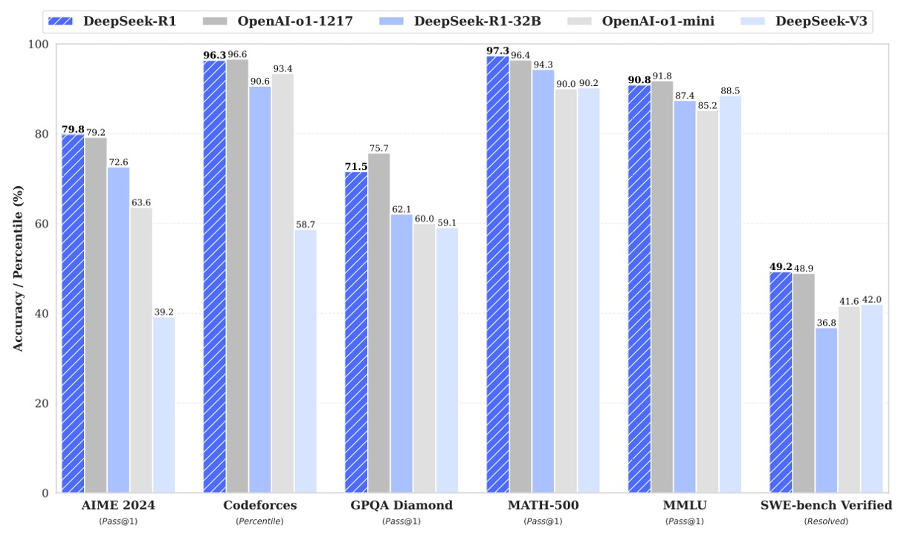
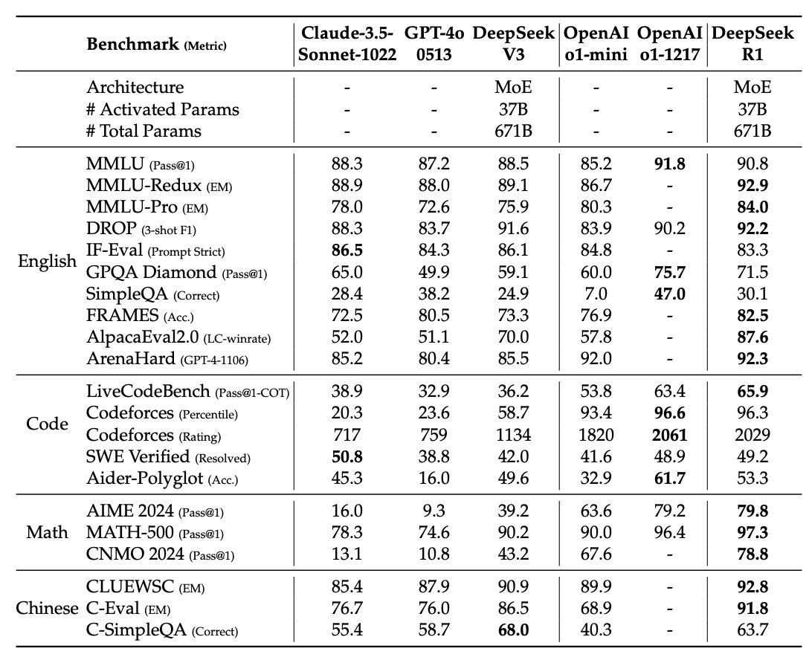

## Insight in Reinforcement Learning

[**DeepSeek-R1: Incentivizing Reasoning Capability in LLMs via Reinforcement Learning**](https://arxiv.org/abs/2501.12948)

---

We went back and reviewed the first three generations of the DeepSeek architecture specifically to read this paper.

Each paper is as thick as a brick, and looking back now, it wasn’t easy at all.

## Problem Definition

OpenAI's o1 series recently sparked a lot of discussions. They were the first to introduce the method of extending the reasoning chain (Chain-of-Thought) during the reasoning phase, significantly improving the model's performance on complex reasoning tasks.

Other studies have attempted to enhance model reasoning abilities using "process reward models," "reinforcement learning," and "search algorithms (such as Monte Carlo Tree Search, Beam Search)," but none could achieve the same level of integrated theoretical reasoning performance as the o1 series models.

Does this mean it’s over?

Absolutely not! Researchers' stubbornness is not without reason.

In this paper, the DeepSeek research team attempts to use "pure reinforcement learning" to drive the reasoning ability of language models, completely without relying on supervised data. So, the authors use DeepSeek-V3-Base as the base model and, after thousands of RL steps, created the first version of the model, called DeepSeek-R1-Zero.

So, is the problem solved?

Not yet.

The story officially begins after DeepSeek-R1-Zero.

## Solving the Problem

### DeepSeek-R1-Zero

First, take DeepSeek-V3-Base as the base model, skip the supervised fine-tuning phase, and apply reinforcement learning algorithms directly.

To reduce the RL training cost, this paper adopts the GRPO method, which does not use a critic model the same size as the policy model, but instead estimates the baseline based on a set of scores.

:::info
GRPO algorithm, originally Group Relative Policy Optimization, was also proposed by DeepSeek in a previous paper. We can take a look at it when we have time:

- [**[24.02] DeepSeekMath: Pushing the Limits of Mathematical Reasoning in Open Language Models**](https://arxiv.org/abs/2402.03300)
  :::

In the GRPO algorithm, we want the model to "learn" how to produce better answers by itself. Its core process can be broken down into the following steps:

- **1. Generate multiple answers from the old model**

  - **For each question $q$**: We use the old policy $\pi*{\theta*{\text{old}}}$ to generate a set of answers

    $$
    \{o_1, o_2, \dots, o_G\}
    $$

    where $G$ is the number of answers.

    ***

- **2. Evaluate the quality of the answers: Calculate the "advantage" $A_i$**

  To measure the quality of the answers, each answer $o_i$ receives a reward $r_i$.

  To compare which answer performs better, the authors define the advantage $A_i$ as:

  $$
  A_i = \frac{r_i - \text{mean}(\{r_1, r_2, \dots, r_G\})}{\text{std}(\{r_1, r_2, \dots, r_G\})}
  $$

  This formula tells us how much better an answer is than the average (normalized by standard deviation).

- **3. Optimize the new model: Maximize the objective function**

  We want the new model $\pi\_\theta$ to learn to generate higher-scoring answers.

  To do this, the authors design an objective function:

  $$
  \begin{aligned}
  J_{GRPO}(\theta) = \; & E\Bigg[\, q \sim P(Q),\, \{o_i\}_{i=1}^{G} \sim \pi_{\theta_{\text{old}}}(O|q) \Bigg] \\
  & \quad \cdot \frac{1}{G} \sum_{i=1}^{G} \Bigg[ \min\Bigg( \frac{\pi_\theta(o_i|q)}{\pi_{\theta_{\text{old}}}(o_i|q)}\, A_i,\; \\
  & \qquad\qquad\quad clip\Bigg(\frac{\pi_\theta(o_i|q)}{\pi_{\theta_{\text{old}}}(o_i|q)},\, 1-\epsilon,\, 1+\epsilon\Bigg)\, A_i \Bigg) \\
  & \qquad\qquad\quad - \beta\, D_{KL}\big(\pi_\theta \,\|\, \pi_{ref}\big) \Bigg].
  \end{aligned}
  $$

  Looking at this string of formulas, it might instinctively make you want to scroll away, but don’t worry, let’s go through it step by step:

  - **Probability Ratio**
    $\frac{\pi*\theta(o_i|q)}{\pi*{\theta\_{\text{old}}}(o_i|q)}$ represents the change in probability of the new model generating answer $o_i$ compared to the old model.

  - **Multiply by Advantage $A_i$**
    If an answer performs better than average ($A_i$ is high), the new model should increase the probability of generating that answer.

  - **Clip Operation**
    To avoid large changes in the probability ratio, we restrict it to the range $[1-\epsilon,\, 1+\epsilon]$, where $\epsilon$ is a hyperparameter, essentially setting a "seatbelt" for model adjustments.

  - **KL Divergence Penalty**
    $\beta D*{KL}\big(\pi*\theta||\pi*{ref}\big)$ is a penalty term used to measure the difference between the new model and the reference model $\pi*{ref}$, preventing the model from deviating too far from the original stable policy.

    The KL divergence is calculated as:

    $$
    D_{KL}\big(\pi_\theta||\pi_{ref}\big) = \frac{\pi_{ref}(o_i|q)}{\pi_\theta(o_i|q)} - \log\frac{\pi_{ref}(o_i|q)}{\pi_\theta(o_i|q)} - 1
    $$

    ***

Not so bad, right? Actually, it’s not that hard.

The model adjusts its parameters by maximizing $J_{GRPO}(\theta)$. This means the new model tends to generate answers that receive higher rewards (higher $A_i$), while maintaining the stability of changes.

The reward serves as the training signal in reinforcement learning, determining the optimization direction.

In this paper, the research team uses a rule-based reward system, which mainly includes two types of rewards:

- **Accuracy Reward**: This evaluates whether the answer is correct. For example, in a math problem, the model is required to provide the final answer in a specific format (e.g., boxed answer), allowing for rule-based verification; for LeetCode problems, the compiler and predefined test cases can be used for validation.
- **Format Reward**: This requires the model to place its reasoning process between `<think>` and `</think>` tags to ensure the output adheres to the expected format.

:::info
This paper does not adopt a neural network-based result or process reward model because, in large-scale RL processes, the "reward hacking" problem often arises. Additionally, retraining the reward model would increase resource demands and complicate the overall process.
:::

:::tip
Reward Hacking refers to a situation in reinforcement learning where an agent exploits unintended loopholes or weaknesses in the reward function, finding strategies that rapidly increase the reward but do not necessarily align with the designer’s true objectives.
:::

During the training of DeepSeek-R1-Zero, the authors designed a simple and clear template, guiding the base model to first generate the reasoning process and then provide the final answer, as shown in the table below:

<div align="center">
<figure style={{"width": "90%"}}>

</figure>
</div>

This design only restricts the output structure, avoiding content-based biases (such as forcing reflective reasoning or specific problem-solving strategies), allowing observation of the model’s natural evolution during the RL process.

The following graph shows the training process, where DeepSeek-R1-Zero's average pass@1 score in the AIME 2024 benchmark test steadily improved from an initial 15.6% to 71.0%, comparable to the OpenAI-o1-0912 model. With the use of a majority voting mechanism (red line), the performance further improved to 86.7%.

<div align="center">
<figure style={{"width": "90%"}}>

</figure>
</div>

As training progressed, the model’s thinking time increased, as shown below.

This indicates that during the test phase, the model can generate hundreds to thousands of reasoning tokens and spontaneously develop higher-level behaviors like reflection and exploration of alternative solutions, all as a result of its self-evolution in the RL environment.

<div align="center">
<figure style={{"width": "90%"}}>

</figure>
</div>

During training, the model experienced an "Aha moment" at a certain intermediate version, where it began to allocate more thinking time and re-examine the initial problem-solving strategy. This not only showed a significant improvement in the model’s reasoning ability but also amazed the authors at how RL could stimulate high-level problem-solving strategies without explicit teaching.

The authors present an example of an "Aha moment" in the paper:

<div align="center">
<figure style={{"width": "90%"}}>

</figure>
</div>

From this, we can learn several key points:

1. **Problem and Initial Derivation**:

   The table presents a math problem, such as "If $a > 1$, what is the sum of real solutions to the equation $\sqrt{a - \sqrt{a + x}} = x$?"

   The model begins by deriving the solution, using squaring to eliminate square roots and attempting to transform the equation into polynomial form.

2. **Midway Doubts and Reflection**:

   During the derivation, the model suddenly pauses and says:

   - "Wait, wait. Wait. That’s an aha moment I can flag here."

   This indicates that it has discovered a potential issue or inconsistency with one of the steps and decides to revisit and re-evaluate the derivation process. This sudden "epiphany" is what is known as the Aha Moment.

3. **Significance of the Aha Moment**:
   - **Self-reflection**: The model is able to flag its own doubts, similar to how humans might realize errors or areas needing correction during problem-solving.
   - **Evolutionary Learning**: This behavior shows that the model, through reinforcement learning, is not simply rigidly executing predefined rules but is gradually learning how to adjust strategies and improve the reasoning process.
   - **Human-like Behavior**: The model uses human-like language to describe its "Aha moment," making it feel as though it is thinking and reflecting, which is a beautiful demonstration of its self-evolution capability in reinforcement learning.

The model's thinking process and self-checking prove that in large-scale reinforcement learning, models can gradually learn to reflect on and correct mistakes, thereby improving problem-solving ability. This demonstrates the immense potential and flexibility of reinforcement learning in reasoning tasks.

:::tip
At this point, the model is still not usable.

Although DeepSeek-R1-Zero has achieved significant progress in reasoning capabilities, there are still issues such as poor output readability and mixed language usage. To address these shortcomings, subsequent research introduced the R1 model with humanized cold-start data assistance.
:::

### DeepSeek-R1

To overcome the readability and language mixing issues present in DeepSeek-R1-Zero, the research team further introduced the DeepSeek-R1 model, assisted by humanized cold-start data.

The core of this phase lies in a carefully designed multi-stage training pipeline, which allows the model to not only maintain strong performance in reasoning tasks but also generate answers that are structurally clear and easy to understand.

The training process of DeepSeek-R1 is divided into four stages, as we will look at sequentially:

- **Cold Start**

  Unlike DeepSeek-R1-Zero, directly jumping into RL from the base model might encounter initial instability issues.

  To address this, the research team first collects a small amount of high-quality chain-of-thought (CoT) data to fine-tune DeepSeek-V3-Base, making it a stable initial value for RL training.

  :::tip
  High-quality chain-of-thought data is generally collected from the most powerful models currently available.
  :::

  **Data collection methods include:**

  - **Few-shot prompts**: Using long CoT examples to demonstrate problem-solving, allowing the model to mimic generating detailed reasoning processes.
  - **Direct prompt generation**: Designing reflection and verification prompts to encourage the model to generate more structured responses.
  - **Selecting quality outputs**: Choosing the more coherent and readable answers from DeepSeek-R1-Zero.
  - **Manual post-processing**: Refining through manual work to remove poor or chaotic outputs.

  To ensure readability, the authors define a fixed output format:

  ```
  |special_token|<reasoning_process>|special_token|<summary>
  ```

  Here, `<reasoning_process>` represents the detailed reasoning process, and `<summary>` summarizes the entire reasoning process. This format retains the full reasoning content while also allowing users to quickly grasp the key points.

  ***

- **Reasoning-Oriented RL**

  With the help of cold-start data, the model begins RL training in a stable state. The main goal of this phase is to further enhance the model's ability in reasoning tasks such as mathematics, programming, science, and logic. Specific steps include:

  - **Start large-scale RL training**:
    Using the fine-tuned DeepSeek-V3-Base as the foundation, RL methods like the GRPO algorithm (similar to DeepSeek-R1-Zero) are employed for continuous training.

  - **Address language mixing issues**:
    It was found that when RL prompts involve multiple languages, the model tends to exhibit language mixing. To resolve this, the authors introduced a "language consistency reward," calculated based on the proportion of target language vocabulary in the CoT.

    :::tip
    This part slightly impacts reasoning accuracy, but overall, the output becomes more in line with human reading habits.
    :::

  - **Final reward design**:
    The reasoning accuracy reward and language consistency reward are directly added together to form the final training signal for model updates. This ensures that the new model improves both reasoning capabilities and the structure and readability of its outputs.

---

- **Rejection Sampling and Supervised Fine-Tuning**

  After the reasoning-oriented RL training converges, the research team further uses the model to generate more high-quality supervised data for a second round of fine-tuning to improve performance on general tasks.

  **Data generation is divided into two categories:**

  - **Reasoning data**:

    - Using rejection sampling, correct and representative reasoning processes are selected from the answers generated in the RL training.
    - To ensure quality, the authors filter out outputs with language mixing, excessively long paragraphs, or code blocks.
    - In the end, approximately 600,000 reasoning-related samples are collected.

  - **Non-reasoning data**:
    - This includes tasks like writing, fact-based Q&A, self-awareness, and translation, with data from DeepSeek-V3’s supervised dataset.
    - For certain tasks, the authors let the model first generate potential CoT before producing the final answer. For simple queries, no CoT is generated.
    - This part includes approximately 200,000 samples.

  After merging these two data categories, a total of about 800,000 samples were used for two epochs of supervised fine-tuning on DeepSeek-V3-Base, improving the model’s performance in both reasoning and general tasks.

  :::info
  Rejection Sampling is a statistical sampling method where, after generating candidate samples, those that do not meet predefined standards or evaluation metrics are discarded, and only the qualifying ones are kept.

  This method is used to obtain higher-quality or condition-compliant samples from a complex or difficult-to-sample distribution.
  :::

---

- **Full-Scenario Reinforcement Learning**

  To make the model more aligned with user needs, the research team conducted a second phase of RL training, optimizing the model for all scenarios (not just reasoning tasks), enhancing its usefulness and safety.

  For reasoning data, the rule-based reward method mentioned earlier is continued to ensure the reasoning accuracy in tasks like mathematics, programming, and logic. For general data, a reward model capturing human preferences is employed, focusing on the final summary to ensure the answer is both helpful and meets safety standards.

  This allows the model to generate answers that maintain excellent reasoning while also considering human-like qualities and risk management.

  Through this stage of training, the model achieves a balanced and exceptional performance across a variety of tasks and scenarios.

## Discussion

### Evaluation Results

<div align="center">
<figure style={{"width": "90%"}}>

</figure>
</div>

<div align="center">
<figure style={{"width": "90%"}}>

</figure>
</div>

The tables above show the evaluation results of DeepSeek-R1 in various benchmark tests, with the results categorized by domain as follows:

- **English Knowledge and Reasoning Tasks**

  - **MMLU, MMLU-Redux, and MMLU-Pro**
    These three metrics are primarily used to evaluate the model’s knowledge level in academic and general knowledge Q&A:

    - **MMLU (Pass@1):** This represents the percentage of questions answered correctly on the first attempt. DeepSeek-R1 scored 90.8, outperforming some competitors.
    - **MMLU-Redux (EM):** Scored based on exact match (EM), DeepSeek-R1 achieved 92.9, showing an advantage in precise answers.
    - **MMLU-Pro (EM):** Focused on specialized topics, DeepSeek-R1 scored 84.0, a significant improvement over DeepSeek-V3, thanks to large-scale RL training in STEM topics.

  - **DROP (3-shot F1) and IF-Eval (Prompt Strict)**

    - **DROP:** Tests the model’s abilities in reading comprehension and numerical reasoning, with DeepSeek-R1 achieving an F1 score of 92.2.
    - **IF-Eval:** Assesses the model’s compliance with format requirements. DeepSeek-R1 scored slightly lower than other models (83.3), but still performed well overall.

  - **GPQA Diamond and SimpleQA**

    - **GPQA Diamond (Pass@1):** Used to evaluate the model’s performance in complex knowledge-based Q&A, DeepSeek-R1 scored 71.5.
    - **SimpleQA (Correct):** Tests the model’s accuracy in simple factual Q&A, where DeepSeek-R1 achieved a score of 30.1. However, the paper notes that DeepSeek-R1 shows significant improvement over DeepSeek-V3 in handling factual Q&A, though it lags slightly behind on Chinese SimpleQA due to safety RL strategies.

  - **FRAMES, AlpacaEval2.0, and ArenaHard**
    These metrics assess the model’s capabilities in long-text understanding, open-domain Q&A, and writing tasks:
    - **FRAMES (Acc.):** DeepSeek-R1 scored 82.5, showing strong document analysis capabilities in long-context Q&A tasks.
    - **AlpacaEval2.0 (LC-winrate)** and **ArenaHard (GPT-4-1106):** Used to evaluate performance in writing and open-domain Q&A tasks, DeepSeek-R1 achieved win rates of 87.6% and 92.3%, respectively, highlighting its versatility and utility.

---

- **Code Generation Tasks**

  - **LiveCodeBench (Pass@1-COT) and Codeforces**
    These tests evaluate the model’s performance in code generation and algorithmic reasoning:

    - **LiveCodeBench:** DeepSeek-R1 scored 65.9, reflecting excellent performance when generating code using chain-of-thought (CoT).
    - **Codeforces (Percentile and Rating):** DeepSeek-R1 performed outstandingly in the Codeforces competition, with a rating of 2029, placing it at a top level. This shows that DeepSeek-R1 can compete with other top models in solving competitive programming problems.

  - **Other Engineering-related Metrics**
    - **SWE Verified (Resolved):** Related to engineering tasks, DeepSeek-R1 scored 49.2, comparable to some competitors.
    - **Aider-Polyglot (Acc.):** Evaluates multilingual programming tasks, with DeepSeek-R1 scoring 53.3, slightly behind certain models, but showing that reasoning-focused models have an advantage in such tasks.

---

- **Mathematics Tasks**

  - **AIME 2024, MATH-500, and CNMO 2024**
    These benchmarks focus on mathematical reasoning and problem-solving:
    - **AIME 2024 (Pass@1):** DeepSeek-R1 scored 79.8, comparable to OpenAI-o1-1217, indicating strong reasoning abilities in math competition problems.
    - **MATH-500 (Pass@1):** DeepSeek-R1 scored 97.3, a very high score, demonstrating a significant advantage in solving complex math problems.
    - **CNMO 2024 (Pass@1):** DeepSeek-R1 scored 78.8, reflecting its excellence in Chinese math reasoning tasks.

---

- **Chinese Tasks**

  - **CLUEWSC, C-Eval, and C-SimpleQA**
    In Chinese tasks, DeepSeek-R1 also demonstrates impressive capabilities:
    - **CLUEWSC (EM):** DeepSeek-R1 scored 92.8, showing strong understanding and reasoning abilities in the Chinese context.
    - **C-Eval (EM):** Scored 91.8, further validating its competitive strength in Chinese language evaluations.
    - **C-SimpleQA (Correct):** DeepSeek-R1 scored 63.7, but the paper notes that its performance on this metric is slightly lower than DeepSeek-V3 due to safety RL strategies, which lead to some queries being rejected. Without the safety RL, its accuracy would exceed 70%.

---

DeepSeek-R1 excels in education-oriented knowledge tests like MMLU, MMLU-Pro, and GPQA Diamond, especially in STEM-related problems, benefiting from large-scale RL training that significantly improved accuracy.

Its performance on FRAMES, AlpacaEval2.0, and ArenaHard shows that DeepSeek-R1 is capable of handling long documents, generating clear summaries, and excelling in writing tasks, with these improvements attributed to supervised fine-tuning and the inclusion of instruction-following data in RL training.

DeepSeek-R1’s math reasoning performance is on par with OpenAI-o1-1217, and it also demonstrates a leading edge in code generation and algorithm competitions. However, in engineering-related coding tasks (such as Aider), there is still room for improvement, and future versions are expected to further refine this through more relevant RL data.

The average length of the model-generated summaries is 689 tokens for ArenaHard and 2,218 characters for AlpacaEval2.0, indicating that DeepSeek-R1 avoids length bias in GPT-based evaluations, further demonstrating its robustness and adaptability across domains.

Overall, DeepSeek-R1 has achieved impressive results across multiple benchmarks, thanks to large-scale reinforcement learning and a carefully designed multi-stage training pipeline, showcasing its strong performance in knowledge-based Q&A, math reasoning, code generation, and Chinese language processing. These results not only demonstrate the significant potential of large-scale RL in enhancing model reasoning abilities but also provide strong support for building more powerful, general-purpose language models for diverse applications in the future.

### Comparison of Distillation and Reinforcement Learning

<div align="center">
<figure style={{"width": "90%"}}>

</figure>
</div>

Here, we have a topic comparing two scenarios:

1. Distilling the reasoning patterns of a large model into a smaller model.
2. Performing large-scale RL directly on the smaller model.

The experimental results on the Qwen-32B-Base model show that after more than 10K steps of RL training, it becomes DeepSeek-R1-Zero-Qwen-32B. Another version, DeepSeek-R1-Distill-Qwen-32B, is derived by distilling from DeepSeek-R1.

The distillation version outperformed the RL version on all benchmarks.

The authors draw two conclusions from this:

1. **Distillation works excellently**: Distilling the reasoning patterns of a powerful model into a smaller model not only significantly boosts performance but also requires far fewer computational resources than performing large-scale RL directly on the smaller model.
2. **Limitations of RL**: Although large-scale RL helps push the boundaries of intelligence, relying solely on small models for RL is not only computationally expensive but may also perform worse than distillation methods. Therefore, to surpass current intelligence levels, stronger foundational models and large-scale RL training are still necessary.

### Failed Attempts

In the early stages of developing DeepSeek-R1, the research team also tried other methods that ultimately did not meet expectations.

This section covers two methods:

- **Process Reward Model (PRM)**: In theory, PRM could guide the model to adopt better strategies in solving reasoning problems, but faced three major challenges in practice:

  - **Difficulty in fine-grained step definition**: It is challenging to define each small step clearly in general reasoning tasks.
  - **Correctness judgment of intermediate steps**: Automated labeling is often insufficient, and manual labeling is hard to scale.
  - **Reward hacking issue**: Introducing a model-based PRM could lead to reward hacking, and retraining the reward model would require extra resources and increase the complexity of the entire training process.

  Although PRM showed some utility in reordering the top N outputs or assisting with search guidance, its computational overhead and application difficulties limited its advantages.

- **Monte Carlo Tree Search (MCTS)**

  Inspired by AlphaGo and AlphaZero, the research team attempted to use MCTS to improve the computational scale and exploration capabilities during testing. The method was to break the answer into smaller parts, prompting the model to generate corresponding labels for each reasoning step, and then guide it using a pre-trained value model. However, this method faced two challenges:

  - **Huge search space**: Compared to games like chess, the search space for token generation grows exponentially, making the model prone to local optima even with node extension limits.
  - **Difficulty in training value models**: The quality of the value model plays a decisive role in each search step, and training a fine-grained value model is very difficult, which impacts the iterative improvement of the entire search process.

  Therefore, although MCTS can improve performance in the reasoning phase through a pre-trained value model, continuously improving the model's performance through self-search remains a significant challenge.

## Conclusion

DeepSeek-R1 combines cold-start data with iterative reinforcement learning fine-tuning, ultimately achieving performance on par with OpenAI-o1-1217 across multiple tasks, fully demonstrating the potential of large-scale reinforcement learning in enhancing reasoning abilities.

However, there are still known drawbacks in DeepSeek-R1 during testing, and the authors clearly state in the final section of the paper:

- **General Capabilities**: R1 still lags behind V3 on some tasks (e.g., function calls, multi-turn dialogues, complex role-playing, and JSON output).
- **Language Mixing Issues**: R1 is primarily optimized for English and Chinese, and may exhibit language mixing when encountering queries in other languages.
- **Prompt Sensitivity**: R1 is sensitive to prompts, particularly under few-shot settings. The authors recommend describing the problem directly and specifying the output format for best results in zero-shot settings.
- **Software Engineering Tasks**: Due to the longer evaluation times for these tasks, RL training efficiency is affected, and R1 has not yet demonstrated significant advantages in this area.

Overall, while there remains a gap between open-source and closed-source models, DeepSeek-R1 has made substantial progress in closing this gap, opening up more possibilities for the future development of open-source models.

Perhaps the next breakthrough will not belong to a single lab or company, but rather to the collective efforts of the open-source community.
