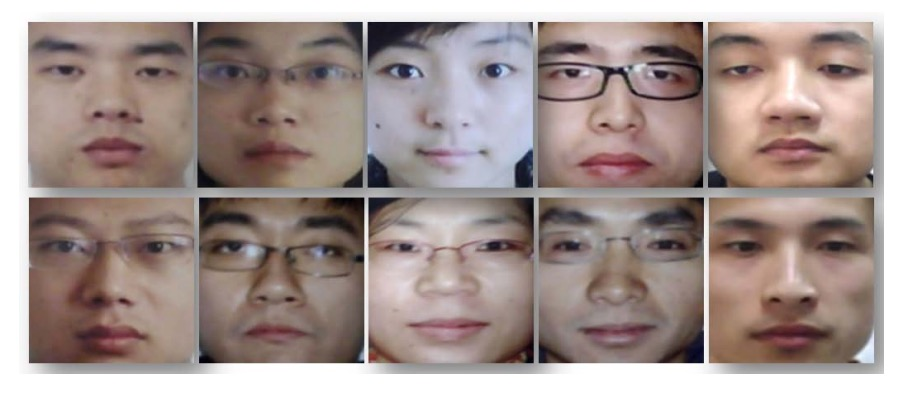

## Silent Reflective Light

[**Face Liveness Detection from A Single Image with Sparse Low Rank Bilinear Discriminative Model**](https://parnec.nuaa.edu.cn/_upload/article/files/4d/43/8a227f2c46bda4c20da97715f010/db1eef47-b25f-4af9-88d4-a8afeccda889.pdf)

---

This time, we will deeply explore the technological context of liveness detection.

At the beginning, we selected a few papers as key references for the early development of this field.

## Defining the Problem

Liveness detection has been the subject of numerous studies since before 2010. The methods of that time relied on facial movements (such as blinking, small facial changes), skin texture, depth information, and other features to recognize a live person.

However, if the attacker knows which algorithm you are using, they can specifically target and break it. For example, detecting facial movements can be fooled by playing a short video, shaking a photo, or using a dual-photo simulation.

What if we introduce a 3D camera or thermal imaging device?

That wouldn't help either.

We can take our phone with us when we go out, but we wouldn't carry a thermal imager just to prove that we are alive at an unknown moment.

**Therefore, the authors of this paper propose to recognize whether someone is alive from "a single image" without relying on external factors.**

For example, as shown in the figure below, which images are photos of faces (reproduced), and which ones are real human faces?

<figure style={{"width": "90%"}}>

</figure>

The answer is: The first column from the right is real, the rest are reproduced photos.

What! You say you can't tell with your naked eye?

Exactly, and that’s the problem.

## Solving the Problem

At that time, the most popular method for image feature extraction was Principal Component Analysis (PCA). However, the authors found that the feature distributions of live and spoof images obtained through PCA overlapped significantly, making it difficult to effectively distinguish between the two.

:::tip
The concept of PCA is to extract the most representative features from the image. So, what are the most obvious features in a facial image? Yes, it's the face itself.

But this is exactly the problem. The features extracted by PCA often focus on the overall structure of the face, rather than subtle reflections and lighting differences, which makes it ineffective for distinguishing between live and spoof images.
:::

To solve this issue, the authors adopted the "Lambertian Reflection Model" as the basis for analysis, aiming to find distinguishing factors from the perspective of how light interacts with surfaces. They approached the problem as a "binary classification" issue—simply put, classifying the image into "live" or "spoof" categories.

The Lambertian Reflection Model is a mathematical model that describes how a surface scatters incident light, assuming the surface is an ideal diffuse reflector. This means that the surface scatters light uniformly in all directions, and the observed brightness is independent of the observation angle.

This property comes from Lambert’s cosine law, and its basic formula is:

$$
I(x,y) = f_c(x,y) \, \rho(x,y) \, A_{\text{light}} \cos\theta
$$

Where:

- $I(x,y)$: Brightness at position $(x,y)$ in the image;
- $f_c(x,y)$: Camera's light response factor, typically treated as a constant;
- $\rho(x,y)$: Reflection coefficient, representing the surface's diffuse reflection characteristics;
- $A_{\text{light}}$ : Light source intensity;
- $\cos\theta$ : Cosine of the angle between the light ray and the surface normal vector, written as $n \cdot s$.

According to this model, the smaller the angle between the light and the surface normal (i.e., $\cos\theta$ approaches 1), the higher the reflection intensity. Conversely, the larger the angle (i.e., $\cos\theta$ approaches 0), the lower the reflection intensity. This variation in lighting reflections is highly appropriate for describing non-specular objects like human skin and paper.

The authors further applied this model to the liveness detection scenario, considering two images obtained under the same lighting conditions:

- Live image $I_t(x,y)$
- Spoof image $I_f(x,y)$

According to the Lambertian model, both can be represented as:

$$
I(x,y) = f_c(x,y) \rho(x,y) A_{\text{light}} \cos\theta
$$

Assuming $f_c(x,y)$ is constant, we have:

$$
I_t(x,y) = \rho_t(x,y) A_{\text{light}} (n_t \cdot s)
$$

$$
I_f(x,y) = \rho_f(x,y) A_{\text{light}} (n_f \cdot s)
$$

Further breaking it down:

$$
I_t(x,y) = \rho_t(x,y) \mu_t(x,y)
$$

$$
I_f(x,y) = \rho_f(x,y) \mu_f(x,y)
$$

Where $\mu(x,y) = A_{\text{light}} (n \cdot s)$, decomposing the image into reflection components $\rho(x,y)$ and lighting components $\mu(x,y)$, highlighting the potential for distinguishing between live and spoof images.

To estimate the lighting component $\mu$, the authors used the Logarithmic Total Variation (LTV) smoothing method:

$$
\mu = \arg \min \| \nabla \mu \|_1 + \lambda | I - \mu |
$$

Where $\lambda$ is set to 0.5.

Next, the authors computed the reflection component using Land’s Retinex formula:

$$
\log(\rho(x,y)) = \log(I(x,y)+1) - \log(\mu(x,y)+1)
$$

This decomposition allows us to observe that the $\mu$ of live images contains more surface normal information, while the $\mu$ of spoof images is relatively smooth, indicating less detail in lighting and structure. This is because spoof images, after being captured by a camera and printed, lose quality and details.

To emphasize these differences, the authors further used the Difference of Gaussian (DoG) filter to extract high- and mid-frequency variations in the image:

- Internal Gaussian standard deviation $\sigma_0$ is 0.5
- External Gaussian standard deviation $\sigma_1$ is 1.0

After applying DoG, the high-frequency components of the live image (especially in the horizontal direction) become more prominent, while the mid-frequency components of the spoof image appear distorted and blurred.

Additionally, under the same lighting conditions, the ratio of lighting components $\mu_f/\mu_t$ is mainly influenced by the surface normals $n_f$ and $n_t$, which means that the "reference image of the real user" can help identify spoof attacks.

For different lighting conditions, the authors proposed the following strategy:

- Use Singular Value Decomposition (SVD) to learn $K$ common lighting directions from the training data, forming a lighting matrix $S \in \mathbb{R}^{3\times K}$;
- Project any lighting image $\mu$ into the lighting space and compute the reconstruction coefficients $v$, which are used as input features for the classifier.

However, since LTV decomposition can potentially leak some texture details into $\mu$, making its distribution nonlinear, to avoid error accumulation, the authors chose to directly learn the classifier from latent samples instead of further manually designing features.

For the classifier design:

- **Sparse Logistic Regression:** Adds $\ell_1$ regularization to standard logistic regression to control overfitting in high-dimensional samples.
- **Sparse Low-Rank Bilinear Logistic Regression:** Directly operates on the 2D image structure, learning a low-rank projection matrix $W = LR$, applying $\ell_{2,1}$ regularization on $L$ and $R$ to zero out some rows, achieving sparsity and low-rank properties. It is optimized using alternating coordinate descent until convergence.

Finally, the original samples are transformed into a high-dimensional feature space through kernel mapping $\phi$, and the sparse classifier model is applied to perform liveness detection.

This method is a non-parametric probabilistic model. Although the number of parameters increases as the sample size increases, $\ell_1$ regularization effectively controls its complexity, and the overall computational efficiency outperforms other common models such as pSVM, RVM, and IVM.

:::info
A **non-parametric probabilistic model** is a type of machine learning method that does not make fixed assumptions about the number of model parameters.

This does not mean these models "have no parameters," but rather that the model's complexity (such as the number of parameters) automatically adjusts with the amount of data, rather than a fixed structure or size being determined in advance.
:::

<figure style={{"width": "90%"}}>

</figure>

After all the formulas, the authors also kindly provide an example image to illustrate the entire model architecture.

The image above shows the latent samples derived from "real user images" (top row) and "spoof images" (bottom row). Through different image processing and spectral analysis techniques, key features are extracted to distinguish between the two.

Let’s explain the meaning of each column:

- **Column 1:** This is the original image, with the top row showing the real user image and the bottom row showing the spoof image (reproduced photo).
- **Column 2:** This is the lighting image (µ Image) estimated by LTV, showing the lighting distribution estimated by the LTV method. The real image typically contains more surface and normal variations in $\mu$, while the spoof image appears smoother, lacking 3D depth.
- **Column 3:** This is the reflection image (ρ Image) estimated by LTV, capturing the object’s material and texture, independent of lighting variations. The reflection images of real faces and spoof images often have significant differences in details and textures.
- **Column 4:** This is the Fourier spectrum of the original image, with the centralized spectrum revealing the global spatial frequency distribution, reflecting the image's detail and texture richness.
- **Column 5:** This is the centralized Fourier spectrum of the image processed with DoG filtering, emphasizing high- and mid-frequency information, highlighting spatial details arising from structural and material differences, which serve as key features for classification.

## Training and Validation Dataset

<figure style={{"width": "60%"}}>

</figure>

<figure style={{"width": "90%"}}>

</figure>

Data was collected using a regular inexpensive webcam across three different sessions, spaced about two weeks apart, with varying environmental and lighting conditions. A total of 15 participants were involved, with each session capturing live images (500 images, 20fps) and corresponding spoof images.

The spoof images were first captured with a high-quality camera, then printed in different sizes and formats (photo paper and A4 color print) to simulate various attack scenarios. The training set consists of images from the first two sessions (approximately 1743 live and 1748 spoof images), and the testing set comes from the third session (3362 live and 5761 spoof images), with some participants appearing only in the test set.

All images underwent face detection, eye localization, geometric normalization, cropped to 64×64 pixels, and converted to grayscale. Detailed data configuration is shown in the table below:

<figure style={{"width": "60%"}}>

</figure>

## Discussion

### SLR Performance Evaluation

<figure style={{"width": "90%"}}>

</figure>

To validate the effectiveness of the aforementioned features and models in real-world applications, the authors first used sparse logistic regression (SLR) to perform recognition experiments on different image features. The left side of the above figure shows the performance of each feature type in the recognition task, with each line representing a feature input. The results are as follows:

- **RAW (Raw grayscale images):** The performance is the worst, indicating that directly using raw pixel values as input cannot effectively distinguish between live and spoof images.
- **LTVu (Lighting image from LTV decomposition):** Similarly, it performs poorly. While it contains lighting information, its non-linear characteristics hinder effective classification by a linear classifier.
- **LTVp (Reflection image from LTV decomposition):** Performance significantly improves, with an AUC of approximately 0.78, indicating that the reflection features capture material and texture differences more effectively.
- **DoG (Difference of Gaussian filtered images):** It also shows good performance with an AUC of approximately 0.75. Emphasizing mid-frequency features enhances the separability of the image in the feature space.
- **HF (High-frequency components):** Performance is relatively poor, with an AUC of approximately 0.69, indicating that although high-frequency components can capture details, they are also more susceptible to noise and distortion, leading to instability.

In summary, the LTVp and DoG features outperform RAW and LTVu in recognizing live and spoof images, further confirming the discriminative potential of reflection and mid-frequency features for this task. In contrast, high-frequency information, although capturing some edge features, lags behind LTVp and DoG due to its instability. Therefore, the subsequent experiments no longer use raw images as input features.

Further, the authors analyzed the performance differences between different sparse linear classification models using the same feature (in this case, DoG filtered images), as shown on the right side of the figure:

- **Standard Sparse Logistic Regression (SLR):** Achieves an AUC of approximately 0.75 with DoG images, serving as the baseline.
- **Sparse Low-Rank Bilinear Logistic Regression (SLRBLR):** After incorporating the image structure and low-rank assumption, the AUC significantly increases to approximately 0.92.
- **SLRBLR Special Case SLRBLRr1 (rank=1):** Further limiting the rank of the projection matrix to 1, the AUC reaches 0.95, showing that a low-rank projection can still preserve the most critical discriminative information and yields the best performance.

These results show that extending traditional SLR to a bilinear form, combined with sparse and low-rank regularization, can effectively uncover the latent spatial structure in images, greatly improving classification performance. Especially for SLRBLRr1, the extremely simplified low-rank projection matrix focuses more on the most representative directions of variation, demonstrating strong recognition ability.

From the feature design perspective, reflection features (LTVp) and mid-frequency features (DoG) significantly improve the separability of samples. From the classification model perspective, the **introduction of the low-rank bilinear model** further extends the performance limit of linear classifiers.

With this design, model performance increased from an AUC of 0.75 to a maximum of 0.95, proving that this method holds great practical potential for liveness detection tasks.

### Classifier Performance Evaluation

<figure style={{"width": "90%"}}>

</figure>

To further improve recognition performance, the authors extended the original linear classification model to **Non-linear Sparse Logistic Regression (SNLR)**, with the left side of the above figure showing its detection performance with different input features. By introducing a non-linear decision boundary, the overall detection capability is significantly improved.

For example, using the lighting component (LTVu) obtained from LTV decomposition, the AUC in the traditional linear classifier is only about 0.22, almost no distinguishing capability. However, after applying SNLR, the AUC dramatically increases to 0.92, fully demonstrating that this feature has potential classification value but requires a more expressive non-linear model to uncover it.

Additionally, when the reflection component (LTVp) and lighting component (LTVu) are combined as input, classification performance improves further, with an AUC of 0.94, showing that these two features have complementary information, and their combination enhances the model's discriminative ability.

Among all the features, the DoG-filtered image shows the best performance in the ROC curve, with its curve rising quickly, indicating that the model achieves a high true positive rate while maintaining a very low false positive rate. This is particularly important for practical applications, such as face verification systems.

---

The right side of the figure further compares the **overall classification accuracy** of three classifier models with different feature inputs: Sparse Logistic Regression (SLR), Sparse Non-linear Logistic Regression (SNLR), and Probabilistic Support Vector Machine (SVM). The classification results are based on 9,123 test images, with accuracy calculated by setting appropriate thresholds and determining the proportion of correctly classified samples.

The results show that **DoG features consistently perform well across all models**. They effectively remove high-frequency noise and low-frequency interference, preserving mid-frequency structural information, and show significant differentiation between live and spoof images. In contrast, using only high-frequency features (HF) suffers from more noise and edge artifacts, resulting in lower classification accuracy.

Traditional Fourier spectrum analysis can extract global frequency information, but its classification accuracy is about 76.7%, approximately 10% lower than the DoG features, indicating its lower stability and discriminative ability. Meanwhile, reflection (LTVp) and lighting (LTVu) images obtained from LTV decomposition, when combined with non-linear models, also show good auxiliary effects, further enhancing overall system recognition performance.

In summary, both from the feature extraction and model design perspective, the **combination of DoG features and non-linear sparse classifiers** provides significant performance improvements for liveness detection tasks, demonstrating great practical potential and expansion space.

## Conclusion

This paper analyzes the inherent surface characteristics of images through the physical reflection model, emphasizing the importance of extracting essential information from images to distinguish between real humans and photos, and lays a solid theoretical foundation for subsequent multimodal fusion and cross-domain learning methods.

On the technical implementation level, the authors propose a "non-invasive, real-time, and no additional hardware required" liveness detection method, which not only demonstrates practicality but also provides a solution that can be directly deployed in existing systems.

Although current liveness detection technologies have greatly surpassed early methods in terms of performance and robustness, the image decomposition strategy and feature learning approach proposed in this paper are still regarded as important foundations for understanding and optimizing liveness detection systems. The core ideas continue to play a significant role in contemporary topics like multimodal fusion and cross-lighting condition adaptation.
