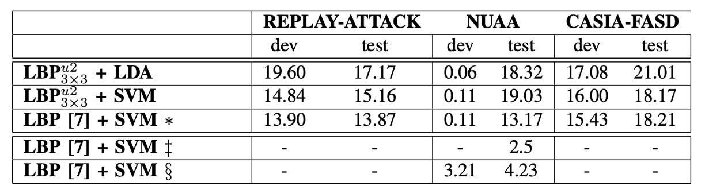

## Lively Micro-textures

[**On the Effectiveness of Local Binary Patterns in Face Anti-spoofing**](https://infoscience.epfl.ch/server/api/core/bitstreams/70fcdacd-de76-46e2-8b91-e338039bd09b/content)

---

Here, we can define a few important terms:

1. **Active Liveness**: The user performs actions or commands such as blinking or turning their head, which are actively requested by the system. The system then verifies whether these actions match the expected behavior to confirm the user's identity.
2. **Passive Liveness**: The user performs natural actions unknowingly, such as looking at the camera or smiling. The system automatically detects these actions to confirm the user's identity.

In simple terms, passive liveness focuses on identity verification through natural behaviors without requiring active user participation. This approach enhances user convenience and reduces the burden of the identity verification process.

It sounds good to reduce the burden, but upon closer inspection, the technology of "active liveness" can be easily exploited by attackers. For example, an attacker could record the user’s actions and then play these recordings to the verification system, bypassing identity verification.

:::tip
**Can’t we randomly combine a few actions?**

Yes, but users will feel displeased as the number of actions increases.

Any request placed on the user lowers the overall user experience, and ultimately, the marketing department will demand a reduction in the user burden. This leads back to the original issue.
:::

## Defining the Problem

The author believes that past literature, when constructing attack scenarios and datasets, often made simplified assumptions that fail to fully reflect the diversity and complexity found in real-world applications. Therefore, the author attempts to propose more practical improvements.

In this paper, several important attack methods are defined:

1. **Print Attack**: The attacker uses a printed photo to deceive the system.
2. **Mobile Attack**: The attacker uses a mobile screen to display photos or videos.
3. **Highdef Attack**: The attacker uses a high-resolution screen to display photos or videos.

In the figure below, the first column represents a real user, the second column shows a Print Attack, the third column is a Mobile Attack, and the fourth column is a Highdef Attack.

<figure style={{"width": "90%"}}>

</figure>

To better simulate these attack scenarios, the author has created a new public dataset, REPLAY-ATTACK, and reconsidered feature extraction design using the multi-scale LBP method proposed in the literature:

- **A simplified variant of Local Binary Patterns (LBP) is adopted, focusing on the key information in image textures to improve detection efficiency.**

This approach is primarily inspired by the following research:

- [**[11.10] Face spoofing detection from single images using micro-texture analysis**](https://ieeexplore.ieee.org/document/6117510)

For easier comparison, the author refers to this paper as [7], and it is contrasted with the current paper.

The author believes that compared to literature [7], specific improvements have been made in the following areas:

- **Attack scenarios and data more closely resemble real-world applications**: Literature [7] only uses the NUAA dataset and includes only printed photo attacks with static images. This is still too simplistic for simulating real-world attacks.
- **Simplified feature design, enhancing efficiency and practicality**: Although the multi-scale LBP features in literature [7] perform well in classification, their high-dimensional 833-dimensional feature vector introduces considerable computational burden.

:::tip
In those days, it wasn’t popular to name the methods in one's own paper, so we often see descriptions like “Method from this paper.” They are either overly long or extremely brief, making them hard to identify.
:::

## Solving the Problem

<figure style={{"width": "90%"}}>

</figure>

The above diagram shows the entire anti-spoofing algorithm workflow based on LBP.

The input first receives the original image. Using face detection technology, the face area in the image is located and scaled to a fixed size, such as 64×64 pixels. This step ensures that subsequent feature extraction occurs at a unified scale.

Next, feature extraction employs two different strategies:

1. **Option 1**: Calculate the LBP features for the entire image, generating a 59-dimensional histogram. This histogram becomes the texture feature vector of the image.
2. **Option 2**: Divide the image into 3×3 blocks, compute LBP features for each block independently, and then concatenate the histograms of all blocks, forming a 531-dimensional feature vector.

Finally, these feature vectors are input into a classifier for binary classification, determining whether the input is genuine or a spoof.

Next, we will look at the details of each step.

### Local Binary Patterns

For any pixel in a grayscale image $I(x,y)$, the LBP operator is based on a 3×3 neighborhood.

Let the central pixel value be $I(x,y)$, and its surrounding 8 neighboring pixels be $\{I(x_p,y_p)\}_{p=0}^{7}$.

For each neighboring pixel, we define the comparison function:

$$
s(z)=
\begin{cases}
1, & \text{if } z \geq 0, \\
0, & \text{if } z < 0.
\end{cases}
$$

Therefore, the LBP value for the central pixel is calculated as:

$$
LBP(x,y) = \sum_{p=0}^{7} s\big(I(x_p,y_p) - I(x,y)\big) \cdot 2^p.
$$

This formula converts the 8 comparison results (each being 0 or 1) into an 8-bit binary number, with a corresponding value range from $0$ to $2^8 - 1 = 255$.

### Uniform LBP

In the paper, the Uniform LBP is referred to as $LBP^{u2}$.

Among the many possible 8-bit binary patterns, some are considered "uniform," meaning that in a circular check, the number of transitions from 0 to 1 or from 1 to 0 does not exceed 2.

Formally, for a binary sequence $b_0b_1\ldots b_{P-1}$ (where $P=8$), if the number of transitions $U$ satisfies

$$
U(b_0,\ldots,b_{P-1}) \leq 2,
$$

then the pattern is called uniform.

Non-uniform patterns are typically merged into a single category. This significantly reduces the dimensionality of the histogram. For a 3×3 neighborhood, the commonly encountered uniform patterns total 59, so the overall feature vector dimension is 59.

### Feature Vector Generation

- **(1) Per-Image Features**

  - **Full Image Histogram**: The LBP$^{u2}_{3\times3}$ value is computed for each pixel in the entire face region (typically the face boundary box is normalized to 64×64 pixels), and the occurrences of each uniform pattern are counted to form a 59-dimensional histogram. After normalization, this histogram serves as the texture feature vector for the image.

- **(2) Per-Block Features**

  - **Block Histogram**: The normalized face image is divided into 3×3 blocks, and a 59-dimensional LBP histogram is calculated for each block. The histograms of all 9 blocks are then concatenated to form a 531-dimensional feature vector. This approach allows finer capture of texture differences in local areas of the image, such as the forehead, cheeks, etc.

:::tip
By now, you might start to sense a similarity to convolutional networks. However, here we still manually extract features, and to prevent dimensional explosion, special methods are employed to reduce the dimensionality.
:::

### Extended Variants of LBP

In addition to the basic LBP$^{u2}_{3\times3}$, the paper also experiments with other variants, mainly including:

- **tLBP (Transitional LBP)**: This method cyclically compares two neighboring pixels adjacent to the central pixel to form a binary pattern. This method emphasizes the transitional characteristics between adjacent pixels.
- **dLBP (Direction-coded LBP)**: dLBP encodes intensity changes along the four basic directions passing through the central pixel, with each direction represented by two bits, thus capturing more directional information.
- **mLBP (Modified LBP)**: mLBP is conceptually similar to the Modified Census Transform (MCT), where instead of directly comparing the central pixel to the neighboring pixels, the neighboring pixels are compared to the average value of the 3×3 region, and the comparison result with the central pixel is discarded. This reduces the noise impact that the central pixel might introduce.

### Classifier

Since the feature vector obtained from the LBP operator is essentially a normalized histogram, the initial classifier typically uses the $\chi^2$ histogram comparison method. The specific process is:

- During training, histograms for all genuine access images are computed and averaged to obtain a reference histogram.
- For a test image, its LBP histogram is computed and the $\chi^2$ distance is used to measure the similarity between this histogram and the reference histogram, producing a classification score.

Additionally, the paper also explores more complex classifiers (such as Linear Discriminant Analysis and Support Vector Machines), but the basic LBP features combined with $\chi^2$ analysis are effective in capturing texture differences between genuine and spoofed images.

:::info
The $\chi^2$ histogram comparison method is a statistical distance measure used to quantify the difference between two histograms, primarily used for comparing the distribution of image features.

Given two histograms $H$ and $G$, where each bin value is denoted as $H_i$ and $G_i$ (for $i=1,2,\ldots,N$), the $\chi^2$ distance is defined as:

$$
\chi^2(H, G) = \sum_{i=1}^{N} \frac{(H_i - G_i)^2}{H_i + G_i + \epsilon},
$$

where $\epsilon$ is a small value to avoid division by zero.

In practice, a smaller $\chi^2$ distance indicates greater similarity between the two histograms. When using LBP to extract texture features from an image, the resulting feature vector is essentially a histogram. The $\chi^2$ histogram comparison can then be used to measure the similarity between the test image and the reference histogram (e.g., the histogram averaged from all genuine access images) to determine whether the image is a genuine access or a spoof attack.
:::

### Dataset Overview

This paper introduces a public dataset named **REPLAY-ATTACK**, specifically designed for studying anti-spoofing techniques in face recognition systems. Below are the main configurations of the dataset:

- **Dataset Name**: REPLAY-ATTACK
- **Dataset Size**: Contains 50 participants, with a total of 1,200 video clips (24 video clips per participant).
- **Video Length and Format**: Each video is 15 seconds long, with a resolution of 320×240 (QVGA) and a frame rate of 25 frames per second.
- **Recording Scenarios**: Videos are recorded in two static environments:
  1. **Controlled Conditions**: Background is a uniform scene with fluorescent lighting.
  2. **Adverse Conditions**: Background is non-uniform, and lighting comes from natural daylight.
- **Recording Equipment**: Videos are recorded using an Apple 13-inch MacBook laptop, with participants sitting in front of the camera.
- **Attack Methods**: The dataset includes three common spoofing attack techniques:
  1. **Print Attack**: High-resolution photos are printed on A4 paper using a laser printer (Triumph-Adler DCC 2520).
  2. **Mobile Attack**: Photos or videos are captured using an iPhone 3GS and played on the device’s screen.
  3. **Highdef Attack**: High-resolution content is recorded with a Canon PowerShot SX150 IS and played on an iPad screen (1024×768).
- **Attack Presentation Modes**: Each attack type has two implementation modes:
  1. **Hand-based**: The operator holds the device to perform the attack, which causes slight shaking and sometimes misleads the blink detector.
  2. **Fixed-support**: The device is placed on a fixed stand, without shaking.
- **Video Classification**: The dataset is randomly divided into three subsets: training, development, and testing sets, with no overlap between identities. Attack videos are also categorized by attack method (hand-held/fixed).
- **Training Recommendation**: The training and development sets are recommended for model training and parameter tuning, while the testing set should only be used for final evaluation.
- **Additional Data**: 100 "registration videos" recorded under the same lighting conditions are provided for training basic face recognition models to assess attack quality.
- **Dataset Accessibility**: The dataset and source code are publicly available for free, with a full protocol and usage guidelines.
- **Dataset URL**: [**REPLAY-ATTACK**](https://www.idiap.ch/en/dataset/replayattack)

---

<figure style={{"width": "80%"}}>

</figure>

The table above shows the distribution of video clips across different subsets in the REPLAY-ATTACK dataset.

### Evaluation Method

:::tip
This evaluation method is still quite common today, so don’t skip it!
:::

The detection system may produce two types of errors:

- **False Rejection Rate (FRR)**: The proportion of genuine access attempts wrongly rejected (legitimate access misclassified as an attack).
- **False Acceptance Rate (FAR)**: The proportion of attack samples wrongly accepted (attacker misclassified as legitimate).

The combined metric for these two errors is called the **Half Total Error Rate (HTER)**, calculated as:

$$
\text{HTER} = \frac{\text{FAR} + \text{FRR}}{2}
$$

Since FAR and FRR are both affected by the threshold, the ROC curve is commonly used to show performance at different thresholds, and the EER (Equal Error Rate), the point where FAR equals FRR, is used to select the threshold on the development set. The HTER is then reported on the test set.

- **A lower HTER score indicates that the classifier is more accurate at distinguishing between genuine and spoofed face access.**

In the experiments, the author used three datasets for evaluation: REPLAY-ATTACK, NUAA, and CASIA-FASD.

Since the NUAA and CASIA-FASD datasets lack independent development sets, 5-fold cross-validation was used, and the average HTER was reported.

## Discussion

### Comparison of Different LBP Features

<figure style={{"width": "80%"}}>

</figure>

The table above shows the HTER results on the REPLAY-ATTACK dataset when different LBP feature variants are used as classifiers with the \(\chi^2\) histogram comparison method.

- **LBP$^{u2}_{3\times3}$**: This is the commonly used "uniform LBP," where LBP values are calculated using a 3×3 neighborhood, and only patterns with no more than two transitions are kept, generating a 59-dimensional histogram.
- **mLBP (modified LBP)**: In this calculation, in addition to performing binary comparisons, the average pixel intensity of the 3×3 neighborhood is calculated and compared to each neighboring pixel (the comparison between the central pixel and the average is discarded), resulting in an improved texture description.

Other extended LBP variants (such as tLBP, dLBP) might also have been evaluated in the experiment, but the table above focuses on comparing mLBP with the traditional LBP$^{u2}_{3\times3}$.

Although mLBP shows slightly superior performance in distinguishing genuine access from spoof attacks, due to computational cost and method ubiquity, LBP$^{u2}_{3\times3}$ was chosen as the main feature for subsequent comparisons. This also highlights that, in anti-spoofing tasks, methods need not only to achieve high accuracy but also to consider computational efficiency and implementation complexity.

### Comparison of Different Datasets

<figure style={{"width": "90%"}}>

</figure>

- **∗ (asterisk)**: Indicates that the results in this row were reproduced using the Bob toolbox for the methods described in [7], including feature extraction and classification.
- **‡ (double dagger)**: Indicates the results reported in the original paper [7], using Matlab for LBP feature extraction and LibSVM for classification.
- **§ (section sign)**: Indicates that the features were provided by the original authors of [7] and classified using the Bob toolbox.

  :::info
  As mentioned earlier, to avoid forgetting, here’s a quick recap.

  For reference, paper [7] is: [**[11.10] Face spoofing detection from single images using micro-texture analysis**](https://ieeexplore.ieee.org/document/6117510)
  :::

---

To compare the performance of different methods across various datasets, the author conducted experiments on three public datasets and used LBP features to compute the HTER for each as the metric. All results reported are the average of 5-fold cross-validation.

Regarding feature extraction strategies, **REPLAY-ATTACK uses full-image features, while NUAA and CASIA-FASD use block-based features**.

The results show that, depending on the dataset, the choice of features significantly influences classification performance:

- On the **REPLAY-ATTACK** dataset, full-image features performed better, likely due to its higher image quality and stable recording conditions, which made the overall texture distribution more representative.
- On the other hand, for the **NUAA** and **CASIA-FASD** datasets, block-based features performed better. This could be because these datasets have lower image quality and more complex environments, with more noticeable local texture differences.

Additionally, the table highlights the **overfitting phenomenon** of the classifier on the NUAA dataset: the performance on the training/development set is good, but the results on the test set significantly drop.

:::tip
This emphasizes the importance of strictly separating the training, development, and testing sets when designing anti-spoofing datasets to ensure the model's generalization capability.
:::

From the model design perspective, although the 833-dimensional extended feature vector used in [7] provides a roughly 1.3% improvement in accuracy, it comes at the cost of a large number of support vectors. For example, when using the 59-dimensional feature, the number of support vectors in the SVM reached 25,717, highlighting the need to carefully balance performance and resource consumption.

:::info
**Fun Fact:**

The author found data issues when reproducing the results from paper [7]!

On the NUAA dataset, the HTER obtained from the reproduction method was 13.17%, a large difference from the 2.5% reported in the original paper.

After in-depth comparison, the author found that part of the difference may be due to the differences in LBP feature implementation: when the original author implemented features in Matlab, about 4% of the encoding in bilinear interpolation was anomalous, which affected the results.

When using the original features and classifying with the Bob toolbox, the HTER dropped to 4.23%. While closer to the reported value, there is still a gap, which may be related to inconsistencies in cross-validation strategies.
:::

## Conclusion

In an era before deep learning became mainstream, the author clearly pointed out that even if face recognition models perform well, without effective anti-spoofing detection, the system's credibility cannot be truly guaranteed. This viewpoint still holds today, and "Face Anti-Spoofing" has become an indispensable core module in biometric recognition systems.

The REPLAY-ATTACK dataset was one of the few public resources at the time focused on video-based attacks and covering various types of spoofing. Not only does it include the three attack types: Print, Mobile, and Highdef, but it also considers different devices and recording conditions, with a complete training and testing protocol. This dataset has established a baseline for subsequent FAS research and contributed to the trend of dataset standardization.

Although, from today's perspective, LBP features are no longer competitive with deep models like CNNs and Transformers, their "high computational efficiency and strong reproducibility" make them still practical in resource-constrained scenarios. LBP has also laid the foundation for the development direction of the entire field.
