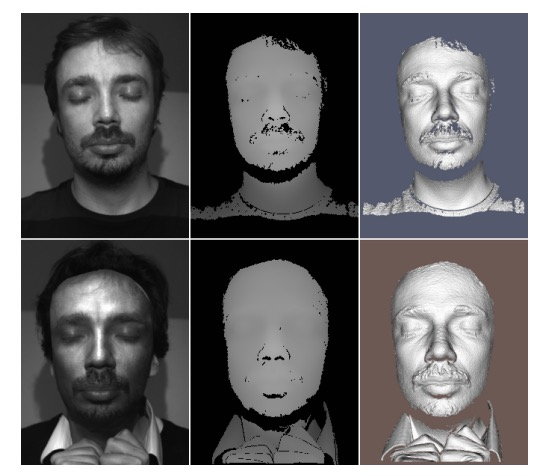
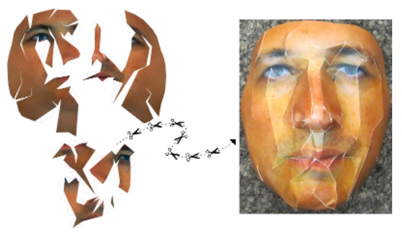
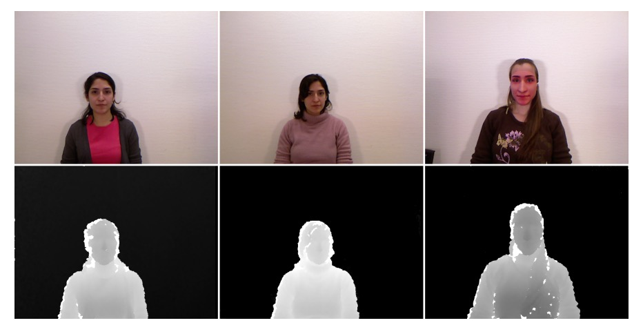

## The Real Mask

[**Spoofing Face Recognition with 3D Masks**](https://infoscience.epfl.ch/server/api/core/bitstreams/1694cd6d-ff27-4323-8993-c76232d5aa14/content)

---

Do you remember what malicious attacks we’ve seen before?

- **Print Attack**: The attacker prints out a photo of the target user and uses it to bypass the face recognition system’s security.
- **Replay Attack**: The attacker records a video of the target user and then replays it to deceive the face recognition system.

You say the resolution is too low? No problem, just use a 4K monitor to play it.

## Defining the Problem

While we were still focusing on these 2D attacks, 3D attacks have already arrived.

The authors of this paper point out that with the advancements in 3D reconstruction and printing technology, past research has been based on the assumption of 2D attack types, which is no longer valid.

This is because we can easily reconstruct a 3D model from a 2D photo and print it out, creating a mask that closely resembles the target user's facial structure.

This mask can easily produce:

1. **Depth of Field Effect**: It can bypass depth detection systems.
2. **Facial Expressions**: It can bypass active liveness detection systems.

It’s neither printing nor video replay. It can directly bypass all defense systems based on 2D attacks.

Uh oh! We're in trouble.

## Solving the Problem

In response to the challenge of 3D mask attacks, the authors propose a straightforward solution:

- **First, create a representative 3D mask attack dataset, and then train the next generation of defense systems based on this data.**

This strategy, starting from data implementation, helps clarify attack patterns and the weaknesses of recognition models in real-world scenarios.

### Morpho Dataset

Morpho is a private dataset collected by MORPHO company in the TABULA RASA project. Although it is not publicly available, it is still one of the few datasets containing high-precision 3D mask attack samples and has been a key resource in early FAS research.

The dataset includes:

- 207 real access samples
- 199 3D mask attack samples
- Provides both 2D color images and 3D facial models

These masks were created for 16 specific users. A structured light 3D scanner was used to construct the facial models, which were then 3D printed in grayscale materials to create realistic-looking masks. During the recording process, each user was filmed between 9 to 15 times, with a total of 20 subjects' data. Coordinates of the two eye corners and the tip of the nose were annotated in each frame.

**Features and limitations are as follows:**

- The masks have extremely high shape accuracy, being a precise replica of the real face.
- All samples were captured in a single session to avoid environmental variation.
- The subjects were required to remain still, making it harder for attackers to obtain scanning data.
- The dataset is a private resource and cannot be used as a public research benchmark.

Below are sample images from the dataset, with the leftmost image showing the target user’s grayscale face image, the middle showing the depth map, and the rightmost showing the grayscale image of the 3D mask. All of these samples are from the Morpho dataset.

<figure style={{"width": "60%"}}>

</figure>

### 3D Mask Attack Database (3DMAD)

Traditionally, creating 3D masks required a 3D scanner, **requiring close proximity and cooperation from the user**, which made it difficult to implement in real-world attack scenarios. Although scanning accuracy has improved, obtaining "high-quality 3D facial data" without authorization is still very challenging. Therefore, in early research, the prevalence of 3D mask attacks was limited.

However, in recent years, the **commercialization of 3D printing and facial modeling technologies** has rapidly developed, lowering the technical barriers and difficulty of creating masks. We only need to obtain a 2D facial photo of the user (such as a social media profile picture) with minimal risk of detection, making it a more practical threat.

To simulate this **low-cost, highly accessible** attack mode, the authors used a third-party service called **[ThatsMyFace.com](https://www.thatsmyface.com/)** to create the masks.

The production steps are as follows:

- **Image Collection**: Each subject needs to provide **one front-facing photo** and **two side photos** (left and right), totaling three high-quality 2D facial images. These images will be the input for 3D facial reconstruction.
- **Model Reconstruction and Mask Printing**: After uploading the images to ThatsMyFace, the platform will automatically reconstruct the three photos into a 3D facial model. The user can preview the model on the website and place an order to customize the mask.

  The authors created two types of masks for each user:

  - **Wearable Full-Size Mask**: Made from hard resin, with eye holes and nostrils, simulating a real attack.

      

      <figure style={{"width": "80%"}}>
      
      </figure>
      

  - **Paper Craft Assembly Mask**: A lower-cost option, intended only for display and future reference.

      

      <figure style={{"width": "70%"}}>
      
      </figure>
      

The dataset includes the uploaded images (front and side photos), paper craft mask files, and STL model files for printing, all of which are included for future research use.

---

After completing the 3D masks, the authors designed a rigorous data recording process to simulate real access and attack behaviors and collect color and depth images for model training.

The entire recording was done using the Microsoft Kinect for Xbox 360, a device capable of capturing both RGB and depth images, which is invaluable for detecting and analyzing 3D mask attacks.

The features of Kinect are as follows:

- **30 frames per second**: Simultaneously captures RGB and depth images.
- **Image Resolution**:
  - Color images: 640 × 480 pixels, 24-bit (3 × 8 bits)
  - Depth images: 640 × 480 pixels, 11-bit (1 × 11 bits)
- **Supports manual annotation**: Allows manual marking of eye positions on color images.

This design enables researchers to analyze attack samples from a multi-modal perspective, which not only helps develop more robust defense algorithms but also allows for comparing the recognition abilities of 2D and 3D models in different scenarios.

---

To simulate real-world behaviors in various contexts, the 3DMAD recording was scheduled in three different sessions. This design takes into account the impact of time, roles, and attack variables to effectively build data diversity.

The recording arrangements for each user are as follows:

- **Session 1 and Session 2** (Real Access):

  - Filmed two weeks apart to reflect the "temporal difference" challenge in biometric recognition.
  - Five video segments per session, each 10 seconds long.
  - The user faces the camera and interacts normally.

- **Session 3** (Mask Attack):

  - A **single attacker** wears the previously made 3D mask to simulate an attack.
  - Five video segments per mask, simulating different attack actions and angles.

- **Overall Scale**:
  - 17 users × 3 sessions × 5 video segments = **255 video segments in total**
  - Each video segment lasts 10 seconds, totaling **76,500 frames** of RGB and depth data.

The actual recording samples are shown in the example below, corresponding from left to right to the three sessions mentioned above:

<figure style={{"width": "90%"}}>

</figure>

---

To ensure the quality and consistency of subsequent model training, the authors tightly controlled the data annotation and recording environment:

- **Eye Position Annotation**:

  - In each video segment, the eye position is manually annotated every 60 frames.
  - The remaining frames are filled in automatically using linear interpolation, ensuring that every frame has annotated coordinates.

- **Recording Environment Design**:
  - The user faces the camera directly.
  - The background is uniform (without distracting patterns).
  - Lighting is sufficient to avoid facial shadows or overexposure.

This environment setup maximizes the removal of background and lighting interference, focusing on recognizing the difference between the mask and the real face.

## Discussion

:::tip
Please remember the definitions of these two indicators, otherwise the following charts will be difficult to understand!
:::

To systematically evaluate the vulnerability of face recognition systems to mask attacks, the authors in this study proposed several benchmark experiments, using **Equal Error Rate (EER)** and **Spoofing False Acceptance Rate (SFAR)** as the two main evaluation metrics:

- **EER** represents the error rate at which the false acceptance and false rejection probabilities are equal during the verification task. The **lower** the EER, the more accurate the verification system.
- **SFAR** is a metric specifically designed for spoofing attacks, quantifying the rate at which **attack samples pass the verification threshold**, reflecting the system's resistance to spoofing attacks. The **lower** the SFAR, the more secure the system.

### 3D Mask Attack Security Analysis

:::info
**In this paper, the reference [22] refers to:**

- [**[13.03] On the vulnerability of face recognition systems to spoofing mask attacks**](https://ieeexplore.ieee.org/abstract/document/6638076)
  :::

The table above shows the verification error rate (EER) and mask attack success rate (SFAR) of three algorithms (LBP-2D, LBP-2.5D, TPS-3D) under different datasets and preprocessing strategies, divided into four settings:

- (1): Results reported in reference [22] (limited to Morpho dataset, SFAR not provided)
- (2): Preprocessed images provided by reference [22], tested with the authors' implemented algorithm (Morpho)
- (3): Full reconstruction experiment with self-developed preprocessing flow and algorithm (Morpho)
- (4): Custom preprocessing and algorithm tested on the 3DMAD dataset (including verification and attack)

---

The data in the table shows that the authors successfully reproduced the EER results from reference [22] in (2), with minimal differences, indicating that the algorithm implementation and settings were consistent, with good reproducibility and reference value.

In the 2D mode, even after changing the preprocessing method (from (2) to (3)), the EER did not significantly change, indicating that the cropping and geometric normalization processes were consistent. However, the SFAR significantly increased, indicating that whether the mask edges appeared in the image had a significant impact on attack success.

In 2.5D and 3D modes, omitting smoothing and hole-filling processing (as in reference [22]) caused both EER and SFAR to deteriorate simultaneously. This shows that preprocessing quality severely affects the model's stability and resistance to attacks.

A horizontal comparison of different datasets shows that, under the same algorithm, the overall performance of 3DMAD is worse than Morpho. The possible reasons include:

- The depth quality obtained by Kinect is inferior to the laser scanner used in Morpho.
- The masks in 3DMAD are reconstructed from 2D images, which results in lower shape accuracy, affecting the spoofing effectiveness.

---

The authors further analyzed the 17 masks in 3DMAD one by one and compared the EER and SFAR of four algorithms (LBP, TPS, ISV, ICP) in 2D / 2.5D / 3D modes. The results are shown in the figure below:

<figure style={{"width": "90%"}}>

</figure>

The analysis shows that the SFAR varies greatly between different masks, ranging from 0% to 98.4%. These discrepancies mainly come from:

- The accuracy of mask shape production
- The realism and restoration of facial textures

This suggests that a single average value is insufficient to reflect the overall attack risk, and analyzing each mask individually is necessary to evaluate spoofing capabilities.

Further observations also found significant differences in attack performance of the same mask under different modes. For example:

- Mask #11 had an SFAR of 96.68% in the ISV-2D mode, but only 7.52% in 2.5D mode.

This indicates that:

- Masks with strong texture information may have high attack potential in 2D mode.
- However, if the 3D structure is insufficient, it is difficult to launch effective attacks in 2.5D or 3D modes.

Similarly, under the same mask and mode, different algorithms may have drastically different sensitivities to attacks. For example:

- Mask #17 had an SFAR of 76.32% using ISV-2D, but only 4.44% when switched to LBP-2D.

This suggests that the characteristics of the algorithm itself (such as discriminability and generalization ability) directly impact its resistance to mask attacks.

---

These observations highlight a key fact:

> **There is a nonlinear relationship between the verification accuracy (EER) and anti-spoofing capability (SFAR) of face recognition systems, which may even be inversely proportional.**

This phenomenon is more pronounced in high-performance models like ISV and ICP.

The underlying reason may be that high-performance models have strong generalization capabilities, which allow them to tolerate a wide variety of real user appearance variations (such as expressions, angles, lighting, etc.). However, this generalization ability can also cause the model to **accidentally identify a mask with a similar appearance to a real user**, thereby reducing security.

This is extremely important in practice, reminding us that when designing recognition systems, we must not only aim for a low EER but also evaluate the SFAR to ensure the system has resistance to spoofing attacks. Otherwise, even if the system performs excellently on the test set, it may still be exposed to high-risk environments in real-world deployment.

:::tip
In addition to this discussion section, the paper also includes some performance analyses based on the algorithms at the time.

However, these analyses have limited reference value for modern deep learning models, so they are not discussed here.
:::

## Conclusion

3DMAD is one of the earliest systematic works to explore the "threat of 3D masks to face recognition systems."

The authors, through the Morpho and 3DMAD datasets, designed various verification and anti-spoofing experiments and analyzed the performance differences of different modalities (2D / 2.5D / 3D), features (LBP variants), and classifiers (SVM, LDA, $\chi^2$).

Overall, the study is comprehensive in data construction, experimental design, and indicator evaluation, providing reference value for the then emerging field of 3D spoofing. The analysis, particularly regarding the relationship between mask production accuracy and model stability, is insightful.

However, from the perspective of 2025, there are some obvious limitations in this research:

- The evaluation mainly relies on closed datasets, lacking generalized tests for cross-dataset and unknown attacks.
- Model training relies on known attack samples, which differs from the real-world scenario where attack types are difficult to predict.
- Under changes in data distribution, some results show instability, indicating that the model's adaptability to mask diversity is still limited.

Nevertheless, the study still holds value in terms of method design and analytical perspectives, laying a preliminary foundation for future research on 3D mask attack defenses. With the continued development of deep learning and sensing technologies, these issues remain worth exploring and expanding.
