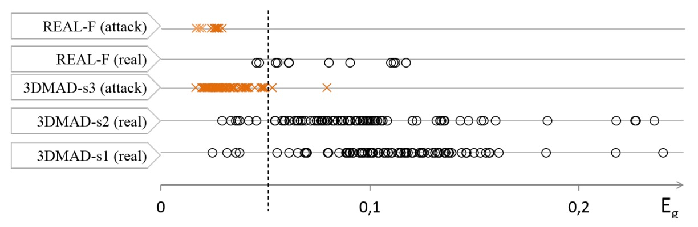

## The Flicker of Life

[**Generalized face anti-spoofing by detecting pulse from face videos**](https://projet.liris.cnrs.fr/imagine/pub/proceedings/ICPR-2016/media/files/1223.pdf)

---

Although heart rate signals (rPPG) have been the subject of many studies in the past, most of them were focused on physiological monitoring applications.

This 2016 paper is the first to bring "heartbeat signals" onto the stage of Face Anti-Spoofing.

It does not analyze textures or surfaces, but seeks a more fundamental proof of existence: **Is the heartbeat of this face truly happening?**

## Defining the Problem

<figure style={{"width": "80%"}}>

</figure>

**Photoplethysmography (PPG)**, as shown in the image above, is a non-contact physiological signal acquisition technique. It does not rely on needles or sensors, but instead on light. Or more precisely, it relies on the interaction between light and blood.

When light shines on exposed skin (such as the earlobe, wrist, or cheek), the hemoglobin in surface blood vessels changes its density in sync with the heartbeat rhythm, thus absorbing different amounts of light. These changes are imperceptible to the naked eye, but they leave faint clues in the intensity of reflected light. PPG captures these brightness variations and indirectly measures the presence of the heartbeat.

This technique was initially used in infrared sensing and vital sign monitoring fields. In recent years, researchers have discovered that **using a regular RGB camera, the same pulse signal (rPPG) can be restored from facial images**.

Each heartbeat causes the face to undergo an extremely subtle change, even though this signal is undetectable by the human eye, as long as the Region of Interest (ROI) is chosen correctly and noise is filtered well, the signal will emerge in the frequency domain.

For years, FAS relied on "visible differences": texture flaws, color distortion, depth gaps, micro-expression lag, etc. These appearance-based strategies performed admirably against photo and video attacks. However, as the material and details of 3D masks became increasingly realistic, this line of defense started to crack:

- **Appearance differences gradually disappear**: The maturation of silicone molds, 3D printing, and color coatings has made fake faces almost indistinguishable from real ones. Traditional LBP and texture models are no longer reliable.
- **Variation in scenes and devices**: Different cameras and compression conditions distort the image frequency structure, making it difficult for models to generalize in real-world applications.
- **Evolving attack methods**: As hardware barriers lower, new attack techniques continue to emerge, from screen playback to full-face masks, with each change potentially leading to a collapse of the defense.

This gradually brings up the question:

> **When all the appearances of a face can be mimicked, can we still recognize "life" in the image?**

This paper chooses to skip all visual clues and instead asks a more fundamental question: **Does this face have a heartbeat?**

But this path is not easy.

rPPG signals are weak and fragile, easily drowned out by environmental light variations, head movements, and encoding noise.

For the model to see it, it must first pass through layer upon layer of interference before finding that pulse belonging to a living person.

## Solving the Problem

Extracting the heartbeat from facial images may sound like something out of a science fiction novel, but it is indeed a real technology.

In this study, however, it is broken down into a well-defined signal processing pipeline.

The overall framework is divided into three simple parts: ROI extraction, signal transformation, and classification judgment.

### Face Detection and ROI Tracking

First, the model's input is a video containing $n$ frames of a face.

Here, the authors do not choose to use the entire face or just the eyes. Instead, they focus on the lower half of the face (cheeks, nose, mouth, chin), avoiding the forehead and eyes to reduce the risk of interference from hair and glasses.

The specific process is as follows:

- Use the **Viola-Jones** detector to extract the face bounding box from the first frame;
- Apply the **DRMF** model to annotate 66 facial landmarks;
- Select 9 of these points to form the ROI, fixed in a stable bare skin area;
- Use **KLT optical flow tracking** technology to dynamically update the ROI coordinates in each frame;
- In each frame, compute the average RGB values of the pixels within the ROI, forming three raw time series signals: $r_{\text{raw}}, g_{\text{raw}}, b_{\text{raw}}$.

For example, the raw signal of the red channel is:

$$
r_{\text{raw}} = [r_1, r_2, \dots, r_n]
$$

These three signals are the uncleaned "heartbeat samples," which may contain beats or be filled with noise.

### Filtering and Frequency Domain Transformation

To extract the rhythm from the noise, the authors designed a three-phase signal cleaning process:

- **Detrending**: Using _smoothness priors_ to remove slow variations and non-stationary trends;
- **Moving Average**: Smoothing neighboring frame values to suppress spiky noise;
- **Bandpass Filtering**: Using an FIR filter based on a Hamming window to preserve frequencies in the 0.7Hz to 4.0Hz range, which corresponds to the common heart rate range of 42 to 240 bpm.

After filtering, the three signals are passed into the **Fast Fourier Transform (FFT)** to convert them into the frequency domain:

<figure style={{"width": "80%"}}>

</figure>

As shown in the figure above, the **real human face**'s Power Spectral Density (PSD) exhibits a dominant peak frequency (corresponding to the heartbeat), sometimes accompanied by harmonics. On the other hand, **attack samples** (masks/photos) often show scattered noise peaks, with low energy and no concentration.

### Feature Design

To convert the PSD into classification input, the authors defined two features:

- **$E$**: The maximum power value within the heartbeat frequency range (0.7 \~ 4.0 Hz);
- **$\Gamma$**: The ratio of the main peak energy to the total energy, used to measure the spectral concentration:

$$
\Gamma = \frac{E}{\sum_{f \in [0.7, 4]} e(f)}
$$

Each channel computes $E$ and $\Gamma$, forming a 6-dimensional vector:

$$
\left[ E_r, E_g, E_b, \Gamma_r, \Gamma_g, \Gamma_b \right]
$$

### Classifier Design

Finally, classification is performed using a **Support Vector Machine (SVM)**, trained with a two-class classification: real human faces and attack samples.

SVM is well-suited for handling small sample, low-dimensional feature classification problems, which aligns with the study's "refined feature design" philosophy.

## Discussion

How far can a set of only six-dimensional physiological signal features go in different attack scenarios?

The authors chose to test three different types of attacks, corresponding to three public or self-constructed datasets:

- **3DMAD**: The classic 3D mask attack dataset;
- **REAL-F**: A new dataset with higher quality masks (self-constructed by the authors);
- **MFSD**: A mobile device dataset that includes photo and video replay attacks.

### 3DMAD Dataset

3DMAD is one of the earliest and currently the only publicly available 3D mask attack datasets.

It includes 17 subjects and 255 video clips, divided into three sessions:

- `s1` and `s2`: Real faces, with five clips recorded on different dates for each session;
- `s3`: Attack samples, using 3D masks created by **ThatsMyFace**, worn by a third person to imitate the original subject.

To ensure sample independence, the experiment used a leave-one-subject-out design (LOOCV): each time, one subject is left out for testing, while the remaining 16 are split into training and development sets, repeating this process 17 times.

Feature and classification settings are as follows:

- **Pulse features**: For each video, extract a 6-dimensional vector $[E_r, E_g, E_b, \Gamma_r, \Gamma_g, \Gamma_b]$ from the first 10 seconds;
- **Classifier**: A linear SVM is used with $C = 1000$, no parameter tuning;
- **Baseline comparison**: Four classic LBP settings are used, including:

  - `LBP-blk` (grayscale block histogram, 531 dimensions)
  - `LBP-blk-color` (RGB block histogram, 1593 dimensions)
  - `LBP-ms` (multi-scale grayscale histogram, 479 dimensions)
  - `LBP-ms-color` (multi-scale RGB, 1437 dimensions)

The final evaluation metric used is **HTER (Half Total Error Rate)**, calculated as:

$$
\text{HTER} = \frac{\text{FPR}(\tau^*) + \text{FNR}(\tau^*)}{2}
$$

where $\tau^\*$ is the optimal threshold calculated using the development set.

The experimental results are shown in the table below:

<figure style={{"width": "60%"}}>

</figure>

**Pulse features achieve HTER < 8% on the 3DMAD dataset**, with stable performance, showing that even with simple features and a linear classifier, it is sufficient to counter 3D mask attacks.

However, all four **LBP baselines achieve a 0% error rate** on this dataset, seemingly a perfect victory. But behind this result lies an engineering reality:

> **In this dataset, both training and testing use the same batch of masks, and the masks have obvious printing textures.**

In other words, LBP can indeed recognize "whether the skin has granular texture," but it does not know if that skin is "alive."

### REAL-F Dataset

<figure style={{"width": "50%"}}>

<figcaption> Left image shows the 3D mask from 3DMAD, right image shows the high-quality simulated mask from REAL-F</figcaption>
</figure>

If 3DMAD is the training ground, REAL-F is much closer to the battlefield.

The REAL-F masks are finely crafted high-quality simulated skin, with materials, textures, and colors that closely approach the limits of how a face can appear. Since no other high-quality 3D mask dataset is available, the authors purchased two REAL-F masks and recorded corresponding data to create a small test set:

- **Dataset Composition**:

  - 12 real samples (from 2 subjects);
  - 12 attack samples (worn by a third person to mimic the original subject);
  - All videos are 10 seconds long, with a resolution of 1280 × 760 and a frame rate of 30 FPS.

- **Training Data**:

  - Randomly select 8 subjects from 3DMAD as the training set, and 8 others as the development set;
  - Use the entire REAL-F dataset as **unseen test data**, performing 100 random split tests.

- **Evaluation Metrics**:

  - Reported three key metrics: **EER** (Equal Error Rate), **HTER** (Half Total Error Rate), and FPR (False Positive Rate) at FNR = 0.1 and FNR = 0.01.

The experimental results are shown in the table below:

<figure style={{"width": "70%"}}>

</figure>

We can observe that all **LBP feature combinations show a significant decline in performance on REAL-F**, with a noticeable increase in EER. Even the best-performing `LBP-blk-color` still misclassifies nearly half of the attack samples as real faces when FNR = 0.01.

In contrast, **Pulse features, although not perfect, demonstrate clear cross-mask stability**, maintaining a low error rate in multiple experiments.

This result highlights one key point:

> **Appearance models will remember how the mask looks, but physiological signals will not.**

LBP methods, which rely on textures, have two clear weaknesses:

1. When faced with fake faces with overly realistic skin textures, they cannot extract distinguishing features;
2. Once the training data is fixed, the model struggles to generalize to new types of masks.

In contrast, **pulse signals have a clear semantic definition (whether they exhibit real pulsations)**. They do not assume the type of mask and are not affected by texture similarity. As long as the mask is non-transparent and lacks pulsations, it will eventually be exposed.

The authors further analyzed the misclassification cases and visualized the $E_g$ distribution of all samples from 3DMAD and REAL-F as shown below:

<figure style={{"width": "80%"}}>

<figcaption> Distribution of \(E_g\) in the Pulse features. Orange crosses represent mask attacks, mostly concentrated in the lower value range</figcaption>
</figure>

We can observe the following:

- Most attack samples (orange crosses) have very low $E_g$ values, corresponding to a noise pattern with no dominant frequency in the PSD;
- Real samples generally have higher $E_g$ values, though with more variation, which is closely related to skin tone, face size, and lighting conditions;
- The main misclassification cases are concentrated in one subject with darker skin and a smaller face area, conditions that weaken the rPPG signal or increase noise intensity.

From here, we can conclude that the limitation of this method is that when the face is too dark or the image resolution is too low, the rPPG signal is drowned by environmental noise, leading to incorrect classification.

### Photo and Video Attacks

In the real world, the easiest attack method to obtain is **a photo and a smartphone**.

This experiment uses the MSU MFSD dataset, which contains 35 subjects and a total of 280 videos, covering two typical types of attacks:

- **Photo Attack** (print attack): Using high-quality printed photos;
- **Video Attack** (video replay): Using an iPad or iPhone to replay a recorded face video;
- Each subject includes 2 real samples, 2 photo attack samples, and 4 video attack samples;
- The recording devices were a MacBook Air and Nexus 5 front camera, with resolutions of 640×480 and 720×480.

To evaluate the model's performance under different attack types, the authors divided the dataset into three groups:

| Test Group | Real Samples | Attack Samples | Description         |
| ---------- | ------------ | -------------- | ------------------- |
| MSU-photo  | 70           | 70             | Photo attack        |
| MSU-video  | 70           | 140            | Video replay attack |
| MSU-all    | 140          | 210            | All attack samples  |

- 15 subjects were used for training, and 20 were used for testing;
- Pulse features were the same as in the previous section, with a 6-dimensional feature vector extracted from each video;
- For comparison, only the most stable-performing `LBP-ms-color` was selected as the texture feature representative.

The experimental results are shown in the table below:

<figure style={{"width": "80%"}}>

<figcaption>Pulse and LBP features' EER performance under different attack scenarios</figcaption>
</figure>

- Pulse features performed best under photo attacks (print attack), with an EER of only around **5%**;
- However, they completely failed under video attacks, as **real face videos were replayed, so the pulse signal remained**;
- LBP features performed the opposite, showing stable recognition performance in video attacks but relatively weaker performance under photo attacks.

This confirms one limitation of the Pulse features:

> **It can only distinguish "whether there is a pulse," but cannot differentiate if the pulse is "live" or "pre-recorded."**

Video replay retains the pulse signal, so for Pulse, it is almost equivalent to a real face;
But a photo is a static object with no physiological movement, making it a clean illusion for Pulse.

## Conclusion

This paper not only proposed a new method but also opened a whole new branch in the FAS technology landscape.

At the time, rPPG was still a niche technology in the physiological monitoring field and was never considered a major player in counteracting spoofing attacks. However, this paper gave it a clear position: **no longer relying on the appearance of the face, but on recognizing "life" itself.**

This concept was quite radical at the time.

After all, in mainstream views back then, the definition of "face" was still based on textures, lighting, and depth, with very few people focusing on the physiological signals behind the image. This paper, however, attempted to bring that faint pulse to the stage and proved that **six-dimensional heartbeat features could outperform thousand-dimensional texture descriptors in cross-domain generalization.**

Unfortunately, this method is not perfect, and it could be said that it has many flaws:

- It was almost helpless against video attacks;
- It is highly sensitive to lighting, image quality, and skin tone;

Most importantly: **It cannot solve the problem through data augmentation or large model stacking**, which in the era of deep learning is almost intolerable!

But precisely because of this, it revealed the possibility of another design direction:

> **Sometimes, rather than expanding the model, switching dimensions can break through the existing methods' blind spots.**

After this paper, various rPPG-based methods began to evolve: CFrPPG, MCCFrPPG, MSTCT, etc. Some improved signal stability, some combined frequency domain discrimination, and some tried to integrate with infrared signals. FAS technology has gone through multiple style changes, but "**live signals**" remain one of the most irreplaceable clues in counteracting high-realism attacks.

Even though we no longer use rPPG for FAS today, its spirit still holds a place in the hearts of every developer.
